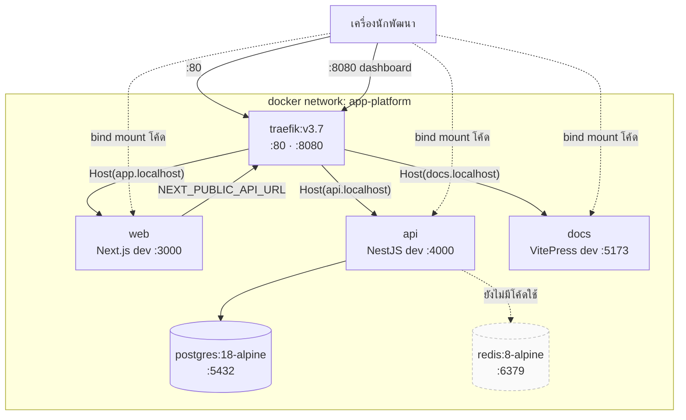

# Container & routing

<Status value="in-progress" note="ยังไม่มี compose/Dockerfile สำหรับ production" />

## ผัง stack ตอนพัฒนา



## ตาราง container

| Service | Image / build | port ใน container | route | ขึ้นกับใคร |
| --- | --- | --- | --- | --- |
| `traefik` | `traefik:v3.7` | 80, 8080 | — | docker socket |
| `web` | `infra/docker/web/Dockerfile.dev` | 3000 | `Host(app.localhost)` | api (ตอน runtime) |
| `api` | `infra/docker/api/Dockerfile.dev` | 4000 | `Host(api.localhost)` | postgres + redis ต้อง healthy ก่อน |
| `docs` | `infra/docker/docs/Dockerfile.dev` | 5173 | `Host(docs.localhost)` | — |
| `postgres` | `postgres:18-alpine` | 5432 | — (publish ตรง) | — |
| `redis` | `redis:8-alpine` | 6379 | — (publish ตรง) | — |

port ที่ publish ออกมาที่เครื่องปรับได้ผ่าน `WEB_PORT`, `API_PORT`, `DOCS_PORT`, `POSTGRES_PORT`, `REDIS_PORT` ดู [Environment variables](/reference/env-vars)

## Traefik ทำงานยังไง

`infra/docker/traefik/traefik.yml` ตั้งไว้สั้นมาก

```yaml
api:
  dashboard: true
  insecure: true          # dev เท่านั้น — ห้ามติดไป production

entryPoints:
  web:
    address: ":80"

providers:
  docker:
    exposedByDefault: false   # ต้อง opt-in ด้วย label เท่านั้น
    network: app-platform
```

`exposedByDefault: false` แปลว่า container จะไม่ถูก expose เว้นแต่ติด label เอง แต่ละ service ประกาศ route ของตัวเองไว้ใน `docker-compose.yml`

```yaml
labels:
  - traefik.enable=true
  - traefik.http.routers.api.rule=Host(`api.localhost`)
  - traefik.http.routers.api.entrypoints=web
  - traefik.http.services.api.loadbalancer.server.port=4000
```

::: danger dashboard เปิด insecure
`insecure: true` เปิด dashboard ที่ `:8080` โดยไม่ต้องยืนยันตัวตน ยอมรับได้เฉพาะบนเครื่องตัวเอง config ของ production ต้องปิดหรือใส่ auth
:::

::: tip เพิ่ม service ใหม่
1. ประกาศ service ใน `docker-compose.yml` พร้อม 4 label ข้างบน (เปลี่ยนชื่อ router/host/port)
2. เติม `build:` + bind mount ใน `docker-compose.local.yml`
3. ผูก `networks: [app-platform]` — ถ้าลืม Traefik จะมองไม่เห็น
:::

## แยกกันสองไฟล์เพราะอะไร

| ไฟล์ | หน้าที่ |
| --- | --- |
| `docker-compose.yml` | นิยาม service, network, env, label ของ Traefik — เป็นฐาน ไม่รู้เรื่อง dev |
| `docker-compose.local.yml` | overlay ของ dev: `build:` ชี้ `Dockerfile.dev`, bind mount `.:/app`, publish port ออกเครื่อง, เปิด polling watcher |

`pnpm dev:docker` ประกอบทั้งสองเข้าด้วยกัน

```bash
docker compose -f docker-compose.yml -f docker-compose.local.yml up
```

การแยกแบบนี้เปิดทางให้เพิ่ม `docker-compose.prod.yml` ทีหลังได้โดยไม่ต้องแตะไฟล์ฐาน

## เรื่อง node_modules ใน dev

`docker-compose.local.yml` bind mount ทั้ง repo (`.:/app`) แล้ว **ทับ** ทุกโฟลเดอร์ `node_modules` ด้วย named volume

```yaml
volumes:
  - .:/app
  - api_node_modules:/app/node_modules
  - api_app_node_modules:/app/apps/api/node_modules
  - contracts_node_modules_api:/app/packages/contracts/node_modules
```

เพราะ `node_modules` ของ pnpm เต็มไปด้วย symlink ที่ผูกกับ platform — ถ้าปล่อยให้ของจากเครื่อง host (อาจเป็น macOS ARM) ทะลุเข้า container (linux) native binary อย่าง `@swc/core` หรือ Prisma engine จะพัง named volume จึงกัน `node_modules` ฝั่ง container ไว้ไม่ให้ปนกัน

::: warning เพิ่ม dependency แล้วต้อง restart
`pnpm add` บน host เขียนลง `node_modules` ของ host ไม่ใช่ของ container ต้อง `docker compose ... restart <service>` หรือรัน `pnpm install` ใน container ให้ volume อัปเดต
:::

## สิ่งที่ยังขาดสำหรับ production

::: warning สถานะโค้ดปัจจุบัน
| สเปกเป้าหมาย | โค้ดวันนี้ |
| --- | --- |
| Dockerfile multi-stage สำหรับ production ทุกแอป | มีแค่ `Dockerfile.dev` |
| `docker-compose.prod.yml` หรือ manifest ของ orchestrator | ไม่มี |
| Traefik ทำ TLS (ACME) + ปิด dashboard | HTTP อย่างเดียว dashboard เปิด insecure |
| healthcheck ของ web/api ใน compose | มีแค่ postgres กับ redis |
| ตั้ง resource limit | ไม่มี |
:::

`apps/web/next.config.ts` ตั้ง `output: "standalone"` ไว้แล้ว ซึ่งเป็นชิ้นส่วนที่ Dockerfile production ต้องใช้ — คัดลอกแค่ `.next/standalone` + `.next/static` ก็ได้ image ที่เล็กมาก
