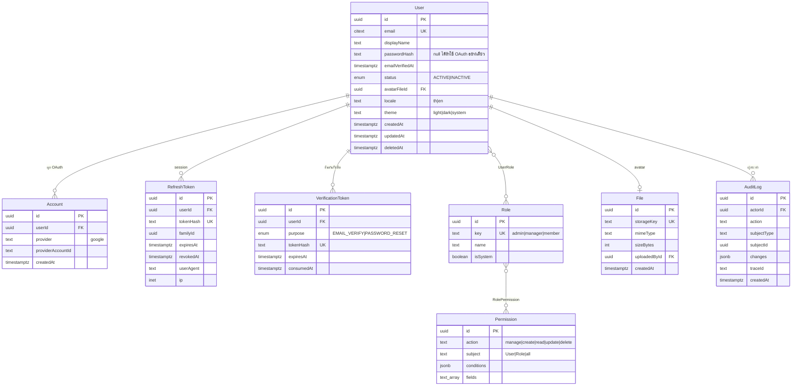
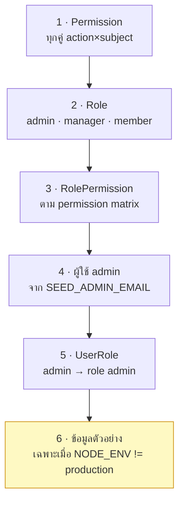

# Data model

<Status value="planned" note="ตอนนี้มีแค่ model User" />

`apps/api/prisma/schema.prisma` เป็นแหล่งความจริงของโครงสร้างฐานข้อมูล หน้านี้คือรูปที่ควรจะเป็นเมื่อ [auth](/auth/overview) และ [RBAC](/auth/rbac-model) ถูก implement ครบ

## ผังความสัมพันธ์



## แต่ละตารางมีไว้ทำไม

| Model | มีไว้ทำไม | หน้าที่เกี่ยว |
| --- | --- | --- |
| `User` | ตัวตนของคน + การตั้งค่าส่วนตัว | [เข้าสู่ระบบ](/auth/login) |
| `Account` | ผูกบัญชี OAuth ภายนอกเข้ากับ `User` — คนหนึ่งมีได้หลาย provider | [สมัครสมาชิก](/auth/signup) |
| `RefreshToken` | session ที่เพิกถอนได้ พร้อม family ไว้จับการใช้ซ้ำ | [JWT & rotation](/auth/tokens) |
| `VerificationToken` | token ครั้งเดียวสำหรับยืนยันอีเมลและรีเซ็ตรหัสผ่าน | [ลืมรหัสผ่าน](/auth/forgot-password) |
| `Role` | กลุ่มสิทธิ์ที่ตั้งชื่อได้ | [RBAC](/auth/rbac-model) |
| `Permission` | กฎแบบ CASL หนึ่งข้อ (action + subject + conditions) | [CASL](/auth/casl) |
| `File` | ไฟล์ที่อัปโหลด ตอนนี้ใช้กับ avatar | — |
| `AuditLog` | ประวัติว่าใครทำอะไร ผูกกับ `traceId` | [Trace ID](/platform/trace-id) |

## ข้อตกลงของ schema

| กฎ | เหตุผล |
| --- | --- |
| PK เป็น `uuid` เสมอ ไม่ใช่ autoincrement | เดา id ของคนอื่นไม่ได้ และ merge ข้อมูลข้าม environment ได้ |
| ชื่อ model เป็น PascalCase เอกพจน์ ชื่อตารางเป็น snake_case พหูพจน์ผ่าน `@@map` | โค้ดอ่านเป็นแบบ TS ส่วน SQL อ่านเป็นแบบ SQL |
| ชื่อ field เป็น camelCase ใน Prisma และ `@map` เป็น snake_case | เหมือนกัน |
| เวลาทุกตัวเป็น `DateTime` เก็บ UTC | ตัดปัญหา timezone ทิ้งทั้งหมด |
| `createdAt` / `updatedAt` ต้องมีทุก model | ไม่มีวันเสียใจที่ใส่ไว้ |
| ตารางที่ลบแล้วยังต้องอ้างอิงได้ ใช้ `deletedAt` แทนการลบจริง | รักษา foreign key และประวัติ |
| อีเมลใช้ `citext` | เทียบแบบไม่สนตัวพิมพ์โดยไม่ต้อง `LOWER()` ทุก query |
| ห้ามใช้ enum ของ Postgres ตรง ๆ ให้ใช้ `enum` ของ Prisma | Prisma จัดการ migration ของ enum ให้ |

::: tip `citext` ต้องเปิด extension ก่อน
เพิ่ม `extensions = [citext]` ใน `datasource` แล้ว Prisma จะสร้าง `CREATE EXTENSION IF NOT EXISTS citext` ให้ใน migration ถ้าไม่ทำแบบนี้ `a@b.com` กับ `A@B.com` จะกลายเป็นสองบัญชี
:::

## Schema

```prisma
generator client {
  provider = "prisma-client-js"
}

datasource db {
  provider   = "postgresql"
  extensions = [citext]
}

enum UserStatus {
  ACTIVE
  INACTIVE
}

enum TokenPurpose {
  EMAIL_VERIFY
  PASSWORD_RESET
}

model User {
  id              String     @id @default(uuid()) @db.Uuid
  email           String     @unique @db.Citext
  displayName     String     @db.VarChar(120)
  /// null ได้ — ผู้ใช้ที่สมัครผ่าน Google อย่างเดียวจะไม่มีรหัสผ่าน
  passwordHash    String?
  emailVerifiedAt DateTime?  @map("email_verified_at")
  status          UserStatus @default(ACTIVE)
  locale          String     @default("th") @db.VarChar(5)
  theme           String     @default("system") @db.VarChar(10)

  avatarFileId String? @map("avatar_file_id") @db.Uuid
  avatarFile   File?   @relation("UserAvatar", fields: [avatarFileId], references: [id], onDelete: SetNull)

  roles              UserRole[]
  accounts           Account[]
  refreshTokens      RefreshToken[]
  verificationTokens VerificationToken[]
  auditLogs          AuditLog[]         @relation("AuditActor")
  uploadedFiles      File[]             @relation("FileUploader")

  createdAt DateTime  @default(now()) @map("created_at")
  updatedAt DateTime  @updatedAt @map("updated_at")
  deletedAt DateTime? @map("deleted_at")

  @@index([status, createdAt])
  @@index([deletedAt])
  @@map("users")
}

model Account {
  id                String @id @default(uuid()) @db.Uuid
  userId            String @map("user_id") @db.Uuid
  user              User   @relation(fields: [userId], references: [id], onDelete: Cascade)
  provider          String @db.VarChar(32)
  providerAccountId String @map("provider_account_id")

  createdAt DateTime @default(now()) @map("created_at")

  /// บัญชี Google หนึ่งอันผูกได้กับผู้ใช้เดียวเท่านั้น
  @@unique([provider, providerAccountId])
  @@index([userId])
  @@map("accounts")
}

model RefreshToken {
  id     String @id @default(uuid()) @db.Uuid
  userId String @map("user_id") @db.Uuid
  user   User   @relation(fields: [userId], references: [id], onDelete: Cascade)

  /// SHA-256 ของ token — ไม่เก็บตัวจริง ถ้า DB หลุดก็ปลอม session ไม่ได้
  tokenHash String @unique @map("token_hash")
  /// token ทุกใบที่สืบทอดจากการ login ครั้งเดียวกันใช้ familyId เดียวกัน
  familyId  String @map("family_id") @db.Uuid

  expiresAt DateTime  @map("expires_at")
  revokedAt DateTime? @map("revoked_at")
  userAgent String?   @map("user_agent")
  ip        String?   @db.Inet

  createdAt DateTime @default(now()) @map("created_at")

  @@index([userId, revokedAt])
  @@index([familyId])
  @@index([expiresAt])
  @@map("refresh_tokens")
}

model VerificationToken {
  id      String       @id @default(uuid()) @db.Uuid
  userId  String       @map("user_id") @db.Uuid
  user    User         @relation(fields: [userId], references: [id], onDelete: Cascade)
  purpose TokenPurpose

  tokenHash  String    @unique @map("token_hash")
  expiresAt  DateTime  @map("expires_at")
  consumedAt DateTime? @map("consumed_at")

  createdAt DateTime @default(now()) @map("created_at")

  @@index([userId, purpose])
  @@index([expiresAt])
  @@map("verification_tokens")
}

model Role {
  id   String @id @default(uuid()) @db.Uuid
  key  String @unique @db.VarChar(64)
  name String @db.VarChar(120)
  /// role ของระบบลบไม่ได้ผ่าน UI
  isSystem Boolean @default(false) @map("is_system")

  users       UserRole[]
  permissions RolePermission[]

  createdAt DateTime @default(now()) @map("created_at")
  updatedAt DateTime @updatedAt @map("updated_at")

  @@map("roles")
}

model Permission {
  id      String @id @default(uuid()) @db.Uuid
  /// action ของ CASL: manage | create | read | update | delete
  action  String @db.VarChar(32)
  /// subject ของ CASL: User | Role | all
  subject String @db.VarChar(64)
  /// เงื่อนไขแบบ MongoQuery เช่น {"id": "${user.id}"}
  conditions Json?
  /// จำกัดเฉพาะบาง field — ว่าง = ทุก field
  fields  String[]

  roles RolePermission[]

  @@unique([action, subject])
  @@map("permissions")
}

model UserRole {
  userId String @map("user_id") @db.Uuid
  roleId String @map("role_id") @db.Uuid
  user   User   @relation(fields: [userId], references: [id], onDelete: Cascade)
  role   Role   @relation(fields: [roleId], references: [id], onDelete: Cascade)

  assignedAt DateTime @default(now()) @map("assigned_at")

  @@id([userId, roleId])
  @@index([roleId])
  @@map("user_roles")
}

model RolePermission {
  roleId       String     @map("role_id") @db.Uuid
  permissionId String     @map("permission_id") @db.Uuid
  role         Role       @relation(fields: [roleId], references: [id], onDelete: Cascade)
  permission   Permission @relation(fields: [permissionId], references: [id], onDelete: Cascade)

  @@id([roleId, permissionId])
  @@map("role_permissions")
}

model File {
  id         String @id @default(uuid()) @db.Uuid
  storageKey String @unique @map("storage_key")
  mimeType   String @map("mime_type") @db.VarChar(128)
  sizeBytes  Int    @map("size_bytes")

  uploadedById String? @map("uploaded_by_id") @db.Uuid
  uploadedBy   User?   @relation("FileUploader", fields: [uploadedById], references: [id], onDelete: SetNull)

  avatarOf User[] @relation("UserAvatar")

  createdAt DateTime @default(now()) @map("created_at")

  @@map("files")
}

model AuditLog {
  id      String  @id @default(uuid()) @db.Uuid
  actorId String? @map("actor_id") @db.Uuid
  actor   User?   @relation("AuditActor", fields: [actorId], references: [id], onDelete: SetNull)

  action      String  @db.VarChar(64)
  subjectType String  @map("subject_type") @db.VarChar(64)
  subjectId   String? @map("subject_id") @db.Uuid
  /// { field: { from, to } } — ห้ามใส่ค่าที่เป็นความลับ
  changes     Json?
  /// ผูกเข้ากับ log ของ request ที่ทำให้เกิด
  traceId     String  @map("trace_id")

  createdAt DateTime @default(now()) @map("created_at")

  @@index([subjectType, subjectId])
  @@index([actorId, createdAt])
  @@index([traceId])
  @@map("audit_logs")
}
```

## ทำไมออกแบบแบบนี้

### เก็บ hash ของ token ไม่ใช่ตัว token

`RefreshToken.tokenHash` และ `VerificationToken.tokenHash` เก็บ SHA-256 ไม่ใช่ค่าจริง ถ้า DB รั่ว คนที่ได้ข้อมูลไปจะปลอม session หรือรีเซ็ตรหัสผ่านของใครไม่ได้ ตอนตรวจก็ hash ค่าที่ได้มาแล้วเทียบ

ใช้ SHA-256 ไม่ใช่ bcrypt เพราะค่าเหล่านี้เป็น random 256-bit ที่เราสร้างเอง ไม่ใช่รหัสผ่านที่คนตั้ง — ไม่มีอะไรให้ brute-force การใส่ work factor จึงมีแต่ทำให้ทุก request ช้าลงเปล่า ๆ

### `familyId` ทำอะไร

refresh token ทุกใบที่สืบทอดจากการ login ครั้งเดียวกันแชร์ `familyId` เมื่อมีคนใช้ token ที่ถูก rotate ไปแล้ว = มีสำเนาหลุด → เพิกถอนทั้ง family ทีเดียว ดู [JWT & rotation](/auth/tokens)

### `Permission` ตรงกับกฎของ CASL แบบ 1:1

`(action, subject, conditions, fields)` คือหน้าตาของ `RawRule` ใน CASL เป๊ะ ๆ แถวใน DB จึงกลายเป็นกฎ CASL ได้โดยไม่ต้องมีชั้นแปลง ดู [CASL](/auth/casl)

### `passwordHash` เป็น null ได้

คนที่สมัครผ่าน Google อย่างเดียวไม่มีรหัสผ่าน อย่าใส่ค่าปลอมลงไป — ให้เป็น `null` แล้วบังคับใน service ว่า login ด้วยรหัสผ่านต้องมี hash

### ลบแบบ soft delete เฉพาะ `User`

`deletedAt` มีแค่ที่ `User` เพราะตารางอื่นไม่ต้องเก็บซาก ทุก query ที่อ่าน user ต้องกรอง `deletedAt: null` เสมอ ทางที่ปลอดภัยกว่าคือใส่เป็นเงื่อนไขติดกับ ability ของ CASL ไปเลย จะได้ไม่มีทางลืม

## ข้อมูลตั้งต้น

seeder ต้องสร้างของตามลำดับนี้



seeder ต้อง **idempotent** — ใช้ `upsert` ทั้งหมด รันซ้ำกี่รอบผลต้องเหมือนเดิม ตาราง permission matrix อยู่ที่ [RBAC](/auth/rbac-model)

::: danger seed ข้อมูลตัวอย่างเฉพาะ non-production
บัญชี `demo@example.com` / `password123` ต้องไม่มีทางถูกสร้างบน production ให้ครอบด้วย `if (process.env.NODE_ENV !== "production")` ในตัว seed ไม่ใช่พึ่งวินัยของคนรัน
:::

## ระเบียบการ migrate

| สถานการณ์ | วิธีทำ |
| --- | --- |
| เพิ่ม field ที่ nullable | migrate ตรงได้เลย |
| เพิ่ม field ที่บังคับ | เพิ่มแบบ nullable → backfill → ค่อยตั้ง NOT NULL (สาม migration) |
| เปลี่ยนชื่อ field | เพิ่มตัวใหม่ → เขียนทั้งสองที่ → backfill → ย้ายการอ่าน → ลบตัวเก่า |
| ลบ field | หยุดเขียนก่อน แล้วรอหนึ่งรอบ deploy ค่อยลบจริง |
| เพิ่ม index บนตารางใหญ่ | `CREATE INDEX CONCURRENTLY` ผ่าน migration ที่เขียน SQL เอง |

หลักคือ **expand แล้วค่อย contract** — ระหว่าง deploy จะมีช่วงที่โค้ดเก่ากับโค้ดใหม่รันพร้อมกัน ทุก migration ต้องรอดในช่วงนั้น

::: warning สถานะโค้ดปัจจุบัน
| สเปกเป้าหมาย | โค้ดวันนี้ |
| --- | --- |
| 8 model + 2 join table | **มีแค่ `User`** (id, email, displayName, passwordHash, createdAt, updatedAt) |
| อีเมลเป็น `citext` | เป็น `text` ธรรมดา — `A@b.com` กับ `a@b.com` สร้างได้สองบัญชี |
| ตั้งชื่อคอลัมน์เป็น snake_case | ไม่มี `@map` เลย คอลัมน์เป็น `displayName`, `passwordHash` |
| soft delete | ไม่มี `deletedAt` |
| seed สร้าง role/permission | `seed.ts` upsert ผู้ใช้เดียว ไม่มี guard เรื่อง `NODE_ENV` |
:::
