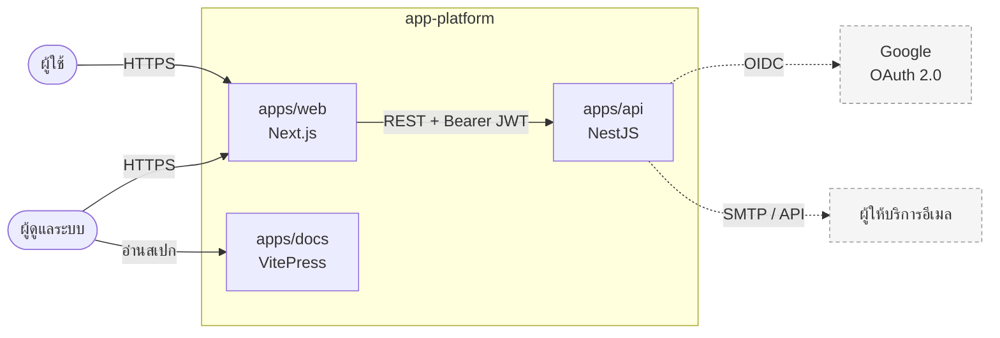
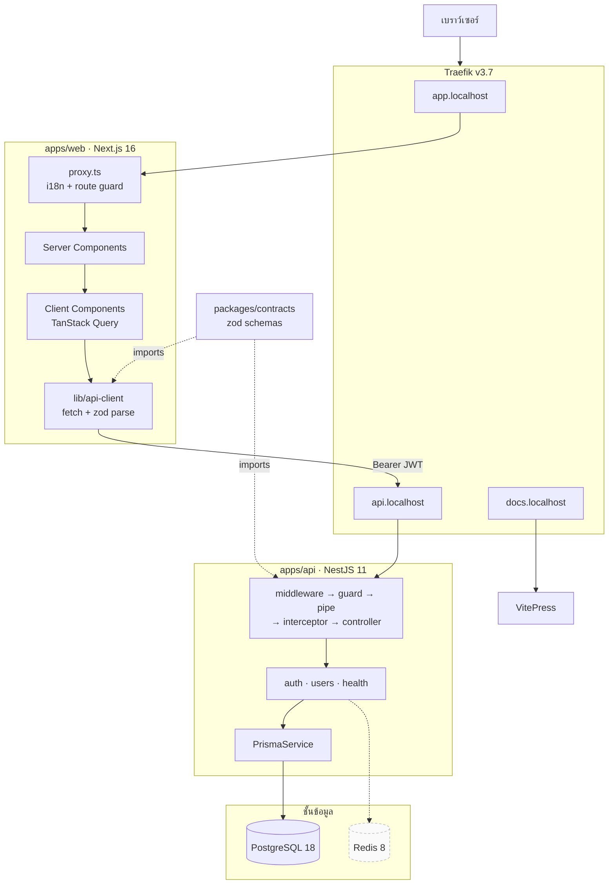
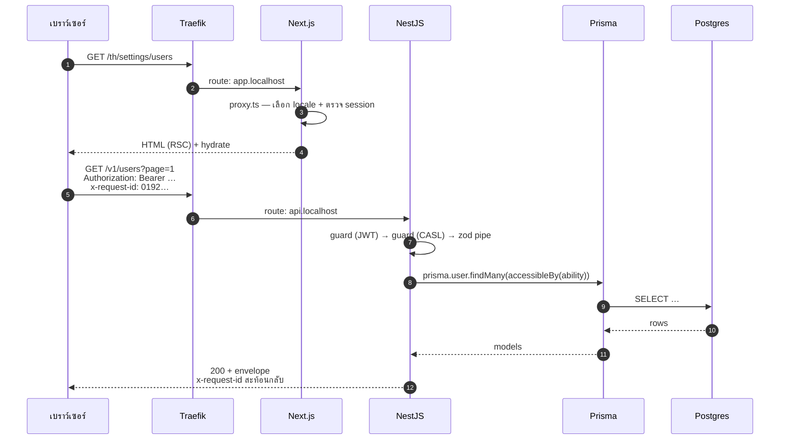

# ภาพรวมระบบ

<Status value="implemented" />

หน้าเดียวจบสำหรับ mental model ของทั้งระบบ รายละเอียดแต่ละส่วนอยู่ในหน้าที่ลิงก์ไว้

## บริบท

Google OAuth และผู้ให้บริการอีเมลยังเป็นเส้นประ — ยังไม่ได้ implement ([สมัครสมาชิก](/auth/signup), [ส่งอีเมล](/backend/email))

## องค์ประกอบ

| ส่วน | หน้าที่ | รายละเอียด |
| --- | --- | --- |
| **apps/web** | UI ทั้งหมด, i18n, form validation, การเก็บ session | [Session ฝั่ง client](/frontend/auth-client) |
| **apps/api** | กฎธุรกิจ, การเข้าถึงข้อมูล, ออก token, บังคับสิทธิ์ | [ภาพรวม auth](/auth/overview) |
| **apps/docs** | สเปกและเอกสาร (ไม่ได้อยู่ใน runtime path) | — |
| **packages/contracts** | zod schema ของ request/response — สัญญาระหว่างสองแอป | [Contract-first](/conventions/contract-first) |
| **Traefik** | reverse proxy ผูก `*.localhost` เข้ากับแต่ละ service | [Container & routing](/architecture/containers) |
| **PostgreSQL** | ข้อมูลถาวรทั้งหมด เข้าถึงผ่าน Prisma เท่านั้น | [Data model](/architecture/data-model) |
| **Redis** | ยกขึ้นมาแล้วแต่ยังไม่มีโค้ดใช้ | [Roadmap](/start/roadmap) |

## เส้นทางของ request

request ที่ผู้ใช้ล็อกอินแล้วเรียกข้อมูล ผ่านมือ 6 ต่อ

รายละเอียดทีละขั้น รวมถึงเส้นทางตอน error อยู่ที่ [วงจรชีวิตของ request](/architecture/request-lifecycle)

## ขอบเขตและกฎ

| ขอบ | กฎ |
| --- | --- |
| web ↔ api | คุยกันด้วย REST + JSON เท่านั้น ห้าม import โค้ดข้ามกัน |
| ของที่ใช้ร่วมกัน | ต้องอยู่ใน `packages/contracts` และเป็น zod schema |
| การเข้าถึง DB | ผ่าน `PrismaService` เท่านั้น ห้ามเขียน SQL ตรง ๆ นอก Prisma |
| ระหว่างโมดูลใน api | เรียกผ่าน service ที่ export ไม่เรียก repository ข้ามโมดูล |
| สิทธิ์ | บังคับที่ฝั่ง server เสมอ UI แค่ซ่อนของ ไม่ใช่ตัวป้องกัน |
| error | ทุก error ที่ออกจาก api ต้องอยู่ในรูป envelope เดียวกัน |
| ทุก request | ต้องมี trace id และ log ทุกบรรทัดต้องแนบ trace id นั้น |

สามข้อสุดท้ายคือสิ่งที่ทำให้ระบบ debug ได้ — อ่าน [Error envelope](/conventions/errors) และ [Trace ID](/platform/trace-id)

## ทำไมเป็น modular monolith

deploy ชิ้นเดียว โค้ดแยกโมดูลชัด — ได้ขอบเขตที่ชัดโดยไม่ต้องแบก distributed transaction, service discovery และ debug ข้าม service ตั้งแต่วันแรก เมื่อโมดูลไหนโตจนต้องแยกจริง ๆ ขอบเขตที่วางไว้ทำให้แยกได้โดยไม่ต้องรื้อ

เหตุผลเต็มและทางเลือกที่ปฏิเสธอยู่ใน [ADR-0004](/adr/0004-modular-monolith)
