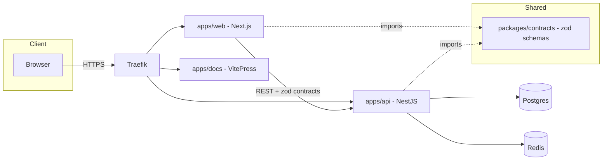

# Architecture overview

- **apps/web** — Next.js (App Router), TanStack Query, shadcn/ui, Tailwind CSS, next-intl.
- **apps/api** — NestJS, Prisma/Postgres, Redis, JWT auth, Swagger, pino logging.
- **apps/docs** — this VitePress site.
- **packages/contracts** — zod schemas shared by web and api, single source of truth for request/response types.
- **Traefik** routes `app.localhost`, `api.localhost`, `docs.localhost` to the respective services in local development.
