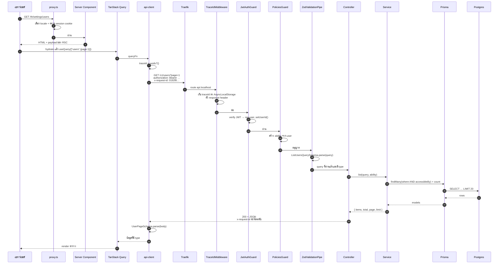
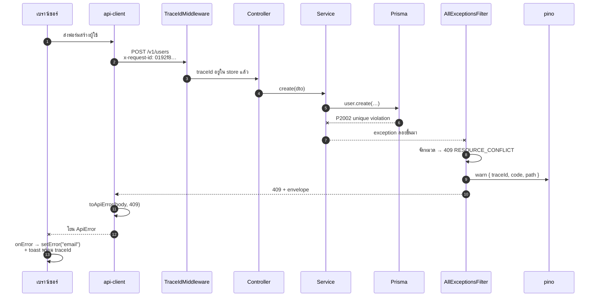
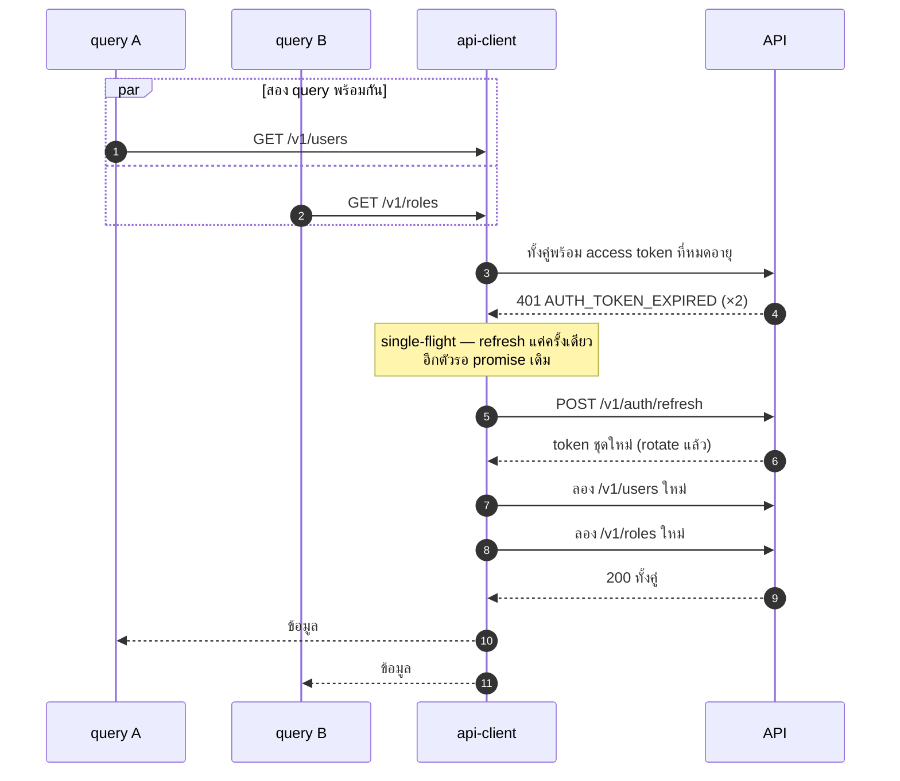
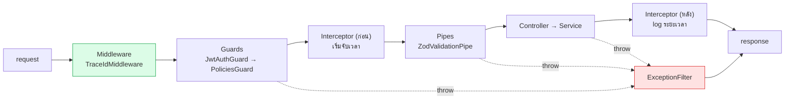

# วงจรชีวิตของ request

<Status value="in-progress" note="pipeline ฝั่ง Nest ทำงานจริงแล้ว เหลือ interceptor กับฝั่ง client" />

ตาม request หนึ่งอันตั้งแต่คลิกจนถึงพิกเซล ทั้งตอนสำเร็จและตอนพัง หน้านี้คือที่ที่ [contract](/conventions/contract-first), [error envelope](/conventions/errors) และ [trace id](/platform/trace-id) มาบรรจบกัน

## ทางที่ทุกอย่างเรียบร้อย

### แต่ละต่อทำอะไร

| # | จุด | หน้าที่ | พังตรงนี้แล้วเกิดอะไร |
| --- | --- | --- | --- |
| 1 | `proxy.ts` | เลือก locale, redirect ถ้าไม่มี session | ส่งไป `/th/login` |
| 2 | Server Component | ประกอบหน้า, prefetch ได้ | error boundary ของ Next |
| 3 | `api-client` | ใส่ trace id, แนบ token, parse response | โยน `ApiError` |
| 4 | Traefik | route ตาม host | 404 ของ Traefik (ไม่มี envelope) |
| 5 | `TraceIdMiddleware` | สร้าง/รับ trace id | — |
| 6 | `JwtAuthGuard` | ยืนยันตัวตน | `401 AUTH_TOKEN_INVALID` |
| 7 | `PoliciesGuard` | ตรวจสิทธิ์ | `403 AUTHZ_FORBIDDEN` |
| 8 | `ZodValidationPipe` | ตรวจ query/body | `422 VALIDATION_FAILED` |
| 9 | Controller | แปลง HTTP เป็นการเรียก service | — |
| 10 | Service | กฎธุรกิจ | `AppException` ที่ระบุ code |
| 11 | Prisma | เข้าถึงข้อมูล | ถูก map เป็น 409/404/500 |
| 12 | `api-client` (`.parse`) | ตรวจว่า API ทำตามสัญญาจริง | โยนทันที = สัญญาถูกละเมิด |

::: tip ลำดับสำคัญ: guard มาก่อน pipe
Nest รัน guard ก่อน pipe เสมอ ทำให้ request ที่ไม่มีสิทธิ์ถูกปัดตกก่อนที่จะเสีย CPU ไป validate body — และไม่รั่วข้อมูลว่ารูปแบบ body ที่ถูกต้องคืออะไรผ่านข้อความ error
:::

## ทางที่พัง

**หัวใจ:** ทุกเส้นทางที่พัง ไม่ว่าจะโผล่มาจากไหน ต้องผ่าน `AllExceptionsFilter` จุดเดียว จึงมั่นใจได้ว่ารูปแบบ error เหมือนกันหมดและมี trace id ทุกครั้ง

## ทาง refresh token

request ที่เจอ `401` จะถูกลองใหม่หลัง refresh สำเร็จ โดยผู้ใช้ไม่รู้สึกอะไร

ถ้าไม่ทำ single-flight สอง request ที่หมดอายุพร้อมกันจะยิง refresh สองครั้ง — และเมื่อมี [rotation](/auth/tokens) ตัวที่สองจะใช้ token ที่ถูก rotate ไปแล้ว ระบบจะตีความว่าเป็นการใช้ซ้ำและเพิกถอนทั้ง family ผู้ใช้หลุดทันที รายละเอียดที่ [Session ฝั่ง client](/frontend/auth-client)

## Pipeline ฝั่ง Nest ที่ควรเป็น

Nest มีลำดับตายตัว การรู้ลำดับนี้ทำให้รู้ว่าจะเอา logic ไปวางตรงไหน

| ชั้น | เอาไว้ใส่อะไร | ห้ามใส่อะไร |
| --- | --- | --- |
| Middleware | trace id, security header, สิ่งที่ต้องมาก่อนทุกอย่าง | กฎธุรกิจ |
| Guard | ยืนยันตัวตน, สิทธิ์, rate limit | แปลงข้อมูล |
| Interceptor | จับเวลา, cache, log | ตัดสินใจว่าใครเข้าได้ |
| Pipe | validate + แปลงชนิดข้อมูล | เรียก DB |
| Controller | แปลง HTTP ↔ service | กฎธุรกิจ |
| Service | กฎธุรกิจทั้งหมด | รู้จัก HTTP |
| Filter | แปลง exception เป็น envelope | กู้สถานการณ์ทางธุรกิจ |

::: danger service ห้ามรู้จัก HTTP
service ห้าม import `Request`, `Response` หรือ `HttpStatus` ตรง ๆ ให้โยน `AppException` ที่มี code แล้วปล่อยให้ filter เป็นคนแปลเป็น status — ทำให้เอา service ไปใช้กับ background job หรือ CLI ได้โดยไม่ต้องแก้

ข้อยกเว้นเดียวคือ helper `Errors.*` ที่ระบุ `HttpStatus` ไว้ตอนสร้าง เพราะรวมศูนย์ไว้ที่เดียว ไม่กระจายไปทั่ว service
:::

::: warning สถานะโค้ดปัจจุบัน
| ชั้น | โค้ดวันนี้ |
| --- | --- |
| Middleware | `TraceIdMiddleware` ทำงานจริง ครอบทุก route ✅ |
| Guards | `JwtAuthGuard` + `PoliciesGuard` เป็น global guard ทั้งคู่ (`APP_GUARD`) พร้อม `@Public()` ✅ |
| Interceptors | ยังไม่มี (จับเวลา/cache) |
| Pipes | มี `ZodValidationPipe` แบบ global ✅ |
| Filters | `AllExceptionsFilter` แบบ global ✅ |
| ฝั่ง client | ไม่มี `api-client` ไม่มี refresh interceptor `providers.tsx` มี `QueryClient` เปล่า ๆ — นอกขอบเขตของรอบนี้ ผูกกับ [ADR-0006](/adr/0006-token-storage-httponly-cookie) |
:::
