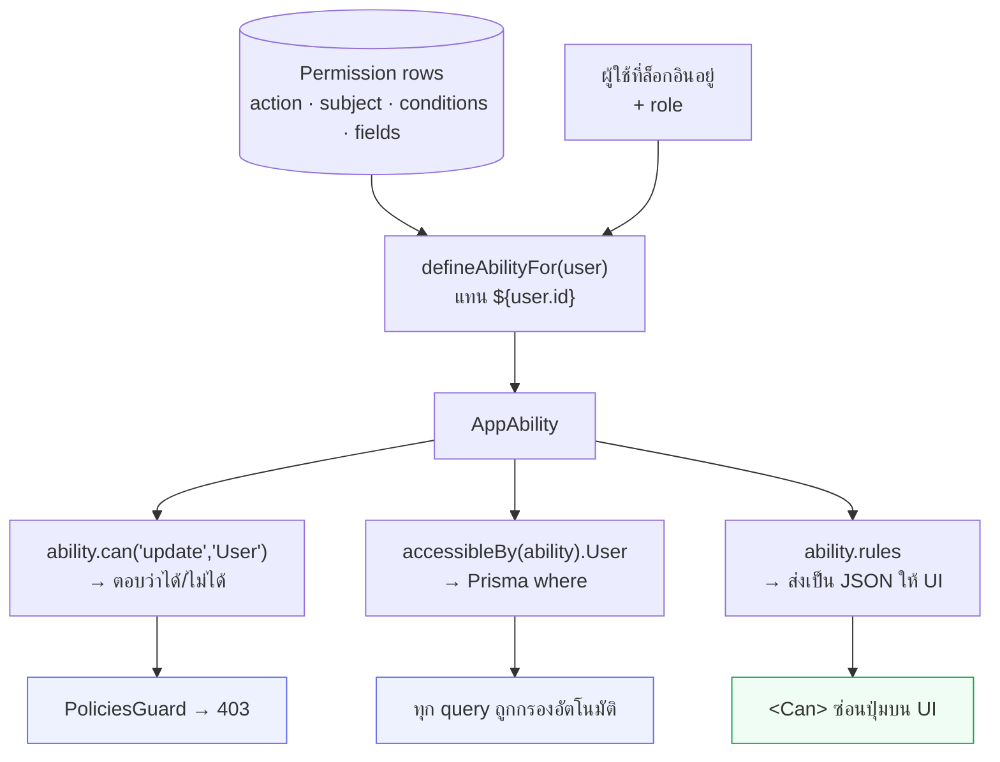

# CASL authorization

<Status value="planned" />

> **ability ชุดเดียว บังคับที่ server ใช้ซ้ำที่ UI**

[RBAC](/auth/rbac-model) คือข้อมูล หน้านี้คือกลไกที่เอาข้อมูลนั้นมาบังคับใช้จริง

## ทำไมต้อง CASL

ระบบสิทธิ์แบบเช็ค role ตรง ๆ พังเมื่อเจอคำว่า "ของตัวเอง"

```ts
// เริ่มจากแบบนี้…
if (user.role !== "admin") throw new ForbiddenException();

// …แล้วกลายเป็นแบบนี้ในสามเดือน
if (user.role !== "admin" && !(user.role === "manager" && target.id !== user.id)
    && !(target.id === user.id && onlyChangingProfileFields(dto))) throw …
```

CASL แยกสามอย่างออกจากกัน — *กฎ* (ข้อมูลในตาราง `Permission`), *การถาม* (`ability.can(...)`), และ *การกรองข้อมูล* (`accessibleBy()` ที่กลายเป็น `WHERE` ของ SQL) แถมส่งกฎชุดเดียวกันไปให้ UI ใช้ซ่อนปุ่มได้ด้วย ไม่ต้องเขียนตรรกะสิทธิ์ซ้ำสองภาษา

## จากตารางถึงคำตอบ



## นิยาม type

```ts
// packages/contracts/src/ability.schema.ts
import { z } from "zod";

export const ACTIONS = ["manage", "create", "read", "update", "delete"] as const;
export const SUBJECTS = ["all", "User", "Role", "Permission", "AuditLog", "File"] as const;

export type AppAction = (typeof ACTIONS)[number];
export type AppSubject = (typeof SUBJECTS)[number];

/** เปิดเฉพาะ operator ที่จำเป็น ไม่เปิด MongoQuery ทั้งชุด */
const ConditionValueSchema = z.union([
  z.string(), z.number(), z.boolean(), z.null(),
  z.object({
    $eq: z.unknown().optional(),
    $ne: z.unknown().optional(),
    $in: z.array(z.unknown()).optional(),
    $nin: z.array(z.unknown()).optional(),
  }).strict(),
]);

export const RawRuleSchema = z.object({
  action: z.enum(ACTIONS),
  subject: z.enum(SUBJECTS),
  fields: z.array(z.string()).optional(),
  conditions: z.record(z.string(), ConditionValueSchema).optional(),
  inverted: z.boolean().optional(),
  reason: z.string().optional(),
});
export type RawRule = z.infer<typeof RawRuleSchema>;

export const AbilityRulesSchema = z.array(RawRuleSchema);
```

::: danger `conditions` ต้องผ่าน zod ก่อนเข้า CASL
`conditions` มาจากคอลัมน์ `Json` ในฐานข้อมูล การป้อนเข้าเครื่องมือประเมินสิทธิ์โดยไม่ตรวจ = ใครที่แก้แถวนั้นได้ก็เขียนกฎอะไรก็ได้ `.strict()` บล็อก operator ที่ไม่ได้อยู่ในรายการ และ `z.enum` บล็อก action/subject ที่ไม่รู้จัก
:::

## สร้าง ability

```ts
// apps/api/src/auth/ability/ability.factory.ts
import { AbilityBuilder, createMongoAbility, type MongoAbility } from "@casl/ability";
import { AbilityRulesSchema, type AppAction, type AppSubject } from "@app-platform/contracts";

export type AppAbility = MongoAbility<[AppAction, AppSubject]>;

@Injectable()
export class AbilityFactory {
  constructor(private readonly prisma: PrismaService) {}

  async forUser(userId: string): Promise<AppAbility> {
    const rows = await this.prisma.permission.findMany({
      where: { roles: { some: { role: { users: { some: { userId } } } } } },
    });

    const rules = AbilityRulesSchema.parse(
      rows.map((row) => ({
        action: row.action,
        subject: row.subject,
        fields: row.fields.length ? row.fields : undefined,
        // แทน placeholder ด้วยค่าจริงของผู้ใช้คนนี้
        conditions: row.conditions ? interpolate(row.conditions, { user: { id: userId } }) : undefined,
      })),
    );

    return createMongoAbility<AppAbility>(rules);
  }
}

/** แทน "${user.id}" ด้วยค่าจริง — รองรับเฉพาะ path ที่ allowlist ไว้ */
function interpolate(conditions: unknown, ctx: { user: { id: string } }): Record<string, unknown> {
  return JSON.parse(
    JSON.stringify(conditions).replace(/"\$\{user\.id\}"/g, JSON.stringify(ctx.user.id)),
  );
}
```

### แคช

`forUser()` ยิง DB ทุก request ซึ่งไม่ไหวถ้าโหลดสูง แคชได้ใน Redis ด้วย key `ability:<userId>` TTL 5 นาที และ **ต้องล้างทันที** เมื่อ role ของผู้ใช้เปลี่ยนหรือ permission ของ role นั้นเปลี่ยน

::: warning แคชสิทธิ์คือแคชที่พลาดไม่ได้
แคชสิทธิ์ค้างแปลว่าคนที่เพิ่งถูกถอดสิทธิ์ยังทำได้ต่ออีก 5 นาที ถ้าจะแคช การล้างต้องอยู่ใน transaction เดียวกับการเปลี่ยน role ถ้ายังไม่มั่นใจ อย่าเพิ่งแคช — ยิง DB ทุก request ยังถูกกว่าการให้สิทธิ์ผิด
:::

## บังคับที่ server

### Guard

```ts
// apps/api/src/auth/ability/policies.guard.ts
export type PolicyHandler = (ability: AppAbility, req: Request) => boolean;

export const CHECK_POLICIES = "check_policies";
export const CheckPolicies = (...handlers: PolicyHandler[]) =>
  SetMetadata(CHECK_POLICIES, handlers);

@Injectable()
export class PoliciesGuard implements CanActivate {
  constructor(private readonly reflector: Reflector, private readonly abilityFactory: AbilityFactory) {}

  async canActivate(context: ExecutionContext): Promise<boolean> {
    const handlers = this.reflector.get<PolicyHandler[]>(CHECK_POLICIES, context.getHandler()) ?? [];
    const req = context.switchToHttp().getRequest<Request>();

    // แนบไว้เสมอ แม้ไม่มี policy — service ยังต้องใช้ทำ accessibleBy
    const ability = await this.abilityFactory.forUser(req.user.id);
    req.ability = ability;

    if (handlers.every((handler) => handler(ability, req))) return true;
    throw Errors.forbidden();
  }
}
```

```ts
@Post()
@CheckPolicies((ability) => ability.can("create", "User"))
create(@Body() dto: CreateUserDto) { … }
```

### กรองข้อมูลด้วย `accessibleBy`

Guard ตอบได้แค่ "ทำได้ไหม" — คำถามที่ยากกว่าคือ "เห็นแถวไหนบ้าง" `@casl/prisma` แปลง ability เป็น `where` ให้

```ts
import { accessibleBy } from "@casl/prisma";

async list(query: ListUsersQuery, ability: AppAbility) {
  const where: Prisma.UserWhereInput = {
    AND: [
      // 🔑 ตัวกรองจากสิทธิ์ ต้อง AND กับทุกอย่างเสมอ
      accessibleBy(ability, "read").User,
      { deletedAt: null },
      query.q ? { displayName: { contains: query.q, mode: "insensitive" } } : {},
    ],
  };

  const [items, total] = await this.prisma.$transaction([
    this.prisma.user.findMany({ where, skip: (query.page - 1) * query.limit, take: query.limit }),
    this.prisma.user.count({ where }),
  ]);

  return { items, total, page: query.page, limit: query.limit };
}
```

`member` ที่มีกฎ `read User where id = ${user.id}` จะได้ `WHERE id = '…'` ใน SQL — ตัวกรองอยู่ในระดับฐานข้อมูล ไม่ใช่กรองในหน่วยความจำหลังดึงมาแล้ว

::: danger `accessibleBy` ต้องอยู่ทุก query ไม่มีข้อยกเว้น
ลืมที่เดียวคือรั่วที่นั่น และเป็นการรั่วที่เทสไม่ค่อยจับได้เพราะโค้ดยังทำงานถูก แค่คืนแถวเกิน วิธีที่ปลอดภัยกว่าคือใช้ [Prisma client extension](https://www.prisma.io/docs/orm/prisma-client/client-extensions) ที่แทรก `accessibleBy` ให้อัตโนมัติจาก ability ใน `AsyncLocalStorage` — จะได้ไม่มีทางลืม
:::

### ตรวจสิทธิ์กับแถวใดแถวหนึ่ง

```ts
async update(id: string, dto: UpdateUser, ability: AppAbility) {
  const user = await this.prisma.user.findFirst({
    where: { AND: [accessibleBy(ability, "read").User, { id, deletedAt: null }] },
  });
  // ถ้าอ่านไม่ได้ ให้เป็น 404 ไม่ใช่ 403 — จะได้ไม่ยืนยันว่า id นี้มีอยู่
  if (!user) throw Errors.userNotFound();

  // ตรวจกับ instance จริง เพราะ conditions ผูกกับค่าในแถว
  const subject = subjectHelper("User", user);
  if (!ability.can("update", subject)) throw Errors.forbidden();

  // ตรวจทีละ field — `manager` แก้ `roles` ไม่ได้แม้จะแก้ user คนนั้นได้
  for (const field of Object.keys(dto)) {
    if (!ability.can("update", subject, field)) throw Errors.forbiddenField(field);
  }

  return this.prisma.user.update({ where: { id }, data: dto });
}
```

::: tip ต้องตรวจสามชั้น
`can(action, subject)` ตอบว่าทำกับ *ชนิด* นี้ได้ไหม · `can(action, instance)` ตอบว่าทำกับ *แถวนี้* ได้ไหม (ประเมิน `conditions`) · `can(action, instance, field)` ตอบว่าแก้ *ช่องนี้* ได้ไหม ข้ามชั้นไหนก็เป็นช่องโหว่ชั้นนั้น
:::

## ส่งกฎไปให้ UI

```ts
// GET /v1/auth/me
@Get("me")
async me(@Req() req: Request) {
  return {
    user: toUserDto(req.user),
    // ส่งกฎดิบ ไม่ใช่ boolean สำเร็จรูป
    rules: req.ability.rules,
  };
}
```

::: tip ส่ง rules ไม่ใช่ flag
ถ้าส่ง `{ canCreateUser: true, canDeleteUser: false }` ทุกครั้งที่เพิ่มปุ่มใหม่บน UI ต้องกลับไปเพิ่ม flag ที่ API การส่งกฎดิบทำให้ UI ถามอะไรก็ได้โดยที่ API ไม่ต้องรู้ล่วงหน้าว่า UI จะถามอะไร
:::

ฝั่ง client ประกอบกลับ

```ts
// apps/web/src/lib/ability.ts
import { createMongoAbility } from "@casl/ability";
import { AbilityRulesSchema } from "@app-platform/contracts";

export function buildAbility(raw: unknown): AppAbility {
  return createMongoAbility(AbilityRulesSchema.parse(raw));
}
```

```tsx
<Can I="create" a="User">
  <Button onClick={openCreateDialog}>เพิ่มผู้ใช้</Button>
</Can>
```

รายละเอียดฝั่ง UI อยู่ที่ [สิทธิ์บน UI](/frontend/permissions-client)

::: danger UI gating ไม่ใช่ security
`<Can>` แค่ซ่อนปุ่ม ใครก็ยิง API ตรงได้ **ทุก endpoint ต้องมี guard ของตัวเอง** ให้คิดว่า UI คือการทำให้ผู้ใช้ไม่เห็นทางที่จะล้มเหลว ไม่ใช่การป้องกัน
:::

## กันการเลื่อนขั้นตัวเอง

ช่องโหว่ที่พบบ่อยที่สุดในระบบสิทธิ์คือคนที่แก้ user ได้ แก้ role ตัวเองเป็น admin

```ts
// สามชั้นซ้อนกัน
can("update", "User", ["displayName", "email", "status"], { id: { $ne: user.id } });
//                     └─ ไม่มี "roles"                     └─ ห้ามแก้ตัวเอง
cannot("update", "Role");
//     └─ manager แตะนิยามของ role ไม่ได้เลย
```

`cannot` ชนะ `can` เสมอใน CASL ไม่ว่าจะประกาศลำดับไหน จึงใช้เป็นตาข่ายกันพลาดได้อย่างมั่นใจ

## เทส

ability คือตรรกะบริสุทธิ์ เทสง่ายมากและคุ้มค่าที่สุดที่จะเทส

```ts
describe("ability ของ manager", () => {
  const manager = { id: "u1", roles: ["manager"] };
  const ability = buildAbilityFrom(MANAGER_RULES, manager);

  it("แก้ผู้ใช้คนอื่นได้", () => {
    expect(ability.can("update", subject("User", { id: "u2" }))).toBe(true);
  });

  it("แก้ตัวเองไม่ได้", () => {
    expect(ability.can("update", subject("User", { id: "u1" }))).toBe(false);
  });

  it("แก้ field roles ไม่ได้", () => {
    expect(ability.can("update", subject("User", { id: "u2" }), "roles")).toBe(false);
  });

  it("แตะ Role ไม่ได้", () => {
    expect(ability.can("update", "Role")).toBe(false);
  });
});
```

ทุกแถวใน[ตารางสิทธิ์](/auth/rbac-model) ควรมีเทสคู่กันหนึ่งอัน โดยเฉพาะแถวที่เป็นการ **ปฏิเสธ** เพราะเทสที่ตรวจว่า "ทำไม่ได้" คือเทสที่จับ regression ด้านความปลอดภัยได้จริง

::: warning สถานะโค้ดปัจจุบัน
| สเปกเป้าหมาย | โค้ดวันนี้ |
| --- | --- |
| `@casl/ability` + `@casl/prisma` | **ไม่ได้ติดตั้งทั้งคู่** — ไม่มีคำว่า casl ใน repo |
| `AbilityFactory` + `PoliciesGuard` | ไม่มี |
| `accessibleBy` ในทุก query | ไม่มีระบบสิทธิ์เลย — `GET /users/:id` คืนใครก็ได้ให้ user ที่ล็อกอินคนใดก็ได้ |
| `GET /v1/auth/me` ส่ง rules | ไม่มี endpoint |
| ตาราง `Permission` | ไม่มี |
| จำกัดระดับ field | ไม่มี |
| เทส ability | ไม่มีไฟล์เทสในโปรเจกต์เลย |
:::
