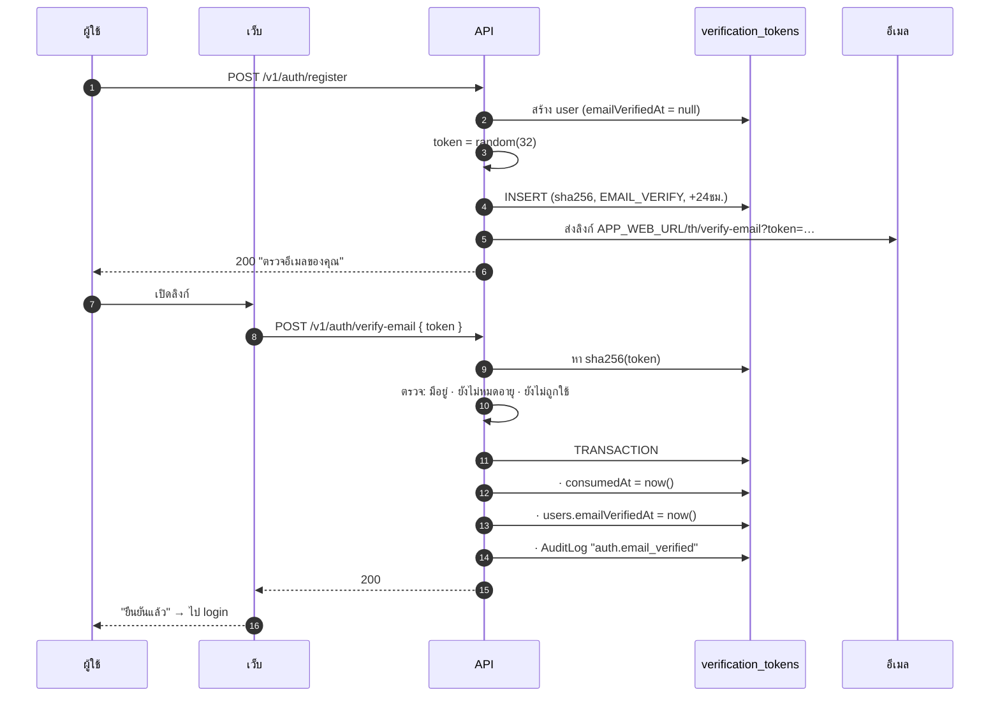
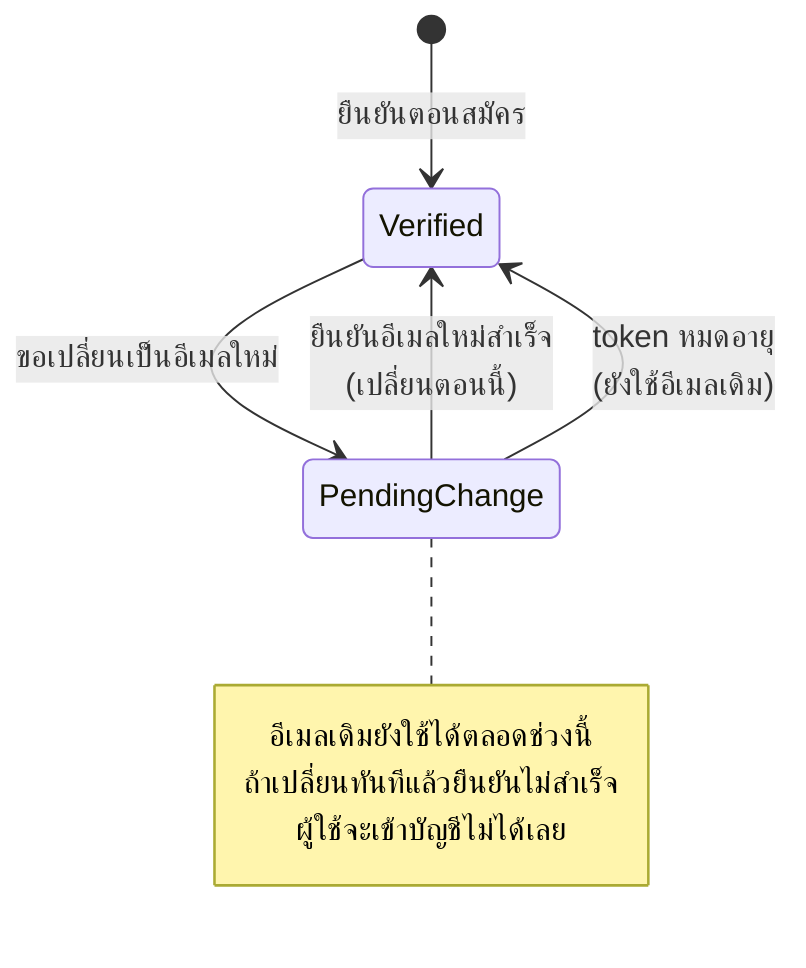

# ยืนยันอีเมล

<Status value="planned" />

พิสูจน์ว่าคนที่สมัครคุมอีเมลนั้นจริง — เป็นเงื่อนไขที่ทำให้ [การลืมรหัสผ่าน](/auth/forgot-password) มีความหมาย เพราะถ้าอีเมลไม่ได้ถูกยืนยัน การรีเซ็ตผ่านอีเมลก็ไม่ได้พิสูจน์อะไร

## Flow



## สัญญาของ token

| กฎ | ค่า | เทียบกับ reset |
| --- | --- | --- |
| อายุ | 24 ชั่วโมง | ยาวกว่า (1 ชม.) เพราะอันตรายน้อยกว่า |
| ใช้ได้ | ครั้งเดียว | เหมือนกัน |
| ใบที่ใช้ได้พร้อมกัน | 1 ใบ — ส่งใหม่ = ใบเก่าตาย | เหมือนกัน |
| ที่เก็บ | SHA-256 ในตาราง `VerificationToken` | เหมือนกัน |
| `purpose` | `EMAIL_VERIFY` | `PASSWORD_RESET` |

::: tip ทำไม 24 ชั่วโมงถึงยอมรับได้
token ยืนยันอีเมลที่หลุด ทำได้อย่างเดียวคือทำให้บัญชีถูกยืนยัน — ไม่ได้ให้สิทธิ์เข้าถึงอะไร ต่างจาก token รีเซ็ตที่ให้อำนาจเปลี่ยนรหัสผ่าน จึงยอมให้อายุยาวขึ้นเพื่อ UX ที่ดีกว่าได้ (คนมักเปิดอีเมลวันถัดไป)
:::

## ยังไม่ยืนยันแล้วทำอะไรได้บ้าง

| การกระทำ | ยังไม่ยืนยัน |
| --- | --- |
| เข้าสู่ระบบ | ❌ `403 AUTH_EMAIL_NOT_VERIFIED` |
| ขอส่งอีเมลยืนยันใหม่ | ✅ (throttle) |
| ยืนยันด้วย token | ✅ |
| อย่างอื่นทั้งหมด | ❌ |

::: tip เข้มแบบนี้หรือผ่อนได้
boilerplate นี้เลือกแบบเข้ม — ยืนยันก่อนถึงจะ login ได้ ตรงไปตรงมาและไม่ต้องเขียนกฎว่าอะไรทำได้บ้างในสถานะครึ่ง ๆ

ผลิตภัณฑ์ที่ต้องการให้ผู้ใช้เริ่มใช้ทันทีอาจเลือกแบบผ่อน (login ได้แต่ทำบางอย่างไม่ได้) ถ้าจะเปลี่ยนไปทางนั้น ให้ทำผ่าน CASL — ใส่เงื่อนไข `emailVerifiedAt != null` ในกฎที่ต้องการ ไม่ใช่กระจาย `if` ตาม controller
:::

ผู้ใช้ที่มาจาก Google ถูกตั้ง `emailVerifiedAt = now()` ทันที เพราะ Google ยืนยันให้แล้ว (และเราตรวจ `email_verified` ใน `id_token` แล้ว) — ดู [สมัครสมาชิก](/auth/signup)

## ส่งใหม่

```ts
export const ResendVerificationSchema = z.object({ email: z.email() });
```

`POST /v1/auth/resend-verification` — `@Public()` เพราะคนที่ยังยืนยันไม่ได้ก็ login ไม่ได้

| ขีดจำกัด | นับต่อ |
| --- | --- |
| 3 ครั้ง/ชั่วโมง | IP + อีเมล |
| 20 ครั้ง/ชั่วโมง | IP |

ตอบข้อความกลาง ๆ เหมือนกันทุกกรณีเช่นเดียวกับ [ลืมรหัสผ่าน](/auth/forgot-password) — ไม่งั้น endpoint นี้จะกลายเป็นเครื่องมือตรวจอีเมลแทน

```ts
async resendVerification(input: ResendVerification) {
  const user = await this.users.findByEmail(input.email);

  // ส่งเฉพาะเมื่อมีจริงและยังไม่ยืนยัน แต่ตอบเหมือนกันทุกกรณี
  if (user && !user.emailVerifiedAt) {
    await this.verification.issueAndSend(user, "EMAIL_VERIFY");
  } else {
    await sleep(randomInt(180, 320));
  }

  return { message: "ถ้าอีเมลนี้รอการยืนยันอยู่ เราได้ส่งลิงก์ใหม่ไปแล้ว" };
}
```

## หน้าเว็บ

### `/[locale]/(auth)/check-email`

หน้าที่เห็นทันทีหลังสมัคร

```
┌────────────────────────────────────┐
│              ✉️                     │
│        ตรวจอีเมลของคุณ               │
│  เราส่งลิงก์ยืนยันไปที่                │
│  ann@example.com                    │
│  ลิงก์มีอายุ 24 ชั่วโมง               │
│  [    ส่งอีเมลอีกครั้ง (0:47)   ]   │
│           ← กลับไปเข้าสู่ระบบ         │
└────────────────────────────────────┘
```

ปุ่มส่งใหม่ต้องมีตัวนับถอยหลัง 60 วินาทีที่ฝั่ง client ด้วย ไม่ใช่พึ่ง `429` จาก server อย่างเดียว

### `/[locale]/(auth)/verify-email?token=…`

| สถานะ | UI |
| --- | --- |
| กำลังตรวจ | spinner "กำลังยืนยัน…" |
| สำเร็จ | ✅ "ยืนยันเรียบร้อย" + ปุ่มไป login (auto redirect 3 วิ) |
| token ไม่ถูกต้อง | ❌ "ลิงก์นี้ใช้ไม่ได้" + ฟอร์มขอใหม่ |
| หมดอายุ | ⏱ "ลิงก์หมดอายุแล้ว" + ฟอร์มขอใหม่ |
| ถูกใช้แล้ว | ℹ️ "ยืนยันไปแล้ว" + ลิงก์ไป login |

::: tip หน้านี้ยิง API ตอนโหลดได้ ต่างจากหน้ารีเซ็ต
ต่างจาก [หน้ารีเซ็ตรหัสผ่าน](/auth/forgot-password) — ที่นี่ยิงอัตโนมัติตอนโหลดหน้าได้ เพราะการเผา token ทิ้งโดยไม่ตั้งใจไม่ทำให้เสียอะไร (ผู้ใช้แค่ยืนยันสำเร็จ) ส่วนหน้ารีเซ็ตถ้าเผาทิ้ง ผู้ใช้จะตั้งรหัสใหม่ไม่ได้และต้องเริ่มใหม่ทั้งหมด

แต่ยังต้องรองรับ `TOKEN_ALREADY_USED` แบบสวย ๆ เพราะ scanner ของ Gmail อาจเปิดลิงก์ไปก่อนผู้ใช้แล้ว
:::

## เปลี่ยนอีเมล

การเปลี่ยนอีเมลของบัญชีที่ใช้อยู่ต้องยืนยัน **อีเมลใหม่** ก่อนถึงจะมีผล



พร้อมกันนั้นต้องส่งแจ้งไปที่ **อีเมลเดิม** ว่า "มีคำขอเปลี่ยนอีเมลเป็น a***@example.com" เพื่อให้เจ้าของตัวจริงรู้ตัวถ้าไม่ได้เป็นคนทำ

::: warning สถานะโค้ดปัจจุบัน
| สเปกเป้าหมาย | โค้ดวันนี้ |
| --- | --- |
| `POST /v1/auth/verify-email` + `resend-verification` | ไม่มีทั้งคู่ |
| คอลัมน์ `emailVerifiedAt` | ไม่มีใน `schema.prisma` |
| ตาราง `VerificationToken` | ไม่มี |
| ส่งอีเมลได้ | ไม่มี mailer ดู [ส่งอีเมล](/backend/email) |
| login ตรวจการยืนยัน | ไม่ตรวจ — user ที่ seed มาใช้งานได้ทันที |
| หน้าเว็บ | ไม่มี |
:::
