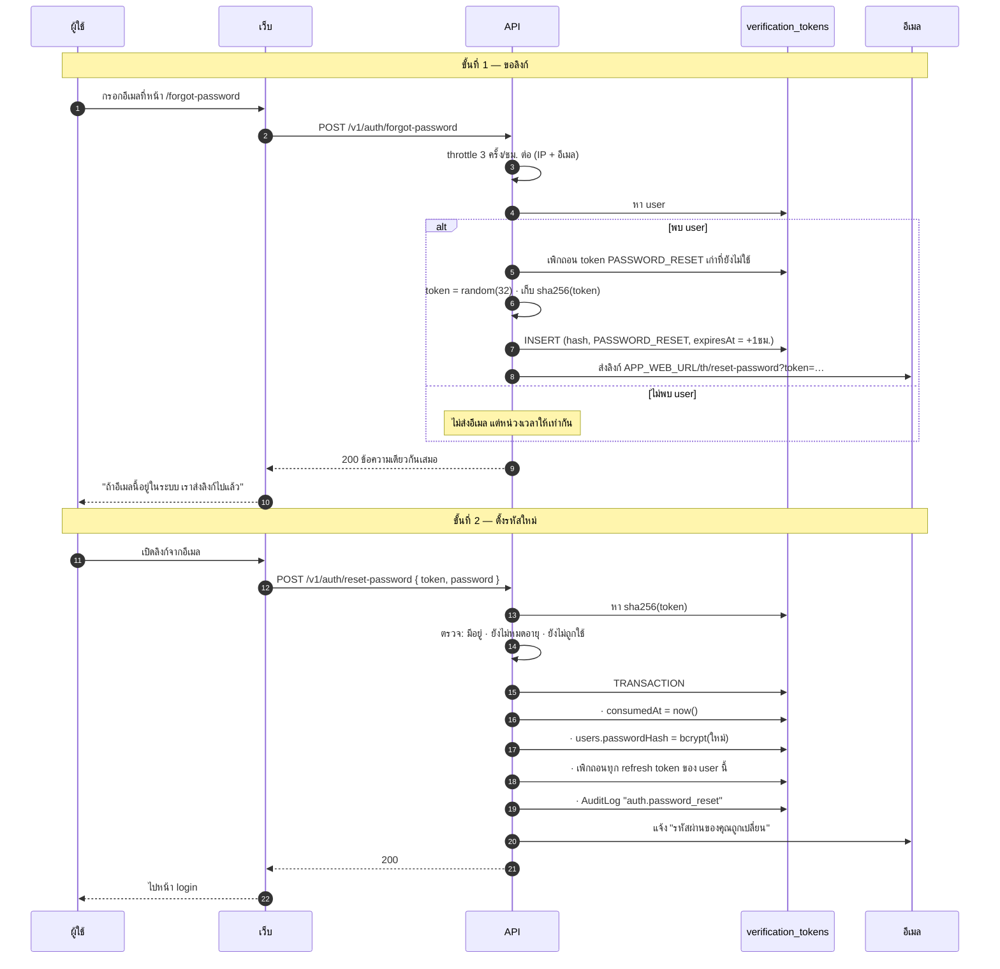
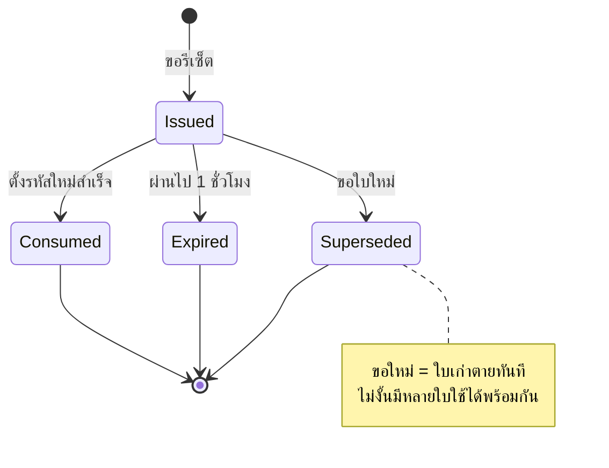

# ลืมรหัสผ่าน

<Status value="planned" />

flow นี้เป็นทางเข้าที่ **ข้ามรหัสผ่านได้** จึงต้องเข้มเป็นพิเศษ ใครที่ยึด flow นี้ได้ก็ยึดบัญชีได้

## สองขั้นตอน



## กันการตรวจว่าอีเมลไหนมีในระบบ

::: danger กฎที่สำคัญที่สุดของหน้านี้
`POST /v1/auth/forgot-password` ต้องตอบ **`200` พร้อมข้อความเดียวกัน ใช้เวลาใกล้เคียงกัน** ไม่ว่าอีเมลนั้นจะมีในระบบหรือไม่

ถ้าตอบ `404` เมื่อไม่พบ หน้านี้จะกลายเป็นเครื่องมือตรวจว่าอีเมลไหนสมัครไว้กับเรา ซึ่งเป็นข้อมูลที่มีค่าสำหรับการ phishing และ credential stuffing
:::

```ts
async forgotPassword(input: ForgotPassword): Promise<{ message: string }> {
  const user = await this.users.findByEmail(input.email);

  if (user && user.status === "ACTIVE") {
    await this.verification.issueAndSend(user, "PASSWORD_RESET");
  } else {
    // ถ่วงเวลาให้ใกล้เคียงกับกรณีที่ต้องเข้าคิวส่งอีเมลจริง
    await sleep(randomInt(180, 320));
  }

  return { message: "ถ้าอีเมลนี้อยู่ในระบบ เราได้ส่งลิงก์รีเซ็ตไปแล้ว" };
}
```

::: tip เวลาต้องใกล้เคียง ไม่ใช่เท่ากันเป๊ะ
เป้าหมายคือทำให้ความต่างจมอยู่ในความแปรปรวนของเครือข่าย ไม่ใช่ทำให้เท่ากันเป๊ะซึ่งเป็นไปไม่ได้ ที่สำคัญกว่าคือ **การส่งอีเมลต้องเป็น async** ถ้ารอ SMTP ตอบก่อน return ความต่างจะใหญ่เกินกว่าจะกลบได้
:::

## สถานะของ token



| กฎ | ค่า | ทำไม |
| --- | --- | --- |
| อายุ | 1 ชั่วโมง | สั้นกว่า token ยืนยันอีเมล (24 ชม.) เพราะอันตรายกว่ามาก |
| ใช้ได้ | ครั้งเดียว | `consumedAt` ตั้งใน transaction เดียวกับการเปลี่ยนรหัส |
| ใบที่ใช้ได้พร้อมกัน | 1 ใบ | ขอใหม่ = เพิกถอนใบเก่าทั้งหมด |
| ที่เก็บ | SHA-256 | DB หลุดก็รีเซ็ตรหัสใครไม่ได้ |
| ความยาว | 32 ไบต์ base64url | 256 บิต เดาไม่ได้ |
| ส่งผ่าน | query string ในลิงก์ | ยอมรับได้เพราะอายุสั้นและใช้ครั้งเดียว |

## ตั้งรหัสใหม่

```ts
export const ResetPasswordSchema = z.object({
  token: z.string().min(32),
  password: PasswordSchema,           // กฎเดียวกับตอนสมัคร
  confirmPassword: z.string(),
}).refine((v) => v.password === v.confirmPassword, {
  message: "รหัสผ่านไม่ตรงกัน",
  path: ["confirmPassword"],
});
```

```ts
async resetPassword(input: ResetPassword) {
  const tokenHash = sha256(input.token);

  await this.prisma.$transaction(async (tx) => {
    const row = await tx.verificationToken.findUnique({ where: { tokenHash } });

    if (!row || row.purpose !== "PASSWORD_RESET") throw Errors.tokenInvalid();
    if (row.consumedAt) throw Errors.tokenAlreadyUsed();
    if (row.expiresAt < new Date()) throw Errors.tokenExpired();

    await tx.verificationToken.update({
      where: { id: row.id },
      data: { consumedAt: new Date() },
    });

    await tx.user.update({
      where: { id: row.userId },
      data: {
        passwordHash: await bcrypt.hash(input.password, 12),
        // ใครที่ตั้งรหัสใหม่ได้ ก็ยืนยันแล้วว่าคุมอีเมลนี้อยู่จริง
        emailVerifiedAt: row.consumedAt ?? new Date(),
      },
    });

    // 🔑 ตัดทุก session — คนที่ขโมยรหัสเก่าไปต้องหลุดออก
    await tx.refreshToken.updateMany({
      where: { userId: row.userId, revokedAt: null },
      data: { revokedAt: new Date() },
    });

    await tx.auditLog.create({
      data: {
        actorId: row.userId,
        action: "auth.password_reset",
        subjectType: "User",
        subjectId: row.userId,
        traceId: getTraceId(),
      },
    });
  });

  await this.mail.sendPasswordChangedNotice(userEmail);
  return { message: "เปลี่ยนรหัสผ่านเรียบร้อย" };
}
```

::: danger เปลี่ยนรหัสผ่านต้องตัดทุก session
เหตุผลหลักที่คนรีเซ็ตรหัสผ่านคือ *สงสัยว่าบัญชีถูกเจาะ* ถ้าไม่เพิกถอน refresh token คนร้ายที่ได้ session ไปแล้วจะยังอยู่ในระบบต่ออีก 7 วัน แม้ผู้ใช้เปลี่ยนรหัสไปแล้ว — ซึ่งทำให้การรีเซ็ตรหัสผ่านแทบไม่มีความหมาย
:::

::: tip แจ้งทางอีเมลทุกครั้ง
ส่งอีเมล "รหัสผ่านของคุณถูกเปลี่ยนเมื่อ … จาก IP …" เสมอ ถ้าไม่ใช่เจ้าตัว นี่คือสัญญาณเดียวที่จะได้รับ อีเมลนี้ห้ามมีลิงก์ที่ทำ action ได้ — ให้บอกให้ติดต่อผู้ดูแลแทน เพื่อไม่ให้กลายเป็นเป้า phishing เสียเอง
:::

## สเปกหน้าเว็บ

### `/[locale]/(auth)/forgot-password`

```
┌────────────────────────────────────┐
│        ลืมรหัสผ่าน                  │
│  กรอกอีเมลของคุณ เราจะส่งลิงก์ไปให้   │
│  อีเมล                              │
│  [                              ]   │
│  [        ส่งลิงก์รีเซ็ต          ]   │
│           ← กลับไปเข้าสู่ระบบ         │
└────────────────────────────────────┘
```

หลังส่งสำเร็จ **แทนที่ทั้งฟอร์มด้วยข้อความยืนยัน** อย่าคงฟอร์มไว้ให้กดซ้ำรัว ๆ

```
┌────────────────────────────────────┐
│              ✉️                     │
│        ตรวจอีเมลของคุณ               │
│  ถ้า ann@example.com อยู่ในระบบ      │
│  เราได้ส่งลิงก์รีเซ็ตไปแล้ว            │
│  ลิงก์มีอายุ 1 ชั่วโมง                │
│  ส่งอีกครั้งได้ใน 0:47               │
└────────────────────────────────────┘
```

### `/[locale]/(auth)/reset-password?token=…`

| สถานะ | UI |
| --- | --- |
| กำลังโหลด | skeleton |
| token ใช้ได้ | ฟอร์มตั้งรหัสใหม่ + ตัววัดความแข็งแรง |
| token ไม่ถูกต้อง | "ลิงก์นี้ใช้ไม่ได้" + ปุ่มขอใหม่ |
| token หมดอายุ | "ลิงก์หมดอายุแล้ว" + ปุ่มขอใหม่ |
| token ถูกใช้แล้ว | "ลิงก์นี้ถูกใช้ไปแล้ว" + ลิงก์ไป login |
| สำเร็จ | "เปลี่ยนรหัสผ่านเรียบร้อย" → ไป login |

::: tip อย่า validate token ตอนโหลดหน้า
ถ้าเรียก API ตรวจ token ตอนหน้าโหลด แค่การ prefetch ของเบราว์เซอร์หรือ scanner ของโปรแกรมอีเมลก็อาจเผาลิงก์ทิ้ง ให้แสดงฟอร์มไปเลย แล้วค่อยตรวจตอน submit
:::

## จำกัดอัตรา

| Endpoint | ขีดจำกัด | นับต่อ |
| --- | --- | --- |
| `POST /v1/auth/forgot-password` | 3 ครั้ง/ชั่วโมง | IP + อีเมล |
| `POST /v1/auth/forgot-password` | 20 ครั้ง/ชั่วโมง | IP อย่างเดียว |
| `POST /v1/auth/reset-password` | 10 ครั้ง/ชั่วโมง | IP |

ชั้นแรกกันการสแปมอีเมลของคนคนเดียว ชั้นที่สองกันการกวาดอีเมลจำนวนมากจากเครื่องเดียว

## เปลี่ยนรหัสผ่านตอนล็อกอินอยู่

คนละอย่างกับการรีเซ็ต — ตัวนี้ต้องรู้รหัสเดิม

```ts
export const ChangePasswordSchema = z.object({
  currentPassword: z.string().min(1),
  newPassword: PasswordSchema,
  confirmPassword: z.string(),
}).refine((v) => v.newPassword === v.confirmPassword, { path: ["confirmPassword"] })
  .refine((v) => v.newPassword !== v.currentPassword, {
    message: "รหัสผ่านใหม่ต้องไม่ซ้ำกับรหัสเดิม",
    path: ["newPassword"],
  });
```

`POST /v1/users/me/password` — ตรวจรหัสเดิม เปลี่ยนเป็นรหัสใหม่ แล้วเพิกถอน **ทุก session ยกเว้นเครื่องปัจจุบัน** (คนที่เพิ่งเปลี่ยนรหัสไม่ควรถูกเตะออกจากหน้าที่ตัวเองกำลังใช้อยู่)

::: warning สถานะโค้ดปัจจุบัน
| สเปกเป้าหมาย | โค้ดวันนี้ |
| --- | --- |
| `POST /v1/auth/forgot-password` + `reset-password` | ไม่มีทั้งคู่ |
| ตาราง `VerificationToken` | ไม่มี |
| ส่งอีเมลได้ | ไม่มี mailer ดู [ส่งอีเมล](/backend/email) |
| เพิกถอน session ตอนเปลี่ยนรหัส | ไม่มีตาราง refresh ให้เพิกถอน |
| throttle | ไม่มี `@nestjs/throttler` |
| หน้าเว็บ | ไม่มี |
:::
