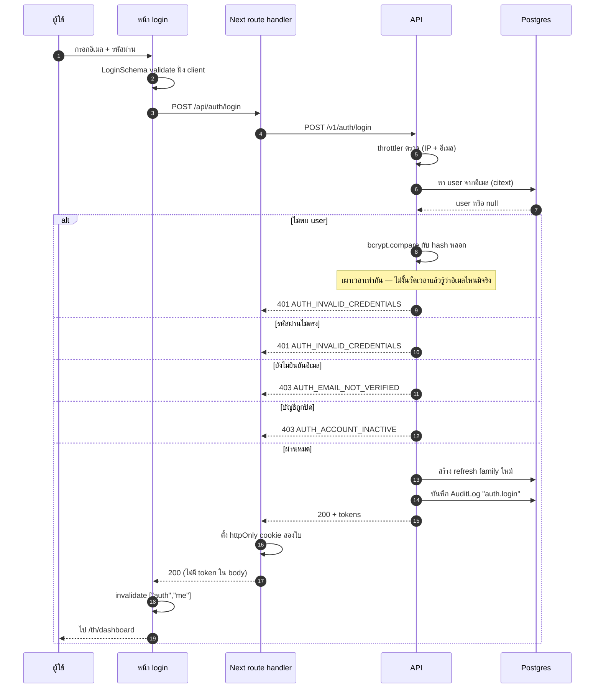

# เข้าสู่ระบบ

<Status value="in-progress" note="endpoint มี · หน้าเว็บยังไม่มี" />

## สัญญา

`LoginSchema` มีอยู่แล้วใน `packages/contracts/src/auth.schema.ts`

```ts
export const LoginSchema = z.object({
  email: z.email(),
  password: z.string().min(8).max(72),   // 72 = เพดานของ bcrypt
});
```

| | ค่า |
| --- | --- |
| Endpoint | `POST /v1/auth/login` |
| Auth | `@Public()` |
| Body | `LoginSchema` |
| สำเร็จ | `200` + `AuthTokensSchema` และตั้ง cookie สองใบ |
| ล้มเหลว | `401 AUTH_INVALID_CREDENTIALS` · `403 AUTH_EMAIL_NOT_VERIFIED` · `403 AUTH_ACCOUNT_INACTIVE` · `429 RATE_LIMIT_EXCEEDED` |
| Throttle | 5 ครั้ง/นาที ต่อ (IP + อีเมล) |

## Flow



::: danger เวลาตอบต้องเท่ากัน
ถ้าไม่พบอีเมล **ยังต้องเรียก `bcrypt.compare` กับ hash หลอก** เพราะ bcrypt กิน CPU เป็นร้อยมิลลิวินาที การ return ทันทีเมื่อไม่พบ user ทำให้วัดเวลาแล้วแยกออกได้ว่าอีเมลไหนมีบัญชีในระบบ

```ts
// hash ของสตริงสุ่ม สร้างครั้งเดียวตอนบูต
const DUMMY_HASH = await bcrypt.hash(randomBytes(32).toString("hex"), 10);

const user = await this.users.findByEmail(input.email);
const ok = await bcrypt.compare(input.password, user?.passwordHash ?? DUMMY_HASH);
if (!user || !ok) throw Errors.invalidCredentials();
```
:::

::: tip ข้อความเดียวสำหรับทุกความผิด
"อีเมลหรือรหัสผ่านไม่ถูกต้อง" เท่านั้น ห้ามแยกเป็น "ไม่พบอีเมลนี้" กับ "รหัสผ่านผิด" — ข้อความแรกคือเครื่องมือให้คนตรวจว่าอีเมลไหนสมัครไว้กับเรา
:::

## Service

```ts
async login(input: Login, meta: RequestMeta): Promise<AuthTokens> {
  const user = await this.users.findByEmail(input.email);

  const passwordOk = await bcrypt.compare(input.password, user?.passwordHash ?? DUMMY_HASH);
  if (!user || !passwordOk) throw Errors.invalidCredentials();

  // บัญชีที่สมัครผ่าน Google อย่างเดียวจะไม่มี passwordHash
  if (!user.passwordHash) throw Errors.passwordNotSet();
  if (!user.emailVerifiedAt) throw Errors.emailNotVerified();
  if (user.status !== "ACTIVE") throw Errors.accountInactive();

  const familyId = uuidv7();
  const refreshToken = await this.refreshTokens.issue(user.id, familyId, meta);
  const accessToken = this.signAccessToken({
    id: user.id,
    email: user.email,
    roles: user.roles.map((r) => r.role.key),
  });

  await this.audit.record("auth.login", { subjectType: "User", subjectId: user.id });
  return { accessToken, refreshToken };
}
```

::: tip ลำดับการตรวจสำคัญ
ตรวจรหัสผ่าน **ก่อน** ตรวจสถานะบัญชี ถ้าตรวจ `status` ก่อน คนที่ไม่รู้รหัสผ่านจะได้ `403 AUTH_ACCOUNT_INACTIVE` ซึ่งยืนยันว่าบัญชีนี้มีอยู่จริง
:::

## จำกัดอัตรา

```ts
@Public()
@Throttle({ default: { limit: 5, ttl: 60_000 } })
@UseGuards(LoginThrottlerGuard)
@Post("login")
login(@Body() body: LoginDto, @Req() req: Request) { … }
```

```ts
// นับต่อ (IP + อีเมล) ไม่ใช่ต่อ IP อย่างเดียว
// ต่อ IP อย่างเดียว = คนหลังเราต์เตอร์เดียวกันโดนกันเอง
// ต่อ อีเมล อย่างเดียว = คนร้ายสร้างคิวล็อกบัญชีคนอื่นได้
@Injectable()
export class LoginThrottlerGuard extends ThrottlerGuard {
  protected async getTracker(req: Record<string, any>): Promise<string> {
    return `${req.ip}:${req.body?.email ?? "unknown"}`;
  }
}
```

`429` ต้องมี header `Retry-After`

::: tip ห้ามล็อกบัญชีถาวร
การล็อกบัญชีหลังพลาด N ครั้งเปิดช่องให้คนร้ายล็อกบัญชีใครก็ได้ที่รู้อีเมล ใช้ throttle แบบมีหน้าต่างเวลาซึ่งคลายเองแทน
:::

## สเปกหน้าเว็บ

`apps/web/src/app/[locale]/(auth)/login/page.tsx`

```
┌────────────────────────────────────┐
│              โลโก้                  │
│         เข้าสู่ระบบ                  │
│                                     │
│  อีเมล                              │
│  [                              ]   │
│  รหัสผ่าน                            │
│  [                          ] 👁     │
│                    ลืมรหัสผ่าน?       │
│  [        เข้าสู่ระบบ            ]   │
│  ───────────  หรือ  ───────────    │
│  [  🔵 เข้าสู่ระบบด้วย Google    ]   │
│                                     │
│  ยังไม่มีบัญชี? สมัครสมาชิก           │
└────────────────────────────────────┘
```

| ส่วน | Component | รายละเอียด |
| --- | --- | --- |
| ฟอร์ม | `Form` + `Input` ของ shadcn | `useForm<Login>({ resolver: zodResolver(LoginSchema) })` |
| รหัสผ่าน | `Input type=password` + ปุ่มสลับ | มี `aria-label` และ `autocomplete="current-password"` |
| ปุ่มหลัก | `Button` | disabled + spinner ตอน `isPending` |
| Google | `Button variant=outline` | ลิงก์ไป `/v1/auth/google` |
| Error | `Alert variant=destructive` | เหนือฟอร์ม ใช้ `t(error.code)` |
| ภาษา | `LocaleSwitcher` | มุมขวาบน |

### สถานะที่ต้องรองรับ

| สถานะ | UI |
| --- | --- |
| ว่าง | ปุ่มกดได้ (validate ตอน submit) |
| กำลังส่ง | ปุ่ม disabled + spinner + ล็อกช่องกรอก |
| กรอกไม่ผ่าน | ข้อความใต้ช่อง โฟกัสไปช่องแรกที่ผิด |
| ยืนยันตัวตนไม่ผ่าน | Alert "อีเมลหรือรหัสผ่านไม่ถูกต้อง" + ล้างช่องรหัสผ่าน |
| ยังไม่ยืนยันอีเมล | Alert + ปุ่ม "ส่งอีเมลยืนยันอีกครั้ง" |
| บัญชีถูกปิด | Alert "บัญชีถูกระงับ กรุณาติดต่อผู้ดูแล" |
| ถูกจำกัดอัตรา | Alert + นับถอยหลังจาก `Retry-After` |
| ระบบขัดข้อง | Alert + trace id พร้อมปุ่มคัดลอก |

### โค้ดฟอร์ม

```tsx
"use client";
const t = useTranslations("auth.login");
const tError = useTranslations("errors");
const router = useRouter();

const form = useForm<Login>({
  resolver: zodResolver(LoginSchema),
  defaultValues: { email: "", password: "" },
});

const mutation = useMutation({
  mutationFn: (values: Login) =>
    fetch("/api/auth/login", {
      method: "POST",
      headers: { "content-type": "application/json" },
      body: JSON.stringify(values),
    }).then(handleResponse),

  onSuccess: () => {
    // cookie ถูกตั้งโดย route handler แล้ว — ล้าง cache แล้วไปต่อ
    queryClient.invalidateQueries({ queryKey: ["auth", "me"] });
    router.push("/dashboard");
  },

  onError: (error) => {
    if (!(error instanceof ApiError)) return;
    form.resetField("password");
    // error ของ login เป็นระดับฟอร์ม ไม่ผูกกับช่องใดช่องหนึ่ง
    form.setError("root", { message: tError(error.code) });
  },
});
```

::: tip ส่งผ่าน route handler ของ Next ไม่ยิง API ตรง
`/api/auth/login` เป็น route handler ที่รันฝั่ง server — มันเรียก API แล้วแปลง token ที่ได้เป็น httpOnly cookie ซึ่ง JavaScript ในหน้าเว็บอ่านไม่ได้ ถ้ายิงตรงจากเบราว์เซอร์ token จะต้องผ่านมือ JS ก่อน ซึ่งทำให้ XSS ขโมยได้ ดู [Session ฝั่ง client](/frontend/auth-client)
:::

### เข้าถึงได้และใช้ง่าย

- `<form>` จริง กด Enter ต้อง submit ได้
- `autocomplete="email"` และ `autocomplete="current-password"` ให้ password manager ทำงาน
- ข้อความ error ผูกกับช่องด้วย `aria-describedby`
- Alert ระดับฟอร์มใช้ `role="alert"` เพื่อให้ screen reader อ่าน
- โฟกัสไปที่ช่องอีเมลตอนโหลดหน้า
- ห้ามใส่ `maxlength` ที่ช่องรหัสผ่านต่ำกว่า 72

### ข้อความ i18n

```json
// apps/web/messages/th.json
{
  "auth": {
    "login": {
      "title": "เข้าสู่ระบบ",
      "email": "อีเมล",
      "password": "รหัสผ่าน",
      "submit": "เข้าสู่ระบบ",
      "forgot": "ลืมรหัสผ่าน?",
      "orContinueWith": "หรือ",
      "google": "เข้าสู่ระบบด้วย Google",
      "noAccount": "ยังไม่มีบัญชี?",
      "signUp": "สมัครสมาชิก",
      "resendVerification": "ส่งอีเมลยืนยันอีกครั้ง"
    }
  }
}
```

ทุก key ต้องมีใน `en.json` ด้วย

## หลัง login สำเร็จ

1. ตั้ง cookie `access_token` (15 นาที) และ `refresh_token` (7 วัน) — `httpOnly`, `secure` ใน production, `sameSite=lax`, `path=/`
2. `invalidateQueries(["auth","me"])` ให้ดึงโปรไฟล์และกฎ CASL ชุดใหม่
3. redirect ไป `?next=` ถ้ามี ไม่งั้นไป `/dashboard`

::: danger ตรวจ `?next=` ก่อนใช้
`?next=https://evil.com` คือ open redirect รับเฉพาะ path ที่ขึ้นต้นด้วย `/` และไม่ขึ้นต้นด้วย `//`

```ts
const raw = searchParams.get("next");
const next = raw && raw.startsWith("/") && !raw.startsWith("//") ? raw : "/dashboard";
```
:::

::: warning สถานะโค้ดปัจจุบัน
| สเปกเป้าหมาย | โค้ดวันนี้ |
| --- | --- |
| หน้า login | ไม่มี — `apps/web` มีแค่หน้า home |
| route handler ตั้ง cookie | ไม่มี |
| bcrypt.compare เผาเวลาเท่ากัน | `auth.service.ts` return ทันทีเมื่อไม่พบ user — **วัดเวลาแล้วรู้ว่าอีเมลไหนมีอยู่** |
| ตรวจสถานะบัญชีและการยืนยันอีเมล | ไม่มีคอลัมน์เหล่านั้นใน schema |
| throttle | ไม่มี `@nestjs/throttler` |
| access token มี `roles` | payload มีแค่ `sub` กับ `email` |
| `AuditLog` | ไม่มีตาราง |
| route อยู่ใต้ `/v1` | เป็น `POST /auth/token` (grant_type=password) — รวม login กับ refresh เป็น endpoint เดียวตาม OAuth2 เพื่อให้ Swagger UI auto-attach token ได้ ดู [OpenAPI § OAuth2 password flow](/backend/openapi) |
:::
