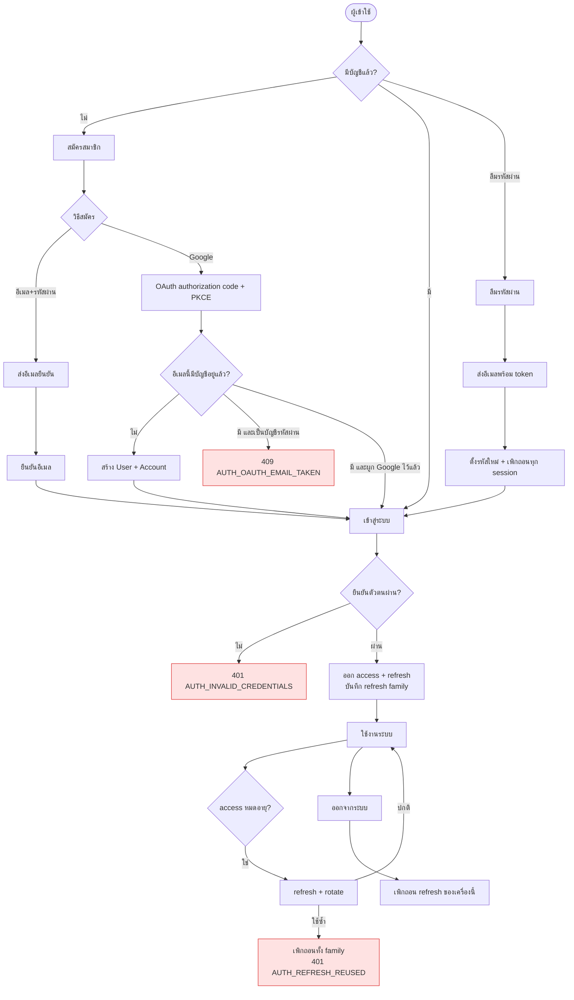

# ภาพรวม auth

<Status value="in-progress" note="login/refresh/logout/logout-all/me ทำงานจริง ยังไม่มี register/OAuth/email flow" />

แผนที่ของทุก flow ที่เกี่ยวกับตัวตนและสิทธิ์ อ่านหน้านี้ก่อนแล้วค่อยเจาะหน้าที่ต้องการ

## Authentication ≠ Authorization

| | Authentication (authn) | Authorization (authz) |
| --- | --- | --- |
| ตอบคำถาม | "คุณคือใคร" | "คุณทำอะไรได้" |
| กลไก | JWT + Passport | CASL ability |
| ผิดแล้วได้ | `401` | `403` |
| เอกสาร | [JWT & rotation](/auth/tokens) | [CASL](/auth/casl) |

สับสนสองอันนี้เมื่อไหร่ ระบบสิทธิ์จะพังทันที `401` แปลว่า "ไม่รู้ว่าคุณเป็นใคร ไป login" ส่วน `403` แปลว่า "รู้ว่าคุณเป็นใคร แต่ทำไม่ได้"

## แผนที่ flow



## Token ทั้งหมดในระบบ

| ชนิด | อายุ | เก็บที่ | มีอะไรข้างใน | เพิกถอนได้ |
| --- | --- | --- | --- | --- |
| **Access token** | 15 นาที | httpOnly cookie (หรือหน่วยความจำ) | `sub`, `email`, `roles`, `jti` | ไม่ได้ — ต้องรอหมดอายุ |
| **Refresh token** | 7 วัน | httpOnly cookie เท่านั้น | `sub`, `familyId`, `jti` | ได้ — เก็บ hash ในตาราง |
| **Email verify token** | 24 ชั่วโมง | ในลิงก์ที่ส่งไปอีเมล | random 256-bit | ครั้งเดียวจบ |
| **Password reset token** | 1 ชั่วโมง | ในลิงก์ที่ส่งไปอีเมล | random 256-bit | ครั้งเดียวจบ |

::: tip ทำไม access token อายุแค่ 15 นาที
access token เพิกถอนไม่ได้ตามธรรมชาติของ JWT — ตัวมันเองพิสูจน์ตัวเองได้โดยไม่ต้องถาม DB ซึ่งคือข้อดีด้านความเร็ว แต่แปลว่าถ้าหลุด ก็ใช้ได้จนหมดอายุ อายุสั้นคือการจำกัดความเสียหาย ส่วน refresh token อายุยาวได้เพราะ **เพิกถอนได้** (เก็บ hash ในตาราง)
:::

### Claim ของ access token

```json
{
  "sub": "0192f8a1-4c2e-7b3d-9f01-2a4c6e8b0d13",
  "email": "ann@example.com",
  "roles": ["manager"],
  "jti": "0192f8a1-…",
  "iat": 1786000000,
  "exp": 1786000900
}
```

::: danger อย่าใส่กฎสิทธิ์ทั้งชุดลงใน JWT
ใส่แค่ `roles` ไม่ใช่ rule ของ CASL ทั้งหมด เพราะ (ก) JWT จะบวมจนเกินขนาด header ที่ proxy รับได้ (ข) แก้สิทธิ์ของ role แล้วต้องรอ token หมดอายุถึงจะมีผล API สร้าง ability สดจาก role ทุก request ส่วน UI ดึงกฎมาจาก `/v1/auth/me` — ดู [CASL](/auth/casl)
:::

## Endpoint

| Method | Path | ต้อง auth | ทำอะไร | สถานะ |
| --- | --- | --- | --- | --- |
| `POST` | `/auth/token` | — | `grant_type=password` (อีเมล+รหัสผ่าน) หรือ `refresh_token` → token | <Status value="implemented" inline /> |
| `POST` | `/auth/logout` | ✅ | เพิกถอน refresh token ที่ส่งมา | <Status value="implemented" inline /> |
| `POST` | `/auth/logout-all` | ✅ | เพิกถอนทุก session ของผู้ใช้ | <Status value="implemented" inline /> |
| `GET` | `/auth/me` | ✅ | โปรไฟล์ + กฎ CASL | <Status value="implemented" inline /> |
| `POST` | `/v1/auth/register` | — | สมัครด้วยรหัสผ่าน | <Status value="planned" inline /> |
| `GET` | `/v1/auth/google` | — | เริ่ม OAuth | <Status value="planned" inline /> |
| `GET` | `/v1/auth/google/callback` | — | รับ callback | <Status value="planned" inline /> |
| `POST` | `/v1/auth/verify-email` | — | ใช้ token ยืนยัน | <Status value="planned" inline /> |
| `POST` | `/v1/auth/forgot-password` | — | ขอลิงก์รีเซ็ต | <Status value="planned" inline /> |
| `POST` | `/v1/auth/reset-password` | — | ตั้งรหัสใหม่ด้วย token | <Status value="planned" inline /> |
| `POST` | `/v1/users/me/password` | ✅ | เปลี่ยนรหัสผ่าน (รู้รหัสเดิม) | <Status value="planned" inline /> |

## หลักการ

| หลัก | ทำยังไง |
| --- | --- |
| **ตรวจสิทธิ์ที่ server เสมอ** | UI ซ่อนปุ่มเพื่อความสวยงาม ไม่ใช่เพื่อความปลอดภัย ทุก endpoint มี guard ของตัวเอง |
| **ปิดเป็นค่าเริ่มต้น** | `JwtAuthGuard` เป็น global แล้ว opt-out ด้วย `@Public()` ไม่ใช่ opt-in ทีละอัน |
| **เก็บแต่ hash** | รหัสผ่าน → bcrypt · refresh/verification token → SHA-256 |
| **ตอบเหมือนกันเสมอ** | login ผิดอีเมลกับผิดรหัสผ่าน ต้องได้ error และเวลาตอบเท่ากัน |
| **token ต่ออายุแบบ rotate** | ทุกครั้งที่ refresh ตัวเก่าตาย ตัวเก่าถูกใช้ซ้ำ = ทั้ง family ตาย |
| **เปลี่ยนรหัสผ่าน = ตัดทุก session** | ทั้งกรณีรีเซ็ตและกรณีเปลี่ยนเอง |
| **บันทึกเหตุการณ์สำคัญ** | login, logout, เปลี่ยนรหัส, เปลี่ยน role → `AuditLog` พร้อม trace id |

::: danger `@Public()` ต้อง opt-out ไม่ใช่ opt-in
วันนี้ระบบเป็น opt-in — route ที่ลืมใส่ `@UseGuards(JwtAuthGuard)` จะเปิด public เงียบ ๆ ซึ่งเกิดขึ้นแล้วจริง: `POST /users` ไม่มี guard สลับเป็น global guard + `@Public()` แล้วการลืมจะกลายเป็น "เข้มเกินไป" แทนที่จะเป็น "หลุด"
:::

## Session ฝั่งเบราว์เซอร์

สรุปสั้น ๆ: เก็บทั้งสอง token ใน **httpOnly cookie** ที่ตั้งโดย route handler ของ Next ไม่ใช่ `localStorage`

| | httpOnly cookie | localStorage |
| --- | --- | --- |
| XSS ขโมยได้ | ไม่ได้ | **ได้** |
| ต้องกัน CSRF | ต้อง (`SameSite=Lax` + double-submit) | ไม่ต้อง |
| ใช้ใน Server Component | ได้ | ไม่ได้ |
| แนบเองอัตโนมัติ | ใช่ | ต้องเขียนเอง |

XSS อันตรายกว่า CSRF มากเพราะรันโค้ดในบริบทผู้ใช้ได้ทั้งหมด และ CSRF มีวิธีป้องกันที่ตรงไปตรงมา เหตุผลเต็มอยู่ที่ [ADR-0006](/adr/0006-token-storage-httponly-cookie) วิธี implement อยู่ที่ [Session ฝั่ง client](/frontend/auth-client)

## ภัยที่ป้องกันไว้

| ภัย | วิธีรับมือ | หน้า |
| --- | --- | --- |
| เดารหัสผ่านรัว ๆ | throttle 5 ครั้ง/นาที/IP+อีเมล + หน่วงแบบทวีคูณ | [เข้าสู่ระบบ](/auth/login) |
| เดาว่าอีเมลไหนมีบัญชี | ข้อความและเวลาตอบเหมือนกันทุกกรณี | [ลืมรหัสผ่าน](/auth/forgot-password) |
| ขโมย token ไปใช้ต่อ | rotation + reuse detection | [JWT & rotation](/auth/tokens) |
| XSS ขโมย session | httpOnly cookie | [Session ฝั่ง client](/frontend/auth-client) |
| CSRF | `SameSite=Lax` + double-submit token | [Session ฝั่ง client](/frontend/auth-client) |
| เลื่อนขั้นสิทธิ์ตัวเอง | CASL ห้ามแก้ role ของตัวเอง | [CASL](/auth/casl) |
| เห็นข้อมูลคนอื่นด้วยการกรอง | `accessibleBy()` ประกอบเข้ากับทุก `where` | [CASL](/auth/casl) |
| ลบผู้ดูแลคนสุดท้าย | `USER_LAST_ADMIN` | [error codes](/reference/error-codes) |

::: warning สถานะโค้ดปัจจุบัน
| สเปกเป้าหมาย | โค้ดวันนี้ |
| --- | --- |
| 12 endpoint | มี 4: `POST /auth/token` (login+refresh), `POST /auth/logout`, `POST /auth/logout-all`, `GET /auth/me` — ยังไม่มี register/OAuth/verify-email/forgot-password/reset-password |
| refresh มี rotation + เพิกถอนได้ | ✅ `RefreshTokenService.rotate()` |
| logout / logout-all เพิกถอน refresh token | ✅ `RefreshTokenService.revoke()` / `revokeAllForUser()` |
| access token ตรวจ `issuer`/`audience` | ✅ เซ็นและ verify ด้วย `app-platform` / `app-platform-web` |
| guard เป็น global + `@Public()` | ✅ `JwtAuthGuard` + `PoliciesGuard` เป็น `APP_GUARD` ทั้งคู่ |
| authorization ด้วย CASL | ✅ `AbilityFactory` + `PoliciesGuard` แคชด้วย Redis ดู [CASL](/auth/casl) |
| token อยู่ใน httpOnly cookie | API คืน token ใน body — ฝั่ง client เก็บใน `sessionStorage` ไม่ใช่ httpOnly cookie ตาม ADR-0006 ดู [Session ฝั่ง client](/frontend/auth-client) |
| throttle หน้า login | ✅ `@nestjs/throttler` บน `POST /auth/token` |
| `AuditLog` | ไม่มีตาราง |
:::
