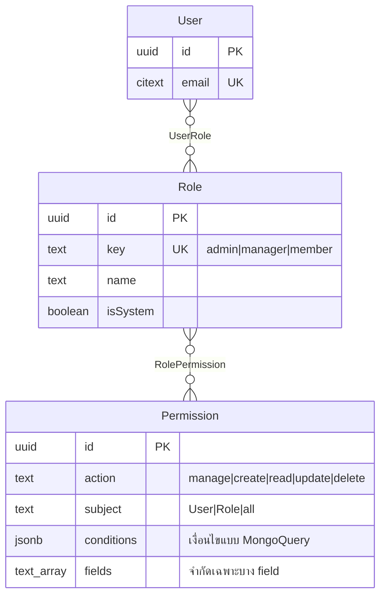
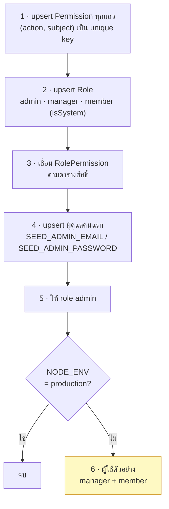

# Role & permission model

<Status value="planned" />

โมเดลข้อมูลของสิทธิ์ ส่วนกลไกที่บังคับใช้จริงอยู่ที่ [CASL](/auth/casl)

## รูปแบบ



**User → Role → Permission** สองชั้น ไม่ผูก permission กับ user ตรง ๆ

::: tip ทำไมไม่ให้ permission ตรงกับ user ได้
เพราะพอทำได้ ทุกคนจะกลายเป็นกรณีพิเศษ แล้วคำถามว่า "ทำไมคนนี้ทำอันนี้ได้" ก็ตอบไม่ได้อีกต่อไป ให้ทุกอย่างผ่าน role — ถ้าต้องการสิทธิ์ชุดใหม่ ก็สร้าง role ใหม่ ซึ่งจะบังคับให้ต้องตั้งชื่อมันและอธิบายได้ว่ามีไว้ทำไม
:::

## Role ตั้งต้น

| key | ชื่อ | `isSystem` | มีไว้ทำไม |
| --- | --- | --- | --- |
| `admin` | ผู้ดูแลระบบ | ✅ | ทำได้ทุกอย่าง รวมถึงจัดการ role |
| `manager` | ผู้จัดการ | ✅ | จัดการผู้ใช้ได้ แต่แตะ role ไม่ได้ |
| `member` | สมาชิก | ✅ | จัดการได้เฉพาะข้อมูลตัวเอง |

`isSystem = true` แปลว่าลบหรือเปลี่ยน key ผ่าน UI ไม่ได้ (`ROLE_SYSTEM_IMMUTABLE`) — กันไม่ให้ใครลบ `admin` ทิ้งจนไม่มีใครเข้าระบบได้อีก ส่วน role ที่สร้างเองภายหลังลบได้ปกติถ้าไม่มีคนถืออยู่

::: danger ต้องเหลือผู้ดูแลอย่างน้อยหนึ่งคนเสมอ
ทุกการกระทำที่จะทำให้ระบบไม่เหลือ user ที่มี role `admin` ต้องถูกบล็อกด้วย `USER_LAST_ADMIN` — ครอบคลุมทั้งการถอด role, การปิดบัญชี และการลบผู้ใช้ ต้องตรวจใน transaction เดียวกับการเปลี่ยนแปลง ไม่ใช่ตรวจก่อนแล้วค่อยทำ (ไม่งั้นสองคำขอพร้อมกันจะเล็ดลอดไปได้ทั้งคู่)
:::

## คำศัพท์

### Action

| Action | ครอบคลุม |
| --- | --- |
| `manage` | **ทุกอย่าง** — คำพิเศษของ CASL |
| `create` | สร้างใหม่ |
| `read` | ดูรายการและดูรายละเอียด |
| `update` | แก้ไข |
| `delete` | ลบ |

### Subject

| Subject | ตรงกับ |
| --- | --- |
| `all` | **ทุกอย่าง** — คำพิเศษของ CASL |
| `User` | model `User` |
| `Role` | model `Role` |
| `Permission` | model `Permission` |
| `AuditLog` | model `AuditLog` |
| `File` | model `File` |

ชื่อ subject ต้องตรงกับชื่อ model ใน Prisma เป๊ะ ๆ เพราะ `@casl/prisma` ใช้ชื่อนี้ผูกกฎเข้ากับ query

## ตารางสิทธิ์

| Subject | Action | admin | manager | member |
| --- | --- | :-: | :-: | :-: |
| `all` | `manage` | ✅ | | |
| `User` | `create` | | ✅ | |
| `User` | `read` | | ✅ | ตัวเอง |
| `User` | `update` | | ✅ ยกเว้นตัวเอง¹ | ตัวเอง² |
| `User` | `delete` | | ✅ ยกเว้นตัวเอง | |
| `Role` | `read` | | ✅ | |
| `Role` | `create` `update` `delete` | ✅ | | |
| `Permission` | `read` | | ✅ | |
| `AuditLog` | `read` | ✅ | | |
| `File` | `create` | | ✅ | ✅ |
| `File` | `read` `delete` | | ✅ | ของตัวเอง |

¹ `manager` แก้ผู้ใช้ได้แต่แก้ **role** ไม่ได้ — เป็นการจำกัดระดับ field ไม่ใช่ระดับ subject
² `member` แก้ได้เฉพาะ `displayName`, `avatarFileId`, `locale`, `theme` ของตัวเอง

::: danger การจำกัดระดับ field ป้องกันการเลื่อนขั้นตัวเอง
ถ้า `manager` มี `update User` แบบไม่จำกัด field เขาจะแก้ role ตัวเองเป็น `admin` ได้ทันที กฎจึงต้องระบุ `fields` ที่อนุญาต และ `conditions` ที่กันการแก้ตัวเอง

```ts
can("update", "User", ["displayName", "email", "status"], { id: { $ne: user.id } });
```
:::

## เก็บเป็นแถวยังไง

`Permission` หนึ่งแถวคือกฎ CASL หนึ่งข้อพอดี

| `action` | `subject` | `conditions` | `fields` |
| --- | --- | --- | --- |
| `manage` | `all` | `null` | `{}` |
| `read` | `User` | `null` | `{}` |
| `update` | `User` | `{"id": {"$ne": "${user.id}"}}` | `{displayName,email,status}` |
| `read` | `User` | `{"id": "${user.id}"}` | `{}` |
| `update` | `User` | `{"id": "${user.id}"}` | `{displayName,avatarFileId,locale,theme}` |

`${user.id}` เป็น placeholder ที่ถูกแทนตอนสร้าง ability จากผู้ใช้ที่ล็อกอินอยู่ — เก็บกฎเป็นข้อมูลได้โดยไม่ต้องผูกกับ user คนใดคนหนึ่ง ดู [CASL](/auth/casl)

::: warning `conditions` มาจากฐานข้อมูล ต้องตรวจก่อนใช้
`conditions` เป็น `Json` ที่ถูกป้อนเข้าเครื่องมือประเมินสิทธิ์ — ถ้าใครแก้แถวใน DB ได้ ก็เขียนกฎอะไรก็ได้ ให้ (ก) แก้ `Permission` ได้เฉพาะ `admin` (ข) ตรวจ `conditions` ด้วย zod ก่อนสร้าง ability (ค) อนุญาต operator เท่าที่จำเป็น (`$eq`, `$ne`, `$in`, `$nin`) ไม่เปิด MongoQuery ทั้งชุด
:::

## Seed



```ts
// apps/api/prisma/seed.ts
const PERMISSIONS = [
  { action: "manage", subject: "all" },
  { action: "create", subject: "User" },
  { action: "read", subject: "User" },
  { action: "update", subject: "User", fields: ["displayName", "email", "status"],
    conditions: { id: { $ne: "${user.id}" } } },
  // …
] as const;

const ROLE_PERMISSIONS: Record<string, Array<[string, string]>> = {
  admin: [["manage", "all"]],
  manager: [["create", "User"], ["read", "User"], ["update", "User"], ["delete", "User"],
            ["read", "Role"], ["read", "Permission"]],
  member: [["read", "User"], ["update", "User"], ["create", "File"]],
};
```

seeder ต้อง **idempotent** — ใช้ `upsert` ทั้งหมด รันซ้ำกี่รอบก็ได้ผลเท่าเดิม เป็นสิ่งจำเป็นเพราะ seed จะถูกรันทุกครั้งที่ deploy เพื่อให้ permission ใหม่ที่เพิ่มในโค้ดไปโผล่ใน DB

::: danger ข้อมูลตัวอย่างห้ามหลุดขึ้น production
บัญชี `demo@example.com` / `password123` ต้องอยู่ใต้ `if (process.env.NODE_ENV !== "production")` ในตัว seed ไม่ใช่พึ่งว่าคนจะไม่รันผิดที่ — และ `SEED_ADMIN_PASSWORD` ต้องถูกบังคับให้เปลี่ยนตอน login ครั้งแรก
:::

## เพิ่ม role ใหม่

1. เพิ่ม key ใน `ROLE_PERMISSIONS` ของ seeder
2. เพิ่มแถวใหม่ในตารางสิทธิ์ของหน้านี้ **และ** ในเวอร์ชันอังกฤษ
3. ถ้ามี permission คู่ใหม่ ให้เพิ่มใน `PERMISSIONS` ด้วย
4. รัน seed ใหม่
5. ถ้ามีผลกับ UI ให้เพิ่มการ์ดสิทธิ์ในหน้าตั้งค่า role

::: tip ผู้ดูแลสร้าง role ได้จาก UI ด้วย
`Role` ที่ `isSystem = false` สร้าง/แก้/ลบได้ผ่านหน้าตั้งค่า สาม role ตั้งต้นเป็นค่าเริ่มต้นที่มีเหตุผล ไม่ใช่ขีดจำกัด แต่ **ทุก permission ต้องมาจากรายการที่ seed ไว้** — ผู้ดูแลเลือกได้ว่าจะให้ role ไหนมี permission อะไร แต่สร้าง permission ใหม่จาก UI ไม่ได้ เพราะนั่นเท่ากับให้เขียนกฎอิสระเข้าเครื่องมือประเมินสิทธิ์
:::

::: warning สถานะโค้ดปัจจุบัน
| สเปกเป้าหมาย | โค้ดวันนี้ |
| --- | --- |
| ตาราง `Role` `Permission` `UserRole` `RolePermission` | ไม่มีสักตาราง — `schema.prisma` มีแค่ `User` |
| seed role และ permission | `seed.ts` upsert ผู้ใช้เดียว |
| ตรวจ "ต้องเหลือผู้ดูแล" | ไม่มี |
| จำกัดสิทธิ์ระดับ field | ไม่มีระบบสิทธิ์เลย |
| ข้อมูลตัวอย่างถูกกันจาก production | ไม่มี guard `NODE_ENV` — `demo@example.com` จะถูกสร้างทุกที่ |
:::
