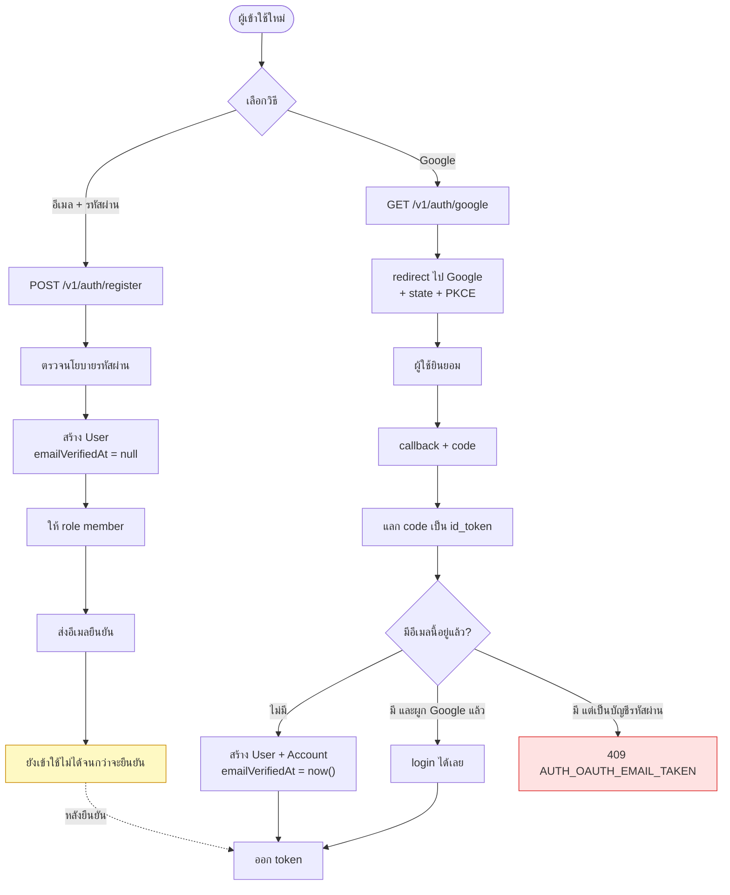
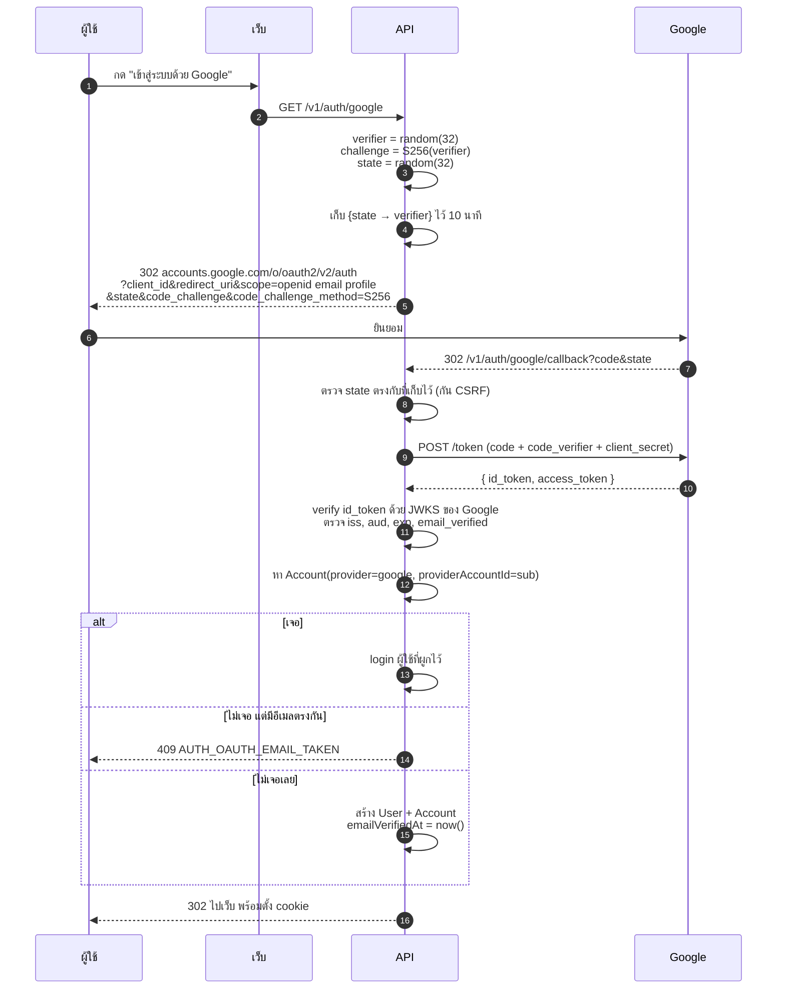

# สมัครสมาชิก & Google OAuth

<Status value="planned" />

::: danger ปัญหาความปลอดภัยที่มีอยู่ตอนนี้
`POST /users` ใน `apps/api/src/users/users.controller.ts` **ไม่มี guard** ใครก็ตามที่เข้าถึง API ได้สร้างบัญชีได้ไม่จำกัด ต้องเลือกอย่างใดอย่างหนึ่งทันที: ทำให้เป็น `POST /v1/auth/register` ที่มีการควบคุมตามหน้านี้ หรือใส่ guard แล้วให้เป็น endpoint สำหรับผู้ดูแลสร้างผู้ใช้เท่านั้น
:::

## สองทางเข้า



## สมัครด้วยอีเมล + รหัสผ่าน

### สัญญา

```ts
// packages/contracts/src/auth.schema.ts
export const RegisterSchema = z
  .object({
    email: z.email().max(255),
    displayName: z.string().trim().min(1).max(120),
    password: PasswordSchema,
    confirmPassword: z.string(),
    acceptTerms: z.literal(true),
  })
  .refine((v) => v.password === v.confirmPassword, {
    message: "รหัสผ่านไม่ตรงกัน",
    path: ["confirmPassword"],
  });
export type Register = z.infer<typeof RegisterSchema>;
```

### นโยบายรหัสผ่าน

```ts
export const PasswordSchema = z
  .string()
  .min(12, "ต้องยาวอย่างน้อย 12 ตัวอักษร")
  .max(72, "ยาวได้ไม่เกิน 72 ตัวอักษร")   // เพดานของ bcrypt
  .refine((p) => !/^\s|\s$/.test(p), "ห้ามขึ้นต้นหรือลงท้ายด้วยช่องว่าง");
```

::: tip ความยาวสำคัญกว่าการบังคับสัญลักษณ์
NIST SP 800-63B เลิกแนะนำการบังคับ "ต้องมีตัวใหญ่ ตัวเลข อักขระพิเศษ" แล้ว เพราะมันผลักคนไปตั้ง `Password1!` ซึ่งเดาง่ายกว่าวลียาว ๆ ที่จำได้จริง — บังคับความยาวขั้นต่ำ 12 แล้วเช็คกับรายการรหัสผ่านที่รั่วแทน

`min(12)` ตรงนี้เข้มกว่า `LoginSchema` ที่ใช้ `min(8)` โดยตั้งใจ — ตอน login ห้ามเข้มกว่าตอนสมัคร ไม่งั้นคนที่ตั้งรหัส 8 ตัวไว้ก่อนหน้าจะเข้าระบบไม่ได้
:::

ควรเช็ครหัสผ่านกับรายการที่รั่วด้วย ผ่าน k-anonymity ของ Have I Been Pwned ซึ่งส่งแค่ 5 ตัวแรกของ SHA-1 ไม่ได้ส่งรหัสผ่านออกไป

### Service

```ts
async register(input: Register): Promise<{ message: string }> {
  const existing = await this.users.findByEmail(input.email);

  // ตอบเหมือนกันทั้งกรณีมีและไม่มี — ไม่งั้นหน้าสมัครกลายเป็นเครื่องมือตรวจอีเมล
  if (existing) {
    await this.mail.sendAccountExistsNotice(input.email);
    return { message: "ถ้าอีเมลนี้ใช้ได้ เราได้ส่งลิงก์ยืนยันไปแล้ว" };
  }

  const memberRole = await this.prisma.role.findUniqueOrThrow({ where: { key: "member" } });

  const user = await this.prisma.user.create({
    data: {
      email: input.email,
      displayName: input.displayName,
      passwordHash: await bcrypt.hash(input.password, 12),
      roles: { create: { roleId: memberRole.id } },
    },
  });

  await this.verification.issueAndSend(user, "EMAIL_VERIFY");
  await this.audit.record("auth.register", { subjectType: "User", subjectId: user.id });

  return { message: "ถ้าอีเมลนี้ใช้ได้ เราได้ส่งลิงก์ยืนยันไปแล้ว" };
}
```

::: danger หน้าสมัครก็รั่วข้อมูลได้เหมือนหน้าลืมรหัสผ่าน
"อีเมลนี้ถูกใช้แล้ว" เป็นข้อความที่ใช้ตรวจได้ว่าใครสมัครไว้กับเรา ตอบข้อความกลาง ๆ แล้วส่งอีเมลไปแจ้งเจ้าของบัญชีเดิมว่า "มีคนพยายามสมัครด้วยอีเมลนี้ ถ้าเป็นคุณให้กดลืมรหัสผ่าน" เจ้าของตัวจริงได้ข้อมูลครบ คนที่ตรวจไม่ได้อะไร

ข้อแลกเปลี่ยนคือ UX แย่ลงเล็กน้อย ถ้ารับได้กับการรั่วนี้ (ระบบภายในองค์กรที่รู้อยู่แล้วว่าใครมีบัญชี) ใช้ `409 USER_EMAIL_TAKEN` ตรง ๆ ก็ได้ แต่ต้องเป็นการตัดสินใจอย่างรู้ตัว
:::

bcrypt cost 12 คือจุดสมดุลปี 2026 — ประมาณ 250 มิลลิวินาทีต่อครั้งบนเครื่อง server ทั่วไป ช้าพอที่จะทำให้ brute-force แพง แต่ไม่ช้าจนกลายเป็นช่องทาง DoS

## Google OAuth

### ทำไมต้อง PKCE



::: danger ต้องตรวจ `state` เสมอ
ถ้าไม่ตรวจ `state` คนร้ายส่งลิงก์ callback ที่มี `code` ของ **บัญชีตัวเอง** ให้เหยื่อคลิก แล้วเหยื่อจะถูกล็อกอินเข้าบัญชีของคนร้ายโดยไม่รู้ตัว — ข้อมูลที่เหยื่อกรอกต่อจากนั้นทั้งหมดตกอยู่ในมือคนร้าย `state` ต้องสุ่ม ผูกกับ session และใช้ครั้งเดียว
:::

::: danger ต้อง verify `id_token` เอง
อย่าเชื่อ `id_token` ที่ decode มาเฉย ๆ ต้องตรวจลายเซ็นด้วย JWKS ของ Google และตรวจ `iss` เป็น `https://accounts.google.com`, `aud` เป็น client id ของเรา, `exp` ยังไม่หมด และ **`email_verified` เป็น `true`** ถ้าไม่ตรวจ `email_verified` คนร้ายสร้างบัญชี Google Workspace บนโดเมนตัวเองแล้วอ้างอีเมลของคนอื่นได้
:::

### กฎการผูกบัญชี

| สถานการณ์ | ผลลัพธ์ |
| --- | --- |
| ไม่มี `Account` ไม่มีอีเมลนี้ | สร้าง `User` + `Account` `emailVerifiedAt = now()` |
| มี `Account` (provider + sub ตรง) | login ผู้ใช้นั้น |
| ไม่มี `Account` แต่มีอีเมลนี้เป็นบัญชีรหัสผ่าน | **`409 AUTH_OAUTH_EMAIL_TAKEN`** — ห้ามผูกอัตโนมัติ |
| ไม่มี `Account` มีอีเมลนี้ที่ผูก Google อื่นไว้ | `409` — สองบัญชี Google ในอีเมลเดียวเป็นไปไม่ได้ |

::: danger ห้ามผูกอัตโนมัติจากการที่อีเมลตรงกัน
"อีเมลตรงกัน = คนเดียวกัน" คือช่องโหว่ยึดบัญชี ถ้าคนร้ายสมัคร Google ด้วยอีเมลของเหยื่อได้ (บนโดเมนที่ตัวเองคุม) ก็จะเข้าบัญชีของเหยื่อได้ทันที การผูกต้องเกิดจากผู้ใช้ที่ล็อกอินอยู่แล้วเป็นคนกดผูกในหน้าตั้งค่าเท่านั้น
:::

หลังจากนั้นผู้ใช้ผูก Google เพิ่มได้จากหน้าโปรไฟล์ ซึ่งตอนนั้นเรารู้แน่ว่าเป็นเจ้าของบัญชีจริงเพราะล็อกอินอยู่

### Env ที่ต้องใช้

| ตัวแปร | หมายเหตุ |
| --- | --- |
| `GOOGLE_CLIENT_ID` | จาก Google Cloud Console |
| `GOOGLE_CLIENT_SECRET` | 🔒 |
| `GOOGLE_CALLBACK_URL` | ต้องตรงกับที่ลงทะเบียนไว้เป๊ะทุกตัวอักษร |

`redirect_uri` ที่ไม่ตรงเป๊ะคือสาเหตุอันดับหนึ่งของ `redirect_uri_mismatch` — ต่างกันแค่ `/` ท้ายก็พัง [EnvSchema](/platform/config) บังคับว่าต้องตั้งครบทั้งสามหรือไม่ตั้งเลย

## สเปกหน้าสมัคร

`apps/web/src/app/[locale]/(auth)/signup/page.tsx`

```
┌────────────────────────────────────┐
│         สร้างบัญชี                  │
│  [  🔵 สมัครด้วย Google         ]   │
│  ───────────  หรือ  ───────────    │
│  ชื่อที่แสดง                         │
│  [                              ]   │
│  อีเมล                              │
│  [                              ]   │
│  รหัสผ่าน                            │
│  [                          ] 👁     │
│  ▓▓▓▓▓▓░░░░  ความแข็งแรง: ดี        │
│  ยืนยันรหัสผ่าน                       │
│  [                          ]       │
│  ☐ ยอมรับเงื่อนไขการใช้งาน           │
│  [        สร้างบัญชี             ]   │
│  มีบัญชีแล้ว? เข้าสู่ระบบ              │
└────────────────────────────────────┘
```

| สถานะ | UI |
| --- | --- |
| กำลังส่ง | ปุ่ม disabled + spinner |
| กรอกไม่ผ่าน | ข้อความใต้ช่อง โฟกัสช่องแรกที่ผิด |
| สำเร็จ | ไปหน้า "ตรวจอีเมลของคุณ" (ไม่ redirect เข้าระบบ) |
| Google ล้มเหลว | กลับหน้า login พร้อม `AUTH_OAUTH_FAILED` |
| อีเมลชนกับบัญชีรหัสผ่าน | Alert ชวนให้ login ด้วยรหัสผ่านแล้วไปผูกในหน้าโปรไฟล์ |

::: tip ตัววัดความแข็งแรงต้องเป็นข้อมูล ไม่ใช่กฎ
แสดงแถบความแข็งแรง (เช่นด้วย zxcvbn) เพื่อ *แนะนำ* แต่กฎที่บล็อกได้จริงมีแค่ `PasswordSchema` เพราะฝั่ง server ต้องบังคับกฎเดียวกันได้ ซึ่ง zxcvbn ไม่เหมาะจะเอามาเป็นกฎตายตัว
:::

## เช็กลิสต์

- [ ] `POST /users` ถูกปิดหรือย้ายไปเป็น endpoint สำหรับผู้ดูแล
- [ ] `POST /v1/auth/register` เป็น `@Public()` + throttle
- [ ] อีเมลชนกันตอบข้อความกลาง ๆ
- [ ] bcrypt cost = 12
- [ ] ผู้ใช้ใหม่ได้ role `member` อัตโนมัติ
- [ ] ยังเข้าใช้ไม่ได้จนกว่าจะยืนยันอีเมล
- [ ] OAuth ใช้ PKCE + `state` แบบใช้ครั้งเดียว
- [ ] verify `id_token` กับ JWKS และตรวจ `email_verified`
- [ ] ห้ามผูกบัญชีอัตโนมัติจากอีเมลที่ตรงกัน
- [ ] `AuditLog` บันทึกทั้ง `auth.register` และ `auth.oauth_link`

::: warning สถานะโค้ดปัจจุบัน
| สเปกเป้าหมาย | โค้ดวันนี้ |
| --- | --- |
| `POST /v1/auth/register` มีการควบคุม | มี `POST /users` ที่ **เปิด public ไม่มี guard** |
| `RegisterSchema` + `PasswordSchema` | มีแค่ `CreateUserSchema` (`password: min(8).max(72)`) |
| Google OAuth | ไม่มีเลย — ไม่มี strategy ไม่มี env ไม่มีตาราง `Account` |
| ต้องยืนยันอีเมลก่อนใช้งาน | ไม่มีคอลัมน์ `emailVerifiedAt` |
| ให้ role อัตโนมัติ | ไม่มีตาราง `Role` |
| bcrypt cost 12 | `seed.ts` ใช้ค่า default (10) — `users.service.ts` ไม่ได้ระบุ |
| อีเมลชนตอบข้อความกลาง | `users.service.ts` โยน `409 Conflict` ตรง ๆ |
:::
