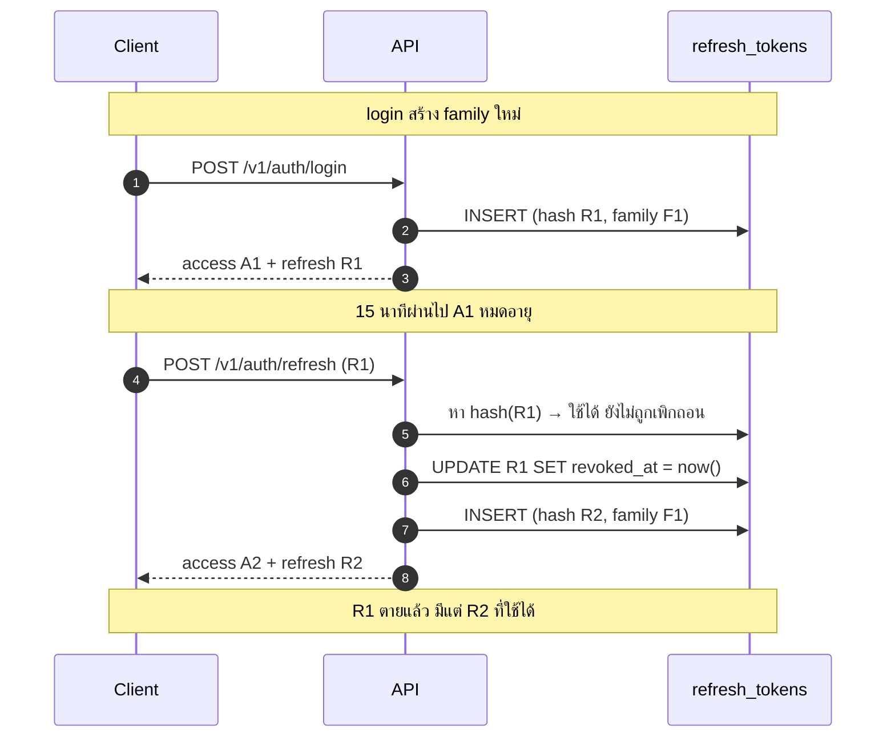
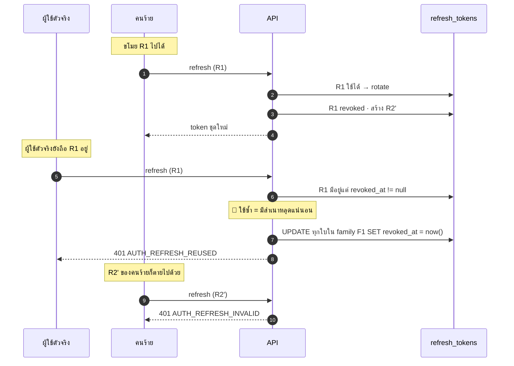
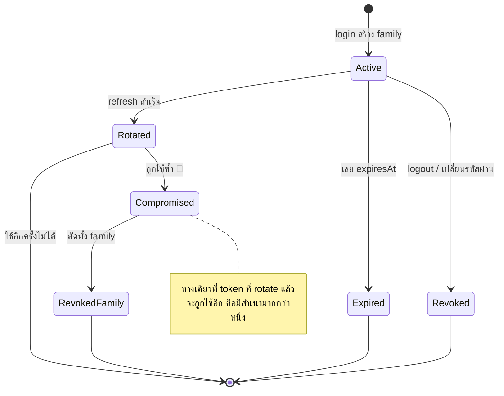

# JWT & refresh rotation

<Status value="implemented" note="rotation + reuse detection ทำงานจริงแล้ว เหลือ logout/logout-all" />

## ปัญหาของ refresh token ที่ไม่ rotate

โค้ดวันนี้ทำแบบนี้

```ts
async refresh(refreshToken: string) {
  const payload = this.jwtService.verify(refreshToken, { secret: … });
  return this.issueTokens(payload.sub, payload.email);   // token เดิมยังใช้ได้ต่อ
}
```

แปลว่าใครก็ตามที่ได้ refresh token ไปหนึ่งครั้ง **ออก access token ได้ตลอด 7 วันโดยไม่มีทางหยุด** ผู้ใช้จะเปลี่ยนรหัสผ่านก็ไม่ช่วย ผู้ดูแลจะสั่งอะไรก็ไม่ได้ เพราะไม่มีที่ให้บันทึกว่าใบไหนถูกยกเลิก

Rotation แก้ปัญหานี้ และแถมด้วยความสามารถ *ตรวจจับ* ว่ามีการขโมยเกิดขึ้น

## กติกา

| กฎ | เหตุผล |
| --- | --- |
| ทุกครั้งที่ refresh สำเร็จ ตัวเก่าถูกทำเครื่องหมายว่าใช้แล้ว และออกตัวใหม่ | refresh token ใช้ได้ครั้งเดียว |
| token ที่สืบทอดจากการ login เดียวกันแชร์ `familyId` | ทำให้ตัด session ทั้งสายได้ทีเดียว |
| ใช้ token ที่ถูก rotate ไปแล้ว = มีสำเนาหลุด → **เพิกถอนทั้ง family** | ทั้งคนร้ายและเจ้าของถูกตัดพร้อมกัน ปลอดภัยไว้ก่อน |
| DB เก็บ SHA-256 ไม่เก็บตัว token | DB หลุดก็ปลอม session ไม่ได้ |
| เปลี่ยนรหัสผ่าน = เพิกถอนทุก family ของผู้ใช้นั้น | รหัสใหม่ต้องมีความหมายจริง |

## Rotation ตอนทำงานปกติ



## จับการใช้ซ้ำ



ผู้ใช้ตัวจริงต้อง login ใหม่ ซึ่งน่ารำคาญ — แต่ทางเลือกคือปล่อยให้คนร้ายอยู่ในระบบต่อ **ถูกเตะออกดีกว่าถูกขโมยต่อ**

::: tip เหตุการณ์นี้ต้องแจ้งผู้ใช้
เมื่อเจอการใช้ซ้ำ ให้ส่งอีเมลแจ้ง "session ทั้งหมดถูกยกเลิกเพราะพบกิจกรรมน่าสงสัย" พร้อมเวลาและ IP ผู้ใช้เป็นคนเดียวที่รู้ว่านั่นคือตัวเองหรือไม่
:::

## สถานะของ refresh token



## Implement

### สร้างและ hash

```ts
// apps/api/src/auth/refresh-token.service.ts
import { createHash, randomBytes } from "node:crypto";

/** เก็บ SHA-256 ไม่ใช่ bcrypt — ค่านี้เป็น random 256-bit ที่เราสร้างเอง ไม่มีอะไรให้ brute-force */
const hash = (token: string) => createHash("sha256").update(token).digest("hex");

@Injectable()
export class RefreshTokenService {
  constructor(private readonly prisma: PrismaService, private readonly config: ConfigService<Env, true>) {}

  async issue(userId: string, familyId: string, meta: { userAgent?: string; ip?: string }) {
    const token = randomBytes(32).toString("base64url");
    const ttlDays = 7;

    await this.prisma.refreshToken.create({
      data: {
        userId,
        familyId,
        tokenHash: hash(token),
        expiresAt: new Date(Date.now() + ttlDays * 86_400_000),
        userAgent: meta.userAgent?.slice(0, 255),
        ip: meta.ip,
      },
    });

    return token;
  }
```

::: tip ทำไม refresh token ไม่ใช่ JWT
มันไม่ต้องพกข้อมูลอะไรเลย — ต้องแลกกับ DB ทุกครั้งอยู่แล้วเพราะต้องเช็คว่าถูกเพิกถอนหรือยัง random string ธรรมดาจึงพอ และสั้นกว่า เดาไม่ได้เหมือนกัน ไม่มีปัญหาเรื่อง algorithm confusion (`alg: none`) ให้ต้องระวัง
:::

### แลก token พร้อมจับการใช้ซ้ำ

```ts
  async rotate(presented: string, meta: { userAgent?: string; ip?: string }) {
    const tokenHash = hash(presented);

    // ทั้งหมดอยู่ใน transaction — สอง request ที่มาพร้อมกันต้องไม่ rotate สำเร็จทั้งคู่
    return this.prisma.$transaction(async (tx) => {
      const row = await tx.refreshToken.findUnique({ where: { tokenHash } });

      // ไม่รู้จักเลย — อาจปลอมหรือถูกล้างไปแล้ว
      if (!row) throw Errors.refreshInvalid();

      // 🚨 รู้จัก แต่ถูกใช้ไปแล้ว = มีสำเนามากกว่าหนึ่งใบในโลก
      if (row.revokedAt) {
        await tx.refreshToken.updateMany({
          where: { familyId: row.familyId, revokedAt: null },
          data: { revokedAt: new Date() },
        });
        this.logger.warn(
          { traceId: getTraceId(), userId: row.userId, familyId: row.familyId },
          "refresh token reuse detected — เพิกถอนทั้ง family",
        );
        throw Errors.refreshReused();
      }

      if (row.expiresAt < new Date()) throw Errors.refreshInvalid();

      await tx.refreshToken.update({ where: { id: row.id }, data: { revokedAt: new Date() } });
      const next = await this.issue(row.userId, row.familyId, meta);  // family เดิม
      return { userId: row.userId, refreshToken: next };
    });
  }
}
```

::: danger ต้องอยู่ใน transaction
ถ้าไม่ใช้ transaction สอง refresh ที่มาพร้อมกันจะอ่านแถวเดียวกันเจอในสถานะ "ยังใช้ได้" แล้ว rotate สำเร็จทั้งคู่ ได้ token สองใบใน family เดียวกัน ซึ่งจะไปทำให้เกิด false positive ของการใช้ซ้ำในภายหลัง — และเป็นเหตุผลว่าทำไมฝั่ง client ต้องทำ [single-flight](/frontend/auth-client)
:::

### ออก access token

```ts
private signAccessToken(user: { id: string; email: string; roles: string[] }) {
  return this.jwtService.sign(
    { sub: user.id, email: user.email, roles: user.roles, jti: uuidv7() },
    {
      secret: this.config.get("JWT_ACCESS_SECRET", { infer: true }),
      expiresIn: this.config.get("JWT_ACCESS_EXPIRES_IN", { infer: true }),
      issuer: "app-platform",
      audience: "app-platform-web",
    },
  );
}
```

`issuer`/`audience` ต้องถูกตรวจตอน verify ด้วย — เป็นการกันไม่ให้ token จากระบบอื่นที่บังเอิญใช้ secret เดียวกัน (เช่นตอนก๊อป config ข้าม environment) ผ่านเข้ามา

### Strategy ที่แยก expired ออกจาก invalid

```ts
// apps/api/src/auth/strategies/jwt.strategy.ts
@Injectable()
export class JwtStrategy extends PassportStrategy(Strategy) {
  constructor(config: ConfigService<Env, true>) {
    super({
      jwtFromRequest: ExtractJwt.fromExtractors([
        (req: Request) => req.cookies?.access_token ?? null,   // cookie มาก่อน
        ExtractJwt.fromAuthHeaderAsBearerToken(),              // เผื่อ client อื่น
      ]),
      secretOrKey: config.get("JWT_ACCESS_SECRET", { infer: true }),
      issuer: "app-platform",
      audience: "app-platform-web",
      ignoreExpiration: false,
      // เผื่อนาฬิกาเครื่องคลาดกันเล็กน้อย
      clockTolerance: 5,
    });
  }

  async validate(payload: AccessTokenPayload) {
    setUserId(payload.sub);   // ให้ log ท่อนหลังรู้ว่าใครทำ
    return { id: payload.sub, email: payload.email, roles: payload.roles };
  }
}
```

แล้วแปลง error ของ passport ให้เป็น code ที่ client แยกออก

```ts
// jwt-auth.guard.ts
handleRequest(err: unknown, user: unknown, info: unknown) {
  if (user) return user;
  if (info instanceof TokenExpiredError) throw Errors.tokenExpired();   // client → refresh
  if (info instanceof JsonWebTokenError) throw Errors.tokenInvalid();   // client → login
  throw Errors.tokenMissing();
}
```

นี่คือสิ่งที่ทำให้ฝั่ง client refresh เงียบ ๆ ได้ แทนที่จะเตะผู้ใช้ออกทุก 15 นาที ดู [error codes](/reference/error-codes)

### Guard เป็น global

```ts
// app.module.ts
providers: [{ provide: APP_GUARD, useClass: JwtAuthGuard }],
```

```ts
// common/decorators/public.decorator.ts
export const IS_PUBLIC = "isPublic";
export const Public = () => SetMetadata(IS_PUBLIC, true);
```

```ts
// jwt-auth.guard.ts
canActivate(context: ExecutionContext) {
  const isPublic = this.reflector.getAllAndOverride<boolean>(IS_PUBLIC, [
    context.getHandler(),
    context.getClass(),
  ]);
  return isPublic ? true : super.canActivate(context);
}
```

ทีนี้ `POST /auth/login` ใส่ `@Public()` ส่วนที่เหลือถูกป้องกันอัตโนมัติ — ลืมแล้วได้ผลเป็น "เข้มเกินไป" ไม่ใช่ "หลุด"

## หมุน secret

เปลี่ยน `JWT_ACCESS_SECRET` ตรง ๆ = ทุกคนหลุดพร้อมกัน ถ้าอยากหมุนแบบไม่มีใครรู้สึก ให้เซ็นด้วยตัวใหม่แต่ยอมรับทั้งสองตัวชั่วคราว

```ts
// verify: ลองตัวใหม่ก่อน ไม่ได้ค่อยลองตัวเก่า
const secrets = [config.get("JWT_ACCESS_SECRET"), config.get("JWT_ACCESS_SECRET_PREVIOUS")].filter(Boolean);
```

ถอด `JWT_ACCESS_SECRET_PREVIOUS` ออกได้หลังผ่านไปนานกว่า `JWT_ACCESS_EXPIRES_IN` (15 นาที)

## เก็บกวาด

`refresh_tokens` โตทุกครั้งที่ refresh ต้องมีงานกวาด

```sql
DELETE FROM refresh_tokens
WHERE expires_at < now() - interval '30 days';
```

เก็บใบที่หมดอายุไว้อีก 30 วันโดยตั้งใจ — ถ้าลบทันทีที่หมดอายุ การใช้ซ้ำหลังหมดอายุจะกลายเป็น `AUTH_REFRESH_INVALID` ธรรมดา แทนที่จะเป็นสัญญาณว่ามีคนถือสำเนาอยู่

::: warning สถานะโค้ดปัจจุบัน
| สเปกเป้าหมาย | โค้ดวันนี้ |
| --- | --- |
| ตาราง `RefreshToken` เก็บ hash + family | ✅ |
| rotate ทุกครั้งที่ refresh | ✅ |
| จับการใช้ซ้ำ → เพิกถอนทั้ง family | ✅ (ดู `RefreshTokenService.rotate()` — ต้อง revoke แล้วค่อย throw **นอก** `$transaction` ไม่งั้นการเพิกถอนจะถูก rollback ไปพร้อมกับ error ที่โยนออกมา ซึ่งเป็นบั๊กที่พบตอน implement จากโค้ดตัวอย่างเดิมในหน้านี้) |
| logout / logout-all | ยังไม่มี endpoint |
| refresh token เป็น random ไม่ใช่ JWT | ✅ `randomBytes(32).toString("base64url")` — `JWT_REFRESH_SECRET` เลิกใช้แล้ว ดู [Environment variables](/reference/env-vars) |
| ตรวจ `issuer` / `audience` | ยังไม่ได้ตั้งทั้งตอนเซ็นและตอน verify |
| แยก expired ออกจาก invalid | `JwtAuthGuard` ยังเป็น `AuthGuard("jwt")` เปล่า ๆ ได้ 401 เหมือนกันหมด |
| guard เป็น global + `@Public()` | ✅ `JwtAuthGuard` + `PoliciesGuard` เป็น `APP_GUARD` ทั้งคู่, `POST /users` ต้อง auth (manager ขึ้นไป) แล้ว |
| route แยก `/auth/login` + `/auth/refresh` | รวมเป็น `POST /auth/token` เดียวตาม OAuth2 grant (`grant_type=password` \| `refresh_token`) — ดู [OpenAPI § OAuth2 password flow](/backend/openapi) |
| access token มี `roles` | payload มีแค่ `sub` กับ `email` — ไม่จำเป็นสำหรับ CASL เพราะ `AbilityFactory` คำนวณสิทธิ์จาก DB สดทุกครั้งอยู่แล้ว ไม่ได้อ่านจาก JWT |
:::
