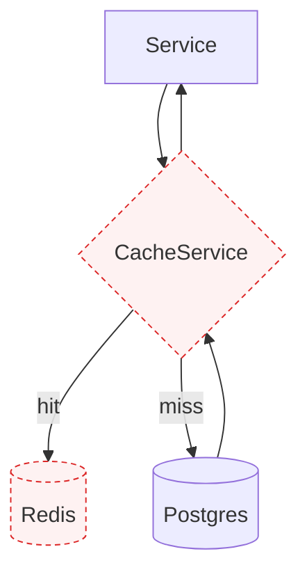
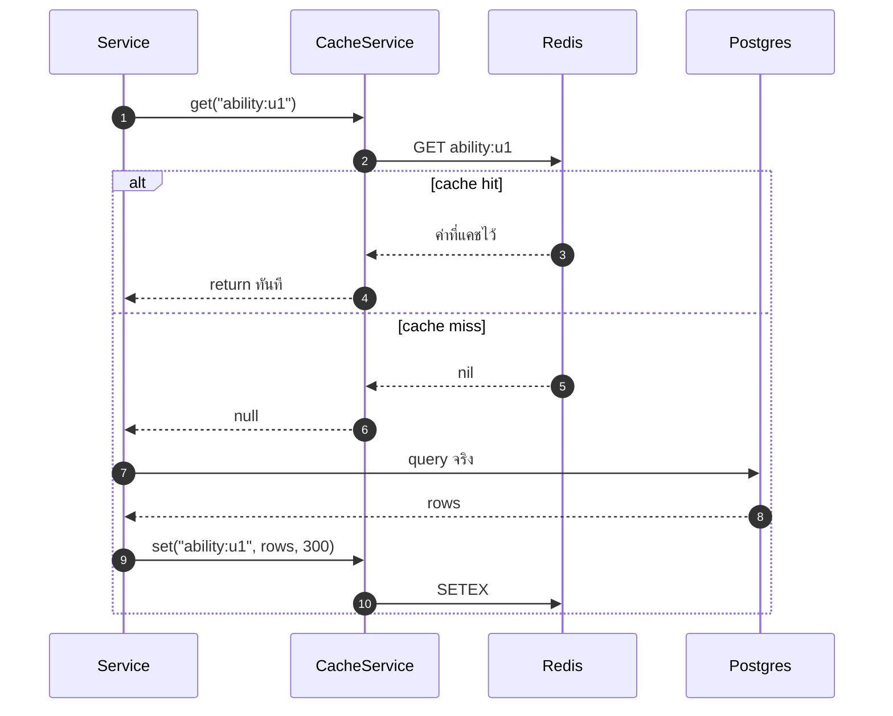

# Caching (Redis)

<Status value="planned" note="Redis รันอยู่แต่ไม่มีโค้ดใช้" />

Redis ถูกยกขึ้นมาใน `docker-compose.yml` ตั้งแต่วันแรก แต่ยังไม่มีบรรทัดโค้ดไหนใน `apps/api` เชื่อมต่อกับมันเลย — นี่คือหนี้ #7 ใน [Roadmap](/start/roadmap)

## ทำไมต้องแคช

| ปัญหา | ไม่มีแคช | มีแคช |
| --- | --- | --- |
| `AbilityFactory.forUser()` | query DB ทุก request ที่มี guard | query DB ครั้งแรก แล้วอ่านจาก Redis 5 นาที |
| รายการ role/permission ที่แทบไม่เปลี่ยน | query ซ้ำทุกครั้งที่ต้องเช็คสิทธิ์ | invalidate เฉพาะตอนมีการแก้ role |
| session/refresh token denylist | ต้องมีที่เก็บที่เร็วพอสำหรับทุก request | Redis คือที่ที่ถูกออกแบบมาสำหรับงานนี้ |

## แผนใช้งาน



Redis (สีแดง) รันอยู่ในระบบแล้วแต่ยังไม่มี `CacheService` หรือ dependency ไหนคุยกับมัน — กล่องในแผนภาพนี้ยังเป็นเป้าหมาย ไม่ใช่ของจริง

## นิยาม interface

```ts
// apps/api/src/cache/cache.service.ts
export abstract class CacheService {
  abstract get<T>(key: string): Promise<T | null>;
  abstract set<T>(key: string, value: T, ttlSeconds: number): Promise<void>;
  abstract del(key: string): Promise<void>;
  /** ลบทุก key ที่ตรง pattern เช่น "ability:*" */
  abstract delPattern(pattern: string): Promise<void>;
}
```

เหมือน [MailerService](/backend/email) — service ที่เรียกใช้รู้จักแค่ interface ไม่รู้ว่าเบื้องหลังเป็น Redis หรือ in-memory ทำให้เทสได้โดยไม่ต้องมี Redis จริง

## รูปแบบ cache-aside

```ts
// apps/api/src/auth/ability/ability.factory.ts
async forUser(userId: string): Promise<AppAbility> {
  const cacheKey = `ability:${userId}`;
  const cached = await this.cache.get<RawRule[]>(cacheKey);
  if (cached) return createMongoAbility<AppAbility>(cached);

  const rules = await this.loadRulesFromDb(userId);
  await this.cache.set(cacheKey, rules, 300); // TTL 5 นาที
  return createMongoAbility<AppAbility>(rules);
}
```



**cache-aside** คือรูปแบบที่ service เป็นคนตัดสินใจว่าจะอ่านแคชก่อนหรือไม่ ต่างจาก write-through ที่ระบบเขียนแคชอัตโนมัติทุกครั้งที่เขียน DB — cache-aside ทำ implement ง่ายกว่าและเข้าใจ failure mode ง่ายกว่า (แคชหายก็แค่ query DB ใหม่)

## Invalidation

::: danger cache ที่ค้าง = สิทธิ์ที่ค้าง
`ability:<userId>` ต้องถูกลบ**ทันที**เมื่อ role ของผู้ใช้เปลี่ยนหรือ permission ของ role นั้นเปลี่ยน ไม่ใช่รอ TTL หมด ถ้าไม่ล้าง คนที่เพิ่งถูกถอดสิทธิ์ admin จะยังทำสิ่งที่ admin ทำได้ต่ออีกถึง 5 นาที
:::

```ts
async updateUserRoles(userId: string, roleIds: string[]) {
  await this.prisma.$transaction([...]);
  await this.cache.del(`ability:${userId}`);
}

async updateRolePermissions(roleId: string, permissionIds: string[]) {
  await this.prisma.$transaction([...]);
  // ทุกคนที่มี role นี้ต้องถูกล้างแคช ไม่ใช่แค่คนที่เพิ่งถูกแก้
  const userIds = await this.prisma.userRole.findMany({ where: { roleId }, select: { userId: true } });
  await this.cache.delPattern(`ability:{${userIds.map((u) => u.userId).join(",")}}`);
}
```

## Key naming

| Pattern | ใช้กับ | TTL |
| --- | --- | --- |
| `ability:<userId>` | CASL ability ที่ประกอบแล้ว | 5 นาที |
| `session:<sessionId>` | ข้อมูล session (ถ้าย้ายจาก stateless JWT) | ตามอายุ session |
| `ratelimit:<ip>:<route>` | ตัวนับสำหรับ throttler | 1 นาที (sliding window) |

::: tip ตั้ง namespace prefix เดียวต่อสภาพแวดล้อม
`NODE_ENV=test` กับ `NODE_ENV=development` ที่ชี้ Redis instance เดียวกันจะเหยียบ key กันถ้าไม่มี prefix ตั้ง `REDIS_KEY_PREFIX=app:dev:` แล้วต่อไว้หน้าทุก key เพื่อกันปัญหานี้
:::

## Redis เป็น cache ไม่ใช่ source of truth

::: danger ห้ามเก็บข้อมูลที่ไม่มีที่มาสำรองใน Redis
Redis ตั้งค่าให้ evict key ได้เมื่อ memory เต็ม (ตาม `maxmemory-policy`) ถ้าข้อมูลอะไรหายแล้วระบบพัง แปลว่าข้อมูลนั้นไม่ควรอยู่ใน Redis เพียงที่เดียว — ต้องมี Postgres เป็นแหล่งความจริงเสมอ และ Redis เป็นแค่ทางลัด
:::

## ทำไมยังไม่ implement

Redis ถูกยกขึ้นมาไว้ล่วงหน้าใน `docker-compose.yml` เพื่อไม่ต้องแก้ infrastructure ทีหลัง แต่การตัดสินใจว่าจะใช้ทำอะไรก่อน (ability cache? rate limit store? refresh token denylist?) ยังไม่ได้ทำ — ควรเริ่มจาก use case ที่วัดผลได้ชัดที่สุดคือ ability cache เพราะ [CASL](/auth/casl) มี query DB ทุก request ที่ผ่าน guard

::: warning สถานะโค้ดปัจจุบัน
| สเปกเป้าหมาย | โค้ดวันนี้ |
| --- | --- |
| `CacheService` + implementation ที่คุยกับ Redis | **ไม่มีโค้ดเลย** — ไม่มี `cache-manager` หรือ Redis client ใน dependency |
| Ability cache | ไม่มี — `AbilityFactory` (เมื่อถูกสร้าง) จะ query DB ทุก request |
| Rate limit store | ไม่มี `@nestjs/throttler` เลย |
| Redis ใน `docker-compose.yml` | มีอยู่จริง รันอยู่ แต่ไม่มีใครต่อเข้าไป |
:::
