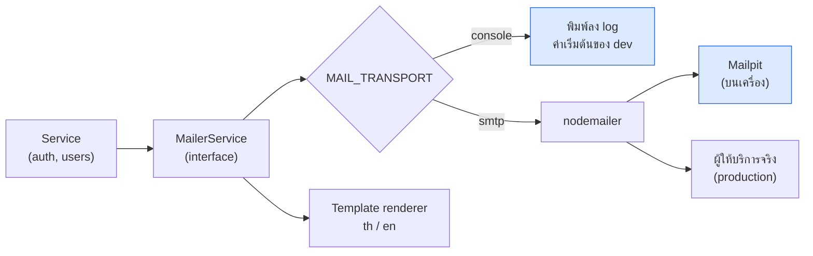
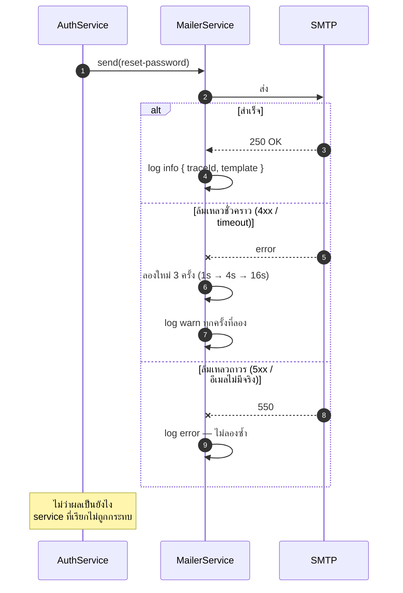

# ส่งอีเมล

<Status value="planned" />

อีเมลเป็นสิ่งที่ทำให้ [ลืมรหัสผ่าน](/auth/forgot-password) และ [ยืนยันอีเมล](/auth/email-verification) ทำงานได้ ถ้าอีเมลส่งไม่ถึง flow เหล่านั้นก็เท่ากับไม่มี

## ชั้นการทำงาน



service ที่เรียกใช้รู้จักแค่ `MailerService` ไม่รู้ว่าปลายทางเป็นอะไร ทำให้เปลี่ยนผู้ให้บริการได้โดยไม่ต้องแตะโค้ด auth เลย

## Interface

```ts
// apps/api/src/mail/mailer.service.ts
export interface MailMessage {
  to: string;
  /** ชื่อ template ต้องมีไฟล์ครบทั้ง th และ en */
  template: MailTemplate;
  /** ตัวแปรของ template — ต้องผ่าน escape ก่อนใส่ใน HTML */
  data: Record<string, string>;
  /** ภาษาของผู้รับ ตกมาจาก user.locale */
  locale: "th" | "en";
}

export type MailTemplate =
  | "verify-email"
  | "reset-password"
  | "password-changed"
  | "account-exists"
  | "session-revoked";

export abstract class MailerService {
  abstract send(message: MailMessage): Promise<void>;
}
```

```ts
// เลือก implementation ตอน boot
{
  provide: MailerService,
  inject: [ConfigService, TemplateRenderer],
  useFactory: (config: ConfigService<Env, true>, renderer: TemplateRenderer) =>
    config.get("MAIL_TRANSPORT", { infer: true }) === "smtp"
      ? new SmtpMailerService(config, renderer)
      : new ConsoleMailerService(renderer),
}
```

::: tip `console` เป็นค่าเริ่มต้น ไม่ใช่ `smtp`
นักพัฒนาที่เพิ่ง clone repo ต้องรัน flow ลืมรหัสผ่านได้ทันทีโดยไม่ต้องตั้ง SMTP `ConsoleMailerService` พิมพ์อีเมลทั้งฉบับ **พร้อมลิงก์ที่คลิกได้** ลง log ซึ่งเพียงพอสำหรับการพัฒนา
:::

```ts
@Injectable()
export class ConsoleMailerService extends MailerService {
  async send(message: MailMessage) {
    const rendered = await this.renderer.render(message);
    this.logger.info(
      { traceId: getTraceId(), to: message.to, template: message.template },
      `\n📧 ${rendered.subject}\n→ ${message.to}\n\n${rendered.text}\n`,
    );
  }
}
```

## Mailpit ตอน dev

อยากเห็นอีเมลจริง ๆ ในเบราว์เซอร์ ให้เพิ่มใน `docker-compose.yml`

```yaml
mailpit:
  image: axllent/mailpit:latest
  restart: unless-stopped
  networks: [app-platform]
  labels:
    - traefik.enable=true
    - traefik.http.routers.mailpit.rule=Host(`mail.localhost`)
    - traefik.http.routers.mailpit.entrypoints=web
    - traefik.http.services.mailpit.loadbalancer.server.port=8025
```

แล้วตั้ง `MAIL_TRANSPORT=smtp` กับ `SMTP_URL=smtp://mailpit:1025` เปิดดูที่ `mail.localhost` — Mailpit รับทุกอีเมลไว้เอง ไม่ส่งออกไปข้างนอกจริง

## Template

```
apps/api/src/mail/templates/
├── verify-email/{th,en}.{subject,html,txt}
├── reset-password/{th,en}.{subject,html,txt}
└── …
```

ทุก template ต้องมีทั้ง `.html` และ `.txt` — โปรแกรมอีเมลบางตัวไม่แสดง HTML และตัวกรองสแปมมองอีเมลที่มีแต่ HTML ว่าน่าสงสัย

```text
apps/api/src/mail/templates/reset-password/th.txt

สวัสดี {{displayName}}

มีคำขอตั้งรหัสผ่านใหม่สำหรับบัญชีของคุณ
เปิดลิงก์นี้เพื่อดำเนินการต่อ (ใช้ได้ภายใน 1 ชั่วโมง)

{{resetUrl}}

หากคุณไม่ได้เป็นคนขอ ไม่ต้องทำอะไร รหัสผ่านของคุณจะไม่ถูกเปลี่ยน

— app-platform
```

::: danger ต้อง escape ตัวแปรทุกตัวใน HTML
`displayName` มาจากผู้ใช้ ถ้าใส่ลง HTML ตรง ๆ คนที่ตั้งชื่อว่า `` จะฝัง HTML ลงในอีเมลที่เราส่งได้ ใช้ตัว render ที่ escape ให้อัตโนมัติ และห้ามใช้ไวยากรณ์วงเล็บปีกกาสามชั้น (raw/unescaped) กับข้อมูลจากผู้ใช้เด็ดขาด
:::

::: tip URL ต้องสร้างจาก `APP_WEB_URL` เท่านั้น
ห้ามสร้างลิงก์จาก `Host` header ของ request ที่เข้ามา คนร้ายเปลี่ยน header นั้นได้ ทำให้อีเมลรีเซ็ตรหัสผ่านของเราชี้ไปที่เว็บของเขาพร้อม token จริง — ช่องโหว่นี้เรียกว่า host header injection และคือทางยึดบัญชีที่สมบูรณ์แบบ
:::

## Template ที่ต้องมี

| Template | ส่งเมื่อ | สิ่งสำคัญ |
| --- | --- | --- |
| `verify-email` | สมัคร / ขอส่งใหม่ | ลิงก์ + อายุ 24 ชม. |
| `reset-password` | ขอรีเซ็ต | ลิงก์ + อายุ 1 ชม. + "ถ้าไม่ได้ขอ ไม่ต้องทำอะไร" |
| `password-changed` | รหัสผ่านถูกเปลี่ยน | เวลา + IP · **ไม่มีลิงก์ทำ action** |
| `account-exists` | สมัครด้วยอีเมลที่มีแล้ว | ชี้ไปหน้าลืมรหัสผ่าน |
| `session-revoked` | จับการใช้ refresh token ซ้ำ | เวลา + เหตุผล + ชวนให้เปลี่ยนรหัสผ่าน |

::: danger อีเมลแจ้งเตือนห้ามมีลิงก์ที่ทำ action
`password-changed` ต้องไม่มีปุ่ม "ไม่ใช่ฉัน กดที่นี่เพื่อยกเลิก" เพราะนั่นคือรูปแบบเดียวกับ phishing เป๊ะ ๆ และเราจะเป็นคนสอนผู้ใช้ให้คลิกลิงก์แบบนั้นเอง ให้เขียนว่า "หากไม่ใช่คุณ กรุณาติดต่อผู้ดูแลระบบ" แทน
:::

## ส่งแล้วพัง



::: danger การส่งอีเมลล้มเหลว ห้ามทำให้ request ล้มเหลว
ถ้า SMTP ล่มแล้ว `POST /v1/auth/register` ตอบ `500` ผู้ใช้จะเห็นว่าสมัครไม่สำเร็จ แล้วสมัครซ้ำ ทั้งที่บัญชีถูกสร้างไปแล้ว → `409` วนไม่จบ

ให้ `send()` จับ error เองทั้งหมดแล้ว log ไว้ ส่วนคนเรียกทำงานต่อ ผู้ใช้กด "ส่งอีกครั้ง" ได้อยู่แล้ว

ข้อแลกเปลี่ยนคือความล้มเหลวจะเงียบ — จึงต้อง monitor อัตราการส่งล้มเหลว ไม่ใช่พึ่งให้ผู้ใช้มาแจ้ง
:::

การส่งควรอยู่นอก request path ด้วย — ระหว่างที่ยังไม่มีระบบคิว ใช้ `setImmediate` ก็พอ แต่ต้องรู้ว่าอีเมลจะหายถ้า process ตายก่อนส่ง เมื่อมีคิวจริง (BullMQ บน Redis ที่ยกไว้แล้วแต่ยังไม่ได้ใช้) ค่อยย้ายไปที่นั่น

## Log และความเป็นส่วนตัว

| Log ได้ | ห้าม Log |
| --- | --- |
| `template`, `traceId`, `locale` | เนื้ออีเมลเต็ม ๆ (ยกเว้น transport `console`) |
| อีเมลผู้รับ (ถูก redact ใน production) | **token ในลิงก์** |
| สถานะสำเร็จ/ล้มเหลว + จำนวนครั้งที่ลอง | ตัวแปรของ template ทั้งชุด |

::: danger token ห้ามอยู่ใน log ของ production
`resetUrl` มี token จริงอยู่ในนั้น ใครที่อ่าน log ได้ก็รีเซ็ตรหัสผ่านของใครก็ได้ `ConsoleMailerService` ที่พิมพ์อีเมลทั้งฉบับจึงต้อง **ใช้ได้เฉพาะ non-production** ให้ `EnvSchema` บังคับว่า `MAIL_TRANSPORT` ต้องเป็น `smtp` เมื่อ `NODE_ENV=production`
:::

## จำกัดอัตรา

| ปลายทาง | ขีดจำกัด |
| --- | --- |
| ต่ออีเมลผู้รับ | 5 ฉบับ/ชั่วโมง ทุก template รวมกัน |
| ต่อ IP | 20 ฉบับ/ชั่วโมง |
| ทั้งระบบ | ตั้งเพดานตามโควตาของผู้ให้บริการ |

ถ้าไม่จำกัด endpoint ที่ส่งอีเมลจะกลายเป็นเครื่องมือส่งสแปมใส่คนอื่นฟรี ๆ และทำให้โดเมนของเราติด blacklist

## ส่งถึงจริงไหม

ก่อนขึ้น production ต้องมีสามอย่างนี้ที่ระดับ DNS ไม่งั้นอีเมลจะไปอยู่ในถังสแปม

| Record | ทำอะไร |
| --- | --- |
| **SPF** | ระบุว่า server ไหนส่งแทนโดเมนเราได้ |
| **DKIM** | เซ็นอีเมลด้วยลายเซ็นที่ตรวจได้ |
| **DMARC** | บอกผู้รับว่าให้ทำยังไงถ้า SPF/DKIM ไม่ผ่าน |

และใช้โดเมนย่อยแยกสำหรับอีเมลระบบ (เช่น `mail.example.com`) เพื่อไม่ให้ชื่อเสียงของโดเมนหลักพังถ้ามีปัญหา

::: warning สถานะโค้ดปัจจุบัน
| สเปกเป้าหมาย | โค้ดวันนี้ |
| --- | --- |
| `MailerService` + สอง transport | **ไม่มีโมดูล mail เลย** |
| Template สองภาษา | ไม่มี |
| Mailpit ใน compose | ไม่มี |
| env `MAIL_*` / `SMTP_URL` | ไม่มีใน `.env.example` |
| ลองส่งซ้ำ + log | ไม่มี |
| จำกัดอัตรา | ไม่มี `@nestjs/throttler` |
| ระบบคิว | Redis ยกไว้แล้วแต่ไม่มีโค้ดใช้ |
:::
