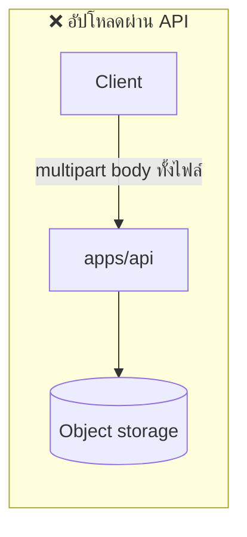
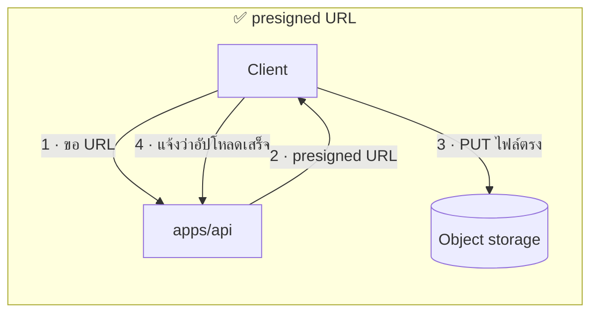
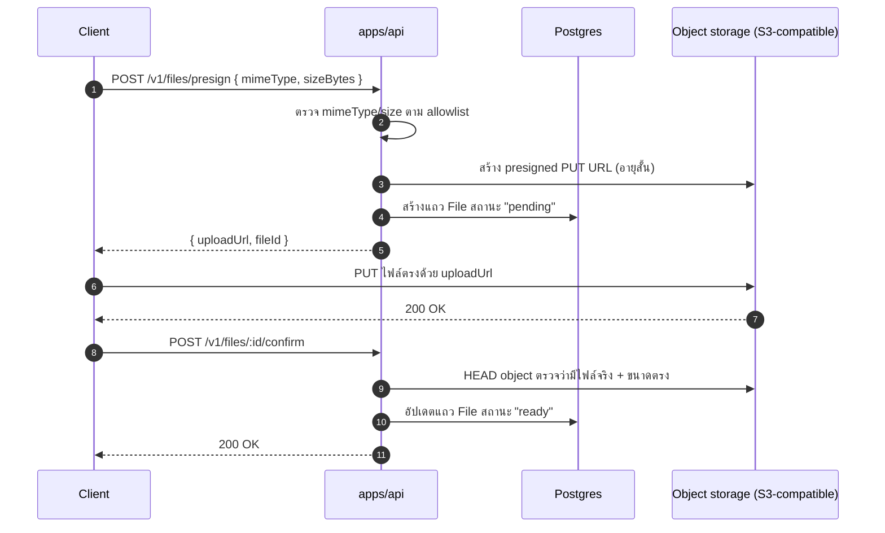

# จัดเก็บไฟล์

<Status value="planned" />

ตอนนี้ไม่มีที่ไหนใน `apps/api` รับไฟล์อัปโหลดได้เลย หน้านี้คือสเปกของ flow อัปโหลดที่ควรจะเป็น ใช้ตาราง `File` ที่นิยามไว้แล้วใน [Data model](/architecture/data-model)

## ทำไมไม่อัปโหลดผ่าน API server ตรง ๆ





ถ้าไฟล์วิ่งผ่าน `apps/api` ทุกไบต์ กิน memory/bandwidth ของ process เดียวกับที่รับ request อื่น ๆ อยู่ และไฟล์ใหญ่ทำให้ request timeout ได้ง่าย **presigned URL** ให้ client อัปโหลดตรงไปที่ object storage โดย API ทำหน้าที่แค่ออก URL ที่ใช้ได้ชั่วคราว

## สถาปัตยกรรมเป้าหมาย



ขั้น **confirm** สำคัญ — ถ้าไม่มี ระบบจะเชื่อ client ว่าอัปโหลดสำเร็จโดยไม่ตรวจอะไรเลย client ที่ขอ presigned URL แล้วไม่อัปโหลดจริงจะทิ้งแถว `File` ที่ชี้ไปยังไฟล์ที่ไม่มีอยู่จริง

## นิยาม endpoint

```ts
// packages/contracts/src/file.schema.ts
export const PresignFileSchema = z.object({
  mimeType: z.enum(["image/jpeg", "image/png", "image/webp", "application/pdf"]),
  sizeBytes: z.number().int().positive().max(10 * 1024 * 1024), // 10MB
});

export const PresignedUploadSchema = z.object({
  fileId: z.uuid(),
  uploadUrl: z.url(),
  expiresAt: z.iso.datetime(),
});
```

```ts
// apps/api/src/files/files.service.ts
async presign(dto: PresignFile, uploadedById: string) {
  const storageKey = `${uploadedById}/${randomUUID()}`;
  const file = await this.prisma.file.create({
    data: { storageKey, mimeType: dto.mimeType, sizeBytes: dto.sizeBytes, uploadedById, status: "pending" },
  });

  const uploadUrl = await this.storage.presignPut(storageKey, {
    contentType: dto.mimeType,
    contentLength: dto.sizeBytes,
    expiresInSeconds: 300,
  });

  return { fileId: file.id, uploadUrl, expiresAt: addSeconds(new Date(), 300).toISOString() };
}
```

::: danger `storageKey` ห้ามมาจาก client
ถ้า client เลือกชื่อไฟล์บน storage เองได้ เขาเขียนทับไฟล์ของคนอื่นได้ทันทีถ้าเดา key ถูก ให้ server เป็นคนสร้าง key เสมอ (เช่น `<userId>/<uuid>`) ไม่ใช่ใช้ชื่อไฟล์ต้นฉบับที่ client ส่งมา
:::

## ตรวจสอบก่อนออก presigned URL

| ตรวจอะไร | ทำไม |
| --- | --- |
| `mimeType` อยู่ใน allowlist | กัน `.exe`, `.html` (XSS ผ่านไฟล์) หรือชนิดไฟล์ที่ไม่รองรับ |
| `sizeBytes` ไม่เกิน limit | กันไฟล์ใหญ่เกินโควตาที่ storage หรือ CDN รองรับ |
| ผู้ใช้ล็อกอินแล้ว | ห้ามคนไม่ล็อกอินขอ presigned URL ได้ — เป็นการเปิดให้อัปโหลดฟรีไม่จำกัด |
| จำนวนไฟล์ต่อผู้ใช้ต่อชั่วโมง | กัน storage เต็มจากการยิง presign รัว ๆ |

::: warning `Content-Type` ที่ client ส่งตอน PUT ต้องตรงกับตอนขอ presign
Presigned URL ผูก `Content-Type` ไว้กับ signature ถ้า client เปลี่ยน header ตอน `PUT` จริง จะได้ `403` จาก storage เอง — เป็นกลไกป้องกันในตัวอยู่แล้ว ไม่ต้องเขียนโค้ดเพิ่ม
:::

## ดาวน์โหลด

ไฟล์ที่ต้องเช็คสิทธิ์ก่อนดาวน์โหลด (เช่น เอกสารส่วนตัว) ก็ใช้ presigned URL เหมือนกัน แต่เป็น `GET` แทน `PUT`

```ts
async getDownloadUrl(fileId: string, ability: AppAbility) {
  const file = await this.prisma.file.findFirst({ where: { id: fileId, status: "ready" } });
  if (!file) throw Errors.fileNotFound();
  if (!ability.can("read", subjectHelper("File", file))) throw Errors.forbidden();

  return this.storage.presignGet(file.storageKey, { expiresInSeconds: 60 });
}
```

ไฟล์ที่เป็น public ล้วน (เช่น avatar ที่แสดงในหน้าโปรไฟล์สาธารณะ) ใช้ URL ตรงจาก CDN ได้เลยโดยไม่ต้อง presign — presigned URL มีไว้สำหรับไฟล์ที่ต้องคุมสิทธิ์เท่านั้น

## Object storage abstraction

```ts
// apps/api/src/files/storage.service.ts
export abstract class StorageService {
  abstract presignPut(key: string, opts: { contentType: string; contentLength: number; expiresInSeconds: number }): Promise<string>;
  abstract presignGet(key: string, opts: { expiresInSeconds: number }): Promise<string>;
  abstract delete(key: string): Promise<void>;
}
```

ใช้ SDK ที่พูด S3 protocol (`@aws-sdk/client-s3` + `@aws-sdk/s3-request-presigner`) แล้วชี้ endpoint ไปที่ MinIO ตอน dev (รันใน `docker-compose.yml` เหมือน service อื่น) และ S3 จริงตอน production — โค้ดฝั่ง `apps/api` เหมือนกันทั้งสอง environment เพราะ MinIO เข้ากันได้กับ S3 API

## ลบไฟล์

::: danger ลบแถว `File` ต้องลบไฟล์จริงด้วยเสมอ ไม่ใช่กลับกัน
ลบแถวใน DB โดยไม่ลบไฟล์จริง = พื้นที่เก็บข้อมูลรั่วเรื่อย ๆ (storage cost บวมโดยไม่มีใครสังเกต) ให้ทำใน transaction เดียว: ลบไฟล์จาก storage ก่อน สำเร็จแล้วค่อยลบแถว DB — ถ้าลบ storage ไม่สำเร็จ ห้ามลบแถว DB เพราะจะทำให้ตามหาไฟล์กำพร้าไม่เจอ
:::

::: warning สถานะโค้ดปัจจุบัน
| สเปกเป้าหมาย | โค้ดวันนี้ |
| --- | --- |
| endpoint `POST /v1/files/presign` + `/confirm` | **ไม่มี** — ไม่มี route อัปโหลดไฟล์เลย |
| `StorageService` + S3/MinIO client | ไม่มี — ไม่มี `@aws-sdk/*` ใน dependency |
| ตาราง `File` | นิยามไว้แล้วใน [Data model](/architecture/data-model) แต่ไม่มีใน `schema.prisma` จริง |
| MinIO ใน `docker-compose.yml` | ไม่มี service นี้ในไฟล์ compose |
| ตรวจ mimeType/size ก่อนอัปโหลด | ไม่มี เพราะไม่มี endpoint |
:::
