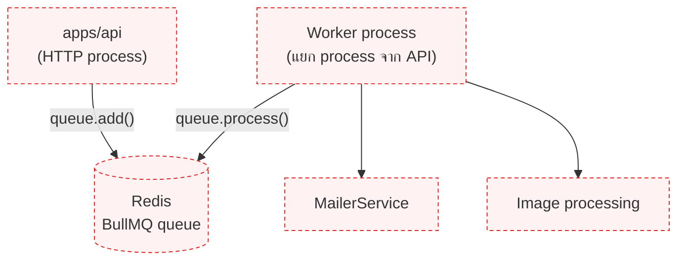
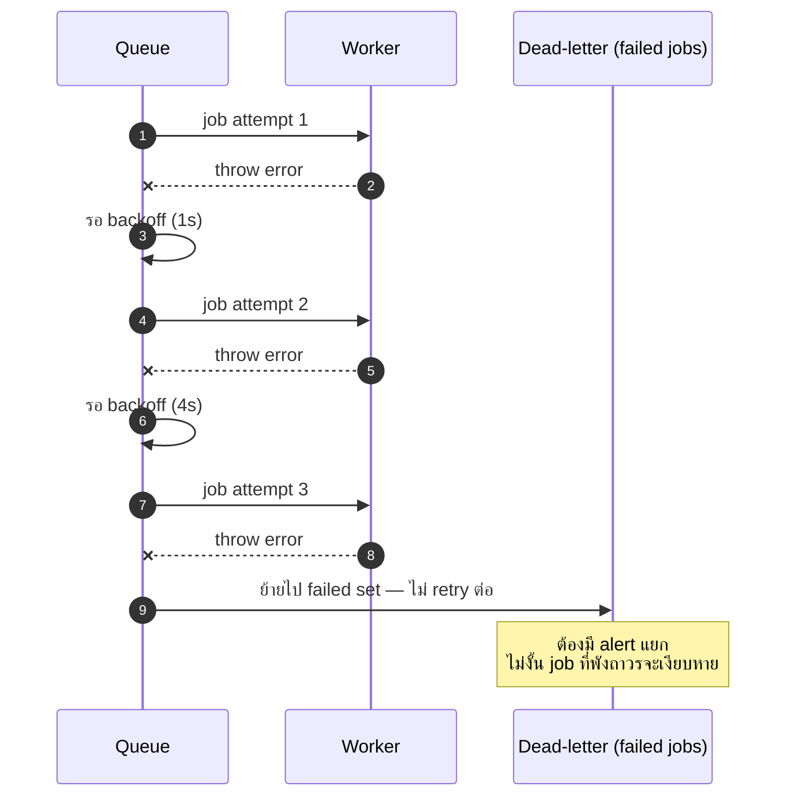

# งานเบื้องหลัง (jobs & queues)

<Status value="planned" />

งานที่ไม่ต้องให้ผู้ใช้รอ (ส่งอีเมล, ประมวลผลรูปภาพ, sync ข้อมูล) ควรอยู่นอก request/response cycle หน้านี้คือสเปกของระบบคิวที่ยังไม่มีโค้ดจริงสักบรรทัด

## ทำไมต้องมีคิว

```mermaid
flowchart LR
  subgraph ไม่มีคิว
    R1["POST /v1/users"] --> S1["สร้าง user"]
    S1 --> M1["ส่งอีเมล<br/>(รอจนเสร็จ)"]
    M1 --> Resp1["response"]
  end
```

```mermaid
flowchart LR
  subgraph มีคิว
    R2["POST /v1/users"] --> S2["สร้าง user"]
    S2 --> Q["enqueue job"]
    Q --> Resp2["response ทันที"]
    Q -.-> W["Worker process<br/>ประมวลผลทีหลัง"]
    W -.-> M2["ส่งอีเมล"]
  end
```

ถ้าไม่มีคิว [การส่งอีเมล](/backend/email) ที่ทำผ่าน `setImmediate` จะหายทันทีที่ process ตาย — คิวที่เก็บ job ไว้ใน Redis ทำให้ job รอดจาก process restart และลองใหม่ได้เมื่อล้มเหลว

## ทำไมเลือก BullMQ

| ทางเลือก | ข้อดี | ทำไมไม่เลือก (ตอนนี้) |
| --- | --- | --- |
| **BullMQ** (บน Redis) | Redis มีอยู่แล้วในระบบ, API เป็น TypeScript-native, มี UI (Bull Board) | — |
| RabbitMQ / SQS | ทนทานกว่าสำหรับ scale ใหญ่ | ต้องเพิ่ม infra ใหม่ทั้งชุด เกินความจำเป็นสำหรับ boilerplate |
| Cron ธรรมดาใน process เดียว | เขียนง่ายสุด | ไม่ retry, ไม่ persist, รันซ้ำได้ถ้ามีหลาย instance |

BullMQ ใช้ Redis instance เดียวกับที่ [caching](/backend/caching) จะใช้ — ไม่ต้องเพิ่ม service ใหม่ในระบบ

## สถาปัตยกรรมเป้าหมาย



Worker เป็นคนละ process จาก API — deploy แยกกันได้ scale แยกกันได้ ถ้า worker ตาย API ยังรับ request ปกติ job แค่ค้างอยู่ในคิวรอ worker กลับมา

## นิยาม queue และ job

```ts
// apps/api/src/jobs/queues/mail.queue.ts
import { Queue } from "bullmq";

export interface SendMailJob {
  to: string;
  template: MailTemplate;
  data: Record<string, string>;
  locale: "th" | "en";
}

export const MAIL_QUEUE = "mail";

export const mailQueue = new Queue<SendMailJob>(MAIL_QUEUE, {
  connection: { host: env.REDIS_HOST, port: env.REDIS_PORT },
  defaultJobOptions: {
    attempts: 3,
    backoff: { type: "exponential", delay: 1000 },
    removeOnComplete: { age: 3600 },
    removeOnFail: { age: 86400 },
  },
});
```

```ts
// enqueue จากที่ไหนก็ได้ใน apps/api
await mailQueue.add("send-reset-password", {
  to: user.email,
  template: "reset-password",
  data: { resetUrl },
  locale: user.locale,
});
```

## Worker

```ts
// apps/api/src/jobs/workers/mail.worker.ts
import { Worker } from "bullmq";

new Worker<SendMailJob>(
  MAIL_QUEUE,
  async (job) => {
    await mailerService.send(job.data);
  },
  { connection: { host: env.REDIS_HOST, port: env.REDIS_PORT }, concurrency: 5 },
);
```

::: tip worker รันเป็น process แยก ไม่ใช่ endpoint ของ Nest
`new Worker()` เปิด connection แบบ blocking ที่ poll คิวตลอดเวลา ถ้าเอาไปรันในตัว `apps/api` เดียวกันกับ HTTP server ทั้งสองจะแย่ง event loop กัน สร้าง entry point แยก (เช่น `apps/api/src/worker.ts`) แล้ว build/deploy เป็นอีก process หนึ่ง
:::

## Retry และ dead letter



::: danger job ที่ retry ครบแล้วยัง fail ต้องมีคนเห็น
BullMQ เก็บ job ที่ fail ครบทุกครั้งไว้ใน `failed` set โดยอัตโนมัติ แต่ถ้าไม่มี monitoring หรือ Bull Board เปิดดู จะไม่มีใครรู้ว่ามี job ค้างอยู่เป็นร้อย ต้องต่อ alert เข้ากับจำนวน job ใน `failed` set ก่อนขึ้น production
:::

## Idempotency

::: danger job อาจถูกประมวลผลซ้ำได้เสมอ
BullMQ รับประกันแค่ "at-least-once" ไม่ใช่ "exactly-once" — ถ้า worker crash หลังทำงานเสร็จแต่ก่อน ack, job จะถูกส่งมาทำใหม่ ทุก job handler ต้อง idempotent เช่น การส่งอีเมลควรเช็คว่าเคยส่งไปแล้วหรือยังก่อนส่งซ้ำ ไม่ใช่พึ่งว่า job จะรันแค่ครั้งเดียว
:::

## ตรวจสอบสถานะ

Bull Board เป็น dashboard สำเร็จรูปที่ mount เป็น route ของ Nest ได้ ใช้ดู pending/active/failed job แบบ real-time โดยไม่ต้อง query Redis เอง — แนะนำให้ใส่หลัง auth guard เสมอ ห้ามเปิด public

::: warning สถานะโค้ดปัจจุบัน
| สเปกเป้าหมาย | โค้ดวันนี้ |
| --- | --- |
| BullMQ queue + worker process | **ไม่มีเลย** — ไม่มี `bullmq` ใน dependency |
| การส่งอีเมลผ่านคิว | ใช้ `setImmediate` ตรง ๆ — ดู [ส่งอีเมล](/backend/email) |
| Worker เป็น process แยก | ไม่มี entry point สำหรับ worker |
| Bull Board dashboard | ไม่มี |
| Redis สำหรับเป็น queue backend | รันอยู่ใน `docker-compose.yml` แต่ไม่มีโค้ดใช้ ([Roadmap](/start/roadmap) หนี้ #7) |
:::
