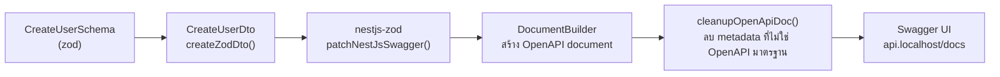

# OpenAPI / Swagger

<Status value="implemented" />

`api.localhost/docs` เป็น Swagger UI ที่ใช้งานได้จริงวันนี้ — เป็นหนึ่งในไม่กี่หน้าของเอกสารชุดนี้ที่ตรงกับโค้ด 100%

## ทำไมต้องแก้ปัญหา DTO ที่มาจาก zod

`@nestjs/swagger` อ่าน metadata จาก decorator ของ `class-validator`/`class-transformer` (เช่น `@IsString()`, `@ApiProperty()`) เพื่อสร้าง schema ของ OpenAPI แต่ DTO ในโปรเจกต์นี้มาจาก `createZodDto` — ไม่มี decorator พวกนั้นเลยสักตัว ดู [Validation](/backend/validation)

`nestjs-zod` แก้ปัญหานี้ด้วยการแปลง zod schema เป็น OpenAPI schema ให้อัตโนมัติ



## ติดตั้ง

```ts
// apps/api/src/main.ts
import { DocumentBuilder, SwaggerModule } from "@nestjs/swagger";
import { patchNestJsSwagger, cleanupOpenApiDoc } from "nestjs-zod";

patchNestJsSwagger(); // เรียกครั้งเดียวก่อนสร้าง document — สอน @nestjs/swagger ให้อ่าน zod metadata

async function bootstrap() {
  const app = await NestFactory.create(AppModule);

  const config = new DocumentBuilder()
    .setTitle("app-platform API")
    .setVersion("1.0")
    .addBearerAuth()
    .build();

  const document = cleanupOpenApiDoc(SwaggerModule.createDocument(app, config));
  SwaggerModule.setup("docs", app, document);

  await app.listen(3001);
}
```

`patchNestJsSwagger()` ต้องเรียกก่อน `SwaggerModule.createDocument()` เสมอ — มันแก้ prototype ของ `@nestjs/swagger` ให้รู้จักอ่าน metadata ที่ `nestjs-zod` แนบไว้กับแต่ละ DTO class

::: tip `cleanupOpenApiDoc` ทำอะไร
zod schema บางแบบ (เช่น `z.union`, `z.discriminatedUnion`) แปลงเป็น OpenAPI แล้วได้ metadata แปลก ๆ ที่ Swagger UI แสดงผลไม่สวย `cleanupOpenApiDoc` ตัดส่วนที่ไม่จำเป็นออกก่อนส่งให้ `SwaggerModule.setup()`
:::

## Bearer auth

```ts
@ApiBearerAuth()
@UseGuards(JwtAuthGuard)
@Get("me")
me(@CurrentUser() user: User) { ... }
```

`.addBearerAuth()` ใน `DocumentBuilder` เปิดปุ่ม "Authorize" บน Swagger UI — ใส่ JWT ครั้งเดียวแล้ว endpoint ที่มี `@ApiBearerAuth()` จะแนบ header ให้อัตโนมัติเวลากด "Try it out"

## OAuth2 password flow — login + auto-attach token ให้ทุก request ที่เหลือ

`.addBearerAuth()` ต้อง copy/paste access token เข้าไปเองหลัง login — `.addOAuth2()` แบบ `password` flow ให้ Swagger UI ยิง `POST /auth/token` ให้เองจากในหน้า Authorize แล้วเก็บ token ไว้ใช้กับทุก request ถัดไปโดยไม่ต้อง copy

```ts
// apps/api/src/main.ts
const config = new DocumentBuilder()
  .addBearerAuth(
    { type: "http", scheme: "bearer", bearerFormat: "JWT" },
    "access-token", // สำหรับ paste token ที่มีอยู่แล้วตรง ๆ (เช่นจาก curl)
  )
  .addOAuth2(
    {
      type: "oauth2",
      flows: {
        password: {
          tokenUrl: "/auth/token",
          refreshUrl: "/auth/token",
          scopes: {},
        },
      },
    },
    "oauth2", // สำหรับกรอก username/password ใน Authorize dialog แล้วให้ Swagger ขอ token เอง
  )
  .build();
```

endpoint ที่ต้องการให้ทั้งสองทางใช้ได้ (either/or) ใส่ decorator ทั้งคู่ — nestjs-swagger รวม decorator หลายตัวแบบ OR ใน `security` array ของ operation นั้น ไม่ใช่ AND:

```ts
@ApiBearerAuth("access-token")
@ApiSecurity("oauth2")
@UseGuards(JwtAuthGuard)
@Get(":id")
findOne(@Param("id") id: string) { ... }
```

`POST /auth/token` เองต้องรับ `application/x-www-form-urlencoded` ไม่ใช่ JSON เพราะ OAuth2 grant flow (RFC 6749) กำหนด body shape ไว้แบบนั้น — ต้องใส่ `@ApiConsumes("application/x-www-form-urlencoded")` ไม่งั้น Swagger UI จะส่งเป็น JSON แล้ว mismatch กับที่ endpoint คาดหวัง:

```ts
@ApiConsumes("application/x-www-form-urlencoded")
@Post("token")
token(@Body() body: TokenRequestDto) { ... }
```

รายละเอียด schema ของ request/response อยู่ที่ [Contract schema catalog § auth.schema.ts](/reference/contracts) และ endpoint จริงอยู่ที่ [API endpoint catalog](/reference/api-endpoints)

::: tip Swagger UI ไม่ได้ auto-refresh ทุกกรณี
`refreshUrl` บอก Swagger UI ว่าจะขอ token ใหม่จากไหน แต่ไม่ได้แปลว่ามันจะ refresh ให้อัตโนมัติทุกเวอร์ชัน/ทุกครั้งที่ access token หมดอายุกลางอากาศ — สิ่งที่การันตีแน่ ๆ คือหลัง Authorize ครั้งแรกสำเร็จ ทุก request ที่เหลือใน session นั้นจะแนบ header ให้เองโดยไม่ต้อง copy/paste ซ้ำ
:::

## Endpoint ที่ไม่อยากให้ขึ้นใน Swagger

```ts
// apps/api/src/health.controller.ts
@ApiExcludeController()
@Controller("health")
export class HealthController {
  @Get()
  check() {
    return { status: "ok", checkedAt: new Date().toISOString() };
  }
}
```

`@ApiExcludeController()` (หรือ `@ApiExcludeEndpoint()` ระดับ method) กันไม่ให้ endpoint ที่ไม่ใช่ business logic — health check, metrics — ปนอยู่ในเอกสาร API ที่ทีมอื่นอ่าน

## บรรยาย endpoint เพิ่มเติม

decorator ของ `@nestjs/swagger` ยังใช้ได้ตามปกติแม้ DTO จะมาจาก zod — มันเสริมข้อมูล ไม่ได้แทนที่ schema

```ts
@ApiOperation({ summary: "สร้างผู้ใช้ใหม่" })
@ApiResponse({ status: 201, description: "สร้างสำเร็จ" })
@ApiResponse({ status: 409, description: "อีเมลถูกใช้แล้ว" })
@Post()
create(@Body() dto: CreateUserDto) { ... }
```

::: warning เอกสารบน endpoint ต้องอัปเดตพร้อมโค้ด
`@ApiResponse({ status: 409, ... })` เป็นแค่ข้อความ — ไม่มีอะไรบังคับว่า service ต้อง throw `409` จริง ถ้า behavior เปลี่ยนแต่ decorator ไม่เปลี่ยน Swagger UI จะโกหกทีมที่อ่าน แนะนำให้รีวิว PR ที่แก้ error handling พร้อมเช็ค decorator เสมอ
:::

## เทียบกับ contract-first

โปรเจกต์นี้เขียน zod schema ก่อน แล้ว Swagger เป็นผลลัพธ์ที่ generate ตามหลัง — ตรงข้ามกับการเขียน `openapi.yaml` เองแล้ว generate code จาก YAML รายละเอียดว่าทำไมเลือกทางนี้อยู่ที่ [Contract-first workflow](/conventions/contract-first)

::: tip export spec เป็นไฟล์ static ได้
`SwaggerModule.createDocument()` คืนค่าเป็น JS object ธรรมดา เขียนสคริปต์ที่รันตอน CI แล้ว `writeFileSync("openapi.json", JSON.stringify(document))` เพื่อเก็บ spec เป็นไฟล์ไว้ generate client SDK หรือเทียบ diff ระหว่าง PR ได้ — ยังไม่ได้ทำในโปรเจกต์นี้
:::

## ตรวจว่า Swagger กับโค้ดตรงกัน

Swagger UI ที่ generate จาก DTO จริง **ไม่มีทางไม่ตรงกับ validation จริง** เพราะมันอ่านจาก schema เดียวกันที่ `ZodValidationPipe` ใช้ ต่างจากการเขียนเอกสาร API แยกต่างหากที่ drift จากโค้ดได้ตลอดเวลา — นี่คือเหตุผลหลักที่หน้านี้เป็น <Status value="implemented" inline /> เพียงไม่กี่หน้าในเอกสารชุดนี้

::: warning สถานะโค้ดปัจจุบัน
| สเปกเป้าหมาย | โค้ดวันนี้ |
| --- | --- |
| Swagger UI ที่ `/docs` | ใช้งานได้จริงที่ `api.localhost/docs` |
| Bearer auth scheme | ตั้งค่าไว้แล้วผ่าน `.addBearerAuth()` |
| OAuth2 password flow (auto-attach token) | ตั้งค่าไว้แล้วผ่าน `.addOAuth2()` — `POST /auth/token` รองรับทั้ง `grant_type=password` และ `grant_type=refresh_token` |
| `patchNestJsSwagger()` + `cleanupOpenApiDoc()` | เรียกอยู่ใน `main.ts` ตามสเปก |
| `@ApiExcludeController()` บน health | มีอยู่จริง |
| export spec เป็น `openapi.json` ใน CI | ยังไม่มี — ไม่มี CI เลย ([Roadmap](/start/roadmap) หนี้ #9) |
:::
