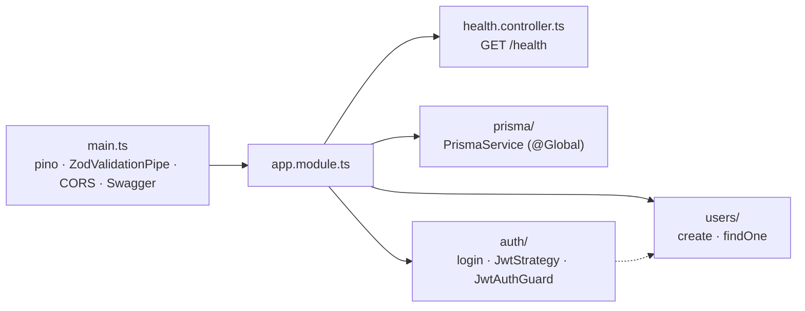
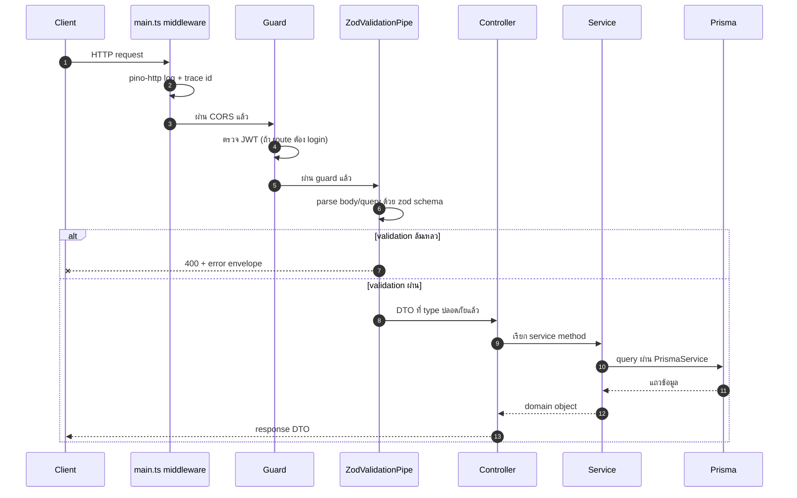

# ภาพรวมแบ็กเอนด์

<Status value="in-progress" note="โมดูลหลักยังไม่ครบ" />

`apps/api` เป็น NestJS 11 modular monolith — API เดียว ไม่ใช่ microservices แยกหลายตัว หน้านี้คือจุดเริ่มก่อนไปอ่านหน้าย่อยแต่ละเรื่อง

## สแต็กและเหตุผล

| ชั้น | ใช้อะไร | ทำไม |
| --- | --- | --- |
| Framework | NestJS 11 | DI + module system ที่บังคับให้แยกขอบเขตชัด ไม่ใช่แค่ Express ที่ราบเรียบ |
| Validation | `nestjs-zod` + `packages/contracts` | schema เดียวใช้ทั้ง runtime validation และ type — ดู [Validation](/backend/validation) |
| Data access | Prisma + `@prisma/adapter-pg` | type-safe query, migration ที่ตรวจสอบได้ — ดู [Prisma](/backend/prisma) |
| API docs | `@nestjs/swagger` + `cleanupOpenApiDoc` | Swagger UI สร้างจาก DTO เดียวกับที่ validate จริง ไม่ใช่เอกสารที่เขียนแยก — ดู [OpenAPI](/backend/openapi) |
| Logging | `nestjs-pino` | structured log, เร็วกว่า logger ของ Nest ที่มากับ default |
| Auth | `@nestjs/jwt` + `passport-jwt` | ดู [Auth overview](/auth/overview) |

รายละเอียดเชิงเหตุผลเต็ม ๆ อยู่ที่ [Tech stack & เหตุผล](/architecture/tech-stack)

## โมดูลวันนี้

ผังโฟลเดอร์แบบเต็มพร้อมเป้าหมายที่ยังไม่มีอยู่ที่ [โครงสร้างโฟลเดอร์ · api](/conventions/structure-api)

## หลักการออกแบบโมดูล

- **หนึ่งโฟลเดอร์ = หนึ่งโมดูล** สื่อสารข้ามโมดูลผ่าน service ที่ export เท่านั้น
- **DTO ไม่มี logic ของตัวเอง** ทุก schema มาจาก `packages/contracts` — ห้ามเขียนกฎ validation ซ้ำใน `apps/api`
- **service ไม่รู้จัก HTTP** controller รับ request แล้วแปลงเป็น argument ธรรมดาให้ service — ทำให้เทส service ได้โดยไม่ต้อง mock request/response

## เส้นทางของ request

ปัจจุบันยังไม่มี global exception filter ที่แปลง error เป็น envelope มาตรฐาน — validation error ตอบกลับด้วยรูปแบบ default ของ Nest ดู [Error envelope](/conventions/errors)

## หน้าเอกสารที่เกี่ยวข้อง

| หัวข้อ | สถานะ |
| --- | --- |
| [Validation (zod pipe)](/backend/validation) | <Status value="implemented" inline /> |
| [Prisma & data access](/backend/prisma) | <Status value="in-progress" inline /> |
| [OpenAPI / Swagger](/backend/openapi) | <Status value="implemented" inline /> |
| [Caching (Redis)](/backend/caching) | <Status value="planned" inline /> |
| [งานเบื้องหลัง (jobs & queues)](/backend/jobs) | <Status value="planned" inline /> |
| [จัดเก็บไฟล์](/backend/file-storage) | <Status value="planned" inline /> |
| [ส่งอีเมล](/backend/email) | <Status value="planned" inline /> |

## Health check

`GET /health` อยู่นอกทุกโมดูลเพราะไม่มี domain ของตัวเอง — คืน `{ status, checkedAt }` และถูก exclude ออกจาก Swagger เพราะไม่ใช่ business endpoint รายละเอียดการใช้กับ orchestrator (Docker healthcheck, load balancer) อยู่ที่หน้า Health checks ในหมวด Platform

::: warning สถานะโค้ดปัจจุบัน
| สเปกเป้าหมาย | โค้ดวันนี้ |
| --- | --- |
| โมดูลครบตามผังเป้าหมาย | มีแค่ `auth`, `users`, `prisma` + `health.controller.ts` |
| global exception filter → error envelope | ไม่มี — error เป็นรูปแบบ default ของ Nest |
| trace id ทุก request | ไม่มี `AsyncLocalStorage` หรือ interceptor ผูก trace id |
| validate env ตอนบูต | `ConfigModule` ไม่มี `validate` |
| `CORS` เป็น allowlist | `app.enableCors()` เรียกโดยไม่มี options — เปิดทุก origin |
:::
