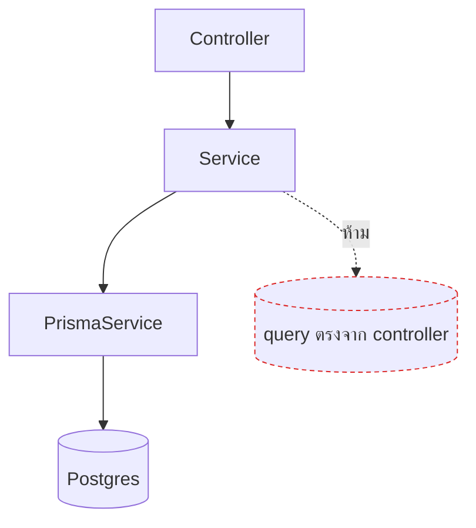

# Prisma & data access

<Status value="in-progress" note="schema มีแค่ User, seed พัง" />

`apps/api` เข้าถึงฐานข้อมูลผ่าน `PrismaService` เท่านั้น — ไม่มี query ดิบ ไม่มี ORM ตัวที่สอง นิยามตารางเต็มอยู่ที่ [Data model](/architecture/data-model)

## ทำไมใช้ `@prisma/adapter-pg`

Prisma มีสอง query engine: engine แบบไบนารีดั้งเดิม กับ driver adapter ที่คุยกับ driver ของ Node ตรง ๆ (`pg` สำหรับ Postgres) `apps/api` ใช้แบบหลัง

| แบบเดิม (binary engine) | driver adapter (`@prisma/adapter-pg`) |
| --- | --- |
| ต้อง download binary ที่ตรงกับ OS/arch ตอน build | ไม่มี binary แยก — รันบน Node ล้วน |
| deploy ยากขึ้นบน serverless / edge | ใช้ connection pool ของ `pg` ได้ตรง ๆ |
| แยก process คุยกันผ่าน IPC | query engine อยู่ใน process เดียวกับแอป |

## ตั้งค่า

```ts
// apps/api/src/prisma/prisma.service.ts
import { Pool } from "pg";
import { PrismaPg } from "@prisma/adapter-pg";
import { PrismaClient } from "@prisma/client";

@Injectable()
export class PrismaService extends PrismaClient implements OnModuleInit, OnModuleDestroy {
  constructor(config: ConfigService<Env, true>) {
    const pool = new Pool({ connectionString: config.get("DATABASE_URL", { infer: true }) });
    super({ adapter: new PrismaPg(pool) });
  }

  async onModuleInit() {
    await this.$connect();
  }

  async onModuleDestroy() {
    await this.$disconnect();
  }
}
```

```ts
// apps/api/src/prisma/prisma.module.ts
@Global()
@Module({ providers: [PrismaService], exports: [PrismaService] })
export class PrismaModule {}
```

`@Global()` แปลว่า import `PrismaModule` ครั้งเดียวใน `app.module.ts` แล้วทุกโมดูล inject `PrismaService` ได้เลยโดยไม่ต้อง import ซ้ำ

## รูปแบบการ query



**ทุก query ต้องอยู่ใน service ไม่ใช่ controller** — controller มีหน้าที่แค่แปลง HTTP เป็น argument แล้วส่งต่อ

```ts
// ตัวอย่าง module ที่ยังไม่เข้าเงื่อนไขต้องมี repository (ดูหัวข้อ "Repository pattern ไหม" ด้านล่าง)
@Injectable()
export class ExampleService {
  constructor(private readonly prisma: PrismaService) {}

  async findById(id: string) {
    return this.prisma.example.findFirst({
      where: { id, deletedAt: null },
    });
  }
}
```

::: tip `findFirst` ไม่ใช่ `findUnique` เมื่อมี soft delete
`findUnique` รับแค่ field ที่เป็น unique constraint (`id`, `email`) และห้ามใส่เงื่อนไขเพิ่ม การกรอง `deletedAt: null` ร่วมด้วยต้องใช้ `findFirst({ where: { id, deletedAt: null } })` แทน ไม่งั้นจะอ่านแถวที่ถูก soft-delete ไปแล้วได้
:::

## Transaction

การเปลี่ยนหลายตารางพร้อมกันต้องอยู่ใน `$transaction` ไม่งั้นถ้าล้มเหลวครึ่งทางจะเหลือข้อมูลไม่สมบูรณ์

```ts
async createWithDefaultRole(dto: CreateUser) {
  return this.prisma.$transaction(async (tx) => {
    const user = await tx.user.create({ data: toUserRow(dto) });
    const memberRole = await tx.role.findUniqueOrThrow({ where: { key: "member" } });
    await tx.userRole.create({ data: { userId: user.id, roleId: memberRole.id } });
    return user;
  });
}
```

::: danger อย่าเรียก `this.prisma.xxx` ข้าง ๆ `tx.xxx` ในฟังก์ชันเดียวกัน
ถ้าใช้ `this.prisma.userRole.create()` แทน `tx.userRole.create()` ข้างในฟังก์ชัน transaction คำสั่งนั้นจะรันเป็น query แยกนอก transaction ทันที — ถ้าขั้นตอนก่อนหน้า rollback แต่คำสั่งนี้ commit ไปแล้ว ข้อมูลจะไม่สอดคล้องกัน ต้องใช้ตัวแปร `tx` ที่ callback ส่งมาเท่านั้น
:::

## Migration

```bash
# สร้าง migration ใหม่จาก schema.prisma ที่แก้ไว้
pnpm --filter @app-platform/api exec prisma migrate dev --name add_avatar_file_id

# apply migration ที่มีอยู่แล้ว (ใช้ตอน deploy)
pnpm --filter @app-platform/api exec prisma migrate deploy
```

`migrate dev` ใช้บนเครื่อง dev เท่านั้น — มัน reset ฐานข้อมูลได้ถ้า migration history ไม่ตรงกัน `migrate deploy` เป็นคำสั่งเดียวที่ควรรันบน production เพราะไม่ถามอะไรและไม่ reset

หลักการ expand/contract สำหรับ schema change ที่ปลอดภัยอยู่ที่ [Data model § ระเบียบการ migrate](/architecture/data-model)

## Seed

```ts
// apps/api/prisma/seed.ts
async function main() {
  if (process.env.NODE_ENV === "production") {
    throw new Error("ห้ามรัน seed บน production");
  }
  await prisma.user.upsert({
    where: { email: process.env.SEED_ADMIN_EMAIL! },
    update: {},
    create: { email: process.env.SEED_ADMIN_EMAIL!, displayName: "Admin", passwordHash: await hash("changeme") },
  });
}
```

::: warning `prisma db seed` ใช้งานไม่ได้วันนี้
`apps/api/prisma.config.ts` สั่งรัน seed ผ่าน `tsx` แต่ `tsx` ไม่ได้อยู่ใน `package.json` (มีแต่ `ts-node`) คำสั่ง `prisma db seed` จะ error ทันที นี่คือหนี้ #4 ใน [Roadmap](/start/roadmap) — ทางแก้ระยะสั้นคือรัน seed ผ่าน `ts-node` ตรง ๆ, ทางแก้ถาวรคือเพิ่ม `tsx` เป็น devDependency หรือแก้ `prisma.config.ts` ให้เรียก `ts-node` แทน
:::

## Repository pattern ไหม

ค่าเริ่มต้นคือ **service เรียก `PrismaService` ตรง ๆ ได้** — ไม่ต้องมี repository คั่นกลางตั้งแต่ module แรกที่สร้าง `PrismaService` เองก็ type-safe และ mock ได้อยู่แล้วผ่าน dependency injection ของ Nest การเพิ่มชั้น repository ทุก module ตั้งแต่ต้นคือ abstraction ที่ยังไม่มีอะไรมาพิสูจน์ว่าจำเป็น

เพิ่มชั้น `XxxRepository` ให้ module นั้นเมื่อเข้าเงื่อนไขข้อใดข้อหนึ่ง:

| เงื่อนไข | เหตุผล |
| --- | --- |
| query Prisma เดิม (where/include/select ซับซ้อนกว่า field เดียว) ถูกเรียกซ้ำในมากกว่า 1 จุดของ service เดิม หรือข้าม service | รวม query ไว้ที่เดียว กัน logic การกรองข้อมูล drift กันระหว่างจุดเรียก |
| query เริ่มผูกกับ `accessibleBy(ability)` จาก CASL ([CASL authorization](/auth/casl)) | แยก "กติกาสิทธิ์กรองแถวไหนได้บ้าง" ออกจาก business logic ของ service ให้ทดสอบแยกกันได้ |
| ต้องการเทส business logic ของ service โดยไม่แตะ Prisma เลย (mock ทั้งชั้น ไม่ใช่ mock ทีละ method ของ `PrismaClient`) | mock `PrismaService` ตรง ๆ ต้อง mock ให้ตรง shape ของ Prisma Client ซึ่งเปราะกว่า mock interface ของ repository ที่เราคุมเอง |

ถ้าไม่เข้าเงื่อนไขไหนเลย ให้ service เรียก `PrismaService` ตรงไปก่อน — เพิ่ม repository ทีหลังได้เสมอเมื่อเงื่อนไขเกิดขึ้นจริง ไม่ต้องเผื่อล่วงหน้า

```ts
// apps/api/src/users/users.repository.ts
@Injectable()
export class UsersRepository {
  constructor(private readonly prisma: PrismaService) {}

  findByEmail(email: string) {
    return this.prisma.user.findUnique({ where: { email } });
  }

  create(data: CreateUserRow) {
    return this.prisma.user.create({ data });
  }
}
```

```ts
// apps/api/src/users/users.service.ts — service ไม่รู้จัก PrismaService เลย รู้จักแค่ repository
@Injectable()
export class UsersService {
  constructor(private readonly usersRepository: UsersRepository) {}

  findByEmail(email: string) {
    return this.usersRepository.findByEmail(email);
  }
}
```

```ts
// เทส service โดย mock repository แทน PrismaService
const module = await Test.createTestingModule({
  providers: [UsersService, { provide: UsersRepository, useValue: mockUsersRepository }],
}).compile();
```

`UsersModule` เป็นตัวอย่างที่ทำแล้ว — เข้าเงื่อนไขข้อแรก (query ผู้ใช้ถูกเรียกทั้งจาก `create()` และ `findByEmail()` และจะถูก `AuthModule` เรียกผ่าน `UsersService` เพิ่มอีกทางเมื่อ RBAC เข้ามา)

## เชื่อมกับ CASL

query ที่คืนรายการต้องกรองด้วย `accessibleBy(ability)` จาก `@casl/prisma` เพื่อให้ผู้ใช้เห็นเฉพาะแถวที่มีสิทธิ์ รายละเอียดเต็มอยู่ที่ [CASL authorization](/auth/casl)

::: warning สถานะโค้ดปัจจุบัน
| สเปกเป้าหมาย | โค้ดวันนี้ |
| --- | --- |
| `PrismaService` ผ่าน `@prisma/adapter-pg` | มีอยู่จริงและตรงสเปก |
| schema ครบ 8 model | มีแค่ `User` — ดู [Data model](/architecture/data-model) |
| `prisma db seed` ใช้งานได้ | พัง — `tsx` ไม่มีใน deps ([Roadmap](/start/roadmap) หนี้ #4) |
| `accessibleBy` กรองทุก query | ไม่มีระบบสิทธิ์เลย |
| เทส service ที่ mock `PrismaService` | ไม่มีไฟล์เทสในโปรเจกต์ |
:::
