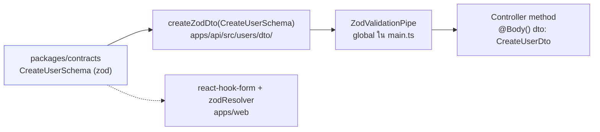
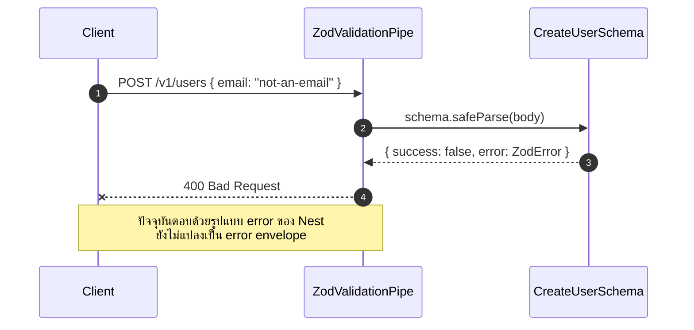

# Validation (zod pipe)

<Status value="implemented" />

`apps/api` ไม่มี validation decorator แบบ `class-validator` เลยสักตัว ทุก request body และ query ถูกตรวจด้วย zod schema เดียวกับที่ `apps/web` และ `apps/api` แชร์กัน ผ่าน `packages/contracts`

## ทำไมไม่ใช้ `class-validator`

NestJS แนะนำ `class-validator` + `class-transformer` เป็นค่าเริ่มต้น แต่ทั้งคู่ผูก validation ไว้กับ class ที่มีแต่ฝั่ง backend ใช้ได้ — ฝั่ง `apps/web` ต้อง validate ฟอร์มด้วย logic คนละชุด แล้วสอง logic ก็ drift กันได้เรื่อย ๆ

zod ตรงข้าม: schema เป็นค่าธรรมดา (`ZodObject`) ที่ทั้งสองฝั่ง import ได้ ไม่ต้องพึ่ง decorator หรือ reflection metadata ดู [Contract-first workflow](/conventions/contract-first) สำหรับเหตุผลระดับสถาปัตยกรรม

## ชั้นการทำงาน



schema ตัวเดียวถูกใช้สามที่พร้อมกัน — validate ฝั่ง server, สร้าง DTO type สำหรับ Swagger, และ validate ฟอร์มฝั่ง client

## นิยาม schema

```ts
// packages/contracts/src/user.schema.ts
import { z } from "zod";

export const CreateUserSchema = z.object({
  email: z.email(),
  displayName: z.string().min(1).max(120),
  password: z.string().min(8).max(72),
});
export type CreateUser = z.infer<typeof CreateUserSchema>;

export const UpdateUserSchema = CreateUserSchema
  .pick({ displayName: true })
  .partial();
export type UpdateUser = z.infer<typeof UpdateUserSchema>;
```

## แปลงเป็น DTO

```ts
// apps/api/src/users/dto/create-user.dto.ts
import { createZodDto } from "nestjs-zod";
import { CreateUserSchema } from "@app-platform/contracts";

export class CreateUserDto extends createZodDto(CreateUserSchema) {}
```

`createZodDto` สร้าง class ที่ใช้เป็น type ของ NestJS ได้ปกติ (เช่นใน `@Body()`) แต่ผูก schema ของ zod ไว้ในตัวเพื่อให้ pipe เอาไปใช้ parse จริง

```ts
@Post()
create(@Body() dto: CreateUserDto) {
  // dto ผ่าน CreateUserSchema.parse() มาแล้ว — type ตรงกับ CreateUser เป๊ะ
  return this.usersService.create(dto);
}
```

## ติดตั้ง pipe แบบ global

```ts
// apps/api/src/main.ts
import { ZodValidationPipe } from "nestjs-zod";

async function bootstrap() {
  const app = await NestFactory.create(AppModule);
  app.useGlobalPipes(new ZodValidationPipe());
  // ...
}
```

ตั้งเป็น global แปลว่าทุก controller ที่ใช้ DTO จาก `createZodDto` ถูก validate อัตโนมัติ ไม่ต้องประกาศ `@UsePipes()` ซ้ำในแต่ละ endpoint

::: tip parse ไม่ใช่แค่ validate
zod ไม่ได้แค่บอกว่า input ผ่านหรือไม่ผ่าน — มันคืนค่าที่ผ่านการแปลงแล้ว (`.transform()`, ค่า default) กลับมา `dto` ที่เข้าไปใน controller จึงเป็นค่าที่ zod ประกอบให้แล้ว ไม่ใช่ raw body ที่ client ส่งมา
:::

## เมื่อ validation ล้มเหลว



รูปแบบ error ที่ควรจะเป็นหลังมี [error envelope](/conventions/errors) คือ array ของ `{ field, code, message }` ต่อหนึ่ง field ที่ผิด — วันนี้ยังเป็นรูปแบบ default ของ `ZodValidationPipe`

## Query param และ pagination

```ts
// packages/contracts/src/pagination.schema.ts
export const PaginationQuerySchema = z.object({
  page: z.coerce.number().int().min(1).default(1),
  limit: z.coerce.number().int().min(1).max(100).default(20),
});
```

### แปลง string เป็นชนิดที่ถูกต้อง <Status value="planned" inline note="ยังไม่มี endpoint ไหนใช้" />

query string เป็น `string` เสมอในระดับ HTTP — `z.coerce.number()` แปลง `"2"` เป็น `2` ก่อนตรวจช่วงค่า endpoint ที่มี list ทั้งหมด (เมื่อถูกสร้าง) ควรใช้ `PaginationQuerySchema` ร่วมกับ `paginatedSchema()` เพื่อให้ response มีรูปแบบ `{ items, total, page, limit }` เดียวกันทุกที่ ดู [ข้อตกลงของ API](/conventions/api-conventions)

::: danger อย่าใช้ `z.any()` เพื่อ "ข้าม" validation ชั่วคราว
`z.any()` ปิด type safety ทั้งสาย — DTO ที่ได้จะเป็น `any` และ TypeScript จะไม่เตือนอะไรเลยตอน service เอาไปใช้ ถ้ายังไม่แน่ใจ schema ให้เขียน `z.unknown()` แล้วค่อย narrow ทีหลัง อย่างน้อย TypeScript จะบังคับให้เช็คก่อนใช้
:::

## เทส schema แยกจาก controller

schema เป็นฟังก์ชันบริสุทธิ์ เทสได้โดยไม่ต้องพึ่ง NestJS test module เลย

```ts
// packages/contracts/src/user.schema.spec.ts
describe("CreateUserSchema", () => {
  it("ปฏิเสธ email ที่ไม่ถูกรูปแบบ", () => {
    const result = CreateUserSchema.safeParse({
      email: "not-an-email",
      displayName: "A",
      password: "password123",
    });
    expect(result.success).toBe(false);
  });

  it("ปฏิเสธรหัสผ่านสั้นกว่า 8 ตัว", () => {
    const result = CreateUserSchema.safeParse({
      email: "a@b.com",
      displayName: "A",
      password: "short",
    });
    expect(result.success).toBe(false);
  });
});
```

การแยกเทส schema ออกจากเทส controller ทำให้เทสเร็วและไม่ต้อง mock `PrismaService` แค่จะเทสว่า "ตัวเลขนี้ถูกปฏิเสธไหม"

::: warning สถานะโค้ดปัจจุบัน
| สเปกเป้าหมาย | โค้ดวันนี้ |
| --- | --- |
| `ZodValidationPipe` แบบ global | มีอยู่จริงใน `main.ts` |
| DTO ทุกตัวมาจาก `createZodDto` | มีอยู่จริง — `create-user.dto.ts`, `login.dto.ts` |
| error ตอบเป็น error envelope | ยังตอบด้วยรูปแบบ default ของ `ZodValidationPipe` — ดู [Error envelope](/conventions/errors) |
| `PaginationQuerySchema` / `paginatedSchema()` ถูกใช้จริง | มี schema ใน contracts แต่ยังไม่มี endpoint ไหนเรียกใช้ |
| เทส schema | ไม่มีไฟล์เทสในโปรเจกต์เลย — [Roadmap](/start/roadmap) หนี้ #8 |
:::
