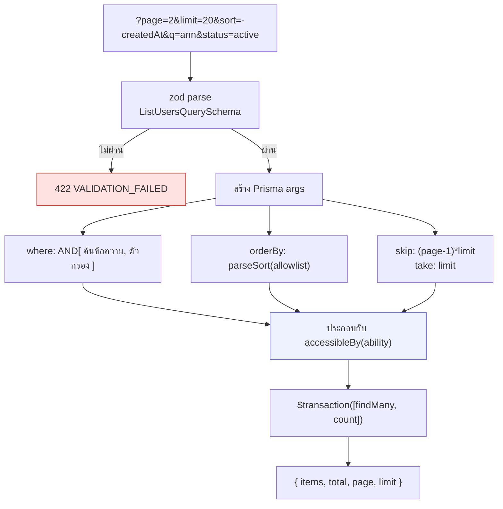

# ข้อตกลงของ API

<Status value="in-progress" />

กฎที่ทุก endpoint ต้องทำตาม เพื่อให้ client เดาพฤติกรรมได้โดยไม่ต้องเปิดเอกสารทีละอัน

## URL และเวอร์ชัน

```
http://api.localhost/v1/users/:id
                     └┬┘ └─┬─┘ └┬┘
                   version │    identifier
                        collection
```

| กฎ | ตัวอย่าง |
| --- | --- |
| ทุก route ขึ้นต้นด้วย `/v1` | `app.setGlobalPrefix("v1")` |
| ชื่อ collection เป็นพหูพจน์ ตัวพิมพ์เล็ก คั่นด้วย `-` | `/v1/users`, `/v1/refresh-tokens` |
| ทรัพยากรย่อยซ้อนได้ไม่เกินหนึ่งชั้น | `/v1/users/:id/roles` |
| การกระทำที่ไม่ใช่ CRUD ใช้กริยาต่อท้าย | `POST /v1/auth/refresh`, `POST /v1/users/:id/deactivate` |
| endpoint ที่ไม่ใช่ธุรกิจ อยู่นอก `/v1` | `/health`, `/docs` |

::: tip เมื่อไหร่ถึงขึ้น `/v2`
ขึ้นเวอร์ชันใหม่เมื่อ **ลบหรือเปลี่ยนความหมาย** ของ field ที่มีอยู่เท่านั้น การเพิ่ม field ใหม่ที่ optional ไม่ใช่ breaking ระหว่างช่วงเปลี่ยนผ่านให้ `/v1` และ `/v2` อยู่ร่วมกัน แล้วประกาศวันเลิกใช้ `/v1` ให้ชัด
:::

## Method และ status code

| Method | ใช้เมื่อ | สำเร็จได้ | idempotent |
| --- | --- | --- | --- |
| `GET` | อ่าน | `200` | ใช่ |
| `POST` | สร้าง หรือสั่งการกระทำ | `201` (สร้าง) · `200` (การกระทำ) | ไม่ |
| `PATCH` | แก้บางส่วน | `200` | ไม่ |
| `PUT` | แทนที่ทั้งก้อน | `200` | ใช่ |
| `DELETE` | ลบ | `204` ไม่มี body | ใช่ |

### Status code ที่ใช้

| Code | ความหมาย | ตัวอย่าง |
| --- | --- | --- |
| `200` | สำเร็จ มี body | `GET /v1/users` |
| `201` | สร้างแล้ว | `POST /v1/users` |
| `204` | สำเร็จ ไม่มี body | `DELETE /v1/users/:id` |
| `400` | request ผิดรูปจนอ่านไม่ได้ | JSON พัง |
| `401` | ยังไม่ได้ยืนยันตัวตน หรือ token หมดอายุ | ไม่มี Bearer token |
| `403` | ยืนยันตัวตนแล้วแต่ไม่มีสิทธิ์ | CASL ปฏิเสธ |
| `404` | ไม่พบ หรือไม่มีสิทธิ์เห็น | ดูหมายเหตุด้านล่าง |
| `409` | ชนกับสถานะปัจจุบัน | อีเมลซ้ำ |
| `422` | รูปถูกแต่ค่าไม่ผ่าน validate | zod ไม่ผ่าน |
| `429` | เรียกถี่เกิน | rate limit หน้า login |
| `500` | บั๊กของเรา | exception ที่ไม่ได้จัดหมวด |

::: tip 403 กับ 404 เลือกยังไง
ถ้าการบอกว่า "มีของชิ้นนี้อยู่" เป็นการรั่วข้อมูลเอง ให้ตอบ `404` เช่นผู้ใช้ทั่วไปเรียกดูโปรไฟล์คนอื่น — ตอบ `404` เพื่อไม่ให้เดาได้ว่ามี id นั้นจริง ส่วน `403` ใช้เมื่อผู้เรียกรู้อยู่แล้วว่าของมีอยู่ แต่ทำไม่ได้ ดู [CASL](/auth/casl)
:::

`401` ทุกครั้งต้องมี header

```
WWW-Authenticate: Bearer realm="api", error="invalid_token"
```

เพื่อให้ฝั่ง client แยกได้ว่า "token หมดอายุ ให้ refresh" กับ "ไม่มีสิทธิ์" คนละเรื่อง

## รูปแบบ response

### ทรัพยากรชิ้นเดียว — คืน object ตรง ๆ

```json
{ "id": "0192…", "email": "a@b.com", "displayName": "Ann", "createdAt": "2026-08-07T09:14:22.481Z" }
```

ไม่ห่อด้วย `{ "data": … }` เพราะ status code บอกอยู่แล้วว่าสำเร็จ และ [error envelope](/conventions/errors) จัดการฝั่งที่พัง — การห่อเพิ่มแค่ทำให้ต้องพิมพ์ `.data` ทุกที่

### รายการ — ใช้ `paginatedSchema()` เสมอ

```json
{ "items": [ … ], "total": 137, "page": 2, "limit": 20 }
```

จาก `packages/contracts/src/common.schema.ts` ที่มีอยู่แล้ว

```ts
export function paginatedSchema<T extends z.ZodTypeAny>(itemSchema: T) {
  return z.object({
    items: z.array(itemSchema),
    total: z.number().int().min(0),
    page: z.number().int().min(1),
    limit: z.number().int().min(1),
  });
}
```

::: danger ห้ามมี endpoint ที่คืน array ดิบ
`GET /v1/users` ที่คืน `[…]` เปล่า ๆ คือระเบิดเวลา — พอข้อมูลโต 200 แถวกลายเป็น 200,000 แถว ถ้าอยากได้ทั้งหมดจริง ๆ ก็ยังต้องผ่าน `paginatedSchema` โดยตั้ง `limit` สูงสุดไว้
:::

## Query parameter

### แบ่งหน้า

`PaginationQuerySchema` ที่มีอยู่แล้ว

```ts
export const PaginationQuerySchema = z.object({
  page: z.coerce.number().int().min(1).default(1),
  limit: z.coerce.number().int().min(1).max(100).default(20),
});
```

`z.coerce` จำเป็นเพราะ query string เป็น string เสมอ และ `.max(100)` คือเพดานที่บังคับไว้ตายตัว

### เรียงลำดับ

`?sort=<field>` เรียงขึ้น, `?sort=-<field>` เรียงลง หลายชั้นคั่นด้วย comma

```
GET /v1/users?sort=-createdAt,displayName
```

```ts
export const SortQuerySchema = z.object({
  sort: z.string().optional(),
});

/** "-createdAt,displayName" -> [{createdAt:"desc"},{displayName:"asc"}] */
export function parseSort(sort: string | undefined, allowed: readonly string[]) {
  if (!sort) return undefined;
  return sort
    .split(",")
    .map((token) => {
      const desc = token.startsWith("-");
      const field = desc ? token.slice(1) : token;
      // allowlist เท่านั้น — ห้ามเอาชื่อ field จากผู้ใช้ยัดเข้า orderBy ตรง ๆ
      if (!allowed.includes(field)) throw Errors.invalidSort(field);
      return { [field]: desc ? "desc" : "asc" } as const;
    });
}
```

### กรอง

| รูปแบบ | ความหมาย | ตัวอย่าง |
| --- | --- | --- |
| `?<field>=<value>` | เท่ากับ | `?status=active` |
| `?<field>=<a>,<b>` | อยู่ในชุด | `?roleId=1,2` |
| `?q=<text>` | ค้นข้อความ (field ไหนขึ้นกับ endpoint) | `?q=สมชาย` |
| `?<field>From` / `?<field>To` | ช่วง | `?createdAtFrom=2026-01-01` |



::: danger ตัวกรองต้องประกอบกับสิทธิ์เสมอ
`where` ที่ได้จาก query ของผู้ใช้ ต้อง `AND` กับ `accessibleBy(ability)` ของ CASL ทุกครั้ง ถ้าลืม ผู้ใช้จะกรองเอาข้อมูลที่ไม่มีสิทธิ์เห็นออกมาได้ — ดู [CASL](/auth/casl)
:::

โครงเต็มของ endpoint แบบรายการ

```ts
export const ListUsersQuerySchema = PaginationQuerySchema.extend({
  sort: z.string().optional(),
  q: z.string().trim().min(1).max(120).optional(),
  status: z.enum(["active", "inactive"]).optional(),
});

async list(query: ListUsersQuery, ability: AppAbility) {
  const where: Prisma.UserWhereInput = {
    AND: [
      accessibleBy(ability, "read").User,
      query.q ? { OR: [{ email: { contains: query.q, mode: "insensitive" } },
                       { displayName: { contains: query.q, mode: "insensitive" } }] } : {},
      query.status ? { status: query.status } : {},
    ],
  };

  const [items, total] = await this.prisma.$transaction([
    this.prisma.user.findMany({
      where,
      orderBy: parseSort(query.sort, ["createdAt", "displayName", "email"]) ?? { createdAt: "desc" },
      skip: (query.page - 1) * query.limit,
      take: query.limit,
    }),
    this.prisma.user.count({ where }),
  ]);

  return { items, total, page: query.page, limit: query.limit };
}
```

`$transaction` ทำให้ `items` กับ `total` มาจาก snapshot เดียวกัน ไม่งั้นถ้ามีคนแทรกข้อมูลระหว่างสอง query ตัวเลขจะเพี้ยน

## รูปแบบข้อมูล

| ชนิด | รูปแบบ | ตัวอย่าง |
| --- | --- | --- |
| ID | UUID เป็น string | `"0192f8a1-4c2e-7b3d-9f01-2a4c6e8b0d13"` |
| วันเวลา | ISO-8601 UTC พร้อม `Z` | `"2026-08-07T09:14:22.481Z"` |
| วันที่ล้วน | `YYYY-MM-DD` | `"2026-08-07"` |
| จำนวนเงิน | integer หน่วยย่อยที่สุด + รหัสสกุลเงิน | `{ "amount": 12550, "currency": "THB" }` |
| enum | UPPER_SNAKE ในสัญญา | `"ACTIVE"` |
| ไม่มีค่า | `null` ไม่ใช่การไม่ส่ง field | `"deletedAt": null` |

::: danger อย่าส่งจำนวนเงินเป็น float
`0.1 + 0.2 !== 0.3` ในทุกภาษาที่ใช้ IEEE-754 เก็บและส่งเป็น integer หน่วยสตางค์ แล้วค่อยจัดรูปตอนแสดงผล
:::

## Header ที่ควรรู้

| Header | ทิศทาง | ทำอะไร |
| --- | --- | --- |
| `authorization: Bearer <jwt>` | ขาเข้า | access token ดู [JWT](/auth/tokens) |
| `x-request-id` | ทั้งสองทาง | trace id ดู [Trace ID](/platform/trace-id) |
| `accept-language` | ขาเข้า | ภาษาของข้อความที่ API สร้าง (`th`, `en`) |
| `idempotency-key` | ขาเข้า | ใช้กับ `POST` ที่ทำซ้ำไม่ได้ (เช่น ชำระเงิน) |
| `www-authenticate` | ขาออก | มาพร้อม `401` เสมอ |

## Idempotency

`POST` ที่มีผลข้างเคียงร้ายแรงควรรับ `idempotency-key`

```
POST /v1/payments
idempotency-key: 0192f8a1-4c2e-7b3d-9f01-2a4c6e8b0d13
```

server เก็บคู่ `(key, hash ของ body) -> response` ไว้ 24 ชั่วโมง เจอ key เดิม body เดิม → คืน response เดิมโดยไม่ทำงานซ้ำ; เจอ key เดิม body ต่าง → `409` ที่เก็บที่เหมาะสมคือ Redis ซึ่งยกขึ้นมาแล้วแต่ยังไม่มีใครใช้

## เช็กลิสต์ก่อนเพิ่ม endpoint ใหม่

- [ ] schema ของ request/response อยู่ใน `packages/contracts`
- [ ] route อยู่ใต้ `/v1` และชื่อเป็นพหูพจน์
- [ ] status code ตรงตามตารางด้านบน
- [ ] endpoint แบบรายการใช้ `PaginationQuerySchema` + `paginatedSchema`
- [ ] มี guard ของ CASL และ `accessibleBy` ถูกประกอบเข้ากับ `where`
- [ ] มี `@ApiTags`, `@ApiBearerAuth` และ `@ApiErrorResponses()`
- [ ] error ที่โยนอยู่ใน [catalog](/reference/error-codes)
- [ ] อัปเดตเอกสารหน้าที่เกี่ยวข้อง

::: warning สถานะโค้ดปัจจุบัน
| สเปกเป้าหมาย | โค้ดวันนี้ |
| --- | --- |
| ทุก route อยู่ใต้ `/v1` | ไม่มี `setGlobalPrefix` — route คือ `/auth/login`, `/users` |
| endpoint แบบรายการใช้ pagination | ไม่มี endpoint แบบรายการเลย `paginatedSchema` ไม่มีใครใช้ |
| มี sort/filter grammar | ยังไม่มี |
| `POST /users` ต้องมี guard | **เป็น public** ใครก็สร้างบัญชีได้ |
| `401` มี `WWW-Authenticate` | ยังไม่มี |
| รองรับ `accept-language` | ยังไม่มี — ข้อความเป็นอังกฤษล้วน |
:::
