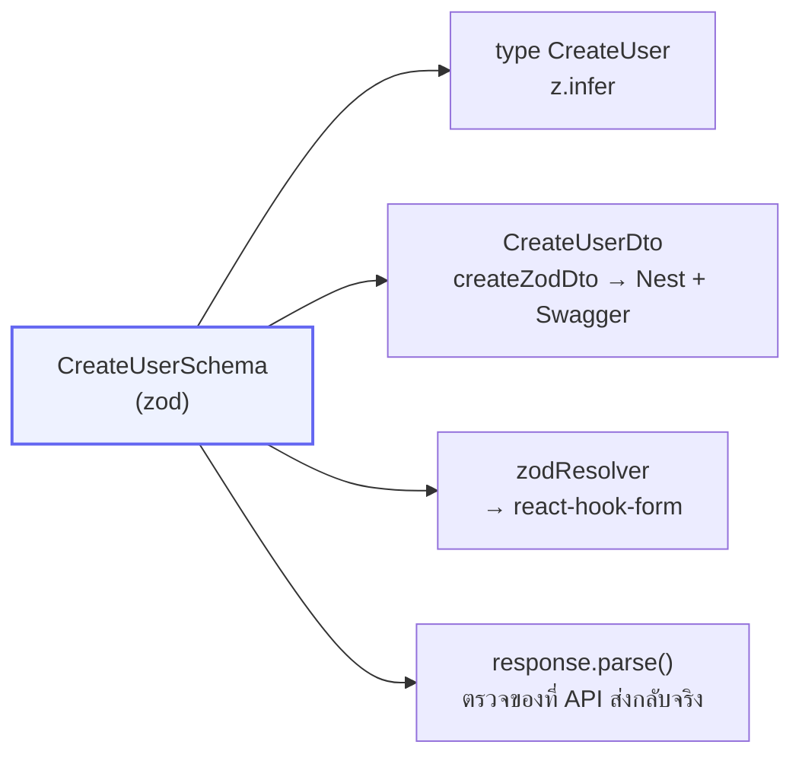
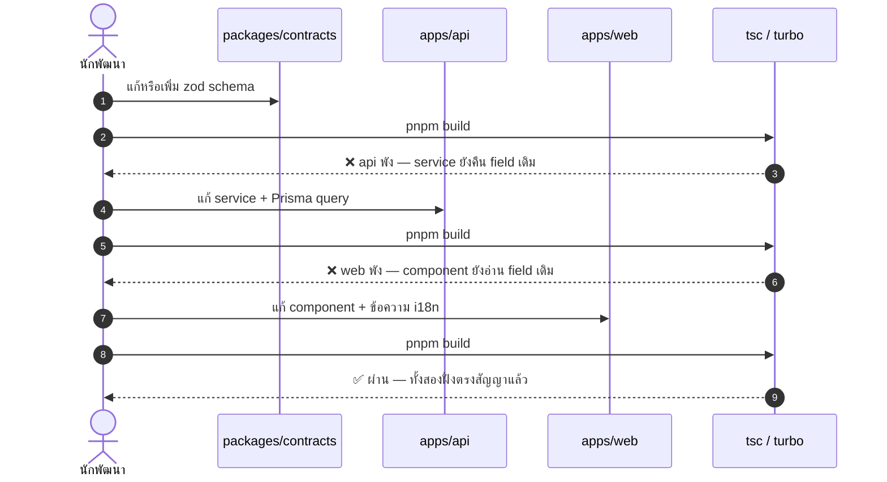

# Contract-first workflow

<Status value="implemented" />

กฎข้อเดียวของหน้านี้:

> **รูปร่างของ request/response ทุกอันถูกนิยามเป็น zod schema ใน `packages/contracts` เพียงที่เดียว**

ที่เหลือเป็นผลพวงของกฎข้อนี้

## ทำไม

ถ้าไม่มีสัญญากลาง รูปร่างข้อมูลจะถูกเขียนซ้ำสามที่ — DTO ฝั่ง Nest, type ฝั่ง React, กฎ validate ของฟอร์ม สามที่นี้จะเพี้ยนกันเสมอ และเพี้ยนแบบเงียบ ๆ จนไปพังตอน runtime

พอมีสัญญากลางเป็น zod ได้สี่อย่างจากนิยามเดียว



แก้ schema ที่เดียว → TypeScript พังทั้งสองแอปทันทีถ้ามีที่ไหนตามไม่ทัน นี่คือประเด็นทั้งหมด **ให้มันพังตอน build ไม่ใช่ตอน production**

## กายวิภาคของ schema

`packages/contracts/src/user.schema.ts` ตามจริง

```ts
import { z } from "zod";

export const CreateUserSchema = z.object({
  email: z.email(),
  displayName: z.string().min(1).max(120),
  password: z.string().min(8).max(72),
});
export type CreateUser = z.infer<typeof CreateUserSchema>;
```

กฎการตั้งชื่อ

| สิ่งที่ทำ | รูปแบบ | ตัวอย่าง |
| --- | --- | --- |
| schema | `<ชื่อ>Schema` (PascalCase) | `CreateUserSchema` |
| type ที่ infer มา | `<ชื่อ>` เท่ากันแต่ไม่มีคำว่า Schema | `type CreateUser` |
| schema ของ query | `<ชื่อ>QuerySchema` | `PaginationQuerySchema` |
| ฟังก์ชันสร้าง schema | camelCase | `paginatedSchema()` |
| ชื่อไฟล์ | `<domain>.schema.ts` | `user.schema.ts` |

::: tip `max(72)` ของรหัสผ่านไม่ใช่ตัวเลขมั่ว
bcrypt ตัดทิ้งทุกอย่างหลังไบต์ที่ 72 ถ้าไม่ล็อกไว้ รหัสผ่านยาว ๆ ที่ต่างกันจะกลายเป็น hash เดียวกัน — จำกัดที่ contract แล้วทั้งสองฝั่งได้กฎเดียวกันฟรี
:::

### ประกอบ schema ต่อ ๆ กันแทนที่จะเขียนซ้ำ

```ts
// user.schema.ts — UpdateUserSchema งอกจาก CreateUserSchema
export const UpdateUserSchema = CreateUserSchema.pick({ displayName: true }).partial();

// common.schema.ts — ห่อ schema อะไรก็ได้ให้เป็นผลลัพธ์แบบแบ่งหน้า
export function paginatedSchema<T extends z.ZodTypeAny>(itemSchema: T) {
  return z.object({
    items: z.array(itemSchema),
    total: z.number().int().min(0),
    page: z.number().int().min(1),
    limit: z.number().int().min(1),
  });
}
```

ใช้ `.pick()` / `.omit()` / `.partial()` / `.extend()` เสมอ อย่าก๊อป field ไปวางใหม่

## ฝั่ง API ใช้ยังไง

`nestjs-zod` แปลง schema เป็น DTO ที่ทั้ง Nest validate ได้และ Swagger อ่าน type ได้ — `apps/api/src/users/dto/create-user.dto.ts`

```ts
import { createZodDto } from "nestjs-zod";
import { CreateUserSchema } from "@app-platform/contracts";

export class CreateUserDto extends createZodDto(CreateUserSchema) {}
```

controller ใช้เป็น DTO ปกติ

```ts
@Post()
create(@Body() body: CreateUserDto) {
  return this.usersService.create(body);
}
```

::: tip schema ที่เป็น union (เช่น `TokenRequestSchema` ของ `/auth/token`) extend เป็น DTO แบบนี้ไม่ได้ตรง ๆ
`createZodDto` ต้องการ schema ที่ infer ออกมาเป็น object type เดียว ถ้า schema เป็น `z.discriminatedUnion(...)` TypeScript จะ error ตอน `class Xxx extends createZodDto(UnionSchema) {}` เพราะ base class มี instance type เป็น union ไม่ใช่ object เดี่ยว ทางแก้คือเขียนเป็น `z.object()` ตัวเดียวที่ field ที่ไม่ใช้ร่วมกันเป็น `.optional()` แล้วบังคับด้วย `.refine()` แทน — ดูตัวอย่างจริงที่ `packages/contracts/src/auth.schema.ts` (`TokenRequestSchema`) และ [Contract schema catalog](/reference/contracts)
:::

`ZodValidationPipe` ที่ลงทะเบียนแบบ global ใน `main.ts` เป็นคนตรวจ ไม่ต้องเรียก `.parse()` เองใน controller

```ts
app.useGlobalPipes(new ZodValidationPipe());
```

ตรงนี้คือของที่มีอยู่แล้วและทำงานถูกต้อง <Status value="implemented" inline />

## ฝั่ง Web ใช้ยังไง

<Status value="implemented" inline /> (`apps/web/src/lib/api-client.ts` export ชื่อ `request()` ไม่ใช่ `apiFetch` ตามตัวอย่างด้านล่าง — ฟังก์ชันเดียวกัน)

### validate ฟอร์ม

```ts
"use client";
import { useForm } from "react-hook-form";
import { zodResolver } from "@hookform/resolvers/zod";
import { CreateUserSchema, type CreateUser } from "@app-platform/contracts";

const form = useForm<CreateUser>({
  resolver: zodResolver(CreateUserSchema),
  defaultValues: { email: "", displayName: "", password: "" },
});
```

ฟอร์มบังคับกฎเดียวกับที่ API บังคับ โดยไม่ต้องเขียนกฎซ้ำ

### ตรวจ response ด้วย

จุดที่มักถูกมองข้าม — API อาจส่งอะไรกลับมาก็ได้ TypeScript ไม่ได้ตรวจตอน runtime ให้ parse ที่ขอบระบบ

```ts
// apps/web/src/lib/api-client.ts
import { z } from "zod";

export async function apiFetch<T extends z.ZodTypeAny>(
  path: string,
  schema: T,
  init?: RequestInit,
): Promise<z.infer<T>> {
  const res = await fetch(`${process.env.NEXT_PUBLIC_API_URL}${path}`, {
    ...init,
    headers: { "content-type": "application/json", ...init?.headers },
    credentials: "include",
  });

  const body = await res.json().catch(() => null);
  if (!res.ok) throw toApiError(body, res.status); // ดู /conventions/errors

  // ถ้า API เพี้ยนจากสัญญา จะพังตรงนี้ ไม่ใช่ไปพังลึก ๆ ใน component
  return schema.parse(body);
}
```

ใช้กับ TanStack Query

```ts
import { paginatedSchema, UserSchema } from "@app-platform/contracts";

const UserPageSchema = paginatedSchema(UserSchema);

useQuery({
  queryKey: ["users", { page }],
  queryFn: () => apiFetch(`/v1/users?page=${page}`, UserPageSchema),
});
```

`queryFn` ได้ type แน่นอนโดยไม่ต้องประกาศ generic เอง เพราะ `z.infer` ทำให้แล้ว

## ขั้นตอนเวลาแก้สัญญา



compiler ไล่ให้เองว่าต้องแก้ตรงไหนบ้าง จบเมื่อไม่มีอะไรพัง

### เช็กลิสต์ตอนแก้ contract

- [ ] แก้ schema ใน `packages/contracts/src/<domain>.schema.ts`
- [ ] export ผ่าน `src/index.ts` แล้วถ้าเป็นไฟล์ใหม่
- [ ] ปรับ service ฝั่ง API ให้คืนของตรงรูป
- [ ] ถ้ากระทบ DB → แก้ `schema.prisma` แล้ว `prisma:migrate`
- [ ] ปรับฝั่ง web ที่ใช้ schema นั้น
- [ ] ถ้ามีข้อความใหม่ → เติม key ใน `apps/web/messages/{th,en}.json` **ทั้งสองไฟล์**
- [ ] `pnpm build` ผ่านทั้ง repo
- [ ] ถ้าสัญญาเปลี่ยนแบบ breaking → อัปเดต [ข้อตกลงของ API](/conventions/api-conventions) เรื่องเวอร์ชัน

## เปลี่ยนสัญญาแบบ breaking

`packages/contracts` ไม่มีขั้นตอน build และถูกใช้แบบ `workspace:*` — ทั้งสองแอปเห็นเวอร์ชันเดียวกันเสมอ ในระบบเดียวจึงไม่มีปัญหาเรื่องเวอร์ชัน แต่ **client ภายนอกมี**

| ชนิดการเปลี่ยน | ทำยังไง |
| --- | --- |
| เพิ่ม field ที่ optional | แก้ได้เลย ไม่ breaking |
| เพิ่ม field ที่บังคับใน response | ไม่ breaking กับ client ที่ parse หลวม แต่ต้องอัปเดต `paginatedSchema` ที่ห่อมันอยู่ |
| เพิ่ม field ที่บังคับใน request | **breaking** — ต้องมีค่า default หรือขึ้นเวอร์ชันใหม่ |
| ลบหรือเปลี่ยนชื่อ field | **breaking** — ทำแบบ expand/contract: เพิ่มตัวใหม่ → ย้ายผู้ใช้ → ค่อยลบตัวเก่า |
| เปลี่ยนชนิดข้อมูล | **breaking** — เหมือนข้างบน อย่าแก้ในที่เดิม |

## ข้อจำกัดของแพ็กเกจ

`packages/contracts/package.json` ชี้ `main` ไปที่ `./src/index.ts` ตรง ๆ ไม่มีขั้นตอน compile

```json
{
  "main": "./src/index.ts",
  "types": "./src/index.ts",
  "exports": { ".": "./src/index.ts" }
}
```

ผลที่ตามมา

- `apps/web` ต้องมี `transpilePackages: ["@app-platform/contracts"]` ใน `next.config.ts` (มีแล้ว)
- `apps/api` compile ผ่าน `nest build` ซึ่งดึง source ของ workspace เข้ามาให้
- ห้ามใส่ของที่รันได้เฉพาะ Node หรือเฉพาะเบราว์เซอร์ใน contracts เด็ดขาด — ต้องรันได้ทั้งสองที่ **มีได้แค่ zod schema กับ type ล้วน ๆ**

::: tip signup / reset password schema ยังไม่มี — ตั้งใจ
`packages/contracts` ยังไม่มี schema ของ signup กับ reset password เพราะฟีเจอร์นั้นเองยังไม่ถูก implement — เป็นขอบเขตของ [สมัครสมาชิก](/auth/signup) และ [ลืมรหัสผ่าน](/auth/forgot-password) (ยัง planned แยกต่างหาก) ไม่ใช่ช่องว่างของ pattern contract-first เอง — `UserSchema`, `CreateUserSchema`, `UpdateUserSchema`, `paginatedSchema`, `AbilityRulesSchema` ทุกตัวมีคนใช้จริงแล้วทั้งสองฝั่ง
:::
