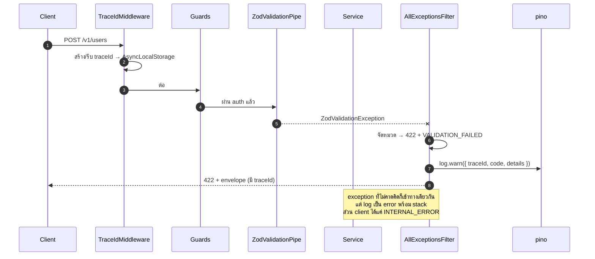
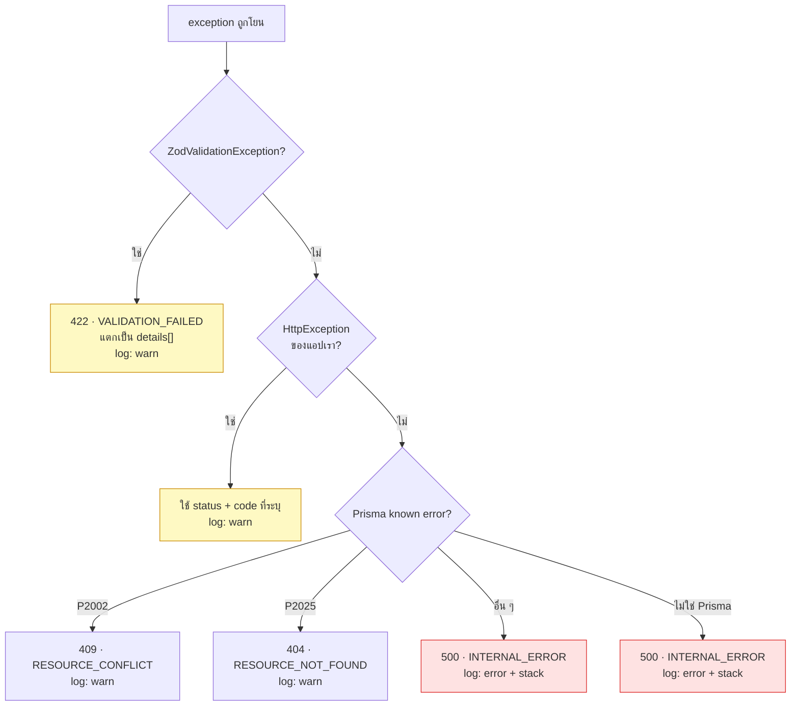

# Error envelope

<Status value="planned" />

> **error ทุกตัวที่ออกจาก API มีหน้าตาเหมือนกันหมด ไม่มีข้อยกเว้น**

ถ้ารูปแบบ error เดาไม่ได้ ฝั่ง client จะเต็มไปด้วย `err?.response?.data?.message ?? err?.message ?? "อะไรสักอย่างพัง"` การกำหนดรูปแบบเดียวทำให้เขียน handler ครั้งเดียวใช้ได้ทั้งระบบ

## สัญญา

```ts
// packages/contracts/src/error.schema.ts
import { z } from "zod";

export const ErrorDetailSchema = z.object({
  /** path ของ field แบบจุด เช่น "email" หรือ "items.0.qty" — null ถ้าไม่ผูกกับ field ไหน */
  field: z.string().nullable(),
  /** key ของข้อความสำหรับ i18n เช่น "validation.email.invalid" */
  code: z.string(),
  /** ข้อความภาษาอังกฤษไว้ debug — ห้ามเอาไปโชว์ผู้ใช้ตรง ๆ */
  message: z.string(),
});

export const ErrorEnvelopeSchema = z.object({
  /** รหัสเสถียรจาก catalog — สิ่งที่ client ควรใช้ตัดสินใจ */
  code: z.string(),
  /** สรุปภาษาอังกฤษไว้ debug */
  message: z.string(),
  /** id สำหรับตามรอย log ทั้งระบบ */
  traceId: z.string(),
  /** เวลาที่เกิด รูปแบบ ISO-8601 UTC */
  timestamp: z.iso.datetime(),
  /** path ที่ถูกเรียก เช่น "POST /v1/users" */
  path: z.string(),
  /** error ระดับ field — ว่างถ้าไม่ใช่ error จากการ validate */
  details: z.array(ErrorDetailSchema).default([]),
});
export type ErrorEnvelope = z.infer<typeof ErrorEnvelopeSchema>;
```

ตัวอย่างจริง

```json
{
  "code": "VALIDATION_FAILED",
  "message": "Request body failed validation",
  "traceId": "0192f8a1-4c2e-7b3d-9f01-2a4c6e8b0d13",
  "timestamp": "2026-08-07T09:14:22.481Z",
  "path": "POST /v1/users",
  "details": [
    { "field": "email", "code": "validation.email.invalid", "message": "Invalid email" },
    { "field": "password", "code": "validation.string.min", "message": "Must be at least 8 characters" }
  ]
}
```

### แต่ละ field ทำหน้าที่อะไร

| Field | ใครใช้ | กฎ |
| --- | --- | --- |
| `code` | client ตัดสินใจ (แสดงอะไร ไปไหนต่อ) | ต้องอยู่ใน [catalog](/reference/error-codes) และ **ห้ามเปลี่ยนความหมาย** — ถือเป็นส่วนหนึ่งของ API |
| `message` | นักพัฒนา | อังกฤษ ไม่แปล ไม่เอาไปโชว์ผู้ใช้ |
| `traceId` | ทั้งผู้ใช้และคนดูแลระบบ | โชว์บน UI ให้ก๊อปได้ ใช้ค้น log ดู [Trace ID](/platform/trace-id) |
| `timestamp` | คนดูแลระบบ | ISO-8601 UTC เสมอ |
| `path` | คนดูแลระบบ | `"<METHOD> <route>"` ใช้ route pattern ไม่ใช่ URL ที่มีค่าจริง (กัน id หลุดเข้า log) |
| `details` | client ผูก error กับช่องกรอก | ว่างเสมอถ้าไม่ใช่ error จาก validate |

::: danger สิ่งที่ห้ามอยู่ใน envelope
ไม่มี stack trace ไม่มีชื่อ table ไม่มี SQL ไม่มีชื่อไฟล์ ไม่มีข้อความจาก exception ดิบของ Prisma ของพวกนี้อยู่ใน log ฝั่ง server ผูกกับ `traceId` เดียวกัน แต่ **ห้ามส่งออกไปหา client**
:::

## เกิดขึ้นได้ยังไง



## การจัดหมวด



หลักที่ห้ามฝ่าฝืน: **error ที่ไม่ได้จัดหมวดไว้ ต้องกลายเป็น `500 INTERNAL_ERROR` เท่านั้น** ห้ามให้ข้อความจากภายในหลุดออกไปโดยบังเอิญ

## จะ implement ยังไง

### exception ของแอป

```ts
// apps/api/src/common/errors/app.exception.ts
import { HttpException, HttpStatus } from "@nestjs/common";
import type { ErrorDetail } from "@app-platform/contracts";

export class AppException extends HttpException {
  constructor(
    readonly code: string,
    message: string,
    status: HttpStatus,
    readonly details: ErrorDetail[] = [],
  ) {
    super(message, status);
  }
}

// helper สั้น ๆ ที่ code ผูกกับ status ตายตัว ไม่ต้องจำ
export const Errors = {
  invalidCredentials: () =>
    new AppException("AUTH_INVALID_CREDENTIALS", "Invalid credentials", HttpStatus.UNAUTHORIZED),
  emailTaken: () =>
    new AppException("USER_EMAIL_TAKEN", "Email already registered", HttpStatus.CONFLICT),
  userNotFound: () =>
    new AppException("USER_NOT_FOUND", "User not found", HttpStatus.NOT_FOUND),
  forbidden: (action: string, subject: string) =>
    new AppException("AUTHZ_FORBIDDEN", `Not allowed to ${action} ${subject}`, HttpStatus.FORBIDDEN),
};
```

ใน service เรียกแบบนี้ ไม่ต้องพิมพ์ code ตรง ๆ

```ts
if (!user) throw Errors.invalidCredentials();
```

### filter ที่จับทุกอย่าง

```ts
// apps/api/src/common/filters/all-exceptions.filter.ts
import { ArgumentsHost, Catch, ExceptionFilter, HttpException, HttpStatus } from "@nestjs/common";
import { Prisma } from "@prisma/client";
import { ZodValidationException } from "nestjs-zod";
import { PinoLogger } from "nestjs-pino";
import type { Request, Response } from "express";
import type { ErrorEnvelope } from "@app-platform/contracts";
import { AppException } from "../errors/app.exception";
import { getTraceId } from "../trace/trace-context";

@Catch()
export class AllExceptionsFilter implements ExceptionFilter {
  constructor(private readonly logger: PinoLogger) {}

  catch(exception: unknown, host: ArgumentsHost) {
    const ctx = host.switchToHttp();
    const req = ctx.getRequest<Request>();
    const res = ctx.getResponse<Response>();

    const { status, code, message, details } = classify(exception);

    const envelope: ErrorEnvelope = {
      code,
      message,
      traceId: getTraceId(),
      timestamp: new Date().toISOString(),
      // ใช้ route pattern ไม่ใช่ req.url เพื่อไม่ให้ id จริงหลุดเข้า log
      path: `${req.method} ${req.route?.path ?? req.path}`,
      details,
    };

    // 5xx = ความผิดของเรา → error + stack. 4xx = ผู้เรียกส่งมาผิด → warn เฉย ๆ
    if (status >= 500) {
      this.logger.error({ err: exception, ...envelope }, "unhandled exception");
    } else {
      this.logger.warn(envelope, "request failed");
    }

    res.status(status).json(envelope);
  }
}

function classify(e: unknown) {
  if (e instanceof ZodValidationException) {
    return {
      status: HttpStatus.UNPROCESSABLE_ENTITY,
      code: "VALIDATION_FAILED",
      message: "Request failed validation",
      details: e.getZodError().issues.map((i) => ({
        field: i.path.join(".") || null,
        code: `validation.${i.code}`,
        message: i.message,
      })),
    };
  }

  if (e instanceof AppException) {
    return { status: e.getStatus(), code: e.code, message: e.message, details: e.details };
  }

  if (e instanceof Prisma.PrismaClientKnownRequestError) {
    if (e.code === "P2002")
      return { status: HttpStatus.CONFLICT, code: "RESOURCE_CONFLICT", message: "Resource already exists", details: [] };
    if (e.code === "P2025")
      return { status: HttpStatus.NOT_FOUND, code: "RESOURCE_NOT_FOUND", message: "Resource not found", details: [] };
  }

  if (e instanceof HttpException) {
    // HttpException ที่ Nest โยนเอง (404 ของ router, 401 ของ guard) — normalize ให้เข้ารูป
    return { status: e.getStatus(), code: httpStatusToCode(e.getStatus()), message: e.message, details: [] };
  }

  // ที่เหลือทั้งหมดเป็นบั๊กของเรา ห้ามให้รายละเอียดหลุดออกไป
  return {
    status: HttpStatus.INTERNAL_SERVER_ERROR,
    code: "INTERNAL_ERROR",
    message: "Internal server error",
    details: [],
  };
}
```

ลงทะเบียนแบบ global ใน `app.module.ts` (ไม่ใช่ `useGlobalFilters` ใน `main.ts` เพราะแบบนี้ filter จะ inject dependency ได้)

```ts
providers: [{ provide: APP_FILTER, useClass: AllExceptionsFilter }],
```

### บอก Swagger ด้วย

ทุก endpoint ต้อง document error envelope ไว้ ไม่งั้น Swagger จะโกหกว่าไม่มีทางพลาด

```ts
// apps/api/src/common/decorators/api-error-responses.decorator.ts
export const ApiErrorResponses = () =>
  applyDecorators(
    ApiExtraModels(ErrorEnvelopeDto),
    ApiResponse({ status: 422, description: "Validation failed", type: ErrorEnvelopeDto }),
    ApiResponse({ status: 401, description: "Unauthenticated", type: ErrorEnvelopeDto }),
    ApiResponse({ status: 403, description: "Forbidden", type: ErrorEnvelopeDto }),
    ApiResponse({ status: 500, description: "Internal error", type: ErrorEnvelopeDto }),
  );
```

## ฝั่ง client ใช้ยังไง

### แปลง response ให้เป็น error object

```ts
// apps/web/src/lib/api-error.ts
import { ErrorEnvelopeSchema, type ErrorEnvelope } from "@app-platform/contracts";

export class ApiError extends Error {
  constructor(readonly envelope: ErrorEnvelope, readonly status: number) {
    super(envelope.message);
    this.name = "ApiError";
  }
  get code() { return this.envelope.code; }
  get traceId() { return this.envelope.traceId; }
  /** map field -> ข้อความ ใช้ยัดกลับเข้า react-hook-form */
  get fieldErrors(): Record<string, string> {
    return Object.fromEntries(
      this.envelope.details.filter((d) => d.field).map((d) => [d.field!, d.code]),
    );
  }
}

export function toApiError(body: unknown, status: number): ApiError {
  const parsed = ErrorEnvelopeSchema.safeParse(body);
  if (parsed.success) return new ApiError(parsed.data, status);

  // API พังจนตอบไม่เป็นรูป (หรือ proxy ตอบแทน) — สร้าง envelope ปลอมให้ handler ทำงานต่อได้
  return new ApiError(
    {
      code: "NETWORK_ERROR",
      message: "Unexpected response",
      traceId: "unknown",
      timestamp: new Date().toISOString(),
      path: "",
      details: [],
    },
    status,
  );
}
```

### แสดงต่อผู้ใช้

`code` แปลงเป็นข้อความในภาษาผู้ใช้ ส่วน `message` ไม่เอาไปโชว์

```ts
// apps/web/messages/th.json
{
  "errors": {
    "AUTH_INVALID_CREDENTIALS": "อีเมลหรือรหัสผ่านไม่ถูกต้อง",
    "USER_EMAIL_TAKEN": "อีเมลนี้ถูกใช้แล้ว",
    "AUTHZ_FORBIDDEN": "คุณไม่มีสิทธิ์ทำรายการนี้",
    "VALIDATION_FAILED": "ข้อมูลที่กรอกไม่ถูกต้อง",
    "INTERNAL_ERROR": "ระบบขัดข้อง กรุณาลองใหม่",
    "NETWORK_ERROR": "เชื่อมต่อไม่ได้ กรุณาตรวจสอบอินเทอร์เน็ต",
    "fallback": "เกิดข้อผิดพลาดที่ไม่คาดคิด"
  }
}
```

```ts
const t = useTranslations("errors");
const label = t.has(error.code) ? t(error.code) : t("fallback");
```

### ผูก error กลับเข้าช่องกรอก

```ts
onError(error) {
  if (!(error instanceof ApiError)) return;
  for (const [field, codeKey] of Object.entries(error.fieldErrors)) {
    form.setError(field as keyof Login, { message: tValidation(codeKey) });
  }
  if (Object.keys(error.fieldErrors).length === 0) {
    toast.error(t(error.code), { description: `Trace ID: ${error.traceId}` });
  }
}
```

### ให้ trace id ก๊อปได้เสมอ

ทุกครั้งที่แสดง error ระดับ 5xx ต้องโชว์ trace id พร้อมปุ่มก๊อป

```tsx
<Alert variant="destructive">
  <AlertTitle>{t(error.code)}</AlertTitle>
  <AlertDescription>
    <button onClick={() => navigator.clipboard.writeText(error.traceId)}>
      Trace ID: <code>{error.traceId}</code> — คลิกเพื่อคัดลอก
    </button>
  </AlertDescription>
</Alert>
```

นี่คือสิ่งที่ทำให้ผู้ใช้แจ้งปัญหาแล้วเราหา log เจอทันที ดู [Trace ID](/platform/trace-id)

::: warning สถานะโค้ดปัจจุบัน
| สเปกเป้าหมาย | โค้ดวันนี้ |
| --- | --- |
| `AllExceptionsFilter` แบบ global | ไม่มี filter เลย — Nest ตอบรูปแบบ default `{statusCode, message, error}` |
| `ErrorEnvelopeSchema` ใน contracts | ยังไม่มีไฟล์ `error.schema.ts` |
| ทุก error มี `traceId` | ยังไม่มี trace id ในระบบ |
| Prisma error ถูก map | `users.service.ts` ดัก duplicate เองแล้วโยน `ConflictException` ของ Nest |
| ข้อความ error ถูกแปล | ไม่มี namespace `errors` ใน `messages/{th,en}.json` |
:::
