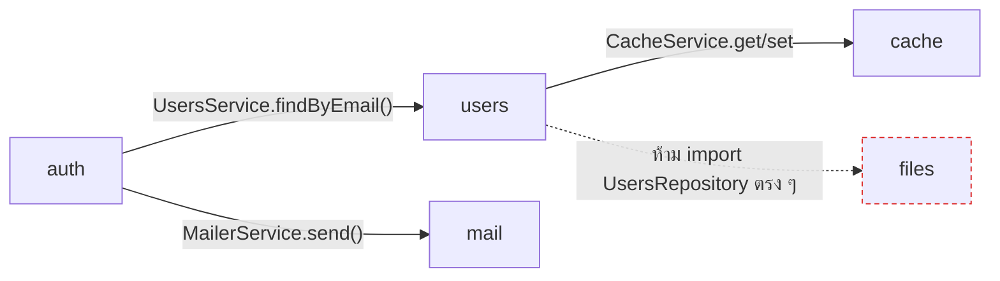
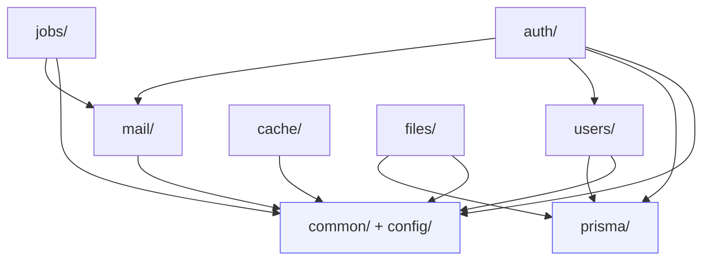

# โครงสร้างโฟลเดอร์ · api

<Status value="implemented" />

[ทัวร์โครงสร้าง repo](/start/repo-tour) ให้ภาพกว้างของทั้ง monorepo หน้านี้ลงรายละเอียดเฉพาะ `apps/api/src` — โครงสร้างที่ควรจะเป็นเมื่อโมดูลตามสเปกถูก implement ครบ

## ผังเป้าหมาย

```text
apps/api/src/
├── main.ts                  bootstrap: pino, ZodValidationPipe, CORS, Swagger
├── app.module.ts             ประกอบทุกโมดูล + ConfigModule + LoggerModule
├── health.controller.ts      GET /health — อยู่นอกโมดูลเพราะไม่มี domain
│
├── common/                   ของที่ทุกโมดูลใช้ร่วมกัน ไม่ผูกกับ domain ไหน
│   ├── filters/               global exception filter → error envelope
│   ├── interceptors/          trace id, response shaping
│   ├── decorators/             @CurrentUser(), @Public()
│   └── client-errors/          POST /client-errors — รับ error report จากเว็บ
│
├── config/                   env schema + ConfigModule setup
│
├── prisma/                   PrismaModule (@Global) + PrismaService
├── redis/                     RedisModule (@Global) — วันนี้ใช้แค่ readiness check
├── auth/                     login, refresh, JwtStrategy, JwtAuthGuard, ability
├── users/                    create, find, update, list
├── mail/                     MailerService + template renderer — ดู /backend/email
├── cache/                     cache-aside helper บน RedisModule — ดู /backend/caching
├── jobs/                      BullMQ queue/worker registration — ดู /backend/jobs
└── files/                     upload, presigned URL — ดู /backend/file-storage
```

โฟลเดอร์ที่มีอยู่จริงวันนี้คือ `main.ts`, `app.module.ts`, `health.controller.ts`, `common/`, `config/`, `prisma/`, `redis/`, `auth/`, `users/` — ไม่มี `common/pipe/` เพราะ `ZodValidationPipe` จาก `nestjs-zod` ใช้ตรง ๆ ได้เลย ไม่ต้องมี wrapper ของตัวเอง — `mail/`, `cache/` (cache-aside helper), `jobs/`, `files/` ยังไม่มี เพราะเป็นขอบเขตของ [ส่งอีเมล](/backend/email), [Caching](/backend/caching), [Jobs](/backend/jobs), [File storage](/backend/file-storage) ที่ยัง planned แยกต่างหาก ไม่ใช่ช่องว่างของโครงสร้างโฟลเดอร์เอง

## กฎการแบ่งโมดูล

**หนึ่งโฟลเดอร์ = หนึ่งโมดูล = หนึ่ง bounded context** โมดูลคุยกันผ่าน service ที่ export ออกมาเท่านั้น ห้าม import repository หรือ Prisma model ข้ามโมดูลตรง ๆ



::: tip ทำไมต้องผ่าน service เท่านั้น
ถ้า `auth` import `PrismaService` แล้ว query ตาราง `user` เองตรง ๆ การเปลี่ยน schema ของ `users` (เช่น เปลี่ยนชื่อ field) จะพังทุกโมดูลที่แอบ query เอง การบังคับให้ผ่าน `UsersService` ทำให้จุดที่ต้องแก้มีที่เดียว
:::

## โครงในหนึ่งโมดูล

```text
apps/api/src/users/
├── users.module.ts
├── users.controller.ts
├── users.service.ts
├── dto/
│   ├── create-user.dto.ts     createZodDto(CreateUserSchema)
│   └── update-user.dto.ts     createZodDto(UpdateUserSchema)
└── users.service.spec.ts      unit test คู่กับ service
```

DTO ไม่มี field validation ของตัวเอง — ทั้งหมดมาจาก `packages/contracts` ผ่าน `createZodDto` ดู [Validation](/backend/validation)

::: warning ห้ามประกาศ zod schema ซ้ำใน `apps/api`
ถ้า schema เขียนอยู่ทั้งใน `packages/contracts` และซ้ำใน DTO ของ `apps/api` สองที่นี้จะ drift กันเมื่อมีคนแก้ที่เดียว `createZodDto` มีไว้ให้ import schema จาก contracts มาใช้ตรง ๆ ไม่ใช่เขียนใหม่
:::

## โฟลเดอร์ที่ใช้ร่วมกัน

| โฟลเดอร์ | มีไว้ทำไม | เกี่ยว |
| --- | --- | --- |
| `common/filters/` | exception filter ที่แปลง error ทุกชนิดเป็น error envelope เดียวกัน | [Error envelope](/conventions/errors) |
| `common/interceptors/` | ผูก trace id เข้ากับทุก request/response | [Trace ID](/platform/trace-id) |
| `common/decorators/` | `@CurrentUser()` ดึง user จาก request, `@Public()` ข้าม guard | [Auth overview](/auth/overview) |
| `config/` | validate env ตอนบูตด้วย zod แทนที่จะปล่อยให้พังตอน runtime | [Config & environment](/platform/config) |

## การตั้งชื่อไฟล์

| ประเภท | รูปแบบ | ตัวอย่าง |
| --- | --- | --- |
| Module | `<name>.module.ts` | `users.module.ts` |
| Controller | `<name>.controller.ts` | `users.controller.ts` |
| Service | `<name>.service.ts` | `users.service.ts` |
| DTO | `<action>-<entity>.dto.ts` | `create-user.dto.ts` |
| Guard | `<name>.guard.ts` | `jwt-auth.guard.ts` |
| Test | คู่กับไฟล์เดิม `.spec.ts` | `users.service.spec.ts` |

## ทิศทางการพึ่งพา



`common/` และ `prisma/` ไม่ import โมดูล domain ใด ๆ กลับ — ทิศทางไหลทางเดียวเสมอ ป้องกัน circular dependency ที่ NestJS resolve ให้ไม่ได้

`common/` และ `config/` มีครบตามผังเป้าหมายแล้ว (`config/env.schema.ts` ดู [Config & environment](/platform/config)) และมีเทสจริงไฟล์แรกแล้วที่ `users/users.service.spec.ts` — `mail/`, `cache/`, `jobs/`, `files/` ยังไม่มีตามที่อธิบายไว้ด้านบน
