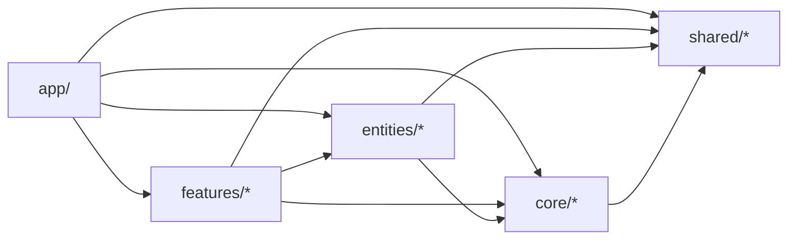

# โครงสร้างโฟลเดอร์ · web

<Status value="implemented" />

[ทัวร์โครงสร้าง repo](/start/repo-tour) ให้ภาพกว้างของ `apps/web` หน้านี้ลงรายละเอียดผัง `core/entities/features/shared` ที่ `apps/web/src` ใช้จริง — ออกแบบมาให้ repo นี้ fork ไปเริ่มโปรเจกต์ใหม่ได้ โดยแยกส่วนที่ "คงที่ทุกโปรเจกต์" ออกจากส่วนที่ "แก้/ลบได้ตามฟีเจอร์"

## ผังจริง

```text
apps/web/src/
├── app/                     Next.js App Router — routing เท่านั้น, import จาก barrel ด้านล่าง
│   └── [locale]/            (auth)/login, (app)/{dashboard,profile,settings/*}
├── core/                    infra ที่คงที่ทุกโปรเจกต์ที่ fork ไป
│   ├── auth/                login/logout/getMe, session storage, useSession
│   ├── permissions/         CASL: buildAbility, AbilityProvider, useAbility
│   ├── api-client/          fetch wrapper + trace id, env, error mapping
│   ├── i18n/                routing, navigation, request config, messages/
│   └── ui/                  design system (19 primitive, shadcn-style)
├── entities/                domain hook ที่ผูก schema จาก @app-platform/contracts
│   ├── user/                useMe, useUsers, useChangePassword
│   └── role/                useRoles
├── features/                ฟีเจอร์เฉพาะโปรเจกต์ — ถูกแทนที่/ลบได้เวลา fork
│   ├── dashboard/, users/, roles/, settings/, shell/
├── shared/                  util ทั่วไป ไม่มีความหมายทาง domain
│   └── lib/                 cn()
└── proxy.ts                 next-intl middleware (ชื่อใหม่ของ middleware.ts ใน Next 16)
```

แต่ละโฟลเดอร์ย่อยใน `core/`, `entities/`, `features/`, `shared/` มี `index.ts` ตัวเดียวเป็นทางเข้าออกที่อนุญาต — ไฟล์ภายในห้าม import ตรงจากนอกโมดูล ต้องผ่าน barrel เท่านั้น กฎนี้บังคับด้วย ESLint (`eslint-plugin-boundaries`, ดูหัวข้อถัดไป)

## กฎการพึ่งพาระหว่างชั้น



- `shared/` ไม่ import อะไรในนี้เลย — เป็น leaf
- `core/` import ได้แค่ `shared/`
- `entities/` import ได้ `core/`, `shared/`
- `features/` import ได้ `entities/`, `core/`, `shared/` — **ห้าม import ข้าม feature อื่น** (เช่น `features/users` ห้าม import จาก `features/roles`) ถ้าต้องใช้ร่วมกันจริง ให้ promote ขึ้นไปเป็น `entities/`
- `app/` import ได้ทุกชั้น

ผิดกฎเหล่านี้ = ESLint error ที่ build time ไม่ใช่แค่ code review — ตั้งใจให้เข้มเพราะ repo นี้ถูกออกแบบให้คนอื่น fork ไปแก้โดยไม่มีทีมเดิมคอย review

## ทำไมแยกแบบนี้

| ชั้น | เกณฑ์ | ตัวอย่าง |
| --- | --- | --- |
| `core/` | โค้ด infra ที่แทบไม่เปลี่ยนข้ามโปรเจกต์ | auth, CASL, fetch wrapper, i18n, design system |
| `entities/` | hook ที่ผูกกับ domain object ที่มักอยู่ทุกโปรเจกต์ admin (user, role) | `useUsers`, `useRoles` |
| `features/` | business logic เฉพาะโปรเจกต์นี้ — สิ่งแรกที่ถูกลบ/เขียนใหม่ตอน fork | dashboard, การตั้งค่า, dialog ต่าง ๆ |
| `shared/` | util ที่ไม่รู้จัก domain เลย | `cn()` |

จุดที่ต้องตัดสินใจเอง (ไม่ใช่กฎตายตัว): `features/shell/` (sidebar, user menu) แม้จะดู "คงที่" แต่ hardcode รายการเมนูตามฟีเจอร์จริง จึงจัดเป็น `features/` ไม่ใช่ `core/` — ถ้าโปรเจกต์ fork ไปมีเมนูต่างจากเดิม จุดนี้คือจุดที่ต้องแก้

## Query key แยกตามเจ้าของ

`query-keys.ts` ไม่ได้รวมไว้ที่เดียวเหมือนเดิม แต่แยกไปอยู่กับโมดูลที่เป็นเจ้าของข้อมูลนั้น — `sessionKeys` อยู่ใน `core/auth/`, `userKeys` ใน `entities/user/`, `roleKeys` ใน `entities/role/`, `dashboardKeys` ใน `features/dashboard/` เหตุผล: ถ้า fork ไปแล้วลบ `features/dashboard/` ทิ้ง จะไม่มี export ค้างจากไฟล์กลางที่ไม่มีใครใช้แล้ว

## การตั้งชื่อไฟล์

| ประเภท | รูปแบบ | ตัวอย่าง |
| --- | --- | --- |
| Route (Next.js บังคับ) | `page.tsx`, `layout.tsx`, `loading.tsx`, `error.tsx` | `dashboard/page.tsx` |
| Component | PascalCase export, kebab-case filename | `edit-user-dialog.tsx` → `EditUserDialog` |
| Hook | `use<Name>.ts` | `use-roles.ts` → `useRoles` |
| Barrel | `index.ts` ทุกโฟลเดอร์ใน `core/`, `entities/`, `features/`, `shared/` | `entities/user/index.ts` |

::: tip `proxy.ts` ไม่ใช่ `middleware.ts`
Next.js 16 เปลี่ยนชื่อไฟล์ middleware เป็น `proxy.ts` — ตอนนี้มีแค่ next-intl middleware อยู่ในนั้น ดู [Session ฝั่ง client](/frontend/auth-client)
:::

::: warning ห้ามแก้ไฟล์ใน `core/ui/` ด้วยมือ (นอกจาก merge conflict)
component เหล่านี้เป็นฐาน design system ที่ทุกโปรเจกต์ fork ใช้ร่วมกัน ปรับ style ผ่าน token ใน `packages/config/tailwind/theme.css` แทน
:::
