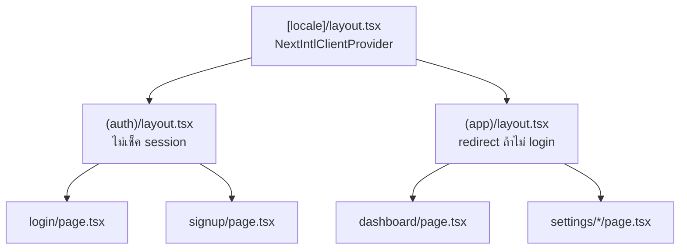
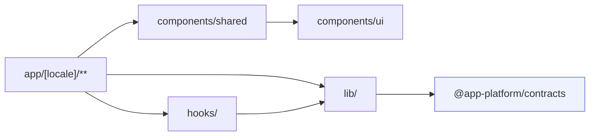

# โครงสร้างโฟลเดอร์ · web

<Status value="implemented" />

[ทัวร์โครงสร้าง repo](/start/repo-tour) ให้ภาพกว้างของ `apps/web` หน้านี้ลงรายละเอียดผังโฟลเดอร์เต็มตามสเปกเป้าหมาย

## ผังเป้าหมาย

```text
apps/web/src/
├── app/
│   ├── layout.tsx              root layout (pass-through)
│   ├── providers.tsx           QueryClientProvider (client component)
│   ├── globals.css             Tailwind v4 entry + design token
│   └── [locale]/                ทุกหน้าอยู่ใต้ locale segment
│       ├── layout.tsx           NextIntlClientProvider + shell (nav/sidebar)
│       ├── page.tsx             หน้าแรก
│       ├── error.tsx            client error boundary — ส่งไป POST /v1/client-errors
│       ├── (auth)/               route group — ไม่ต้อง login
│       │   ├── login/page.tsx
│       │   └── signup/page.tsx   ยัง planned — ดู /auth/signup
│       └── (app)/                route group — ต้อง login
│           ├── dashboard/page.tsx
│           ├── settings/
│           │   ├── users/page.tsx
│           │   ├── roles/page.tsx
│           │   └── theme/page.tsx
│           └── profile/page.tsx
│
├── i18n/
│   ├── routing.ts               defineRouting: locales ["th","en"]
│   ├── request.ts               โหลด messages ต่อ request
│   └── navigation.ts            Link/redirect/useRouter ที่รู้จัก locale
│
├── components/
│   ├── ui/                      shadcn/ui — ห้ามแก้ไฟล์ที่ generate มาด้วยมือ
│   └── shared/                  component ของเราเอง ประกอบจาก ui/
│
├── lib/
│   ├── utils.ts                 cn() helper
│   ├── api-client.ts             fetch wrapper ที่แนบ trace id
│   └── ability.ts                buildAbility() จาก CASL rules
│
├── hooks/                       custom hook ที่ใช้ข้ามหน้า
└── proxy.ts                     middleware ของ Next 16 (ชื่อใหม่ของ middleware.ts)
```

โฟลเดอร์ที่มีอยู่จริงวันนี้คือ `app/layout.tsx`, `app/[locale]/{layout,page,error}.tsx`, `app/[locale]/(auth)/login/`, `app/[locale]/(app)/{dashboard,profile,settings/*}/` (placeholder — ยังไม่มีฟีเจอร์จริง รอ [หน้าผลิตภัณฑ์](/start/roadmap) แต่ละหน้าถูก implement), `i18n/`, `lib/{api-client,auth,session,ability,utils}.ts`, `hooks/use-session.ts`, `proxy.ts` — `(auth)/signup/` ยังไม่มีเพราะ [สมัครสมาชิก](/auth/signup) ยัง planned

## กฎการแบ่งตามฟีเจอร์

หน้าเว็บถูกจัดกลุ่มด้วย [route group](https://nextjs.org/docs/app/building-your-application/routing/route-groups) ของ Next.js — วงเล็บใน `(auth)` และ `(app)` ไม่ปรากฏใน URL แต่ทำให้ใส่ layout ที่ต่างกันได้ (เช่น `(app)/layout.tsx` เช็ค session ก่อน render)



## โครงในหนึ่งหน้า

```text
app/[locale]/(app)/settings/users/
├── page.tsx           server component — ดึงข้อมูลตั้งต้น
├── loading.tsx         skeleton ระหว่างโหลด
├── error.tsx            error boundary เฉพาะหน้านี้
└── _components/         component ที่ใช้เฉพาะหน้านี้ ไม่ export ออกไปที่อื่น
```

โฟลเดอร์ที่ขึ้นต้นด้วย `_` ไม่ถูก Next.js นับเป็น route — ใช้เก็บ component ที่ผูกกับหน้านั้นโดยเฉพาะ ถ้า component ถูกใช้มากกว่าหนึ่งหน้าให้ย้ายขึ้นไป `components/shared/`

## โฟลเดอร์ที่ใช้ร่วมกัน

| โฟลเดอร์ | มีไว้ทำไม | เกี่ยว |
| --- | --- | --- |
| `components/ui/` | component จาก `shadcn/ui` ที่ generate ด้วย CLI — เป็นฐาน design system | [UI system](/frontend/ui-system) |
| `components/shared/` | component ของเราเองที่ประกอบจาก `ui/` แล้วใช้ข้ามหลายหน้า | — |
| `lib/api-client.ts` | fetch wrapper ที่แนบ trace id และ parse error envelope | [Trace ID](/platform/trace-id) |
| `lib/ability.ts` | ประกอบ CASL ability จาก rules ที่ API ส่งมา | [CASL](/auth/casl) |
| `hooks/` | custom hook เช่น `useDebounce`, `useAbility` | — |

::: tip `proxy.ts` ไม่ใช่ `middleware.ts`
Next.js 16 เปลี่ยนชื่อไฟล์ middleware เป็น `proxy.ts` ตอนนี้มีแค่ next-intl middleware อยู่ในนั้น การป้องกัน route (redirect ไป `/login` ถ้าไม่มี session) จะถูกเพิ่มเข้าไปที่นี่ ดู [Session ฝั่ง client](/frontend/auth-client)
:::

## การตั้งชื่อไฟล์

| ประเภท | รูปแบบ | ตัวอย่าง |
| --- | --- | --- |
| Route (Next.js บังคับ) | `page.tsx`, `layout.tsx`, `loading.tsx`, `error.tsx` | `dashboard/page.tsx` |
| Component ของเราเอง | PascalCase | `UserTable.tsx` |
| Hook | `use<Name>.ts` | `useAbility.ts` |
| lib / util | camelCase | `apiClient.ts` → export เป็น `api-client.ts` ตามธรรมเนียม kebab-case ของไฟล์ |

::: warning ห้ามแก้ไฟล์ใน `components/ui/` ด้วยมือ (นอกจาก merge conflict)
component เหล่านี้ generate มาจาก `shadcn` CLI ถ้าแก้ตรง ๆ แล้วรัน `shadcn add` ซ้ำภายหลัง การแก้ไขจะหายหรือ conflict อยากปรับ style ให้ทำผ่าน `components/shared/` ที่ wrap ทับอีกชั้น หรือแก้ที่ token ใน `packages/config/tailwind/theme.css`
:::

## ทิศทางการพึ่งพา



`components/ui/` ไม่ import อะไรนอกจาก library ภายนอก (Radix, `class-variance-authority`) — มันคือฐานที่ทุกอย่างอ้างอิงลงมา ไม่ใช่จุดที่พึ่งพา domain logic

route group `(auth)`/`(app)` มีจริงแล้ว (`(app)/layout.tsx` redirect ไป `/login` ถ้ายังไม่มี session), `lib/api-client.ts` และ `lib/ability.ts` มีคนใช้จริง (`settings/users/page.tsx` ดึงรายชื่อผู้ใช้จริงผ่าน `paginatedSchema(UserSchema)`), `hooks/use-session.ts` มีอยู่

::: tip `components/ui/` ยังเป็น component ที่เขียนเอง ไม่ใช่จาก shadcn CLI — ตั้งใจ
เป็นขอบเขตของ [UI system](/frontend/ui-system) ซึ่งยัง planned แยกต่างหาก หน้านี้ว่าด้วยโครงสร้างโฟลเดอร์/route เท่านั้น ไม่ใช่ความสมบูรณ์ของ component library
:::
