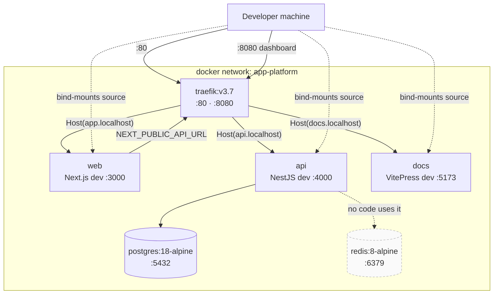

# Containers & routing

<Status value="in-progress" note="no production compose or Dockerfile yet" />

## Development stack



## Container table

| Service | Image / build | Container port | Route | Depends on |
| --- | --- | --- | --- | --- |
| `traefik` | `traefik:v3.7` | 80, 8080 | — | docker socket |
| `web` | `infra/docker/web/Dockerfile.dev` | 3000 | `Host(app.localhost)` | api (at runtime) |
| `api` | `infra/docker/api/Dockerfile.dev` | 4000 | `Host(api.localhost)` | postgres + redis healthy |
| `docs` | `infra/docker/docs/Dockerfile.dev` | 5173 | `Host(docs.localhost)` | — |
| `postgres` | `postgres:18-alpine` | 5432 | — (published directly) | — |
| `redis` | `redis:8-alpine` | 6379 | — (published directly) | — |

Host-side ports are configurable through `WEB_PORT`, `API_PORT`, `DOCS_PORT`, `POSTGRES_PORT`, `REDIS_PORT` — see [Environment variables](/en/reference/env-vars).

## How Traefik works

`infra/docker/traefik/traefik.yml` is deliberately tiny:

```yaml
api:
  dashboard: true
  insecure: true          # dev only — must never reach production

entryPoints:
  web:
    address: ":80"

providers:
  docker:
    exposedByDefault: false   # opt in with labels only
    network: app-platform
```

`exposedByDefault: false` means a container is invisible to Traefik unless it labels itself. Each service declares its own route in `docker-compose.yml`:

```yaml
labels:
  - traefik.enable=true
  - traefik.http.routers.api.rule=Host(`api.localhost`)
  - traefik.http.routers.api.entrypoints=web
  - traefik.http.services.api.loadbalancer.server.port=4000
```

::: danger The dashboard is insecure
`insecure: true` exposes the dashboard on `:8080` with no authentication. That's acceptable on your own machine only. A production config must disable it or put auth in front.
:::

::: tip Adding a service
1. Declare it in `docker-compose.yml` with the four labels above (new router name / host / port)
2. Add `build:` and bind mounts in `docker-compose.local.yml`
3. Attach `networks: [app-platform]` — forget this and Traefik can't see it
:::

## Why two compose files

| File | Role |
| --- | --- |
| `docker-compose.yml` | Services, network, env, Traefik labels — the base, with no dev assumptions |
| `docker-compose.local.yml` | Dev overlay: `build:` pointing at `Dockerfile.dev`, `.:/app` bind mounts, host-published ports, polling watchers |

`pnpm dev:docker` composes both:

```bash
docker compose -f docker-compose.yml -f docker-compose.local.yml up
```

The split leaves room to add `docker-compose.prod.yml` later without touching the base.

## About node_modules in dev

`docker-compose.local.yml` bind-mounts the whole repo (`.:/app`) and then **shadows** every `node_modules` directory with a named volume:

```yaml
volumes:
  - .:/app
  - api_node_modules:/app/node_modules
  - api_app_node_modules:/app/apps/api/node_modules
  - contracts_node_modules_api:/app/packages/contracts/node_modules
```

pnpm's `node_modules` is full of platform-specific symlinks. Letting the host's copy (possibly macOS ARM) leak into the container (linux) breaks native binaries like `@swc/core` and Prisma's engines. The named volumes keep the container's copy separate.

::: warning Adding a dependency requires a restart
`pnpm add` on the host writes to the host's `node_modules`, not the container's. Run `docker compose ... restart <service>` or run `pnpm install` inside the container so the volume catches up.
:::

## What's missing for production

::: warning Current code status
| Target spec | Code today |
| --- | --- |
| Multi-stage production Dockerfiles for every app | only `Dockerfile.dev` exists |
| `docker-compose.prod.yml` or orchestrator manifests | none |
| Traefik with TLS (ACME) and the dashboard closed | HTTP only; dashboard is insecure |
| Healthchecks for web/api in compose | only postgres and redis have them |
| Resource limits | none |
:::

`apps/web/next.config.ts` already sets `output: "standalone"`, which is the piece a production Dockerfile needs — copy only `.next/standalone` plus `.next/static` for a very small image.
