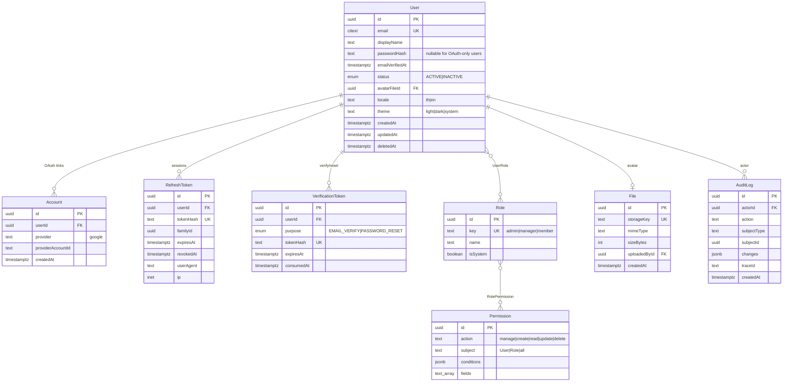
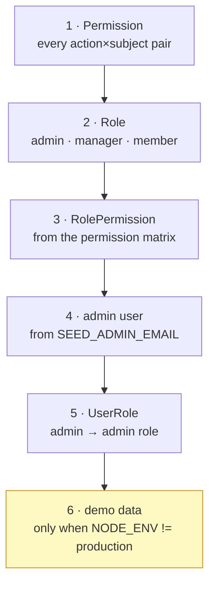

# Data model

<Status value="planned" note="only the User model exists today" />

`apps/api/prisma/schema.prisma` is the source of truth for the database. This page describes the shape it needs once [auth](/en/auth/overview) and [RBAC](/en/auth/rbac-model) are implemented.

## Entity relationships



## What each table is for

| Model | Purpose | Related page |
| --- | --- | --- |
| `User` | A person's identity plus their preferences | [Login](/en/auth/login) |
| `Account` | Links an external OAuth identity to a `User` — one person can have several providers | [Signup](/en/auth/signup) |
| `RefreshToken` | Revocable sessions with a family for reuse detection | [JWT & rotation](/en/auth/tokens) |
| `VerificationToken` | Single-use tokens for email verification and password reset | [Forgot password](/en/auth/forgot-password) |
| `Role` | A named bundle of permissions | [RBAC](/en/auth/rbac-model) |
| `Permission` | One CASL rule (action + subject + conditions) | [CASL](/en/auth/casl) |
| `File` | Uploaded files; used for avatars today | — |
| `AuditLog` | Who did what, tied to a `traceId` | [Trace ID](/en/platform/trace-id) |

## Schema conventions

| Rule | Reason |
| --- | --- |
| Primary keys are always `uuid`, never autoincrement | Nobody can guess someone else's id, and data merges across environments |
| Models are PascalCase singular; tables are snake_case plural via `@@map` | Code reads like TypeScript, SQL reads like SQL |
| Fields are camelCase in Prisma, `@map`ped to snake_case | Same reason |
| All timestamps are `DateTime` stored in UTC | Removes the entire timezone problem class |
| Every model carries `createdAt` / `updatedAt` | You will never regret having them |
| Tables still referenced after deletion use `deletedAt`, not a real delete | Preserves foreign keys and history |
| Emails use `citext` | Case-insensitive comparison without `LOWER()` on every query |
| No raw Postgres enums — use Prisma `enum` | Prisma manages enum migrations for you |

::: tip citext needs the extension enabled
Add `extensions = [citext]` to the `datasource` block and Prisma emits `CREATE EXTENSION IF NOT EXISTS citext` in the migration. Without it, `a@b.com` and `A@B.com` become two separate accounts.
:::

## Schema

```prisma
generator client {
  provider = "prisma-client-js"
}

datasource db {
  provider   = "postgresql"
  extensions = [citext]
}

enum UserStatus {
  ACTIVE
  INACTIVE
}

enum TokenPurpose {
  EMAIL_VERIFY
  PASSWORD_RESET
}

model User {
  id              String     @id @default(uuid()) @db.Uuid
  email           String     @unique @db.Citext
  displayName     String     @db.VarChar(120)
  /// nullable — a Google-only user never has a password
  passwordHash    String?
  emailVerifiedAt DateTime?  @map("email_verified_at")
  status          UserStatus @default(ACTIVE)
  locale          String     @default("th") @db.VarChar(5)
  theme           String     @default("system") @db.VarChar(10)

  avatarFileId String? @map("avatar_file_id") @db.Uuid
  avatarFile   File?   @relation("UserAvatar", fields: [avatarFileId], references: [id], onDelete: SetNull)

  roles              UserRole[]
  accounts           Account[]
  refreshTokens      RefreshToken[]
  verificationTokens VerificationToken[]
  auditLogs          AuditLog[]         @relation("AuditActor")
  uploadedFiles      File[]             @relation("FileUploader")

  createdAt DateTime  @default(now()) @map("created_at")
  updatedAt DateTime  @updatedAt @map("updated_at")
  deletedAt DateTime? @map("deleted_at")

  @@index([status, createdAt])
  @@index([deletedAt])
  @@map("users")
}

model Account {
  id                String @id @default(uuid()) @db.Uuid
  userId            String @map("user_id") @db.Uuid
  user              User   @relation(fields: [userId], references: [id], onDelete: Cascade)
  provider          String @db.VarChar(32)
  providerAccountId String @map("provider_account_id")

  createdAt DateTime @default(now()) @map("created_at")

  /// one Google account maps to exactly one user
  @@unique([provider, providerAccountId])
  @@index([userId])
  @@map("accounts")
}

model RefreshToken {
  id     String @id @default(uuid()) @db.Uuid
  userId String @map("user_id") @db.Uuid
  user   User   @relation(fields: [userId], references: [id], onDelete: Cascade)

  /// SHA-256 of the token — the real value is never stored, so a DB leak can't forge sessions
  tokenHash String @unique @map("token_hash")
  /// every token descended from one login shares a familyId
  familyId  String @map("family_id") @db.Uuid

  expiresAt DateTime  @map("expires_at")
  revokedAt DateTime? @map("revoked_at")
  userAgent String?   @map("user_agent")
  ip        String?   @db.Inet

  createdAt DateTime @default(now()) @map("created_at")

  @@index([userId, revokedAt])
  @@index([familyId])
  @@index([expiresAt])
  @@map("refresh_tokens")
}

model VerificationToken {
  id      String       @id @default(uuid()) @db.Uuid
  userId  String       @map("user_id") @db.Uuid
  user    User         @relation(fields: [userId], references: [id], onDelete: Cascade)
  purpose TokenPurpose

  tokenHash  String    @unique @map("token_hash")
  expiresAt  DateTime  @map("expires_at")
  consumedAt DateTime? @map("consumed_at")

  createdAt DateTime @default(now()) @map("created_at")

  @@index([userId, purpose])
  @@index([expiresAt])
  @@map("verification_tokens")
}

model Role {
  id   String @id @default(uuid()) @db.Uuid
  key  String @unique @db.VarChar(64)
  name String @db.VarChar(120)
  /// system roles cannot be deleted through the UI
  isSystem Boolean @default(false) @map("is_system")

  users       UserRole[]
  permissions RolePermission[]

  createdAt DateTime @default(now()) @map("created_at")
  updatedAt DateTime @updatedAt @map("updated_at")

  @@map("roles")
}

model Permission {
  id      String @id @default(uuid()) @db.Uuid
  /// CASL action: manage | create | read | update | delete
  action  String @db.VarChar(32)
  /// CASL subject: User | Role | all
  subject String @db.VarChar(64)
  /// MongoQuery-style conditions, e.g. {"id": "${user.id}"}
  conditions Json?
  /// restrict to specific fields — empty means all
  fields  String[]

  roles RolePermission[]

  @@unique([action, subject])
  @@map("permissions")
}

model UserRole {
  userId String @map("user_id") @db.Uuid
  roleId String @map("role_id") @db.Uuid
  user   User   @relation(fields: [userId], references: [id], onDelete: Cascade)
  role   Role   @relation(fields: [roleId], references: [id], onDelete: Cascade)

  assignedAt DateTime @default(now()) @map("assigned_at")

  @@id([userId, roleId])
  @@index([roleId])
  @@map("user_roles")
}

model RolePermission {
  roleId       String     @map("role_id") @db.Uuid
  permissionId String     @map("permission_id") @db.Uuid
  role         Role       @relation(fields: [roleId], references: [id], onDelete: Cascade)
  permission   Permission @relation(fields: [permissionId], references: [id], onDelete: Cascade)

  @@id([roleId, permissionId])
  @@map("role_permissions")
}

model File {
  id         String @id @default(uuid()) @db.Uuid
  storageKey String @unique @map("storage_key")
  mimeType   String @map("mime_type") @db.VarChar(128)
  sizeBytes  Int    @map("size_bytes")

  uploadedById String? @map("uploaded_by_id") @db.Uuid
  uploadedBy   User?   @relation("FileUploader", fields: [uploadedById], references: [id], onDelete: SetNull)

  avatarOf User[] @relation("UserAvatar")

  createdAt DateTime @default(now()) @map("created_at")

  @@map("files")
}

model AuditLog {
  id      String  @id @default(uuid()) @db.Uuid
  actorId String? @map("actor_id") @db.Uuid
  actor   User?   @relation("AuditActor", fields: [actorId], references: [id], onDelete: SetNull)

  action      String  @db.VarChar(64)
  subjectType String  @map("subject_type") @db.VarChar(64)
  subjectId   String? @map("subject_id") @db.Uuid
  /// { field: { from, to } } — never store secret values here
  changes     Json?
  /// ties this record back to the request that caused it
  traceId     String  @map("trace_id")

  createdAt DateTime @default(now()) @map("created_at")

  @@index([subjectType, subjectId])
  @@index([actorId, createdAt])
  @@index([traceId])
  @@map("audit_logs")
}
```

## Why it looks like this

### Token hashes, not tokens

`RefreshToken.tokenHash` and `VerificationToken.tokenHash` store SHA-256, not the value. If the database leaks, nobody can forge a session or reset anyone's password. Verification hashes the presented value and compares.

SHA-256 rather than bcrypt because these are random 256-bit values *we* generated, not human-chosen passwords — there is nothing to brute-force, so a work factor would only slow every request down for nothing.

### What `familyId` buys

Every refresh token descended from one login shares a `familyId`. When an already-rotated token is presented, a copy has leaked — revoke the whole family at once. See [JWT & rotation](/en/auth/tokens).

### `Permission` maps 1:1 onto CASL

`(action, subject, conditions, fields)` is exactly the shape of CASL's `RawRule`, so a database row becomes a CASL rule with no translation layer. See [CASL](/en/auth/casl).

### `passwordHash` is nullable

Google-only users have no password. Don't invent a placeholder — leave it `null` and require the service to reject password login when the hash is missing.

### Soft delete only on `User`

`deletedAt` exists only on `User` because nothing else needs a tombstone. Every read of a user must filter `deletedAt: null`. The safer route is to fold it into the CASL ability conditions so it can't be forgotten.

## Seed data

The seeder must create things in this order.



The seeder must be **idempotent** — all `upsert`, so running it repeatedly changes nothing. The permission matrix lives at [RBAC](/en/auth/rbac-model).

::: danger Demo data must never reach production
The `demo@example.com` / `password123` account must be impossible to create in production. Wrap it in `if (process.env.NODE_ENV !== "production")` inside the seed itself, rather than trusting whoever runs it.
:::

## Migration etiquette

| Situation | How |
| --- | --- |
| Add a nullable column | Migrate directly |
| Add a required column | Add nullable → backfill → set NOT NULL (three migrations) |
| Rename a column | Add the new one → write both → backfill → move reads → drop the old |
| Drop a column | Stop writing first, wait one deploy, then drop |
| Add an index to a large table | `CREATE INDEX CONCURRENTLY` in a hand-written SQL migration |

The principle is **expand then contract** — during a deploy, old and new code run simultaneously, and every migration must survive that window.

::: warning Current code status
| Target spec | Code today |
| --- | --- |
| 8 models + 2 join tables | **Only `User`** (id, email, displayName, passwordHash, createdAt, updatedAt) |
| Emails as `citext` | Plain `text` — `A@b.com` and `a@b.com` can both exist |
| snake_case column names | No `@map` at all; columns are `displayName`, `passwordHash` |
| Soft delete | No `deletedAt` |
| Seed creates roles and permissions | `seed.ts` upserts one user with no `NODE_ENV` guard |
:::
