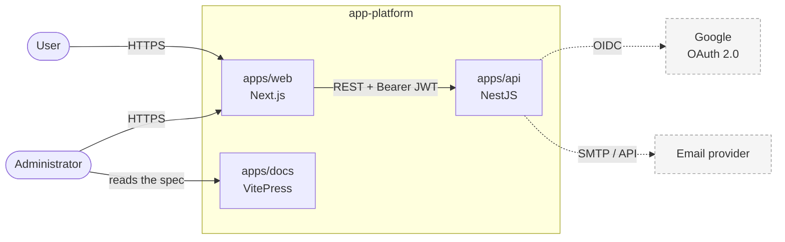
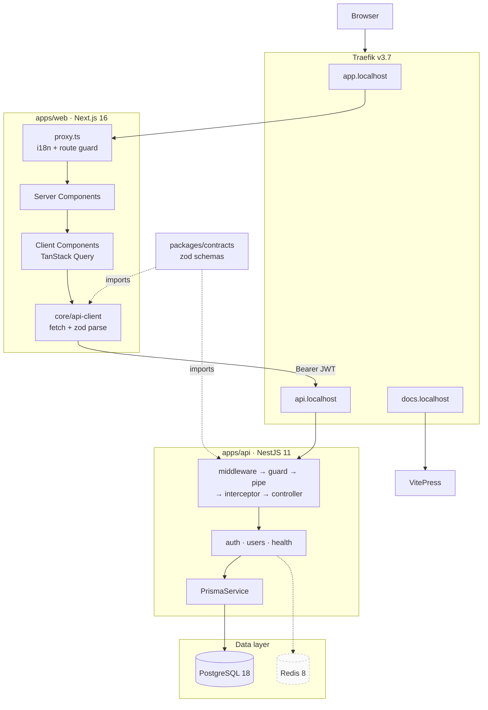
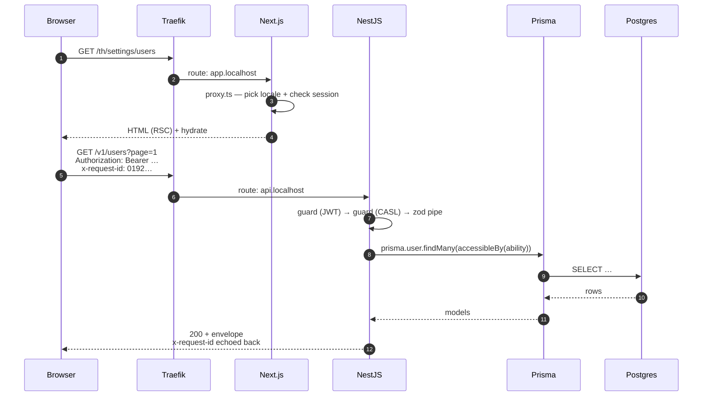

# System overview

<Status value="implemented" />

One page for the whole mental model. Each part links to its own page for detail.

## Context

Google OAuth and the email provider are dashed — not implemented yet ([Signup](/en/auth/signup), [Transactional email](/en/backend/email)).

## Components

| Part | Responsibility | Detail |
| --- | --- | --- |
| **apps/web** | All UI, i18n, form validation, session storage | [Client session](/en/frontend/auth-client) |
| **apps/api** | Business rules, data access, token issuance, permission enforcement | [Auth overview](/en/auth/overview) |
| **apps/docs** | Spec and documentation (not in the runtime path) | — |
| **packages/contracts** | zod schemas for requests/responses — the contract between the two apps | [Contract-first](/en/conventions/contract-first) |
| **Traefik** | Reverse proxy mapping `*.localhost` to each service | [Containers & routing](/en/architecture/containers) |
| **PostgreSQL** | All persistent state, reached only through Prisma | [Data model](/en/architecture/data-model) |
| **Redis** | Provisioned, but no code uses it yet | [Roadmap](/en/start/roadmap) |

## Request path

An authenticated read passes through six hands.

Step-by-step detail, including the error path, is at [Request lifecycle](/en/architecture/request-lifecycle).

## Boundaries and rules

| Boundary | Rule |
| --- | --- |
| web ↔ api | REST + JSON only; never import code across |
| Shared code | Must live in `packages/contracts` and be a zod schema |
| Database access | Only through `PrismaService`; no raw SQL outside Prisma |
| Between API modules | Call exported services; never reach into another module's repository |
| Permissions | Always enforced server-side. The UI only hides things; it is not a guard. |
| Errors | Everything leaving the API uses the same envelope |
| Every request | Carries a trace id, and every log line carries it too |

Those last three are what make the system debuggable — read [Error envelope](/en/conventions/errors) and [Trace ID](/en/platform/trace-id).

## Why a modular monolith

One deployment, strictly separated modules. You get clear boundaries without carrying distributed transactions, service discovery, and cross-service debugging from day one. When a module genuinely outgrows the monolith, the boundaries you kept let you extract it without a rewrite.

Full reasoning and rejected alternatives: [ADR-0004](/en/adr/0004-modular-monolith).
