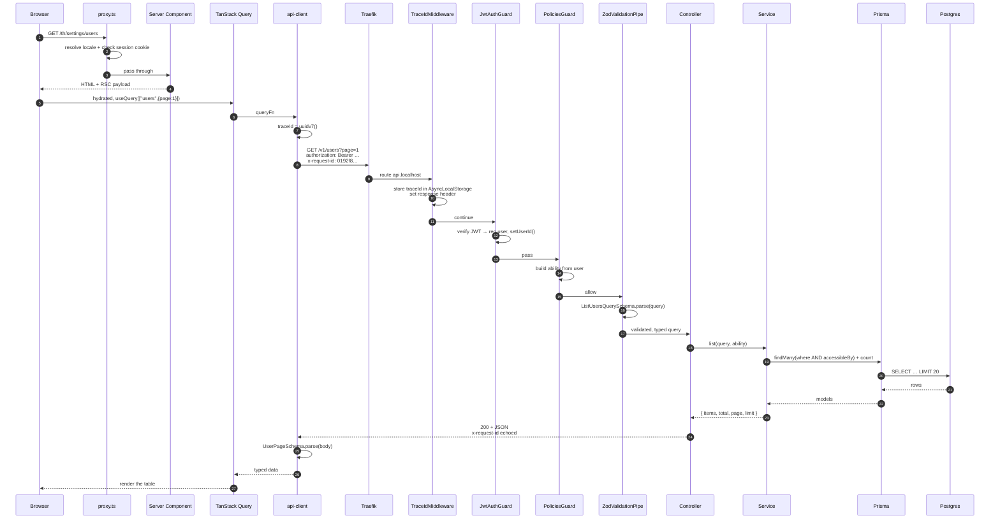
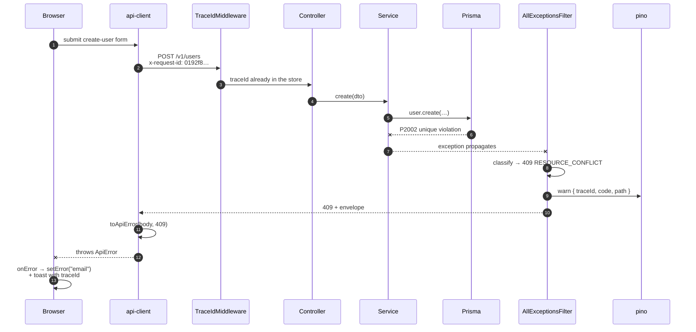
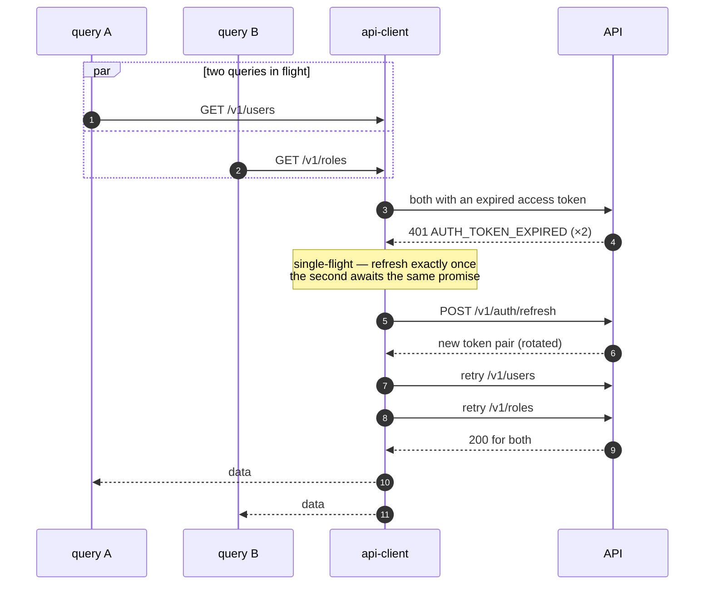
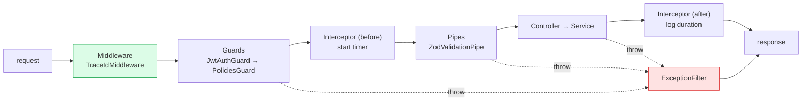

# Request lifecycle

<Status value="planned" />

Follow one request from click to pixel, on both the happy and the failure path. This is where [contracts](/en/conventions/contract-first), the [error envelope](/en/conventions/errors), and the [trace id](/en/platform/trace-id) meet.

## Happy path

### What each hop does

| # | Hop | Responsibility | If it fails |
| --- | --- | --- | --- |
| 1 | `proxy.ts` | Resolve locale, redirect if no session | Redirect to `/th/login` |
| 2 | Server Component | Compose the page, optionally prefetch | Next error boundary |
| 3 | `api-client` | Attach trace id and token, parse the response | Throws `ApiError` |
| 4 | Traefik | Host-based routing | Traefik's own 404 (no envelope) |
| 5 | `TraceIdMiddleware` | Create or adopt the trace id | — |
| 6 | `JwtAuthGuard` | Authentication | `401 AUTH_TOKEN_INVALID` |
| 7 | `PoliciesGuard` | Authorization | `403 AUTHZ_FORBIDDEN` |
| 8 | `ZodValidationPipe` | Validate query/body | `422 VALIDATION_FAILED` |
| 9 | Controller | Translate HTTP into a service call | — |
| 10 | Service | Business rules | `AppException` with a code |
| 11 | Prisma | Data access | Mapped to 409/404/500 |
| 12 | `api-client` (`.parse`) | Verify the API kept its contract | Throwing here means the contract was broken |

::: tip Order matters: guards run before pipes
Nest always runs guards before pipes, so an unauthorised request is rejected before any CPU is spent validating the body — and error messages never leak what a valid body would look like.
:::

## Failure path

**The key point:** every failure path, wherever it originates, funnels through a single `AllExceptionsFilter`. That's what guarantees one error shape and a trace id every time.

## Refresh path

A request that hits `401` is retried after a successful refresh, invisibly to the user.

Without single-flight, two simultaneously expired requests fire two refreshes. With [rotation](/en/auth/tokens), the second one presents an already-rotated token, the system reads that as reuse, and the whole family gets revoked — logging the user straight out. Details at [Client session](/en/frontend/auth-client).

## The Nest pipeline

Nest's order is fixed. Knowing it tells you where each kind of logic belongs.

| Layer | Put here | Never here |
| --- | --- | --- |
| Middleware | Trace id, security headers, anything that must run first | Business rules |
| Guard | Authentication, authorization, rate limiting | Data transformation |
| Interceptor | Timing, caching, logging | Access decisions |
| Pipe | Validation and type coercion | Database calls |
| Controller | HTTP ↔ service translation | Business rules |
| Service | All business rules | Knowledge of HTTP |
| Filter | Turning exceptions into envelopes | Business recovery |

::: danger Services must not know about HTTP
A service must never import `Request`, `Response`, or `HttpStatus` directly. Throw an `AppException` carrying a code and let the filter map it to a status. That keeps services reusable from background jobs and CLIs.

The single exception is the `Errors.*` helper, which pins `HttpStatus` at construction time — centralised in one file rather than scattered through services.
:::

::: warning Current code status
| Layer | Code today |
| --- | --- |
| Middleware | none at all |
| Guards | `JwtAuthGuard` exists but is opt-in per route; no `PoliciesGuard` |
| Interceptors | none |
| Pipes | global `ZodValidationPipe` ✅ |
| Filters | none — Nest's default error handler |
| Client side | no `api-client`, no refresh interceptor; `providers.tsx` has a bare `QueryClient` |
:::
