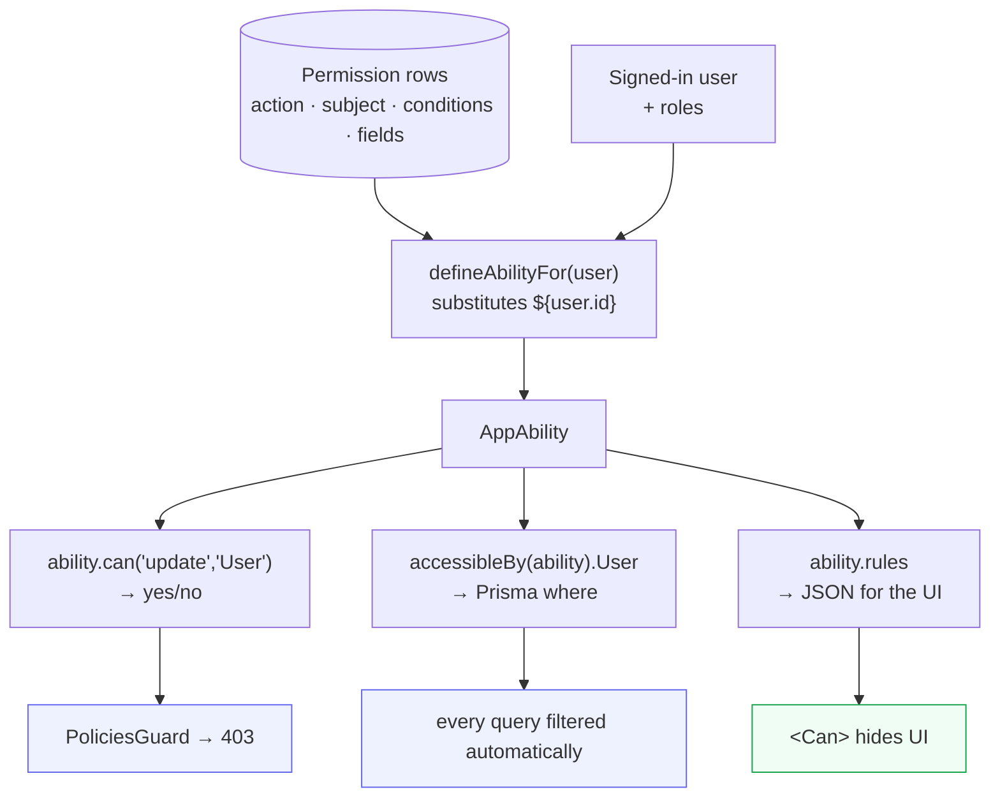

# CASL authorization

<Status value="planned" />

> **One ability set: enforced on the server, reused in the UI.**

[RBAC](/en/auth/rbac-model) is the data. This page is the engine that turns it into decisions.

## Why CASL

Role checks fall apart the moment "their own" enters the requirements:

```ts
// it starts like this…
if (user.role !== "admin") throw new ForbiddenException();

// …and looks like this three months later
if (user.role !== "admin" && !(user.role === "manager" && target.id !== user.id)
    && !(target.id === user.id && onlyChangingProfileFields(dto))) throw …
```

CASL separates three things — the *rules* (rows in `Permission`), the *question* (`ability.can(...)`), and the *filtering* (`accessibleBy()`, which becomes SQL `WHERE`). It also ships the same rules to the UI so button visibility doesn't require reimplementing the logic in a second place.

## From rows to answers



## Type definitions

```ts
// packages/contracts/src/ability.schema.ts
import { z } from "zod";

export const ACTIONS = ["manage", "create", "read", "update", "delete"] as const;
export const SUBJECTS = ["all", "User", "Role", "Permission", "AuditLog", "File"] as const;

export type AppAction = (typeof ACTIONS)[number];
export type AppSubject = (typeof SUBJECTS)[number];

/** only the operators we need — not all of MongoQuery */
const ConditionValueSchema = z.union([
  z.string(), z.number(), z.boolean(), z.null(),
  z.object({
    $eq: z.unknown().optional(),
    $ne: z.unknown().optional(),
    $in: z.array(z.unknown()).optional(),
    $nin: z.array(z.unknown()).optional(),
  }).strict(),
]);

export const RawRuleSchema = z.object({
  action: z.enum(ACTIONS),
  subject: z.enum(SUBJECTS),
  fields: z.array(z.string()).optional(),
  conditions: z.record(z.string(), ConditionValueSchema).optional(),
  inverted: z.boolean().optional(),
  reason: z.string().optional(),
});
export type RawRule = z.infer<typeof RawRuleSchema>;

export const AbilityRulesSchema = z.array(RawRuleSchema);
```

::: danger `conditions` must pass zod before reaching CASL
It arrives from a `Json` database column and goes into a permission evaluator. Feeding it in unvalidated means anyone who can edit those rows writes arbitrary rules. `.strict()` blocks unlisted operators and `z.enum` blocks unknown actions and subjects.
:::

## Building an ability

```ts
// apps/api/src/auth/ability/ability.factory.ts
import { AbilityBuilder, createMongoAbility, type MongoAbility } from "@casl/ability";
import { AbilityRulesSchema, type AppAction, type AppSubject } from "@app-platform/contracts";

export type AppAbility = MongoAbility<[AppAction, AppSubject]>;

@Injectable()
export class AbilityFactory {
  constructor(private readonly prisma: PrismaService) {}

  async forUser(userId: string): Promise<AppAbility> {
    const rows = await this.prisma.permission.findMany({
      where: { roles: { some: { role: { users: { some: { userId } } } } } },
    });

    const rules = AbilityRulesSchema.parse(
      rows.map((row) => ({
        action: row.action,
        subject: row.subject,
        fields: row.fields.length ? row.fields : undefined,
        // substitute placeholders with this user's real values
        conditions: row.conditions ? interpolate(row.conditions, { user: { id: userId } }) : undefined,
      })),
    );

    return createMongoAbility<AppAbility>(rules);
  }
}

/** replace "${user.id}" with the real value — allowlisted paths only */
function interpolate(conditions: unknown, ctx: { user: { id: string } }): Record<string, unknown> {
  return JSON.parse(
    JSON.stringify(conditions).replace(/"\$\{user\.id\}"/g, JSON.stringify(ctx.user.id)),
  );
}
```

### Caching

`forUser()` hits the database on every request, which won't hold under load. Cache it in Redis under `ability:<userId>` with a 5-minute TTL — and **invalidate immediately** when a user's roles change or a role's permissions change.

::: warning A permission cache is one you cannot get wrong
A stale permission cache means someone who just lost access keeps it for five more minutes. If you cache, the invalidation must happen inside the same transaction as the role change. If you're not confident, don't cache yet — a database round trip per request is cheaper than granting the wrong permission.
:::

## Enforcing on the server

### The guard

```ts
// apps/api/src/auth/ability/policies.guard.ts
export type PolicyHandler = (ability: AppAbility, req: Request) => boolean;

export const CHECK_POLICIES = "check_policies";
export const CheckPolicies = (...handlers: PolicyHandler[]) =>
  SetMetadata(CHECK_POLICIES, handlers);

@Injectable()
export class PoliciesGuard implements CanActivate {
  constructor(private readonly reflector: Reflector, private readonly abilityFactory: AbilityFactory) {}

  async canActivate(context: ExecutionContext): Promise<boolean> {
    const handlers = this.reflector.get<PolicyHandler[]>(CHECK_POLICIES, context.getHandler()) ?? [];
    const req = context.switchToHttp().getRequest<Request>();

    // always attach it, even with no policies — services still need it for accessibleBy
    const ability = await this.abilityFactory.forUser(req.user.id);
    req.ability = ability;

    if (handlers.every((handler) => handler(ability, req))) return true;
    throw Errors.forbidden();
  }
}
```

```ts
@Post()
@CheckPolicies((ability) => ability.can("create", "User"))
create(@Body() dto: CreateUserDto) { … }
```

### Filtering with `accessibleBy`

A guard answers "may you do this?". The harder question is "which rows may you see?". `@casl/prisma` converts an ability into a `where`:

```ts
import { accessibleBy } from "@casl/prisma";

async list(query: ListUsersQuery, ability: AppAbility) {
  const where: Prisma.UserWhereInput = {
    AND: [
      // 🔑 the permission filter, ANDed with everything, always
      accessibleBy(ability, "read").User,
      { deletedAt: null },
      query.q ? { displayName: { contains: query.q, mode: "insensitive" } } : {},
    ],
  };

  const [items, total] = await this.prisma.$transaction([
    this.prisma.user.findMany({ where, skip: (query.page - 1) * query.limit, take: query.limit }),
    this.prisma.user.count({ where }),
  ]);

  return { items, total, page: query.page, limit: query.limit };
}
```

A `member` whose rule is `read User where id = ${user.id}` produces `WHERE id = '…'` in SQL — filtering at the database, not in memory after fetching everything.

::: danger `accessibleBy` belongs in every query, with no exceptions
Forget it once and that's your leak — and it's the kind tests rarely catch, because the code still works; it just returns too many rows. The safer approach is a [Prisma client extension](https://www.prisma.io/docs/orm/prisma-client/client-extensions) that injects `accessibleBy` automatically from the ability in `AsyncLocalStorage`, so it can't be forgotten.
:::

### Checking against a specific record

```ts
async update(id: string, dto: UpdateUser, ability: AppAbility) {
  const user = await this.prisma.user.findFirst({
    where: { AND: [accessibleBy(ability, "read").User, { id, deletedAt: null }] },
  });
  // unreadable → 404, not 403, so we don't confirm the id exists
  if (!user) throw Errors.userNotFound();

  // check against the real instance, because conditions reference row values
  const subject = subjectHelper("User", user);
  if (!ability.can("update", subject)) throw Errors.forbidden();

  // check each field — a manager may edit this user but not their `roles`
  for (const field of Object.keys(dto)) {
    if (!ability.can("update", subject, field)) throw Errors.forbiddenField(field);
  }

  return this.prisma.user.update({ where: { id }, data: dto });
}
```

::: tip Three levels, all required
`can(action, subject)` asks about the *type*. `can(action, instance)` asks about *that row* (evaluating `conditions`). `can(action, instance, field)` asks about *that column*. Skip a level and you've opened a hole at that level.
:::

## Shipping rules to the UI

```ts
// GET /v1/auth/me
@Get("me")
async me(@Req() req: Request) {
  return {
    user: toUserDto(req.user),
    // raw rules, not pre-computed booleans
    rules: req.ability.rules,
  };
}
```

::: tip Send rules, not flags
Returning `{ canCreateUser: true, canDeleteUser: false }` means every new button in the UI requires a new flag on the API. Raw rules let the UI ask anything without the API having to anticipate the question.
:::

The client reconstructs it:

```ts
// apps/web/src/lib/ability.ts
import { createMongoAbility } from "@casl/ability";
import { AbilityRulesSchema } from "@app-platform/contracts";

export function buildAbility(raw: unknown): AppAbility {
  return createMongoAbility(AbilityRulesSchema.parse(raw));
}
```

```tsx
<Can I="create" a="User">
  <Button onClick={openCreateDialog}>Add user</Button>
</Can>
```

UI details at [Permissions in the UI](/en/frontend/permissions-client).

::: danger UI gating is not security
`<Can>` hides buttons. Anyone can call the API directly. **Every endpoint needs its own guard.** Think of the UI as keeping users from seeing paths that would fail, not as preventing anything.
:::

## Preventing self-escalation

The most common hole in permission systems: someone who can edit users edits their own role to admin.

```ts
// three overlapping layers
can("update", "User", ["displayName", "email", "status"], { id: { $ne: user.id } });
//                     └─ no "roles"                        └─ never yourself
cannot("update", "Role");
//     └─ managers can't touch role definitions at all
```

In CASL, `cannot` always beats `can` regardless of declaration order, which makes it a dependable safety net.

## Testing

Abilities are pure logic — easy to test and the highest-value thing to test.

```ts
describe("manager ability", () => {
  const manager = { id: "u1", roles: ["manager"] };
  const ability = buildAbilityFrom(MANAGER_RULES, manager);

  it("can update another user", () => {
    expect(ability.can("update", subject("User", { id: "u2" }))).toBe(true);
  });

  it("cannot update itself", () => {
    expect(ability.can("update", subject("User", { id: "u1" }))).toBe(false);
  });

  it("cannot update the roles field", () => {
    expect(ability.can("update", subject("User", { id: "u2" }), "roles")).toBe(false);
  });

  it("cannot touch Role at all", () => {
    expect(ability.can("update", "Role")).toBe(false);
  });
});
```

Every row of the [permission matrix](/en/auth/rbac-model) deserves a matching test, especially the **denials** — those are the tests that catch security regressions.

::: warning Current code status
| Target spec | Code today |
| --- | --- |
| `@casl/ability` + `@casl/prisma` | **Neither is installed** — "casl" doesn't appear in the repo |
| `AbilityFactory` + `PoliciesGuard` | Don't exist |
| `accessibleBy` on every query | There's no permission system — `GET /users/:id` returns anyone to any signed-in user |
| `GET /v1/auth/me` returning rules | No such endpoint |
| A `Permission` table | Doesn't exist |
| Field-level restrictions | Don't exist |
| Ability tests | There are no test files in the project at all |
:::
