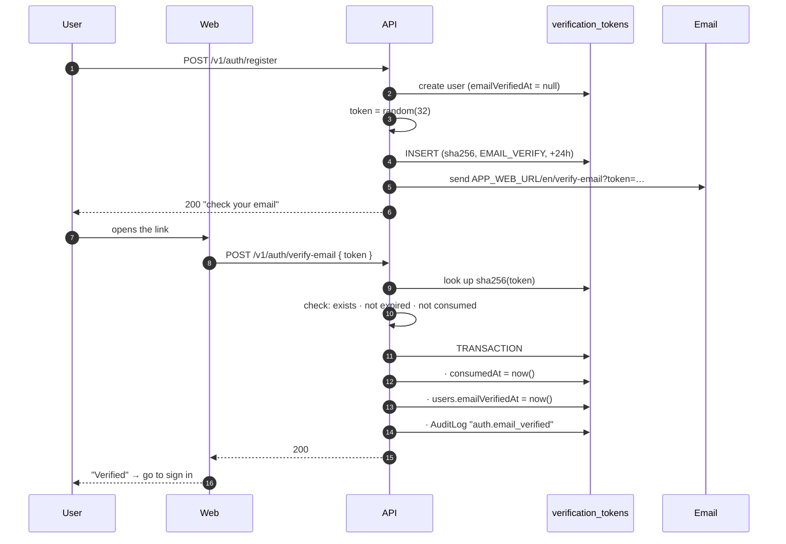
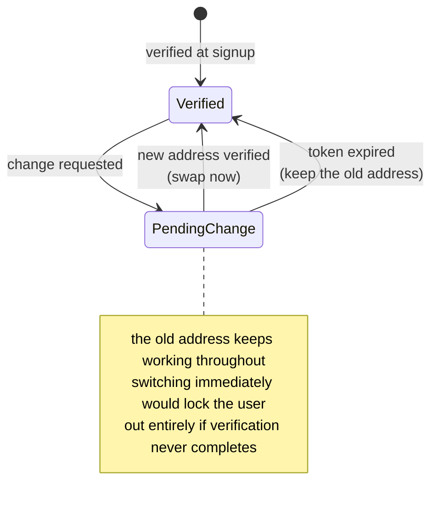

# Email verification

<Status value="planned" />

Proves the person who signed up actually controls that mailbox — which is the precondition that makes [password reset](/en/auth/forgot-password) meaningful. Reset-by-email proves nothing if the email was never verified.

## Flow



## Token contract

| Rule | Value | Versus reset |
| --- | --- | --- |
| Lifetime | 24 hours | Longer (reset is 1 hour) because it's less dangerous |
| Uses | One | Same |
| Concurrently valid | One — resending kills the old | Same |
| Storage | SHA-256 in `VerificationToken` | Same |
| `purpose` | `EMAIL_VERIFY` | `PASSWORD_RESET` |

::: tip Why 24 hours is acceptable
A leaked verification token can do exactly one thing: mark the account verified. It grants no access. A reset token grants the power to change the password. That difference buys the longer lifetime, which is better UX — people often open email the next day.
:::

## What an unverified user can do

| Action | Unverified |
| --- | --- |
| Sign in | ❌ `403 AUTH_EMAIL_NOT_VERIFIED` |
| Request a new verification email | ✅ (throttled) |
| Verify with a token | ✅ |
| Everything else | ❌ |

::: tip Strict or lenient
This boilerplate picks strict — verify before you can sign in. It's simple and there's no half-authenticated state whose rules you have to write down.

A product that wants people using it immediately might go lenient (sign in, but some actions blocked). If you switch, do it through CASL — add an `emailVerifiedAt != null` condition to the relevant rules rather than scattering `if` statements through controllers.
:::

Google users get `emailVerifiedAt = now()` immediately, because Google already verified it and we checked `email_verified` on the `id_token` — see [Signup](/en/auth/signup).

## Resending

```ts
export const ResendVerificationSchema = z.object({ email: z.email() });
```

`POST /v1/auth/resend-verification` is `@Public()`, because someone who can't verify also can't sign in.

| Limit | Counted per |
| --- | --- |
| 3/hour | IP + email |
| 20/hour | IP |

Return a neutral message in every case, exactly as with [forgot password](/en/auth/forgot-password) — otherwise this endpoint becomes the email checker instead.

```ts
async resendVerification(input: ResendVerification) {
  const user = await this.users.findByEmail(input.email);

  // only send when it's real and still pending, but answer identically either way
  if (user && !user.emailVerifiedAt) {
    await this.verification.issueAndSend(user, "EMAIL_VERIFY");
  } else {
    await sleep(randomInt(180, 320));
  }

  return { message: "If that email is awaiting verification, we've sent a new link." };
}
```

## Pages

### `/[locale]/(auth)/check-email`

Shown immediately after signup.

```
┌────────────────────────────────────┐
│              ✉️                     │
│         Check your email            │
│  We sent a verification link to     │
│  ann@example.com                    │
│  The link expires in 24 hours.      │
│  [    Resend email (0:47)        ]  │
│           ← Back to sign in         │
└────────────────────────────────────┘
```

The resend button needs a client-side 60-second countdown of its own, not just reliance on a server `429`.

### `/[locale]/(auth)/verify-email?token=…`

| State | UI |
| --- | --- |
| Verifying | Spinner, "Verifying…" |
| Success | ✅ "Email verified" + a sign-in button (auto-redirect after 3s) |
| Invalid token | ❌ "This link isn't valid" + a resend form |
| Expired | ⏱ "This link has expired" + a resend form |
| Already used | ℹ️ "Already verified" + a link to sign in |

::: tip Unlike the reset page, this one may call the API on load
Burning this token accidentally costs nothing — the user just ends up verified. On the [reset page](/en/auth/forgot-password), burning the token leaves them unable to set a password and forced to start over.

You still need to handle `TOKEN_ALREADY_USED` gracefully, because Gmail's scanner may have opened the link before the user did.
:::

## Changing an email address

Changing the email on an existing account must verify the **new** address before it takes effect.



At the same time, notify the **old** address: "a request was made to change this account's email to a***@example.com" — so the real owner notices if it wasn't them.

::: warning Current code status
| Target spec | Code today |
| --- | --- |
| `POST /v1/auth/verify-email` + `resend-verification` | Neither exists |
| An `emailVerifiedAt` column | Not in `schema.prisma` |
| A `VerificationToken` table | Doesn't exist |
| Ability to send email | No mailer — see [Transactional email](/en/backend/email) |
| Login checks verification | It doesn't — the seeded user works immediately |
| The pages | Don't exist |
:::
