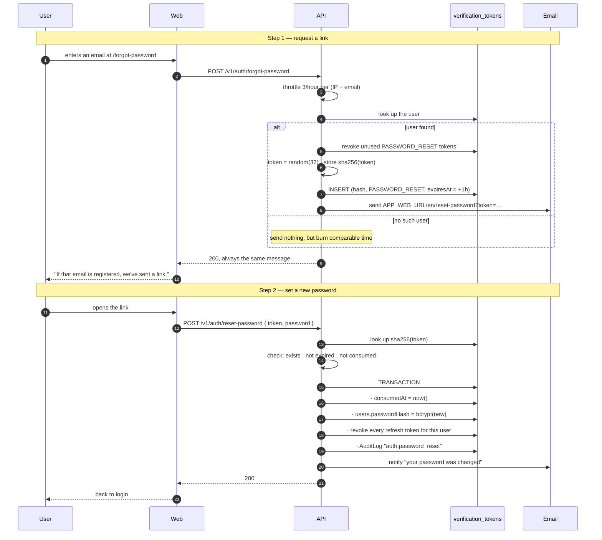
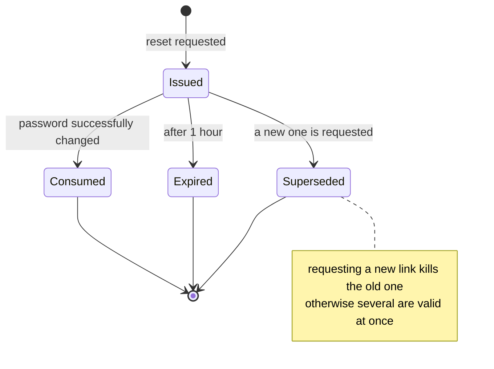

# Forgot password

<Status value="planned" />

This flow is a **password bypass**, so it deserves extra care. Whoever controls it controls the account.

## Two steps



## Preventing email enumeration

::: danger The single most important rule on this page
`POST /v1/auth/forgot-password` must return **`200` with the same message in comparable time**, whether or not the email exists.

Return `404` for unknown emails and this endpoint becomes a tool for discovering who has an account here — valuable for phishing and credential stuffing.
:::

```ts
async forgotPassword(input: ForgotPassword): Promise<{ message: string }> {
  const user = await this.users.findByEmail(input.email);

  if (user && user.status === "ACTIVE") {
    await this.verification.issueAndSend(user, "PASSWORD_RESET");
  } else {
    // approximate the time it takes to queue a real email
    await sleep(randomInt(180, 320));
  }

  return { message: "If that email is registered, we've sent a reset link." };
}
```

::: tip Comparable, not identical
The goal is to bury the difference in network noise, not achieve perfect equality, which isn't possible. What matters more is that **sending is asynchronous** — waiting on SMTP before returning creates a gap too large to hide.
:::

## Token lifecycle



| Rule | Value | Why |
| --- | --- | --- |
| Lifetime | 1 hour | Shorter than email verification (24h) because it's far more dangerous |
| Uses | One | `consumedAt` is set in the same transaction as the password change |
| Concurrently valid | One | Requesting a new one revokes all previous |
| Storage | SHA-256 | A database leak can't reset anyone's password |
| Length | 32 bytes base64url | 256 bits, unguessable |
| Transport | Query string in the link | Acceptable given the short life and single use |

## Setting the new password

```ts
export const ResetPasswordSchema = z.object({
  token: z.string().min(32),
  password: PasswordSchema,           // the same policy as signup
  confirmPassword: z.string(),
}).refine((v) => v.password === v.confirmPassword, {
  message: "Passwords do not match",
  path: ["confirmPassword"],
});
```

```ts
async resetPassword(input: ResetPassword) {
  const tokenHash = sha256(input.token);

  await this.prisma.$transaction(async (tx) => {
    const row = await tx.verificationToken.findUnique({ where: { tokenHash } });

    if (!row || row.purpose !== "PASSWORD_RESET") throw Errors.tokenInvalid();
    if (row.consumedAt) throw Errors.tokenAlreadyUsed();
    if (row.expiresAt < new Date()) throw Errors.tokenExpired();

    await tx.verificationToken.update({
      where: { id: row.id },
      data: { consumedAt: new Date() },
    });

    await tx.user.update({
      where: { id: row.userId },
      data: {
        passwordHash: await bcrypt.hash(input.password, 12),
        // completing a reset proves they control the mailbox
        emailVerifiedAt: row.consumedAt ?? new Date(),
      },
    });

    // 🔑 end every session — anyone holding a stolen one is cut off
    await tx.refreshToken.updateMany({
      where: { userId: row.userId, revokedAt: null },
      data: { revokedAt: new Date() },
    });

    await tx.auditLog.create({
      data: {
        actorId: row.userId,
        action: "auth.password_reset",
        subjectType: "User",
        subjectId: row.userId,
        traceId: getTraceId(),
      },
    });
  });

  await this.mail.sendPasswordChangedNotice(userEmail);
  return { message: "Your password has been changed." };
}
```

::: danger A password change must revoke every session
The main reason people reset a password is *suspecting their account was compromised.* Skip revoking refresh tokens and the intruder who already has a session stays inside for another seven days despite the new password — which makes the reset nearly meaningless.
:::

::: tip Always notify by email
Send "your password was changed at … from IP …" every time. If it wasn't them, that email is the only signal they'll get. It must contain **no actionable links** — say to contact an administrator instead, so the email doesn't become a phishing template itself.
:::

## Page specs

### `/[locale]/(auth)/forgot-password`

```
┌────────────────────────────────────┐
│         Forgot password             │
│  Enter your email and we'll send    │
│  you a reset link.                  │
│  Email                              │
│  [                              ]   │
│  [        Send reset link        ]  │
│           ← Back to sign in         │
└────────────────────────────────────┘
```

On success, **replace the whole form** with a confirmation. Don't leave it there to be hammered.

```
┌────────────────────────────────────┐
│              ✉️                     │
│         Check your email            │
│  If ann@example.com is registered,  │
│  we've sent a reset link.           │
│  The link expires in 1 hour.        │
│  Resend available in 0:47           │
└────────────────────────────────────┘
```

### `/[locale]/(auth)/reset-password?token=…`

| State | UI |
| --- | --- |
| Loading | Skeleton |
| Token valid | New-password form with a strength meter |
| Token invalid | "This link isn't valid" + request a new one |
| Token expired | "This link has expired" + request a new one |
| Token already used | "This link was already used" + link to sign in |
| Success | "Password changed" → go to sign in |

::: tip Don't validate the token on page load
Calling the API when the page loads means a browser prefetch or an email scanner can burn the link. Render the form immediately and validate on submit.
:::

## Rate limits

| Endpoint | Limit | Counted per |
| --- | --- | --- |
| `POST /v1/auth/forgot-password` | 3/hour | IP + email |
| `POST /v1/auth/forgot-password` | 20/hour | IP alone |
| `POST /v1/auth/reset-password` | 10/hour | IP |

The first stops spamming one person's inbox; the second stops harvesting many addresses from one machine.

## Changing a password while signed in

Different from a reset — this one requires the current password.

```ts
export const ChangePasswordSchema = z.object({
  currentPassword: z.string().min(1),
  newPassword: PasswordSchema,
  confirmPassword: z.string(),
}).refine((v) => v.newPassword === v.confirmPassword, { path: ["confirmPassword"] })
  .refine((v) => v.newPassword !== v.currentPassword, {
    message: "The new password must differ from the current one",
    path: ["newPassword"],
  });
```

`POST /v1/users/me/password` — verify the current password, set the new one, then revoke **every session except the current device**. Someone who just changed their own password shouldn't be thrown out of the page they're using.

::: warning Current code status
| Target spec | Code today |
| --- | --- |
| `POST /v1/auth/forgot-password` + `reset-password` | Neither exists |
| A `VerificationToken` table | Doesn't exist |
| Ability to send email | No mailer — see [Transactional email](/en/backend/email) |
| Session revocation on password change | No refresh table to revoke |
| Throttling | No `@nestjs/throttler` |
| The pages | Don't exist |
:::
