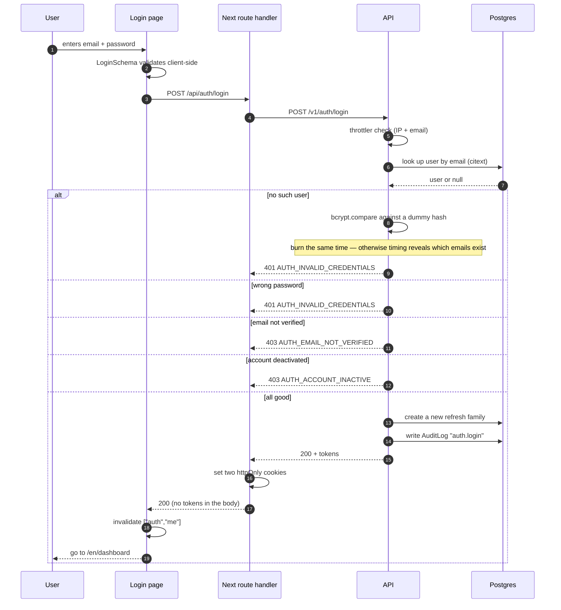

# Login

<Status value="in-progress" note="endpoint exists · page does not" />

## Contract

`LoginSchema` already lives in `packages/contracts/src/auth.schema.ts`:

```ts
export const LoginSchema = z.object({
  email: z.email(),
  password: z.string().min(8).max(72),   // 72 = bcrypt's ceiling
});
```

| | Value |
| --- | --- |
| Endpoint | `POST /v1/auth/login` |
| Auth | `@Public()` |
| Body | `LoginSchema` |
| Success | `200` + `AuthTokensSchema`, and two cookies set |
| Failure | `401 AUTH_INVALID_CREDENTIALS` · `403 AUTH_EMAIL_NOT_VERIFIED` · `403 AUTH_ACCOUNT_INACTIVE` · `429 RATE_LIMIT_EXCEEDED` |
| Throttle | 5 per minute per (IP + email) |

## Flow



::: danger Response time must not vary
When the email doesn't exist, **still run `bcrypt.compare` against a dummy hash**. bcrypt costs hundreds of milliseconds; returning early on a missing user makes it trivially measurable which emails are registered.

```ts
// hash of a random string, computed once at boot
const DUMMY_HASH = await bcrypt.hash(randomBytes(32).toString("hex"), 10);

const user = await this.users.findByEmail(input.email);
const ok = await bcrypt.compare(input.password, user?.passwordHash ?? DUMMY_HASH);
if (!user || !ok) throw Errors.invalidCredentials();
```
:::

::: tip One message for every failure
"Incorrect email or password" and nothing else. Never split it into "no such account" and "wrong password" — the first is a ready-made tool for checking who has registered with you.
:::

## Service

```ts
async login(input: Login, meta: RequestMeta): Promise<AuthTokens> {
  const user = await this.users.findByEmail(input.email);

  const passwordOk = await bcrypt.compare(input.password, user?.passwordHash ?? DUMMY_HASH);
  if (!user || !passwordOk) throw Errors.invalidCredentials();

  // Google-only accounts have no passwordHash
  if (!user.passwordHash) throw Errors.passwordNotSet();
  if (!user.emailVerifiedAt) throw Errors.emailNotVerified();
  if (user.status !== "ACTIVE") throw Errors.accountInactive();

  const familyId = uuidv7();
  const refreshToken = await this.refreshTokens.issue(user.id, familyId, meta);
  const accessToken = this.signAccessToken({
    id: user.id,
    email: user.email,
    roles: user.roles.map((r) => r.role.key),
  });

  await this.audit.record("auth.login", { subjectType: "User", subjectId: user.id });
  return { accessToken, refreshToken };
}
```

::: tip Check order matters
Verify the password **before** checking account state. Check `status` first and someone who doesn't know the password still learns from `403 AUTH_ACCOUNT_INACTIVE` that the account exists.
:::

## Rate limiting

```ts
@Public()
@Throttle({ default: { limit: 5, ttl: 60_000 } })
@UseGuards(LoginThrottlerGuard)
@Post("login")
login(@Body() body: LoginDto, @Req() req: Request) { … }
```

```ts
// count per (IP + email), not per IP alone
// per-IP only: everyone behind one router blocks each other
// per-email only: an attacker can lock out anyone whose email they know
@Injectable()
export class LoginThrottlerGuard extends ThrottlerGuard {
  protected async getTracker(req: Record<string, any>): Promise<string> {
    return `${req.ip}:${req.body?.email ?? "unknown"}`;
  }
}
```

`429` must carry a `Retry-After` header.

::: tip Never permanently lock accounts
Locking after N failures lets an attacker lock out anyone whose email they know. Use a time-windowed throttle that recovers on its own.
:::

## Page spec

`apps/web/src/app/[locale]/(auth)/login/page.tsx`

```
┌────────────────────────────────────┐
│               Logo                  │
│            Sign in                  │
│                                     │
│  Email                              │
│  [                              ]   │
│  Password                           │
│  [                          ] 👁     │
│                  Forgot password?   │
│  [           Sign in             ]  │
│  ───────────   or   ───────────    │
│  [  🔵 Continue with Google      ]  │
│                                     │
│  No account? Sign up                │
└────────────────────────────────────┘
```

| Part | Component | Detail |
| --- | --- | --- |
| Form | shadcn `Form` + `Input` | `useForm<Login>({ resolver: zodResolver(LoginSchema) })` |
| Password | `Input type=password` + reveal toggle | Needs an `aria-label` and `autocomplete="current-password"` |
| Primary button | `Button` | Disabled with a spinner while `isPending` |
| Google | `Button variant=outline` | Links to `/v1/auth/google` |
| Errors | `Alert variant=destructive` | Above the form, using `t(error.code)` |
| Language | `LocaleSwitcher` | Top right |

### States to handle

| State | UI |
| --- | --- |
| Empty | Button enabled (validate on submit) |
| Submitting | Button disabled + spinner, inputs locked |
| Validation failed | Message under the field, focus the first invalid one |
| Authentication failed | Alert "Incorrect email or password" and clear the password field |
| Email not verified | Alert plus a "Resend verification email" button |
| Account deactivated | Alert "This account is suspended. Contact an administrator." |
| Rate limited | Alert with a countdown from `Retry-After` |
| Server error | Alert plus a copyable trace id |

### Form code

```tsx
"use client";
const t = useTranslations("auth.login");
const tError = useTranslations("errors");
const router = useRouter();

const form = useForm<Login>({
  resolver: zodResolver(LoginSchema),
  defaultValues: { email: "", password: "" },
});

const mutation = useMutation({
  mutationFn: (values: Login) =>
    fetch("/api/auth/login", {
      method: "POST",
      headers: { "content-type": "application/json" },
      body: JSON.stringify(values),
    }).then(handleResponse),

  onSuccess: () => {
    // the route handler already set the cookies — clear the cache and move on
    queryClient.invalidateQueries({ queryKey: ["auth", "me"] });
    router.push("/dashboard");
  },

  onError: (error) => {
    if (!(error instanceof ApiError)) return;
    form.resetField("password");
    // login errors are form-level, not tied to one field
    form.setError("root", { message: tError(error.code) });
  },
});
```

::: tip Post through a Next route handler, not straight to the API
`/api/auth/login` is a server-side route handler. It calls the API and converts the returned tokens into httpOnly cookies, which page JavaScript can't read. Calling the API directly from the browser would route the tokens through JavaScript first, which is exactly what XSS exploits. See [Client session](/en/frontend/auth-client).
:::

### Accessibility and usability

- A real `<form>` so Enter submits
- `autocomplete="email"` and `autocomplete="current-password"` for password managers
- Field errors linked via `aria-describedby`
- Form-level alerts use `role="alert"` so screen readers announce them
- Focus the email field on load
- Never set `maxlength` below 72 on the password field

### i18n messages

```json
// apps/web/messages/en.json
{
  "auth": {
    "login": {
      "title": "Sign in",
      "email": "Email",
      "password": "Password",
      "submit": "Sign in",
      "forgot": "Forgot password?",
      "orContinueWith": "or",
      "google": "Continue with Google",
      "noAccount": "No account?",
      "signUp": "Sign up",
      "resendVerification": "Resend verification email"
    }
  }
}
```

Every key must also exist in `th.json`.

## After a successful login

1. Set `access_token` (15 min) and `refresh_token` (7 days) — `httpOnly`, `secure` in production, `sameSite=lax`, `path=/`
2. `invalidateQueries(["auth","me"])` to fetch the fresh profile and CASL rules
3. Redirect to `?next=` if present, otherwise `/dashboard`

::: danger Validate `?next=` before using it
`?next=https://evil.com` is an open redirect. Accept only paths starting with `/` and not `//`:

```ts
const raw = searchParams.get("next");
const next = raw && raw.startsWith("/") && !raw.startsWith("//") ? raw : "/dashboard";
```
:::

::: warning Current code status
| Target spec | Code today |
| --- | --- |
| A login page | None — `apps/web` has only a home page |
| A route handler setting cookies | None |
| Constant-time bcrypt comparison | `auth.service.ts` returns early when the user is missing — **timing reveals which emails exist** |
| Account state and verification checks | Those columns don't exist in the schema |
| Throttling | No `@nestjs/throttler` |
| Access tokens carry `roles` | The payload has only `sub` and `email` |
| `AuditLog` | No such table |
| Routes under `/v1` | It's `POST /auth/token` (grant_type=password) — login and refresh are merged into one OAuth2-shaped endpoint so Swagger UI can auto-attach the token. See [OpenAPI § OAuth2 password flow](/en/backend/openapi) |
:::
