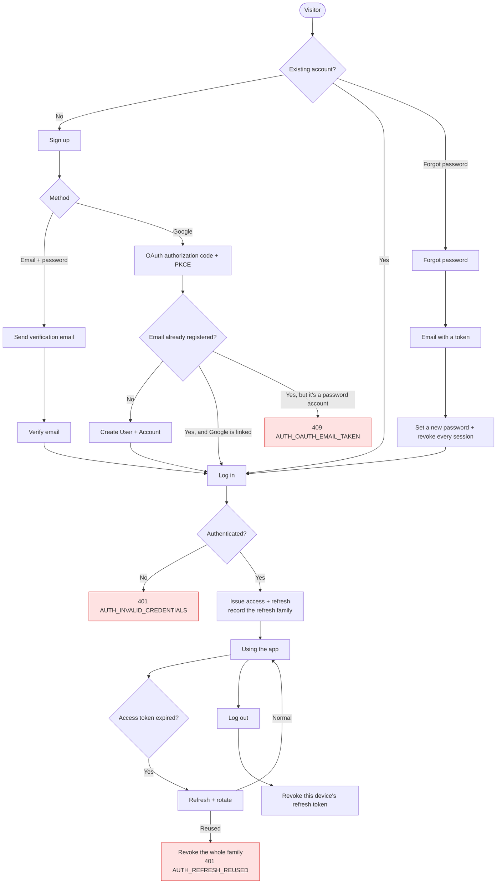

# Auth overview

<Status value="in-progress" />

A map of every identity and permission flow. Read this before diving into a specific page.

## Authentication ≠ authorization

| | Authentication (authn) | Authorization (authz) |
| --- | --- | --- |
| Answers | "Who are you?" | "What may you do?" |
| Mechanism | JWT + Passport | CASL abilities |
| Failure | `401` | `403` |
| Docs | [JWT & rotation](/en/auth/tokens) | [CASL](/en/auth/casl) |

Confuse these two and the permission system falls apart. `401` means "I don't know who you are, go log in"; `403` means "I know exactly who you are, and no".

## Flow map



## Every token in the system

| Kind | Lifetime | Stored in | Contains | Revocable |
| --- | --- | --- | --- | --- |
| **Access token** | 15 minutes | httpOnly cookie (or memory) | `sub`, `email`, `roles`, `jti` | No — you wait it out |
| **Refresh token** | 7 days | httpOnly cookie only | `sub`, `familyId`, `jti` | Yes — hashed in a table |
| **Email verify token** | 24 hours | A link in an email | 256 random bits | Single use |
| **Password reset token** | 1 hour | A link in an email | 256 random bits | Single use |

::: tip Why access tokens live only 15 minutes
A JWT is inherently unrevocable — it proves itself without asking the database, which is the speed benefit, but it also means a leaked one works until it expires. A short lifetime caps the damage. Refresh tokens can live longer because they **are** revocable (hashed rows in a table).
:::

### Access token claims

```json
{
  "sub": "0192f8a1-4c2e-7b3d-9f01-2a4c6e8b0d13",
  "email": "ann@example.com",
  "roles": ["manager"],
  "jti": "0192f8a1-…",
  "iat": 1786000000,
  "exp": 1786000900
}
```

::: danger Never put the full rule set in a JWT
Carry `roles`, not CASL rules. Otherwise (a) the JWT grows past what proxies accept in a header, and (b) changing a role's permissions has no effect until every token expires. The API builds abilities fresh per request; the UI fetches rules from `/v1/auth/me` — see [CASL](/en/auth/casl).
:::

## Endpoints

| Method | Path | Auth | Purpose | Status |
| --- | --- | --- | --- | --- |
| `POST` | `/v1/auth/login` | — | Email + password → tokens | <Status value="in-progress" inline /> |
| `POST` | `/v1/auth/refresh` | refresh cookie | Rotate and return a new pair | <Status value="in-progress" inline /> |
| `POST` | `/v1/auth/logout` | ✅ | Revoke this device's refresh token | <Status value="planned" inline /> |
| `POST` | `/v1/auth/logout-all` | ✅ | Revoke every session | <Status value="planned" inline /> |
| `GET` | `/v1/auth/me` | ✅ | Profile + CASL rules | <Status value="planned" inline /> |
| `POST` | `/v1/auth/register` | — | Password signup | <Status value="planned" inline /> |
| `GET` | `/v1/auth/google` | — | Start OAuth | <Status value="planned" inline /> |
| `GET` | `/v1/auth/google/callback` | — | OAuth callback | <Status value="planned" inline /> |
| `POST` | `/v1/auth/verify-email` | — | Consume a verification token | <Status value="planned" inline /> |
| `POST` | `/v1/auth/forgot-password` | — | Request a reset link | <Status value="planned" inline /> |
| `POST` | `/v1/auth/reset-password` | — | Set a new password with a token | <Status value="planned" inline /> |
| `POST` | `/v1/users/me/password` | ✅ | Change password (knows the current one) | <Status value="planned" inline /> |

## Principles

| Principle | How |
| --- | --- |
| **Always enforce server-side** | The UI hides buttons for looks, not safety. Every endpoint has its own guard |
| **Closed by default** | `JwtAuthGuard` is global; opt out with `@Public()`, never opt in one route at a time |
| **Store hashes only** | Passwords → bcrypt · refresh and verification tokens → SHA-256 |
| **Answer identically** | A wrong email and a wrong password produce the same error in the same time |
| **Rotate on renewal** | Every refresh kills the old token; reusing an old one kills the family |
| **Password change ends every session** | Both for resets and for deliberate changes |
| **Audit the important events** | login, logout, password change, role change → `AuditLog` with the trace id |

::: danger `@Public()` must be opt-out, not opt-in
Today it's opt-in — a route that forgets `@UseGuards(JwtAuthGuard)` is silently public, which has already happened: `POST /users` is unguarded. Flip to a global guard plus `@Public()` and forgetting produces "too strict" instead of "wide open".
:::

## Browser sessions

Short version: both tokens go in **httpOnly cookies**, never `localStorage`.

| | httpOnly cookie | localStorage |
| --- | --- | --- |
| Stealable by XSS | No | **Yes** |
| Needs CSRF defence | Yes (`SameSite=Lax` + double-submit) | No |
| Readable in Server Components | Yes | No |
| Attached automatically | Yes | You write that code |

XSS is far more dangerous than CSRF because it runs arbitrary code as the user, and CSRF has straightforward defences. Full reasoning in [ADR-0006](/en/adr/0006-token-storage-httponly-cookie); implementation in [Client session](/en/frontend/auth-client).

## Threats covered

| Threat | Mitigation | Page |
| --- | --- | --- |
| Password brute force | Throttle 5/min per IP+email, with backoff | [Login](/en/auth/login) |
| Email enumeration | Identical messages and timing everywhere | [Forgot password](/en/auth/forgot-password) |
| Stolen token reuse | Rotation + reuse detection | [JWT & rotation](/en/auth/tokens) |
| XSS session theft | httpOnly cookies | [Client session](/en/frontend/auth-client) |
| CSRF | `SameSite=Lax` + double-submit token | [Client session](/en/frontend/auth-client) |
| Privilege escalation | CASL forbids editing your own roles | [CASL](/en/auth/casl) |
| Data leaks via filtering | `accessibleBy()` composed into every `where` | [CASL](/en/auth/casl) |
| Deleting the last admin | `USER_LAST_ADMIN` | [Error codes](/en/reference/error-codes) |

::: warning Current code status
| Target spec | Code today |
| --- | --- |
| 12 endpoints | 2 exist: `POST /auth/login`, `POST /auth/refresh` |
| Refresh rotates and can be revoked | `auth.service.ts` verifies and re-signs; the same token is reusable indefinitely |
| Global guard + `@Public()` | Opt-in per route — `POST /users` is **public** |
| CASL authorization | `@casl/*` isn't installed; only authentication exists |
| Tokens in httpOnly cookies | The API returns tokens in the body; there's no client side yet |
| Login throttling | No `@nestjs/throttler` |
| `AuditLog` | No such table |
:::
