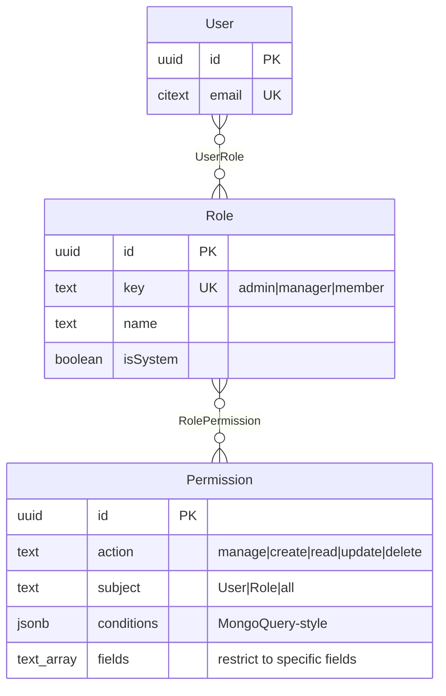
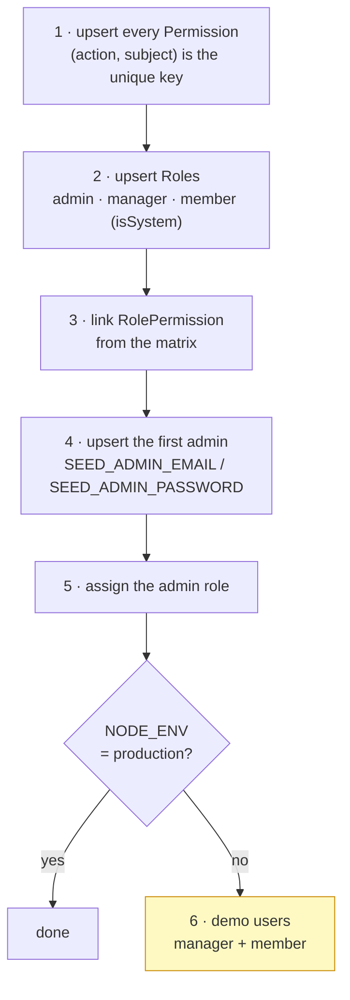

# Role & permission model

<Status value="planned" />

The data model for permissions. The engine that enforces them is at [CASL](/en/auth/casl).

## Shape



**User → Role → Permission**, two hops. Permissions are never attached to a user directly.

::: tip Why users can't hold permissions directly
Because the moment they can, everyone becomes a special case, and "why can this person do that?" stops having an answer. Everything goes through roles — needing a new permission set means creating a role, which forces you to name it and explain what it's for.
:::

## Starter roles

| key | Name | `isSystem` | Purpose |
| --- | --- | --- | --- |
| `admin` | Administrator | ✅ | Everything, including managing roles |
| `manager` | Manager | ✅ | Manages users but never touches roles |
| `member` | Member | ✅ | Manages only their own data |

`isSystem = true` means the role can't be deleted or re-keyed through the UI (`ROLE_SYSTEM_IMMUTABLE`) — that's what stops someone deleting `admin` and locking everyone out. Roles created later are freely deletable when nobody holds them.

::: danger There must always be at least one administrator
Anything that would leave the system with no user holding `admin` must be blocked with `USER_LAST_ADMIN` — that covers removing the role, deactivating the account, and deleting the user. Check inside the same transaction as the change, not before it; otherwise two concurrent requests both slip through.
:::

## Vocabulary

### Actions

| Action | Covers |
| --- | --- |
| `manage` | **Everything** — CASL's wildcard |
| `create` | Create new records |
| `read` | List and view |
| `update` | Modify |
| `delete` | Remove |

### Subjects

| Subject | Maps to |
| --- | --- |
| `all` | **Everything** — CASL's wildcard |
| `User` | the `User` model |
| `Role` | the `Role` model |
| `Permission` | the `Permission` model |
| `AuditLog` | the `AuditLog` model |
| `File` | the `File` model |

Subject names must match Prisma model names exactly, because `@casl/prisma` uses them to bind rules to queries.

## Permission matrix

| Subject | Action | admin | manager | member |
| --- | --- | :-: | :-: | :-: |
| `all` | `manage` | ✅ | | |
| `User` | `create` | | ✅ | |
| `User` | `read` | | ✅ | own |
| `User` | `update` | | ✅ except self¹ | own² |
| `User` | `delete` | | ✅ except self | |
| `Role` | `read` | | ✅ | |
| `Role` | `create` `update` `delete` | ✅ | | |
| `Permission` | `read` | | ✅ | |
| `AuditLog` | `read` | ✅ | | |
| `File` | `create` | | ✅ | ✅ |
| `File` | `read` `delete` | | ✅ | own |

¹ `manager` can edit users but not their **roles** — a field-level restriction, not a subject-level one
² `member` may change only `displayName`, `avatarFileId`, `locale`, `theme` on their own record

::: danger Field-level restrictions prevent self-escalation
If `manager` had unrestricted `update User`, they could set their own role to `admin` immediately. Rules must therefore name the allowed `fields` and carry `conditions` that exclude self:

```ts
can("update", "User", ["displayName", "email", "status"], { id: { $ne: user.id } });
```
:::

## How rules are stored

One `Permission` row is exactly one CASL rule.

| `action` | `subject` | `conditions` | `fields` |
| --- | --- | --- | --- |
| `manage` | `all` | `null` | `{}` |
| `read` | `User` | `null` | `{}` |
| `update` | `User` | `{"id": {"$ne": "${user.id}"}}` | `{displayName,email,status}` |
| `read` | `User` | `{"id": "${user.id}"}` | `{}` |
| `update` | `User` | `{"id": "${user.id}"}` | `{displayName,avatarFileId,locale,theme}` |

`${user.id}` is a placeholder substituted when the ability is built for the signed-in user — which is how rules stay data rather than being tied to one person. See [CASL](/en/auth/casl).

::: warning `conditions` comes from the database and must be validated
`conditions` is a `Json` column fed into a permission evaluator — anyone who can edit those rows can write arbitrary rules. So: (a) only `admin` may modify `Permission`, (b) validate `conditions` with zod before constructing an ability, (c) allow only the operators you need (`$eq`, `$ne`, `$in`, `$nin`), not all of MongoQuery.
:::

## Seeding



```ts
// apps/api/prisma/seed.ts
const PERMISSIONS = [
  { action: "manage", subject: "all" },
  { action: "create", subject: "User" },
  { action: "read", subject: "User" },
  { action: "update", subject: "User", fields: ["displayName", "email", "status"],
    conditions: { id: { $ne: "${user.id}" } } },
  // …
] as const;

const ROLE_PERMISSIONS: Record<string, Array<[string, string]>> = {
  admin: [["manage", "all"]],
  manager: [["create", "User"], ["read", "User"], ["update", "User"], ["delete", "User"],
            ["read", "Role"], ["read", "Permission"]],
  member: [["read", "User"], ["update", "User"], ["create", "File"]],
};
```

The seeder must be **idempotent** — all `upsert`, repeatable with identical results. That's necessary because seeding runs on every deploy so newly added permissions reach the database.

::: danger Demo data must never reach production
The `demo@example.com` / `password123` account belongs inside `if (process.env.NODE_ENV !== "production")` in the seed itself, not behind an assumption that nobody runs it in the wrong place. And `SEED_ADMIN_PASSWORD` must be forced to change on first login.
:::

## Adding a role

1. Add the key to `ROLE_PERMISSIONS` in the seeder
2. Add a column to the matrix on this page **and** the Thai version
3. Add any new permission pairs to `PERMISSIONS`
4. Re-run the seed
5. If it affects the UI, add a permission card to the role settings page

::: tip Administrators can also create roles from the UI
Roles with `isSystem = false` can be created, edited, and deleted through settings. The three starter roles are sensible defaults, not a limit. But **every permission must come from the seeded list** — administrators choose which permissions a role has; they cannot author new permissions from the UI, because that would mean feeding arbitrary rules into the permission evaluator.
:::

::: warning Current code status
| Target spec | Code today |
| --- | --- |
| `Role`, `Permission`, `UserRole`, `RolePermission` tables | **None of them** — `schema.prisma` has only `User` |
| Seeded roles and permissions | `seed.ts` upserts one user |
| A "must keep one admin" check | Doesn't exist |
| Field-level restrictions | There's no permission system at all |
| Demo data gated from production | No `NODE_ENV` guard — `demo@example.com` would be created anywhere |
:::
