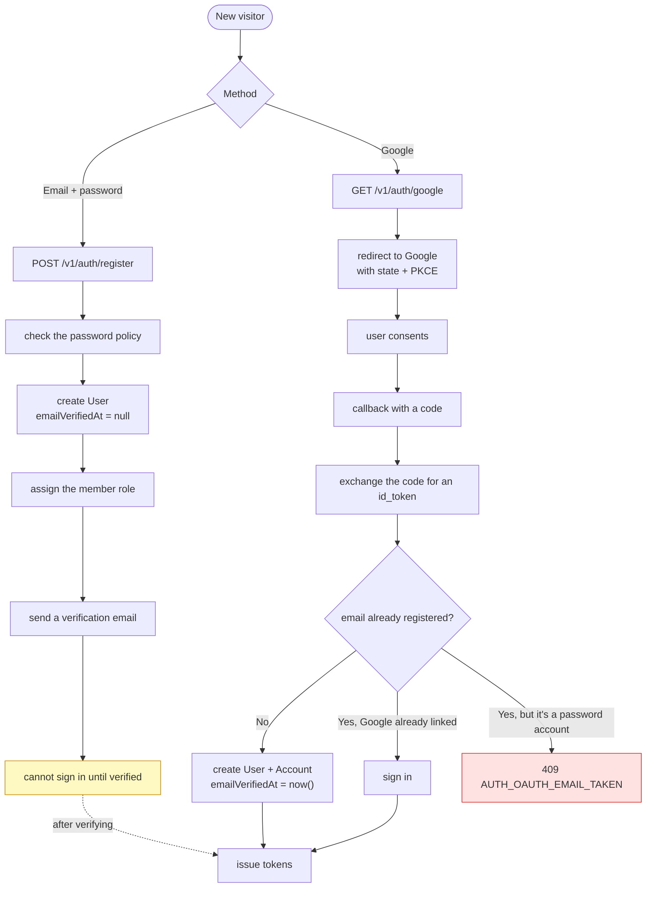
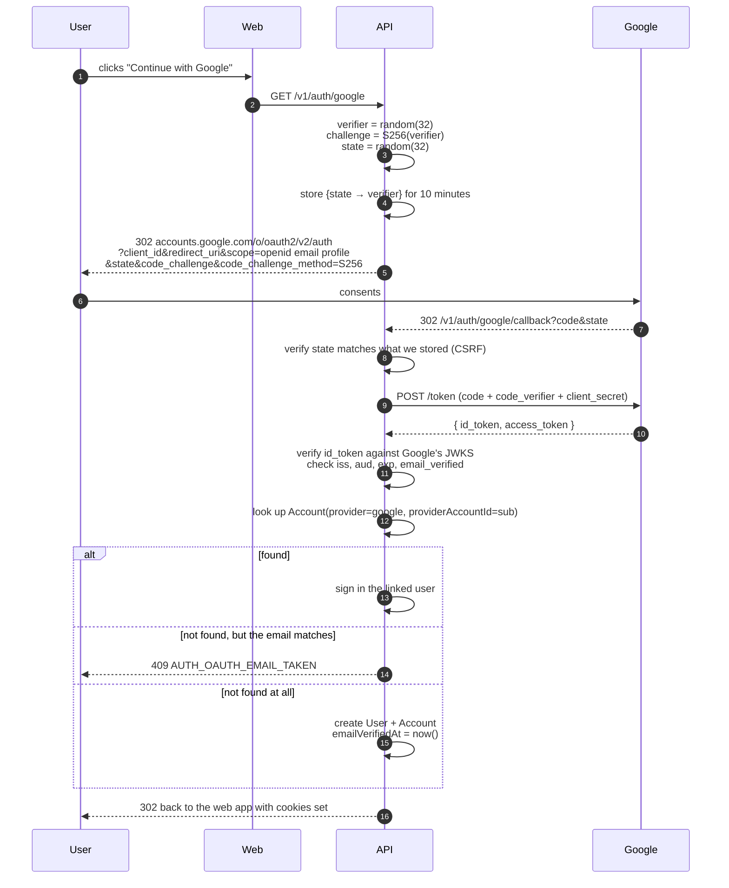

# Signup & Google OAuth

<Status value="planned" />

::: danger Existing security problem
`POST /users` in `apps/api/src/users/users.controller.ts` has **no guard**. Anyone who can reach the API can create unlimited accounts. Pick one immediately: turn it into a controlled `POST /v1/auth/register` per this page, or guard it and make it an admin-only user-creation endpoint.
:::

## Two ways in



## Email + password signup

### Contract

```ts
// packages/contracts/src/auth.schema.ts
export const RegisterSchema = z
  .object({
    email: z.email().max(255),
    displayName: z.string().trim().min(1).max(120),
    password: PasswordSchema,
    confirmPassword: z.string(),
    acceptTerms: z.literal(true),
  })
  .refine((v) => v.password === v.confirmPassword, {
    message: "Passwords do not match",
    path: ["confirmPassword"],
  });
export type Register = z.infer<typeof RegisterSchema>;
```

### Password policy

```ts
export const PasswordSchema = z
  .string()
  .min(12, "Must be at least 12 characters")
  .max(72, "Must be at most 72 characters")   // bcrypt's ceiling
  .refine((p) => !/^\s|\s$/.test(p), "Cannot start or end with whitespace");
```

::: tip Length beats composition rules
NIST SP 800-63B no longer recommends forcing uppercase/digit/symbol requirements — they push people toward `Password1!`, which is easier to guess than a long memorable phrase. Require 12 characters and check against breach lists instead.

Note this `min(12)` is stricter than `LoginSchema`'s `min(8)` on purpose. Login must never be stricter than signup, or people with older 8-character passwords get locked out.
:::

You should also check passwords against breach corpora using Have I Been Pwned's k-anonymity API, which sends only the first five hex characters of the SHA-1 — never the password.

### Service

```ts
async register(input: Register): Promise<{ message: string }> {
  const existing = await this.users.findByEmail(input.email);

  // identical response whether or not the account exists — otherwise signup becomes an email checker
  if (existing) {
    await this.mail.sendAccountExistsNotice(input.email);
    return { message: "If that email can be used, we've sent a verification link." };
  }

  const memberRole = await this.prisma.role.findUniqueOrThrow({ where: { key: "member" } });

  const user = await this.prisma.user.create({
    data: {
      email: input.email,
      displayName: input.displayName,
      passwordHash: await bcrypt.hash(input.password, 12),
      roles: { create: { roleId: memberRole.id } },
    },
  });

  await this.verification.issueAndSend(user, "EMAIL_VERIFY");
  await this.audit.record("auth.register", { subjectType: "User", subjectId: user.id });

  return { message: "If that email can be used, we've sent a verification link." };
}
```

::: danger Signup leaks accounts just like forgot-password does
"That email is already in use" is a tool for checking who has registered with you. Return a neutral message and email the existing owner instead: "someone tried to sign up with this address; if that was you, use forgot password." The real owner gets the full story; a prober gets nothing.

The trade-off is slightly worse UX. If that leak is acceptable for your context — an internal system where membership is already public — return `409 USER_EMAIL_TAKEN` directly. Just make it a deliberate choice.
:::

bcrypt cost 12 is the 2026 sweet spot: roughly 250 ms per hash on typical server hardware. Slow enough to make brute force expensive, fast enough not to become a DoS vector.

## Google OAuth

### Why PKCE



::: danger `state` must always be verified
Without it, an attacker sends a victim a callback link containing **the attacker's own** `code`. The victim silently ends up logged into the attacker's account, and everything they type from then on lands in the attacker's hands. `state` must be random, bound to the session, and single-use.
:::

::: danger Verify the `id_token` yourself
Never trust a decoded `id_token`. Check the signature against Google's JWKS, and verify `iss` is `https://accounts.google.com`, `aud` is your client id, `exp` is in the future, and **`email_verified` is `true`**. Skip `email_verified` and an attacker can create a Google Workspace account on a domain they control while claiming someone else's address.
:::

### Account-linking rules

| Situation | Result |
| --- | --- |
| No `Account`, no such email | Create `User` + `Account`, set `emailVerifiedAt = now()` |
| `Account` exists (provider + sub match) | Sign that user in |
| No `Account`, but the email belongs to a password account | **`409 AUTH_OAUTH_EMAIL_TAKEN`** — never link automatically |
| No `Account`, email already linked to a different Google account | `409` — two Google accounts on one email is impossible |

::: danger Never auto-link on a matching email
"Same email means same person" is an account-takeover hole. If an attacker can get a Google account carrying the victim's address (on a domain they control), they immediately own the victim's account. Linking must be initiated by an already-authenticated user from their profile settings.
:::

Users can then link Google from their profile page, where we already know they own the account because they're signed in.

### Required env

| Variable | Notes |
| --- | --- |
| `GOOGLE_CLIENT_ID` | From the Google Cloud Console |
| `GOOGLE_CLIENT_SECRET` | 🔒 |
| `GOOGLE_CALLBACK_URL` | Must match the registered URI character for character |

A mismatched `redirect_uri` is the number one cause of `redirect_uri_mismatch` — even a trailing slash breaks it. [EnvSchema](/en/platform/config) requires all three or none.

## Signup page spec

`apps/web/src/app/[locale]/(auth)/signup/page.tsx`

```
┌────────────────────────────────────┐
│          Create an account          │
│  [  🔵 Sign up with Google       ]  │
│  ───────────   or   ───────────    │
│  Display name                       │
│  [                              ]   │
│  Email                              │
│  [                              ]   │
│  Password                           │
│  [                          ] 👁     │
│  ▓▓▓▓▓▓░░░░  Strength: good         │
│  Confirm password                   │
│  [                          ]       │
│  ☐ I accept the terms of service    │
│  [        Create account         ]  │
│  Already have an account? Sign in   │
└────────────────────────────────────┘
```

| State | UI |
| --- | --- |
| Submitting | Button disabled + spinner |
| Validation failed | Message under the field, focus the first invalid one |
| Success | Go to "check your email" (do **not** log them in) |
| Google failed | Back to login with `AUTH_OAUTH_FAILED` |
| Email collides with a password account | Alert suggesting they sign in with a password and link from their profile |

::: tip A strength meter informs; it does not enforce
Show a strength bar (zxcvbn or similar) as guidance, but the only blocking rule is `PasswordSchema` — because the server must enforce the identical rule, and zxcvbn scores don't make good hard limits.
:::

## Checklist

- [ ] `POST /users` is closed, or moved to an admin-only endpoint
- [ ] `POST /v1/auth/register` is `@Public()` and throttled
- [ ] Email collisions return a neutral message
- [ ] bcrypt cost is 12
- [ ] New users get the `member` role automatically
- [ ] Sign-in is blocked until the email is verified
- [ ] OAuth uses PKCE and a single-use `state`
- [ ] `id_token` is verified against JWKS, including `email_verified`
- [ ] Accounts are never auto-linked on a matching email
- [ ] `AuditLog` records both `auth.register` and `auth.oauth_link`

::: warning Current code status
| Target spec | Code today |
| --- | --- |
| A controlled `POST /v1/auth/register` | There's `POST /users`, **public and unguarded** |
| `RegisterSchema` + `PasswordSchema` | Only `CreateUserSchema` (`password: min(8).max(72)`) |
| Google OAuth | Nothing at all — no strategy, no env, no `Account` table |
| Verification required before use | No `emailVerifiedAt` column |
| Automatic role assignment | No `Role` table |
| bcrypt cost 12 | `seed.ts` uses the default (10); `users.service.ts` doesn't specify one |
| Neutral response on collision | `users.service.ts` throws `409 Conflict` directly |
:::
