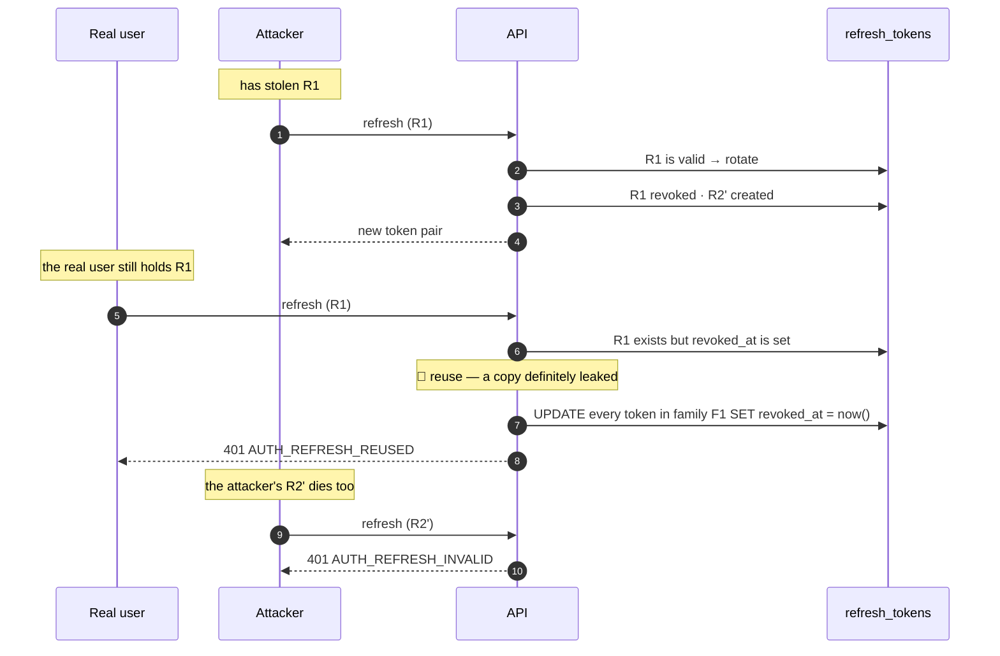
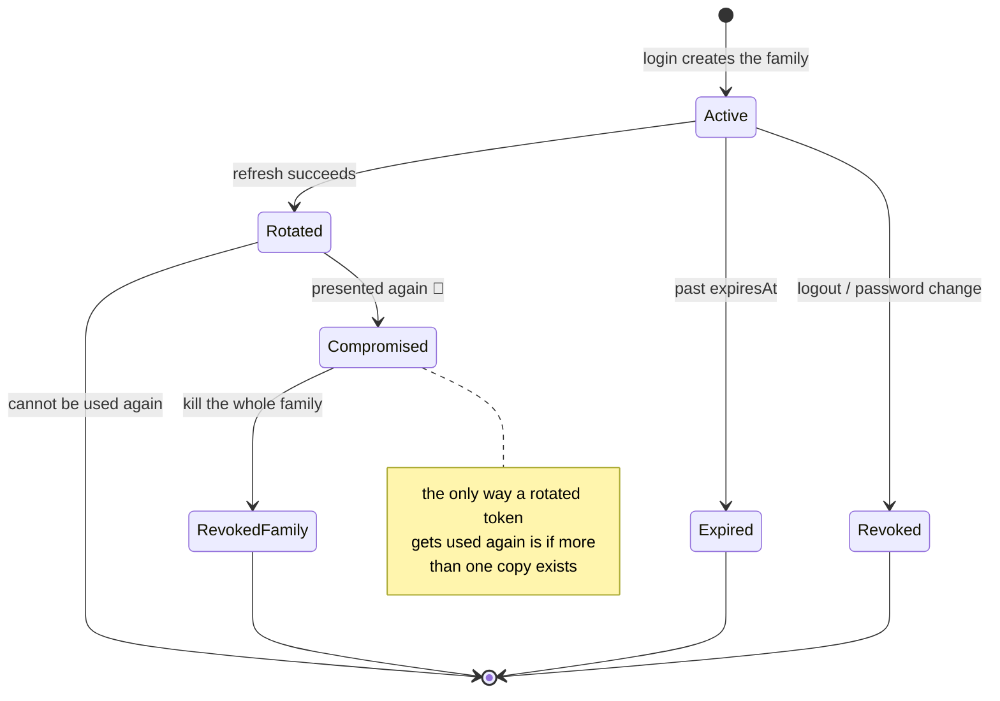

# JWT & refresh rotation

<Status value="in-progress" />

## The problem with non-rotating refresh tokens

Today's code does this:

```ts
async refresh(refreshToken: string) {
  const payload = this.jwtService.verify(refreshToken, { secret: … });
  return this.issueTokens(payload.sub, payload.email);   // the old token still works
}
```

Meaning anyone who obtains a refresh token once **can mint access tokens for seven days with no way to stop them.** Changing the password doesn't help. An administrator can't intervene, because there's nowhere to record that a token is dead.

Rotation fixes that, and additionally lets you *detect* that theft happened.

## The rules

| Rule | Reason |
| --- | --- |
| Every successful refresh marks the old token used and issues a new one | A refresh token is single-use |
| Tokens descended from one login share a `familyId` | Lets you kill a whole session lineage at once |
| Presenting an already-rotated token means a copy leaked → **revoke the family** | Cuts off attacker and owner together; fail safe |
| The database stores SHA-256, never the token | A leak can't be turned into sessions |
| Changing a password revokes every family for that user | Makes the new password actually mean something |

## Rotation on the happy path

```mermaid
sequenceDiagram
  autonumber
  participant C as Client
  participant A as API
  participant D as refresh_tokens

  Note over C,D: login starts a new family
  C->>A: POST /v1/auth/login
  A->>D: INSERT (hash R1, family F1)
  A-->>C: access A1 + refresh R1

  Note over C,D: 15 minutes later, A1 expires
  C->>A: POST /v1/auth/refresh (R1)
  A->>D: look up hash(R1) → valid, not revoked
  A->>D: UPDATE R1 SET revoked_at = now()
  A->>D: INSERT (hash R2, family F1)
  A-->>C: access A2 + refresh R2

  Note over C,D: R1 is dead; only R2 works
```

## Reuse detection



The real user has to log in again, which is annoying — but the alternative is leaving the attacker inside. **Being logged out beats being robbed.**

::: tip Tell the user when this happens
On reuse detection, send an email: "all sessions were cancelled because of suspicious activity", with the time and IP. The user is the only one who knows whether that was them.
:::

## Refresh token states



## Implementation

### Issuing and hashing

```ts
// apps/api/src/auth/refresh-token.service.ts
import { createHash, randomBytes } from "node:crypto";

/** SHA-256, not bcrypt — this is a random 256-bit value we generated; there's nothing to brute-force */
const hash = (token: string) => createHash("sha256").update(token).digest("hex");

@Injectable()
export class RefreshTokenService {
  constructor(private readonly prisma: PrismaService, private readonly config: ConfigService<Env, true>) {}

  async issue(userId: string, familyId: string, meta: { userAgent?: string; ip?: string }) {
    const token = randomBytes(32).toString("base64url");
    const ttlDays = 7;

    await this.prisma.refreshToken.create({
      data: {
        userId,
        familyId,
        tokenHash: hash(token),
        expiresAt: new Date(Date.now() + ttlDays * 86_400_000),
        userAgent: meta.userAgent?.slice(0, 255),
        ip: meta.ip,
      },
    });

    return token;
  }
```

::: tip Why the refresh token isn't a JWT
It doesn't need to carry anything — we hit the database on every use anyway to check revocation. A plain random string is shorter, equally unguessable, and immune to JWT algorithm-confusion problems like `alg: none`.
:::

### Exchange with reuse detection

```ts
  async rotate(presented: string, meta: { userAgent?: string; ip?: string }) {
    const tokenHash = hash(presented);

    // all inside a transaction — two concurrent requests must not both succeed
    return this.prisma.$transaction(async (tx) => {
      const row = await tx.refreshToken.findUnique({ where: { tokenHash } });

      // completely unknown — forged, or already purged
      if (!row) throw Errors.refreshInvalid();

      // 🚨 known but already used — more than one copy exists in the world
      if (row.revokedAt) {
        await tx.refreshToken.updateMany({
          where: { familyId: row.familyId, revokedAt: null },
          data: { revokedAt: new Date() },
        });
        this.logger.warn(
          { traceId: getTraceId(), userId: row.userId, familyId: row.familyId },
          "refresh token reuse detected — revoking family",
        );
        throw Errors.refreshReused();
      }

      if (row.expiresAt < new Date()) throw Errors.refreshInvalid();

      await tx.refreshToken.update({ where: { id: row.id }, data: { revokedAt: new Date() } });
      const next = await this.issue(row.userId, row.familyId, meta);  // same family
      return { userId: row.userId, refreshToken: next };
    });
  }
}
```

::: danger This must be a transaction
Without one, two concurrent refreshes both read the row as valid and both rotate, producing two live tokens in one family — which later triggers a false reuse detection. It's also why the client must implement [single-flight](/en/frontend/auth-client).
:::

### Issuing access tokens

```ts
private signAccessToken(user: { id: string; email: string; roles: string[] }) {
  return this.jwtService.sign(
    { sub: user.id, email: user.email, roles: user.roles, jti: uuidv7() },
    {
      secret: this.config.get("JWT_ACCESS_SECRET", { infer: true }),
      expiresIn: this.config.get("JWT_ACCESS_EXPIRES_IN", { infer: true }),
      issuer: "app-platform",
      audience: "app-platform-web",
    },
  );
}
```

`issuer` and `audience` must also be checked on verification — that stops a token from another system that happens to share a secret (say, after copying config between environments) from being accepted.

### A strategy that distinguishes expired from invalid

```ts
// apps/api/src/auth/strategies/jwt.strategy.ts
@Injectable()
export class JwtStrategy extends PassportStrategy(Strategy) {
  constructor(config: ConfigService<Env, true>) {
    super({
      jwtFromRequest: ExtractJwt.fromExtractors([
        (req: Request) => req.cookies?.access_token ?? null,   // cookie first
        ExtractJwt.fromAuthHeaderAsBearerToken(),              // fallback for other clients
      ]),
      secretOrKey: config.get("JWT_ACCESS_SECRET", { infer: true }),
      issuer: "app-platform",
      audience: "app-platform-web",
      ignoreExpiration: false,
      // tolerate small clock differences between machines
      clockTolerance: 5,
    });
  }

  async validate(payload: AccessTokenPayload) {
    setUserId(payload.sub);   // so later log lines know who acted
    return { id: payload.sub, email: payload.email, roles: payload.roles };
  }
}
```

Then translate passport's errors into codes the client can act on:

```ts
// jwt-auth.guard.ts
handleRequest(err: unknown, user: unknown, info: unknown) {
  if (user) return user;
  if (info instanceof TokenExpiredError) throw Errors.tokenExpired();   // client → refresh
  if (info instanceof JsonWebTokenError) throw Errors.tokenInvalid();   // client → login
  throw Errors.tokenMissing();
}
```

That distinction is what lets the client refresh silently instead of ejecting the user every 15 minutes. See [Error codes](/en/reference/error-codes).

### A global guard

```ts
// app.module.ts
providers: [{ provide: APP_GUARD, useClass: JwtAuthGuard }],
```

```ts
// common/decorators/public.decorator.ts
export const IS_PUBLIC = "isPublic";
export const Public = () => SetMetadata(IS_PUBLIC, true);
```

```ts
// jwt-auth.guard.ts
canActivate(context: ExecutionContext) {
  const isPublic = this.reflector.getAllAndOverride<boolean>(IS_PUBLIC, [
    context.getHandler(),
    context.getClass(),
  ]);
  return isPublic ? true : super.canActivate(context);
}
```

Now `POST /auth/login` carries `@Public()` and everything else is protected automatically — forgetting produces "too strict" rather than "wide open".

## Rotating secrets

Changing `JWT_ACCESS_SECRET` outright logs everyone out. To rotate invisibly, sign with the new secret while accepting both for a window:

```ts
// verify: try the new secret first, then the previous one
const secrets = [config.get("JWT_ACCESS_SECRET"), config.get("JWT_ACCESS_SECRET_PREVIOUS")].filter(Boolean);
```

Drop `JWT_ACCESS_SECRET_PREVIOUS` after longer than `JWT_ACCESS_EXPIRES_IN` (15 minutes).

## Cleanup

`refresh_tokens` grows on every refresh, so it needs a sweep:

```sql
DELETE FROM refresh_tokens
WHERE expires_at < now() - interval '30 days';
```

Keeping expired rows for another 30 days is deliberate — delete them immediately and a post-expiry reuse looks like a plain `AUTH_REFRESH_INVALID` instead of the signal that someone is holding a copy.

::: warning Current code status
| Target spec | Code today |
| --- | --- |
| A `RefreshToken` table with hashes and families | No table; refresh is entirely stateless |
| Rotate on every refresh | `refresh()` just verifies and re-signs — the old token lives until expiry |
| Reuse detection | Impossible; there's no state to compare against |
| logout / logout-all | No endpoints |
| Refresh tokens are random, not JWTs | They're JWTs with the same payload as access tokens |
| `issuer` / `audience` checks | Set neither when signing nor when verifying |
| Expired distinguished from invalid | `JwtAuthGuard` is a bare `AuthGuard("jwt")` — everything is one 401 |
| Global guard + `@Public()` | Opt-in per route; `POST /users` is public |
| Access tokens carry `roles` | The payload has only `sub` and `email` |
:::
