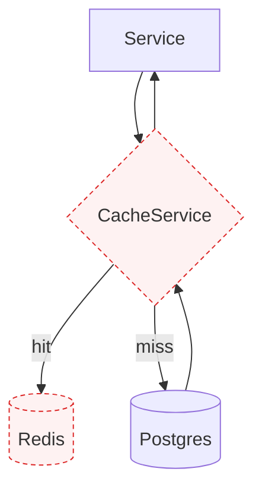
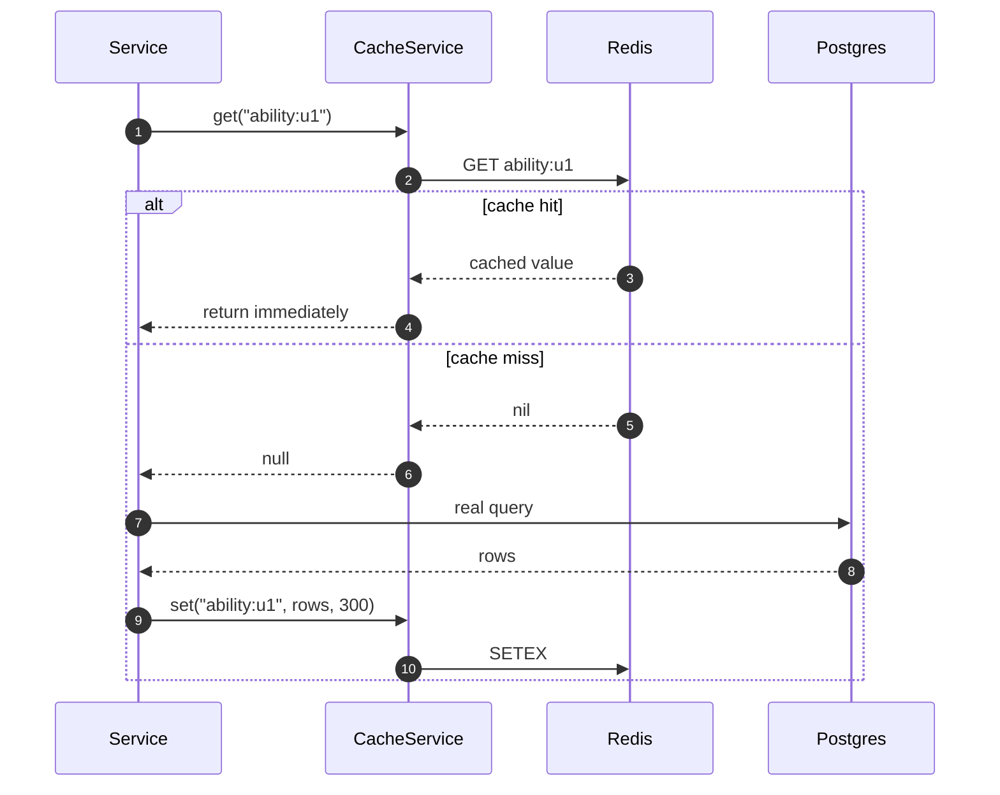

# Caching (Redis)

<Status value="planned" note="Redis runs but no code uses it" />

Redis has been provisioned in `docker-compose.yml` since day one, but not a single line of code in `apps/api` connects to it. This is debt #7 in the [Roadmap](/en/start/roadmap).

## Why cache anything

| Problem | Without a cache | With a cache |
| --- | --- | --- |
| `AbilityFactory.forUser()` | Queries the DB on every guarded request | Queries the DB once, then reads Redis for 5 minutes |
| Role/permission lists that rarely change | Re-queried on every permission check | Invalidated only when a role actually changes |
| Session / refresh token denylist | Needs a store fast enough for every request | Redis is built for exactly this |

## Planned wiring



Redis (in red) already runs in the stack, but no `CacheService` or dependency talks to it yet — the boxes in this diagram are still a target, not reality.

## Defining the interface

```ts
// apps/api/src/cache/cache.service.ts
export abstract class CacheService {
  abstract get<T>(key: string): Promise<T | null>;
  abstract set<T>(key: string, value: T, ttlSeconds: number): Promise<void>;
  abstract del(key: string): Promise<void>;
  /** deletes every key matching a pattern, e.g. "ability:*" */
  abstract delPattern(pattern: string): Promise<void>;
}
```

Like [MailerService](/en/backend/email) — calling code knows only the interface, never whether it's backed by Redis or something in-memory, so it can be tested without a real Redis.

## Cache-aside pattern

```ts
// apps/api/src/auth/ability/ability.factory.ts
async forUser(userId: string): Promise<AppAbility> {
  const cacheKey = `ability:${userId}`;
  const cached = await this.cache.get<RawRule[]>(cacheKey);
  if (cached) return createMongoAbility<AppAbility>(cached);

  const rules = await this.loadRulesFromDb(userId);
  await this.cache.set(cacheKey, rules, 300); // 5-minute TTL
  return createMongoAbility<AppAbility>(rules);
}
```



**Cache-aside** means the service decides whether to check the cache first, unlike write-through, where the cache updates automatically on every write. Cache-aside is simpler to implement and its failure mode is simpler to reason about — a lost cache entry just means re-querying the DB.

## Invalidation

::: danger A stale cache is a stale set of permissions
`ability:<userId>` must be deleted **immediately** when a user's role changes, or a role's permissions change — never wait for the TTL to expire. Without that, someone just stripped of admin keeps admin-level access for up to 5 more minutes.
:::

```ts
async updateUserRoles(userId: string, roleIds: string[]) {
  await this.prisma.$transaction([...]);
  await this.cache.del(`ability:${userId}`);
}

async updateRolePermissions(roleId: string, permissionIds: string[]) {
  await this.prisma.$transaction([...]);
  // everyone with this role needs their cache cleared, not just the one who was edited
  const userIds = await this.prisma.userRole.findMany({ where: { roleId }, select: { userId: true } });
  await this.cache.delPattern(`ability:{${userIds.map((u) => u.userId).join(",")}}`);
}
```

## Key naming

| Pattern | Used for | TTL |
| --- | --- | --- |
| `ability:<userId>` | The assembled CASL ability | 5 minutes |
| `session:<sessionId>` | Session data (if moving away from stateless JWTs) | Matches session lifetime |
| `ratelimit:<ip>:<route>` | Throttler counters | 1 minute (sliding window) |

::: tip Use one namespace prefix per environment
`NODE_ENV=test` and `NODE_ENV=development` pointing at the same Redis instance will stomp on each other's keys without a prefix. Set `REDIS_KEY_PREFIX=app:dev:` and prepend it to every key to avoid this.
:::

## Redis is a cache, not a source of truth

::: danger Never store data with no backing source in Redis
Redis is configured to evict keys under memory pressure (per `maxmemory-policy`). If something breaking disappears when a key is evicted, that data shouldn't live only in Redis — Postgres must always be the source of truth, with Redis as a shortcut on top.
:::

## Why this isn't implemented yet

Redis was provisioned early in `docker-compose.yml` so the infrastructure wouldn't need revisiting later, but the decision of what to use it for first (ability cache? rate-limit store? refresh-token denylist?) hasn't been made. The clearest win is the ability cache, since [CASL](/en/auth/casl) queries the database on every guarded request.

::: warning Current code status
| Target spec | Code today |
| --- | --- |
| `CacheService` + a Redis-backed implementation | **No code exists** — no `cache-manager` or Redis client dependency |
| Ability cache | Doesn't exist — `AbilityFactory` (once built) will query the DB on every request |
| Rate-limit store | No `@nestjs/throttler` at all |
| Redis in `docker-compose.yml` | Present and running, but nothing connects to it |
:::
