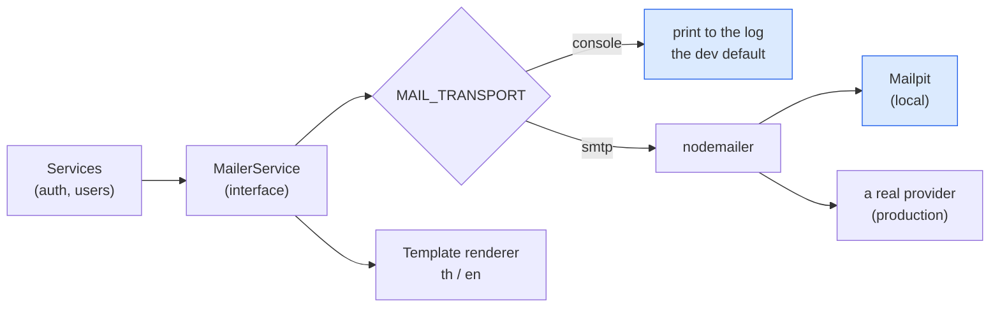
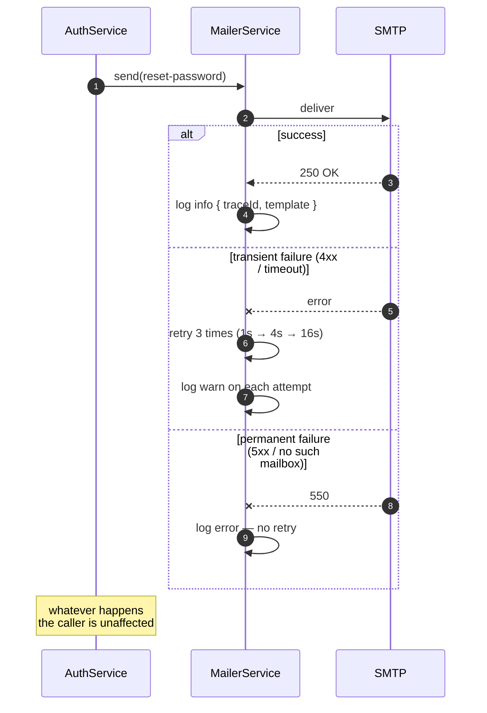

# Transactional email

<Status value="planned" />

Email is what makes [forgot password](/en/auth/forgot-password) and [email verification](/en/auth/email-verification) work. If mail doesn't arrive, those flows effectively don't exist.

## Layers



Calling services know only `MailerService`, never the destination — so you can change providers without touching a line of auth code.

## The interface

```ts
// apps/api/src/mail/mailer.service.ts
export interface MailMessage {
  to: string;
  /** template name — a file must exist for both th and en */
  template: MailTemplate;
  /** template variables — must be escaped before landing in HTML */
  data: Record<string, string>;
  /** the recipient's language, taken from user.locale */
  locale: "th" | "en";
}

export type MailTemplate =
  | "verify-email"
  | "reset-password"
  | "password-changed"
  | "account-exists"
  | "session-revoked";

export abstract class MailerService {
  abstract send(message: MailMessage): Promise<void>;
}
```

```ts
// choose the implementation at boot
{
  provide: MailerService,
  inject: [ConfigService, TemplateRenderer],
  useFactory: (config: ConfigService<Env, true>, renderer: TemplateRenderer) =>
    config.get("MAIL_TRANSPORT", { infer: true }) === "smtp"
      ? new SmtpMailerService(config, renderer)
      : new ConsoleMailerService(renderer),
}
```

::: tip The default is `console`, not `smtp`
Someone who just cloned the repo must be able to exercise the forgot-password flow without configuring SMTP. `ConsoleMailerService` prints the whole message — **including a clickable link** — to the log, which is enough for development.
:::

```ts
@Injectable()
export class ConsoleMailerService extends MailerService {
  async send(message: MailMessage) {
    const rendered = await this.renderer.render(message);
    this.logger.info(
      { traceId: getTraceId(), to: message.to, template: message.template },
      `\n📧 ${rendered.subject}\n→ ${message.to}\n\n${rendered.text}\n`,
    );
  }
}
```

## Mailpit for development

To see real messages in a browser, add to `docker-compose.yml`:

```yaml
mailpit:
  image: axllent/mailpit:latest
  restart: unless-stopped
  networks: [app-platform]
  labels:
    - traefik.enable=true
    - traefik.http.routers.mailpit.rule=Host(`mail.localhost`)
    - traefik.http.routers.mailpit.entrypoints=web
    - traefik.http.services.mailpit.loadbalancer.server.port=8025
```

Then set `MAIL_TRANSPORT=smtp` and `SMTP_URL=smtp://mailpit:1025`, and open `mail.localhost`. Mailpit captures everything and forwards nothing.

## Templates

```
apps/api/src/mail/templates/
├── verify-email/{th,en}.{subject,html,txt}
├── reset-password/{th,en}.{subject,html,txt}
└── …
```

Every template needs both `.html` and `.txt` — some clients don't render HTML, and HTML-only messages look suspicious to spam filters.

```text
apps/api/src/mail/templates/reset-password/en.txt

Hi {{displayName}}

Someone asked to reset the password for your account.
Open this link to continue (valid for 1 hour):

{{resetUrl}}

If this wasn't you, do nothing. Your password will not change.

— app-platform
```

::: danger Escape every variable in HTML
`displayName` comes from a user. Interpolated raw into HTML, someone whose name is `` gets to inject markup into email we send. Use a renderer that escapes by default, and never use triple-brace (raw/unescaped) syntax with user data.
:::

::: tip Build URLs from `APP_WEB_URL` only
Never construct links from the incoming request's `Host` header. An attacker can set that header, which would make our password-reset emails point at their site carrying a real token — that's host header injection, and it's a complete account takeover.
:::

## Templates you need

| Template | Sent when | What matters |
| --- | --- | --- |
| `verify-email` | Signup / resend | The link, and the 24-hour expiry |
| `reset-password` | Reset requested | The link, 1-hour expiry, and "if this wasn't you, do nothing" |
| `password-changed` | Password changed | Time + IP · **no actionable links** |
| `account-exists` | Signup with an existing email | Points at forgot password |
| `session-revoked` | Refresh token reuse detected | Time, reason, and a prompt to change the password |

::: danger Notification emails must not contain actionable links
`password-changed` must not have a "Wasn't you? Click here to undo" button, because that is exactly the shape of a phishing email — and we'd be training users to click them. Say "if this wasn't you, contact an administrator" instead.
:::

## When sending fails



::: danger A failed email must not fail the request
If SMTP is down and `POST /v1/auth/register` returns `500`, the user thinks signup failed and tries again — but the account already exists, so they get a `409` loop forever.

Have `send()` swallow and log its own errors while the caller continues. The user can always press "resend".

The trade-off is that failures are silent, so you must monitor the send-failure rate rather than waiting for user reports.
:::

Sending should also happen off the request path. Until there's a queue, `setImmediate` is adequate — accepting that mail is lost if the process dies first. Once a real queue exists (BullMQ on the already-provisioned but unused Redis), move it there.

## Logging and privacy

| Log this | Never log this |
| --- | --- |
| `template`, `traceId`, `locale` | Full message bodies (except the `console` transport) |
| Recipient address (redacted in production) | **Tokens inside links** |
| Success/failure and attempt count | The whole template variable set |

::: danger Tokens must never reach production logs
`resetUrl` contains a live token. Anyone who can read the logs can reset anyone's password. That's why `ConsoleMailerService`, which prints entire messages, must be **non-production only** — have `EnvSchema` require `MAIL_TRANSPORT=smtp` when `NODE_ENV=production`.
:::

## Rate limits

| Scope | Limit |
| --- | --- |
| Per recipient | 5 messages/hour across all templates |
| Per IP | 20 messages/hour |
| Globally | A ceiling matching your provider's quota |

Without limits, an email-sending endpoint becomes a free spam cannon aimed at other people — and gets your domain blacklisted.

## Deliverability

Three DNS records must exist before production, or the mail lands in spam.

| Record | Purpose |
| --- | --- |
| **SPF** | Declares which servers may send for the domain |
| **DKIM** | Signs messages verifiably |
| **DMARC** | Tells recipients what to do when SPF/DKIM fail |

Use a dedicated subdomain for system mail (e.g. `mail.example.com`) so trouble there doesn't damage the main domain's reputation.

::: warning Current code status
| Target spec | Code today |
| --- | --- |
| `MailerService` with two transports | **There's no mail module at all** |
| Bilingual templates | Don't exist |
| Mailpit in compose | Not present |
| `MAIL_*` / `SMTP_URL` env | Not in `.env.example` |
| Retries and logging | Don't exist |
| Rate limiting | No `@nestjs/throttler` |
| A queue | Redis is provisioned but no code uses it |
:::
