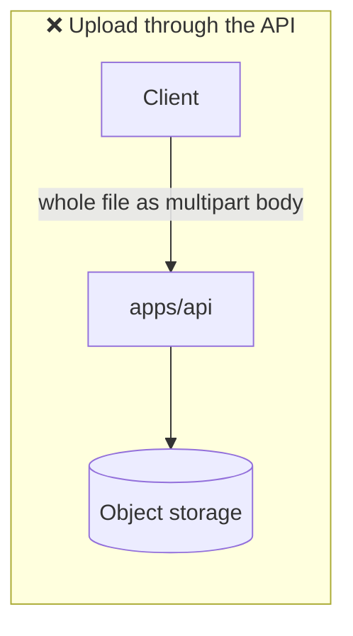
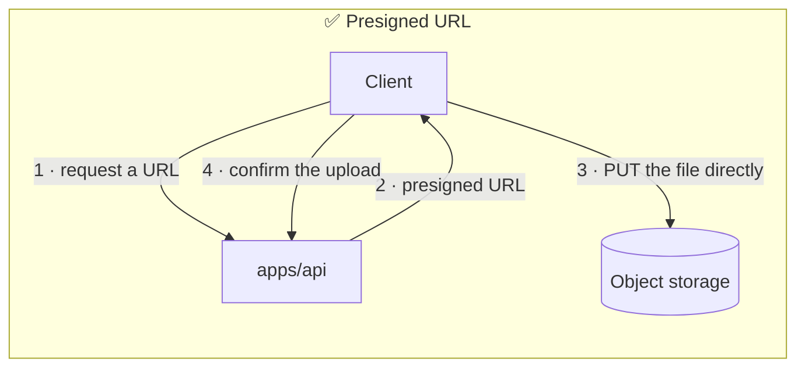
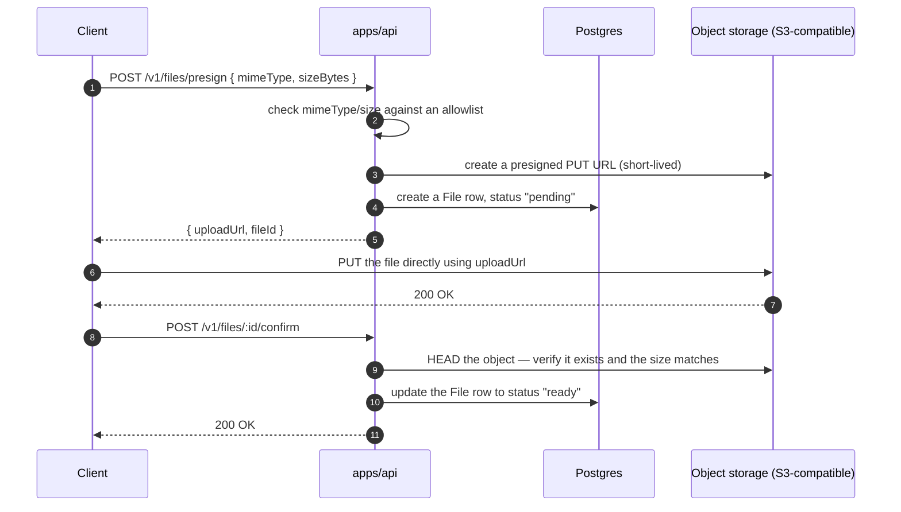

# File storage

<Status value="planned" />

Nothing in `apps/api` can accept a file upload today. This page specs the upload flow that should exist, built around the `File` table already defined in [Data model](/en/architecture/data-model).

## Why not upload straight through the API server





Route every byte of a file through `apps/api`, and it eats memory and bandwidth from the same process handling every other request — large files also make timeouts far more likely. A **presigned URL** lets the client upload directly to object storage; the API's only job is issuing a short-lived URL.

## Target architecture



The **confirm** step matters — skip it, and the system trusts the client that an upload succeeded without checking anything. A client that requests a presigned URL and never uploads leaves behind a `File` row pointing at nothing.

## Defining the endpoints

```ts
// packages/contracts/src/file.schema.ts
export const PresignFileSchema = z.object({
  mimeType: z.enum(["image/jpeg", "image/png", "image/webp", "application/pdf"]),
  sizeBytes: z.number().int().positive().max(10 * 1024 * 1024), // 10MB
});

export const PresignedUploadSchema = z.object({
  fileId: z.uuid(),
  uploadUrl: z.url(),
  expiresAt: z.iso.datetime(),
});
```

```ts
// apps/api/src/files/files.service.ts
async presign(dto: PresignFile, uploadedById: string) {
  const storageKey = `${uploadedById}/${randomUUID()}`;
  const file = await this.prisma.file.create({
    data: { storageKey, mimeType: dto.mimeType, sizeBytes: dto.sizeBytes, uploadedById, status: "pending" },
  });

  const uploadUrl = await this.storage.presignPut(storageKey, {
    contentType: dto.mimeType,
    contentLength: dto.sizeBytes,
    expiresInSeconds: 300,
  });

  return { fileId: file.id, uploadUrl, expiresAt: addSeconds(new Date(), 300).toISOString() };
}
```

::: danger `storageKey` must never come from the client
Let the client pick its own storage filename, and it can overwrite someone else's file the moment it guesses their key. The server must always generate the key (e.g. `<userId>/<uuid>`), never the original filename the client sent.
:::

## Checks before issuing a presigned URL

| Check | Why |
| --- | --- |
| `mimeType` is on an allowlist | Blocks `.exe`, `.html` (XSS via file), or unsupported file types |
| `sizeBytes` under the limit | Blocks files too large for the storage or CDN quota |
| The user is logged in | Unauthenticated presign requests amount to unlimited free uploads |
| Uploads per user per hour | Blocks storage exhaustion from spamming presign requests |

::: warning `Content-Type` at `PUT` time must match the presign request
A presigned URL binds `Content-Type` into its signature. If the client sends a different header on the real `PUT`, storage itself returns `403` — this protection is built in, no extra code needed.
:::

## Downloads

Files that need a permission check before download (private documents, for example) also use presigned URLs — `GET` instead of `PUT`.

```ts
async getDownloadUrl(fileId: string, ability: AppAbility) {
  const file = await this.prisma.file.findFirst({ where: { id: fileId, status: "ready" } });
  if (!file) throw Errors.fileNotFound();
  if (!ability.can("read", subjectHelper("File", file))) throw Errors.forbidden();

  return this.storage.presignGet(file.storageKey, { expiresInSeconds: 60 });
}
```

Fully public files (an avatar shown on a public profile, say) can use a direct CDN URL with no presigning at all — presigned URLs exist only for files that need access control.

## Object storage abstraction

```ts
// apps/api/src/files/storage.service.ts
export abstract class StorageService {
  abstract presignPut(key: string, opts: { contentType: string; contentLength: number; expiresInSeconds: number }): Promise<string>;
  abstract presignGet(key: string, opts: { expiresInSeconds: number }): Promise<string>;
  abstract delete(key: string): Promise<void>;
}
```

Use an SDK that speaks the S3 protocol (`@aws-sdk/client-s3` + `@aws-sdk/s3-request-presigner`) pointed at MinIO in dev (running in `docker-compose.yml` alongside the other services) and real S3 in production — the `apps/api` code is identical in both environments because MinIO is S3-API compatible.

## Deleting files

::: danger Deleting a `File` row must always delete the real file too, never the other way around
Deleting a DB row without deleting the underlying file leaks storage forever — costs creep up with nobody noticing. Do it in one flow: delete from storage first, and only delete the DB row once that succeeds. If the storage delete fails, don't delete the DB row — otherwise the orphaned file becomes untrackable.
:::

::: warning Current code status
| Target spec | Code today |
| --- | --- |
| `POST /v1/files/presign` + `/confirm` endpoints | **Don't exist** — no upload routes at all |
| `StorageService` + an S3/MinIO client | Doesn't exist — no `@aws-sdk/*` dependency |
| A `File` table | Defined in [Data model](/en/architecture/data-model) but not present in `schema.prisma` |
| MinIO in `docker-compose.yml` | Not in the compose file |
| mimeType/size checks before upload | Don't exist, because no endpoint exists |
:::
