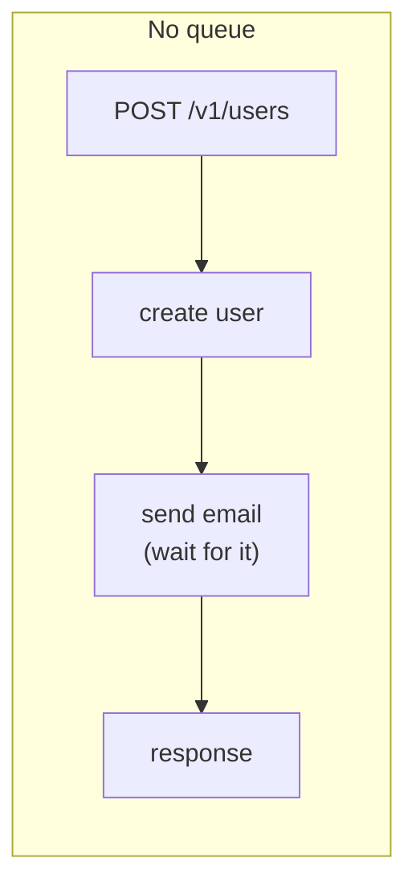
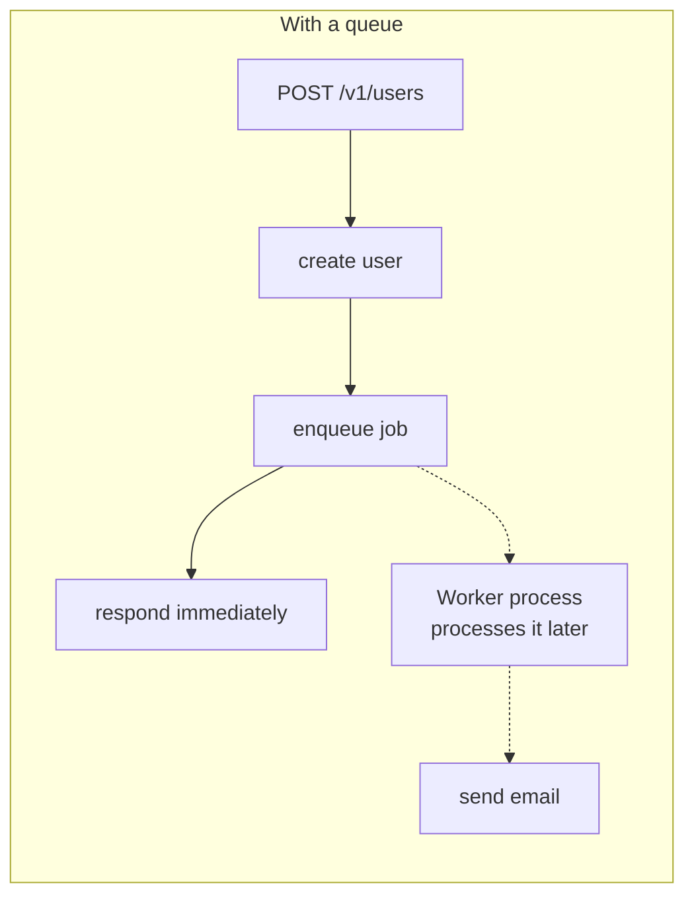
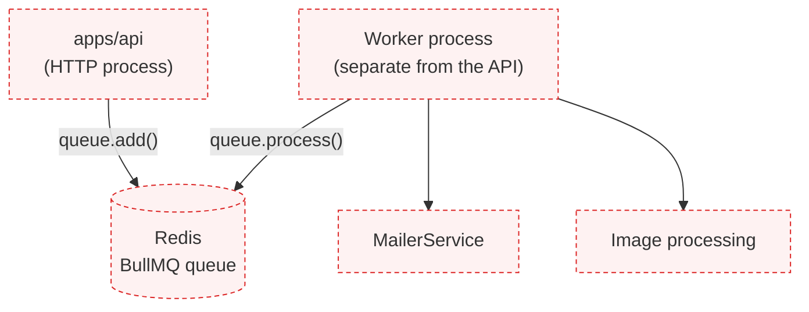
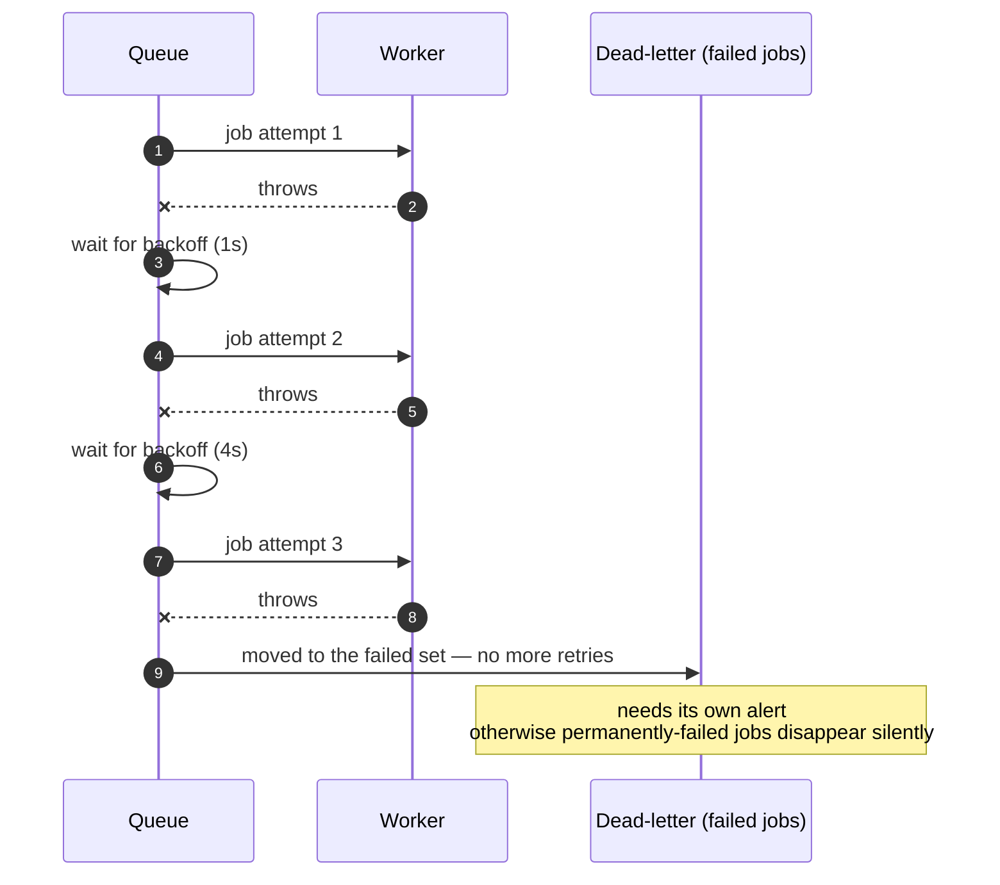

# Background jobs & queues

<Status value="planned" />

Work that doesn't need the user to wait (sending email, image processing, syncing data) belongs outside the request/response cycle. This page is a spec for a queue system with not a single line of real code behind it yet.

## Why a queue at all





Without a queue, [email sending](/en/backend/email) done through `setImmediate` disappears the moment the process dies. A queue backed by Redis survives process restarts and can retry on failure.

## Why BullMQ

| Option | Upside | Why not (for now) |
| --- | --- | --- |
| **BullMQ** (on Redis) | Redis already exists in the stack, TypeScript-native API, ships a UI (Bull Board) | — |
| RabbitMQ / SQS | More durable at large scale | Requires an entire new piece of infrastructure — overkill for a boilerplate |
| A plain in-process cron | Simplest to write | No retries, no persistence, runs twice if there's more than one instance |

BullMQ reuses the same Redis instance [caching](/en/backend/caching) will use — no new service added to the stack.

## Target architecture



The worker is a separate process from the API — deployable and scalable independently. If the worker dies, the API keeps handling requests normally; jobs just sit in the queue waiting for the worker to come back.

## Defining a queue and a job

```ts
// apps/api/src/jobs/queues/mail.queue.ts
import { Queue } from "bullmq";

export interface SendMailJob {
  to: string;
  template: MailTemplate;
  data: Record<string, string>;
  locale: "th" | "en";
}

export const MAIL_QUEUE = "mail";

export const mailQueue = new Queue<SendMailJob>(MAIL_QUEUE, {
  connection: { host: env.REDIS_HOST, port: env.REDIS_PORT },
  defaultJobOptions: {
    attempts: 3,
    backoff: { type: "exponential", delay: 1000 },
    removeOnComplete: { age: 3600 },
    removeOnFail: { age: 86400 },
  },
});
```

```ts
// enqueue from anywhere in apps/api
await mailQueue.add("send-reset-password", {
  to: user.email,
  template: "reset-password",
  data: { resetUrl },
  locale: user.locale,
});
```

## Worker

```ts
// apps/api/src/jobs/workers/mail.worker.ts
import { Worker } from "bullmq";

new Worker<SendMailJob>(
  MAIL_QUEUE,
  async (job) => {
    await mailerService.send(job.data);
  },
  { connection: { host: env.REDIS_HOST, port: env.REDIS_PORT }, concurrency: 5 },
);
```

::: tip A worker runs as a separate process, not a Nest endpoint
`new Worker()` opens a blocking connection that continuously polls the queue. Run it inside the same `apps/api` process as the HTTP server, and the two fight over the event loop. Create a separate entry point (e.g. `apps/api/src/worker.ts`) and build/deploy it as its own process.
:::

## Retries and dead letters



::: danger A job that exhausts retries still needs a human to see it
BullMQ automatically keeps every job that fails all its attempts in a `failed` set — but with no monitoring or Bull Board open, nobody notices hundreds of jobs piling up. Wire an alert to the size of the `failed` set before going to production.
:::

## Idempotency

::: danger A job can always be processed more than once
BullMQ guarantees "at-least-once," not "exactly-once." If a worker crashes after finishing work but before acking, the job gets redelivered. Every job handler must be idempotent — email sending, for example, should check whether it already sent before sending again, rather than assuming it runs exactly once.
:::

## Observing job status

Bull Board is a ready-made dashboard that mounts as a Nest route, showing pending/active/failed jobs in real time without querying Redis by hand. Always mount it behind an auth guard — never expose it publicly.

::: warning Current code status
| Target spec | Code today |
| --- | --- |
| A BullMQ queue + worker process | **None exist** — no `bullmq` dependency |
| Email sent through a queue | Uses `setImmediate` directly — see [Transactional email](/en/backend/email) |
| A worker as a separate process | No worker entry point exists |
| The Bull Board dashboard | Doesn't exist |
| Redis as a queue backend | Runs in `docker-compose.yml`, but no code uses it ([Roadmap](/en/start/roadmap) debt #7) |
:::
