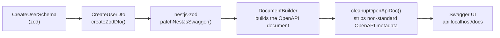

# OpenAPI / Swagger

<Status value="implemented" />

`api.localhost/docs` is a working Swagger UI today — one of the few pages in this documentation set that matches the code 100%.

## Why DTOs built from zod need a workaround

`@nestjs/swagger` reads metadata from `class-validator`/`class-transformer` decorators (`@IsString()`, `@ApiProperty()`, etc.) to build an OpenAPI schema. But every DTO in this project comes from `createZodDto` — none of those decorators exist. See [Validation](/en/backend/validation).

`nestjs-zod` solves this by converting zod schemas into OpenAPI schemas automatically.



## Setup

```ts
// apps/api/src/main.ts
import { DocumentBuilder, SwaggerModule } from "@nestjs/swagger";
import { patchNestJsSwagger, cleanupOpenApiDoc } from "nestjs-zod";

patchNestJsSwagger(); // call once before building the document — teaches @nestjs/swagger to read zod metadata

async function bootstrap() {
  const app = await NestFactory.create(AppModule);

  const config = new DocumentBuilder()
    .setTitle("app-platform API")
    .setVersion("1.0")
    .addBearerAuth()
    .build();

  const document = cleanupOpenApiDoc(SwaggerModule.createDocument(app, config));
  SwaggerModule.setup("docs", app, document);

  await app.listen(3001);
}
```

`patchNestJsSwagger()` must always run before `SwaggerModule.createDocument()` — it patches `@nestjs/swagger`'s prototype so it knows how to read the metadata `nestjs-zod` attaches to each DTO class.

::: tip What `cleanupOpenApiDoc` does
Some zod shapes (`z.union`, `z.discriminatedUnion`) convert into OpenAPI metadata that renders oddly in Swagger UI. `cleanupOpenApiDoc` strips the unnecessary parts before the document goes to `SwaggerModule.setup()`.
:::

## Bearer auth

```ts
@ApiBearerAuth()
@UseGuards(JwtAuthGuard)
@Get("me")
me(@CurrentUser() user: User) { ... }
```

`.addBearerAuth()` on `DocumentBuilder` adds an "Authorize" button to Swagger UI — paste a JWT once, and every endpoint marked `@ApiBearerAuth()` attaches the header automatically when you hit "Try it out".

## OAuth2 password flow — login + auto-attach the token to everything else

`.addBearerAuth()` requires copy/pasting the access token after login every time — `.addOAuth2()` with a `password` flow lets Swagger UI call `POST /auth/token` for you right from the Authorize dialog, then keeps the token attached to every request that follows without any copying.

```ts
// apps/api/src/main.ts
const config = new DocumentBuilder()
  .addBearerAuth(
    { type: "http", scheme: "bearer", bearerFormat: "JWT" },
    "access-token", // for pasting a token you already have (e.g. from curl)
  )
  .addOAuth2(
    {
      type: "oauth2",
      flows: {
        password: {
          tokenUrl: "/auth/token",
          refreshUrl: "/auth/token",
          scopes: {},
        },
      },
    },
    "oauth2", // for typing username/password into the Authorize dialog and letting Swagger fetch the token itself
  )
  .build();
```

For an endpoint that should accept either path (an either/or), attach both decorators — `@nestjs/swagger` combines multiple security decorators as OR entries in that operation's `security` array, not AND:

```ts
@ApiBearerAuth("access-token")
@ApiSecurity("oauth2")
@UseGuards(JwtAuthGuard)
@Get(":id")
findOne(@Param("id") id: string) { ... }
```

`POST /auth/token` itself must consume `application/x-www-form-urlencoded`, not JSON, because the OAuth2 grant flow (RFC 6749) specifies that body shape. Without `@ApiConsumes("application/x-www-form-urlencoded")`, Swagger UI sends JSON and the endpoint rejects it:

```ts
@ApiConsumes("application/x-www-form-urlencoded")
@Post("token")
token(@Body() body: TokenRequestDto) { ... }
```

Request/response schema details live on [Contract schema catalog § auth.schema.ts](/en/reference/contracts), and the real endpoint on [API endpoint catalog](/en/reference/api-endpoints).

::: tip Swagger UI doesn't auto-refresh in every case
`refreshUrl` tells Swagger UI where to fetch a new token from, but it doesn't guarantee the UI refreshes automatically the instant an access token expires mid-session. What it does guarantee is that after the first successful Authorize, every remaining request in that session attaches the header for you without copy/pasting again.
:::

## Endpoints that shouldn't show up in Swagger

```ts
// apps/api/src/health.controller.ts
@ApiExcludeController()
@Controller("health")
export class HealthController {
  @Get()
  check() {
    return { status: "ok", checkedAt: new Date().toISOString() };
  }
}
```

`@ApiExcludeController()` (or `@ApiExcludeEndpoint()` at the method level) keeps non-business endpoints — health checks, metrics — out of the docs other teams read.

## Documenting an endpoint further

`@nestjs/swagger` decorators still work normally even though DTOs come from zod — they add information, they don't replace the schema.

```ts
@ApiOperation({ summary: "Create a new user" })
@ApiResponse({ status: 201, description: "Created" })
@ApiResponse({ status: 409, description: "Email already in use" })
@Post()
create(@Body() dto: CreateUserDto) { ... }
```

::: warning Endpoint docs must be updated alongside the code
`@ApiResponse({ status: 409, ... })` is just text — nothing enforces that the service actually throws `409`. If behavior changes but the decorator doesn't, Swagger UI lies to whoever reads it. Reviewers should always check these decorators when reviewing a PR that touches error handling.
:::

## Compared to contract-first

This project writes zod schemas first, and Swagger is a generated byproduct — the opposite of hand-writing an `openapi.yaml` and generating code from that YAML. See [Contract-first workflow](/en/conventions/contract-first) for why this direction was chosen.

::: tip You can export the spec as a static file
`SwaggerModule.createDocument()` returns a plain JS object. A CI script could `writeFileSync("openapi.json", JSON.stringify(document))` to keep a spec file for generating client SDKs or diffing between PRs — this project doesn't do it yet.
:::

## How Swagger stays in sync with the code

A Swagger UI generated from real DTOs **cannot** drift from real validation, because it reads from the same schemas `ZodValidationPipe` uses — unlike a hand-written API spec that can drift from the code at any time. That's the main reason this page is one of the few marked <Status value="implemented" inline /> in this documentation set.

::: warning Current code status
| Target spec | Code today |
| --- | --- |
| Swagger UI at `/docs` | Live at `api.localhost/docs` |
| Bearer auth scheme | Configured via `.addBearerAuth()` |
| OAuth2 password flow (token auto-attach) | Configured via `.addOAuth2()` — `POST /auth/token` supports both `grant_type=password` and `grant_type=refresh_token` |
| `patchNestJsSwagger()` + `cleanupOpenApiDoc()` | Called in `main.ts`, matching the spec |
| `@ApiExcludeController()` on health | Present |
| Exporting the spec as `openapi.json` in CI | Doesn't exist — there's no CI at all ([Roadmap](/en/start/roadmap) debt #9) |
:::
