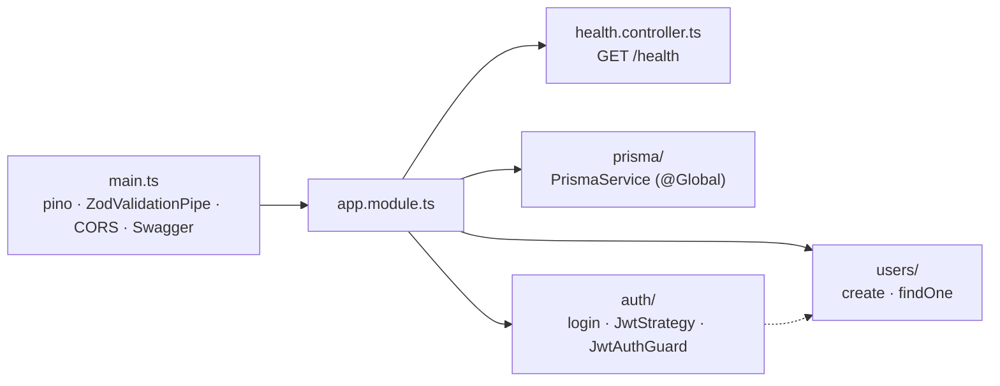
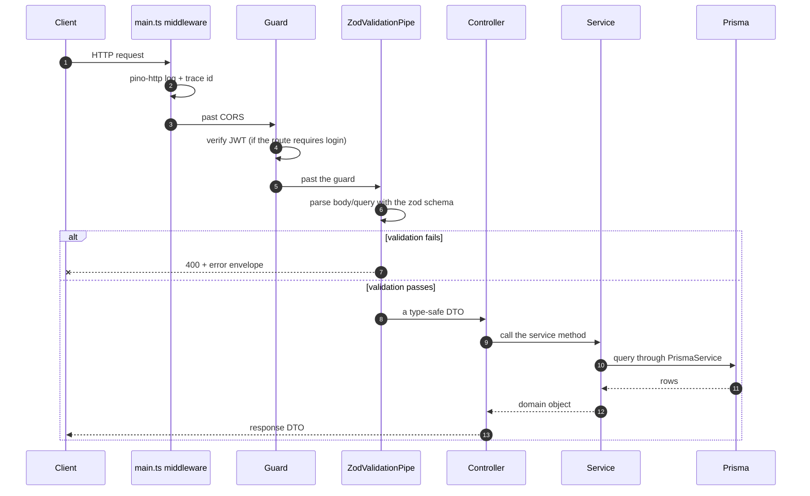

# Backend overview

<Status value="in-progress" note="Core modules are incomplete" />

`apps/api` is a NestJS 11 modular monolith — one API, not a set of separate microservices. This page is the starting point before the topic-specific pages.

## Stack & rationale

| Layer | Uses | Why |
| --- | --- | --- |
| Framework | NestJS 11 | DI + a module system that forces clear boundaries, not just flat Express |
| Validation | `nestjs-zod` + `packages/contracts` | One schema drives both runtime validation and types — see [Validation](/en/backend/validation) |
| Data access | Prisma + `@prisma/adapter-pg` | Type-safe queries, checkable migrations — see [Prisma](/en/backend/prisma) |
| API docs | `@nestjs/swagger` + `cleanupOpenApiDoc` | Swagger UI built from the same DTOs that actually validate, not a hand-written spec — see [OpenAPI](/en/backend/openapi) |
| Logging | `nestjs-pino` | Structured logs, faster than Nest's default logger |
| Auth | `@nestjs/jwt` + `passport-jwt` | See [Auth overview](/en/auth/overview) |

The full rationale lives on [Tech stack & rationale](/en/architecture/tech-stack).

## Modules today

The full folder tree, including what's still missing, is on [Folder structure · api](/en/conventions/structure-api).

## Module design principles

- **One folder = one module.** Cross-module communication happens only through exported services.
- **DTOs carry no logic of their own.** Every schema comes from `packages/contracts` — never redeclare validation rules inside `apps/api`.
- **Services know nothing about HTTP.** Controllers receive the request and pass plain arguments to services — so services can be tested without mocking request/response.

## Request path

There's no global exception filter turning errors into the standard envelope yet — validation errors return Nest's default shape. See [Error envelope](/en/conventions/errors).

## Related pages

| Topic | Status |
| --- | --- |
| [Validation (zod pipe)](/en/backend/validation) | <Status value="implemented" inline /> |
| [Prisma & data access](/en/backend/prisma) | <Status value="in-progress" inline /> |
| [OpenAPI / Swagger](/en/backend/openapi) | <Status value="implemented" inline /> |
| [Caching (Redis)](/en/backend/caching) | <Status value="planned" inline /> |
| [Background jobs & queues](/en/backend/jobs) | <Status value="planned" inline /> |
| [File storage](/en/backend/file-storage) | <Status value="planned" inline /> |
| [Transactional email](/en/backend/email) | <Status value="planned" inline /> |

## Health check

`GET /health` sits outside every module because it has no domain of its own — it returns `{ status, checkedAt }` and is excluded from Swagger since it isn't a business endpoint. How orchestrators (Docker healthcheck, load balancer) consume it belongs on the Platform section's Health checks page.

::: warning Current code status
| Target spec | Code today |
| --- | --- |
| Modules matching the target tree | Only `auth`, `users`, `prisma`, plus `health.controller.ts` exist |
| A global exception filter → error envelope | Doesn't exist — errors use Nest's default shape |
| A trace id on every request | No `AsyncLocalStorage` or interceptor attaches one |
| Env validated at boot | `ConfigModule` has no `validate` |
| `CORS` as an allowlist | `app.enableCors()` is called with no options — every origin is allowed |
:::
