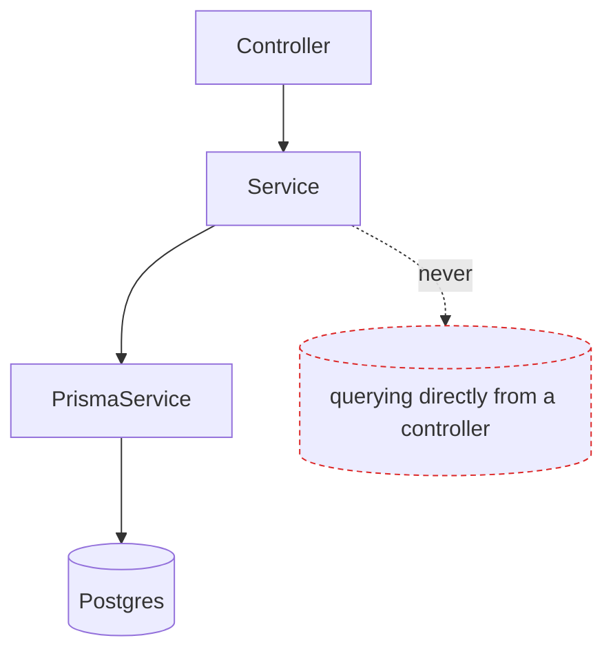

# Prisma & data access

<Status value="in-progress" note="Schema has only User, seed is broken" />

`apps/api` reaches the database only through `PrismaService` — no raw queries, no second ORM. The full table definitions live on [Data model](/en/architecture/data-model).

## Why `@prisma/adapter-pg`

Prisma has two query engines: the traditional binary engine, and a driver adapter that talks to a Node driver directly (`pg` for Postgres). `apps/api` uses the latter.

| Traditional (binary engine) | Driver adapter (`@prisma/adapter-pg`) |
| --- | --- |
| Needs an OS/arch-matched binary downloaded at build time | No separate binary — runs on plain Node |
| Harder to deploy on serverless / edge | Uses `pg`'s connection pool directly |
| A separate process talks over IPC | The query engine lives in the same process as the app |

## Setup

```ts
// apps/api/src/prisma/prisma.service.ts
import { Pool } from "pg";
import { PrismaPg } from "@prisma/adapter-pg";
import { PrismaClient } from "@prisma/client";

@Injectable()
export class PrismaService extends PrismaClient implements OnModuleInit, OnModuleDestroy {
  constructor(config: ConfigService<Env, true>) {
    const pool = new Pool({ connectionString: config.get("DATABASE_URL", { infer: true }) });
    super({ adapter: new PrismaPg(pool) });
  }

  async onModuleInit() {
    await this.$connect();
  }

  async onModuleDestroy() {
    await this.$disconnect();
  }
}
```

```ts
// apps/api/src/prisma/prisma.module.ts
@Global()
@Module({ providers: [PrismaService], exports: [PrismaService] })
export class PrismaModule {}
```

`@Global()` means importing `PrismaModule` once in `app.module.ts` lets every module inject `PrismaService` without importing it again.

## Query pattern



**Every query lives in a service, never a controller** — a controller's only job is turning HTTP into plain arguments and passing them along.

```ts
// apps/api/src/users/users.service.ts
@Injectable()
export class UsersService {
  constructor(private readonly prisma: PrismaService) {}

  async findById(id: string) {
    return this.prisma.user.findFirst({
      where: { id, deletedAt: null },
    });
  }

  async create(dto: CreateUser) {
    const passwordHash = await hash(dto.password);
    return this.prisma.user.create({
      data: { email: dto.email, displayName: dto.displayName, passwordHash },
    });
  }
}
```

::: tip `findFirst`, not `findUnique`, once soft delete exists
`findUnique` only accepts fields that are unique constraints (`id`, `email`) and cannot take extra conditions. Filtering `deletedAt: null` alongside it requires `findFirst({ where: { id, deletedAt: null } })` — otherwise you can read a row that's already been soft-deleted.
:::

## Transactions

Changes that touch multiple tables must sit inside `$transaction`, or a failure partway through leaves inconsistent data behind.

```ts
async createWithDefaultRole(dto: CreateUser) {
  return this.prisma.$transaction(async (tx) => {
    const user = await tx.user.create({ data: toUserRow(dto) });
    const memberRole = await tx.role.findUniqueOrThrow({ where: { key: "member" } });
    await tx.userRole.create({ data: { userId: user.id, roleId: memberRole.id } });
    return user;
  });
}
```

::: danger Don't call `this.prisma.xxx` alongside `tx.xxx` in the same function
Using `this.prisma.userRole.create()` instead of `tx.userRole.create()` inside a transaction callback runs that statement as a separate query, immediately, outside the transaction. If an earlier step rolls back but this one already committed, the data is now inconsistent. Only use the `tx` variable the callback provides.
:::

## Migrations

```bash
# generate a new migration from the edited schema.prisma
pnpm --filter @app-platform/api exec prisma migrate dev --name add_avatar_file_id

# apply existing migrations (used at deploy time)
pnpm --filter @app-platform/api exec prisma migrate deploy
```

`migrate dev` is a dev-machine-only command — it can reset the database if the migration history doesn't line up. `migrate deploy` is the only command that should run on production, since it never prompts and never resets.

The expand/contract principle for safe schema changes lives on [Data model § Migration discipline](/en/architecture/data-model).

## Seeding

```ts
// apps/api/prisma/seed.ts
async function main() {
  if (process.env.NODE_ENV === "production") {
    throw new Error("Never run seed in production");
  }
  await prisma.user.upsert({
    where: { email: process.env.SEED_ADMIN_EMAIL! },
    update: {},
    create: { email: process.env.SEED_ADMIN_EMAIL!, displayName: "Admin", passwordHash: await hash("changeme") },
  });
}
```

::: warning `prisma db seed` doesn't work today
`apps/api/prisma.config.ts` runs seeding through `tsx`, but `tsx` isn't in `package.json` (only `ts-node` is). `prisma db seed` fails immediately. This is debt #4 in the [Roadmap](/en/start/roadmap) — the short-term fix is running the seed via `ts-node` directly; the permanent fix is adding `tsx` as a devDependency or having `prisma.config.ts` call `ts-node` instead.
:::

## Repository pattern?

`apps/api` does **not** add a repository layer between services and `PrismaService` — `PrismaService` is already type-safe and mockable through Nest's dependency injection. Adding a repository layer would be an abstraction over an abstraction, with no plan to ever swap ORMs.

```ts
// test a service by mocking PrismaService directly, no repository in between
const module = await Test.createTestingModule({
  providers: [UsersService, { provide: PrismaService, useValue: mockPrisma }],
}).compile();
```

## Tying in with CASL

Queries that return lists must be filtered with `accessibleBy(ability)` from `@casl/prisma` so users only see rows they're allowed to. Full details on [CASL authorization](/en/auth/casl).

::: warning Current code status
| Target spec | Code today |
| --- | --- |
| `PrismaService` via `@prisma/adapter-pg` | Real and matches the spec |
| 8-model schema | Only `User` exists — see [Data model](/en/architecture/data-model) |
| A working `prisma db seed` | Broken — `tsx` isn't in deps ([Roadmap](/en/start/roadmap) debt #4) |
| `accessibleBy` filtering every query | No authorization system exists at all |
| Service tests mocking `PrismaService` | No test files exist in the project |
:::
