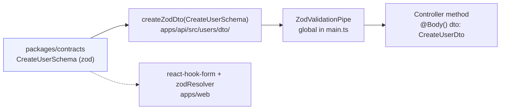
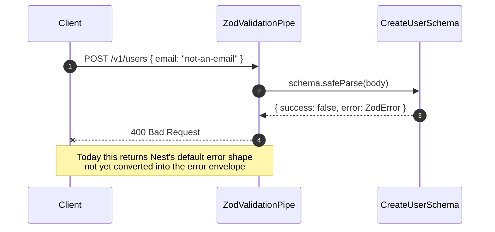

# Validation (zod pipe)

<Status value="implemented" />

`apps/api` has no `class-validator` decorators at all. Every request body and query is checked with the same zod schemas that `apps/web` and `apps/api` share through `packages/contracts`.

## Why not `class-validator`

NestJS defaults to `class-validator` + `class-transformer`, but both tie validation to classes that only the backend can use — `apps/web` would have to validate forms with a completely separate piece of logic, and the two would drift apart over time.

zod is the opposite: a schema is a plain value (a `ZodObject`) that either side can import, with no decorators or reflection metadata involved. See [Contract-first workflow](/en/conventions/contract-first) for the architectural rationale.

## Layers



One schema is used in three places at once — server-side validation, DTO types for Swagger, and client-side form validation.

## Defining a schema

```ts
// packages/contracts/src/user.schema.ts
import { z } from "zod";

export const CreateUserSchema = z.object({
  email: z.email(),
  displayName: z.string().min(1).max(120),
  password: z.string().min(8).max(72),
});
export type CreateUser = z.infer<typeof CreateUserSchema>;

export const UpdateUserSchema = CreateUserSchema
  .pick({ displayName: true })
  .partial();
export type UpdateUser = z.infer<typeof UpdateUserSchema>;
```

## Turning it into a DTO

```ts
// apps/api/src/users/dto/create-user.dto.ts
import { createZodDto } from "nestjs-zod";
import { CreateUserSchema } from "@app-platform/contracts";

export class CreateUserDto extends createZodDto(CreateUserSchema) {}
```

`createZodDto` produces a class usable as an ordinary NestJS type (e.g. in `@Body()`), while carrying the zod schema internally so the pipe can use it for real parsing.

```ts
@Post()
create(@Body() dto: CreateUserDto) {
  // dto already passed through CreateUserSchema.parse() — its type matches CreateUser exactly
  return this.usersService.create(dto);
}
```

## Registering the pipe globally

```ts
// apps/api/src/main.ts
import { ZodValidationPipe } from "nestjs-zod";

async function bootstrap() {
  const app = await NestFactory.create(AppModule);
  app.useGlobalPipes(new ZodValidationPipe());
  // ...
}
```

Registering it globally means every controller using a `createZodDto` DTO is validated automatically — no `@UsePipes()` needed per endpoint.

::: tip It parses, not just validates
zod doesn't just say pass/fail — it returns the transformed value (`.transform()`, defaults applied). The `dto` a controller receives is what zod produced, not the raw body the client sent.
:::

## When validation fails



Once the [error envelope](/en/conventions/errors) exists, the target shape is an array of `{ field, code, message }` — one per invalid field. Today it's `ZodValidationPipe`'s default shape.

## Query params and pagination

```ts
// packages/contracts/src/pagination.schema.ts
export const PaginationQuerySchema = z.object({
  page: z.coerce.number().int().min(1).default(1),
  limit: z.coerce.number().int().min(1).max(100).default(20),
});
```

### Coercing strings into the right type <Status value="planned" inline note="No endpoint uses it yet" />

Query strings are always `string` at the HTTP level — `z.coerce.number()` converts `"2"` to `2` before range-checking it. Once list endpoints exist, they should share `PaginationQuerySchema` with `paginatedSchema()` so every response has the same `{ items, total, page, limit }` shape. See [API conventions](/en/conventions/api-conventions).

::: danger Don't use `z.any()` to "skip" validation temporarily
`z.any()` disables type safety along the whole chain — the resulting DTO becomes `any` and TypeScript stops warning you when the service uses it. If a schema isn't nailed down yet, use `z.unknown()` and narrow later — at least TypeScript will force a check before use.
:::

## Testing schemas separately from controllers

Schemas are pure functions — they can be tested with no NestJS test module at all.

```ts
// packages/contracts/src/user.schema.spec.ts
describe("CreateUserSchema", () => {
  it("rejects a malformed email", () => {
    const result = CreateUserSchema.safeParse({
      email: "not-an-email",
      displayName: "A",
      password: "password123",
    });
    expect(result.success).toBe(false);
  });

  it("rejects passwords shorter than 8 characters", () => {
    const result = CreateUserSchema.safeParse({
      email: "a@b.com",
      displayName: "A",
      password: "short",
    });
    expect(result.success).toBe(false);
  });
});
```

Testing schemas separately from controllers keeps tests fast and avoids mocking `PrismaService` just to check "is this value rejected."

::: warning Current code status
| Target spec | Code today |
| --- | --- |
| A global `ZodValidationPipe` | Registered in `main.ts` |
| Every DTO built with `createZodDto` | True today — `create-user.dto.ts`, `login.dto.ts` |
| Errors returned as the error envelope | Still `ZodValidationPipe`'s default shape — see [Error envelope](/en/conventions/errors) |
| `PaginationQuerySchema` / `paginatedSchema()` in real use | The schema exists in contracts, but no endpoint calls it yet |
| Schema tests | No test files exist anywhere in the project — [Roadmap](/en/start/roadmap) debt #8 |
:::
