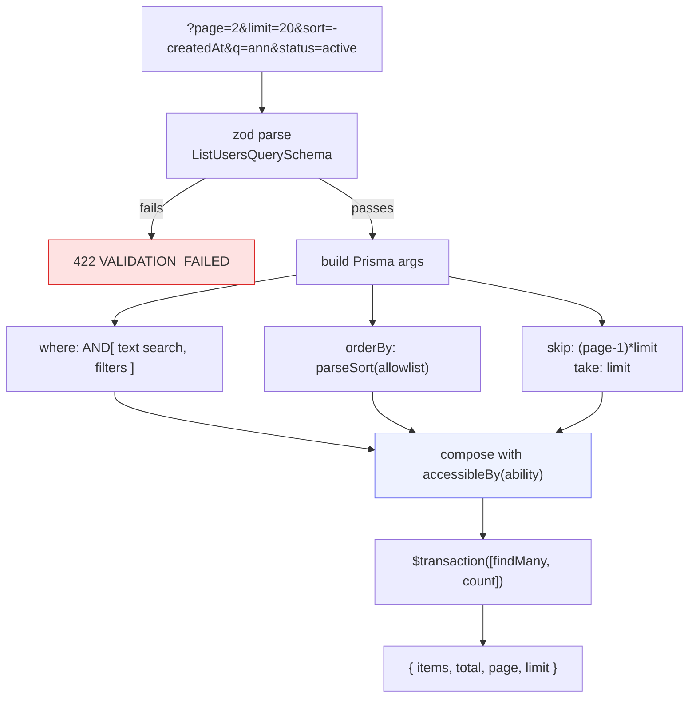

# API conventions

<Status value="in-progress" />

The rules every endpoint follows, so clients can predict behaviour without reading each one's docs.

## URLs and versioning

```
http://api.localhost/v1/users/:id
                     └┬┘ └─┬─┘ └┬┘
                   version │    identifier
                        collection
```

| Rule | Example |
| --- | --- |
| Every route sits under `/v1` | `app.setGlobalPrefix("v1")` |
| Collections are plural, lowercase, hyphenated | `/v1/users`, `/v1/refresh-tokens` |
| Nest sub-resources at most one level deep | `/v1/users/:id/roles` |
| Non-CRUD actions use a trailing verb | `POST /v1/auth/refresh`, `POST /v1/users/:id/deactivate` |
| Non-business endpoints sit outside `/v1` | `/health`, `/docs` |

::: tip When to bump to `/v2`
Only when you **remove or change the meaning** of an existing field. Adding an optional field is not breaking. During a transition, run `/v1` and `/v2` side by side and announce a clear sunset date for `/v1`.
:::

## Methods and status codes

| Method | Use for | Success | Idempotent |
| --- | --- | --- | --- |
| `GET` | Read | `200` | Yes |
| `POST` | Create, or perform an action | `201` (create) · `200` (action) | No |
| `PATCH` | Partial update | `200` | No |
| `PUT` | Full replacement | `200` | Yes |
| `DELETE` | Delete | `204`, no body | Yes |

### Status codes we use

| Code | Meaning | Example |
| --- | --- | --- |
| `200` | Success with a body | `GET /v1/users` |
| `201` | Created | `POST /v1/users` |
| `204` | Success, no body | `DELETE /v1/users/:id` |
| `400` | Malformed request | Broken JSON |
| `401` | Unauthenticated, or token expired | No Bearer token |
| `403` | Authenticated but not permitted | CASL denied |
| `404` | Not found, or not visible to you | See note below |
| `409` | Conflicts with current state | Duplicate email |
| `422` | Well-formed but failed validation | zod rejected it |
| `429` | Too many requests | Login rate limit |
| `500` | Our bug | Unclassified exception |

::: tip Choosing between 403 and 404
If confirming that a resource exists is itself a leak, return `404`. A regular user requesting someone else's profile should get `404` so they can't probe for valid ids. Use `403` when the caller already knows the thing exists but may not act on it. See [CASL](/en/auth/casl).
:::

Every `401` must carry:

```
WWW-Authenticate: Bearer realm="api", error="invalid_token"
```

so the client can distinguish "expired, go refresh" from "not allowed".

## Response shapes

### A single resource — return the object directly

```json
{ "id": "0192…", "email": "a@b.com", "displayName": "Ann", "createdAt": "2026-08-07T09:14:22.481Z" }
```

No `{ "data": … }` wrapper. The status code already says it succeeded, and the [error envelope](/en/conventions/errors) covers failures — a wrapper only forces `.data` everywhere.

### A list — always `paginatedSchema()`

```json
{ "items": [ … ], "total": 137, "page": 2, "limit": 20 }
```

From the existing `packages/contracts/src/common.schema.ts`:

```ts
export function paginatedSchema<T extends z.ZodTypeAny>(itemSchema: T) {
  return z.object({
    items: z.array(itemSchema),
    total: z.number().int().min(0),
    page: z.number().int().min(1),
    limit: z.number().int().min(1),
  });
}
```

::: danger Never return a bare array
A `GET /v1/users` returning `[…]` is a time bomb — 200 rows becomes 200,000. Even a genuine "give me everything" case goes through `paginatedSchema` with a hard maximum `limit`.
:::

## Query parameters

### Pagination

The existing `PaginationQuerySchema`:

```ts
export const PaginationQuerySchema = z.object({
  page: z.coerce.number().int().min(1).default(1),
  limit: z.coerce.number().int().min(1).max(100).default(20),
});
```

`z.coerce` is required because query strings are always strings, and `.max(100)` is a hard ceiling.

### Sorting

`?sort=<field>` ascending, `?sort=-<field>` descending, comma-separated for multiple keys:

```
GET /v1/users?sort=-createdAt,displayName
```

```ts
export const SortQuerySchema = z.object({
  sort: z.string().optional(),
});

/** "-createdAt,displayName" -> [{createdAt:"desc"},{displayName:"asc"}] */
export function parseSort(sort: string | undefined, allowed: readonly string[]) {
  if (!sort) return undefined;
  return sort
    .split(",")
    .map((token) => {
      const desc = token.startsWith("-");
      const field = desc ? token.slice(1) : token;
      // allowlist only — never feed a user-supplied field name into orderBy
      if (!allowed.includes(field)) throw Errors.invalidSort(field);
      return { [field]: desc ? "desc" : "asc" } as const;
    });
}
```

### Filtering

| Pattern | Meaning | Example |
| --- | --- | --- |
| `?<field>=<value>` | Equals | `?status=active` |
| `?<field>=<a>,<b>` | In set | `?roleId=1,2` |
| `?q=<text>` | Text search (fields are endpoint-specific) | `?q=ann` |
| `?<field>From` / `?<field>To` | Range | `?createdAtFrom=2026-01-01` |



::: danger Filters must always compose with permissions
The `where` built from user input must be `AND`ed with `accessibleBy(ability)` every time. Forget it and users can filter their way to rows they aren't allowed to see — see [CASL](/en/auth/casl).
:::

A complete list endpoint:

```ts
export const ListUsersQuerySchema = PaginationQuerySchema.extend({
  sort: z.string().optional(),
  q: z.string().trim().min(1).max(120).optional(),
  status: z.enum(["active", "inactive"]).optional(),
});

async list(query: ListUsersQuery, ability: AppAbility) {
  const where: Prisma.UserWhereInput = {
    AND: [
      accessibleBy(ability, "read").User,
      query.q ? { OR: [{ email: { contains: query.q, mode: "insensitive" } },
                       { displayName: { contains: query.q, mode: "insensitive" } }] } : {},
      query.status ? { status: query.status } : {},
    ],
  };

  const [items, total] = await this.prisma.$transaction([
    this.prisma.user.findMany({
      where,
      orderBy: parseSort(query.sort, ["createdAt", "displayName", "email"]) ?? { createdAt: "desc" },
      skip: (query.page - 1) * query.limit,
      take: query.limit,
    }),
    this.prisma.user.count({ where }),
  ]);

  return { items, total, page: query.page, limit: query.limit };
}
```

`$transaction` makes `items` and `total` come from one snapshot; otherwise a concurrent insert makes the count wrong.

## Data formats

| Type | Format | Example |
| --- | --- | --- |
| ID | UUID as a string | `"0192f8a1-4c2e-7b3d-9f01-2a4c6e8b0d13"` |
| Timestamp | ISO-8601 UTC with `Z` | `"2026-08-07T09:14:22.481Z"` |
| Date only | `YYYY-MM-DD` | `"2026-08-07"` |
| Money | Integer minor units + currency code | `{ "amount": 12550, "currency": "THB" }` |
| Enum | UPPER_SNAKE in contracts | `"ACTIVE"` |
| Absent value | `null`, not an omitted field | `"deletedAt": null` |

::: danger Never send money as a float
`0.1 + 0.2 !== 0.3` in every IEEE-754 language. Store and transmit integer minor units, and format only at display time.
:::

## Headers worth knowing

| Header | Direction | Purpose |
| --- | --- | --- |
| `authorization: Bearer <jwt>` | in | Access token — see [JWT](/en/auth/tokens) |
| `x-request-id` | both | Trace id — see [Trace ID](/en/platform/trace-id) |
| `accept-language` | in | Language for API-generated text (`th`, `en`) |
| `idempotency-key` | in | For non-repeatable `POST`s (e.g. payments) |
| `www-authenticate` | out | Always accompanies `401` |

## Idempotency

Any `POST` with serious side effects should accept `idempotency-key`:

```
POST /v1/payments
idempotency-key: 0192f8a1-4c2e-7b3d-9f01-2a4c6e8b0d13
```

The server stores `(key, body hash) -> response` for 24 hours. Same key and body → replay the stored response without redoing the work. Same key, different body → `409`. Redis is the natural store, and it's already provisioned but unused.

## New endpoint checklist

- [ ] Request/response schemas live in `packages/contracts`
- [ ] Route sits under `/v1` with a plural collection name
- [ ] Status codes match the table above
- [ ] List endpoints use `PaginationQuerySchema` + `paginatedSchema`
- [ ] A CASL guard exists, and `accessibleBy` is composed into the `where`
- [ ] `@ApiTags`, `@ApiBearerAuth`, and `@ApiErrorResponses()` are present
- [ ] Every thrown error is in the [catalog](/en/reference/error-codes)
- [ ] Related documentation is updated

::: warning Current code status
| Target spec | Code today |
| --- | --- |
| Every route under `/v1` | No `setGlobalPrefix` — routes are `/auth/login`, `/users` |
| List endpoints paginate | There are no list endpoints; `paginatedSchema` is unused |
| Sort/filter grammar | Doesn't exist |
| `POST /users` is guarded | **It is public** |
| `401` carries `WWW-Authenticate` | It doesn't |
| `accept-language` support | None — all text is English |
:::
