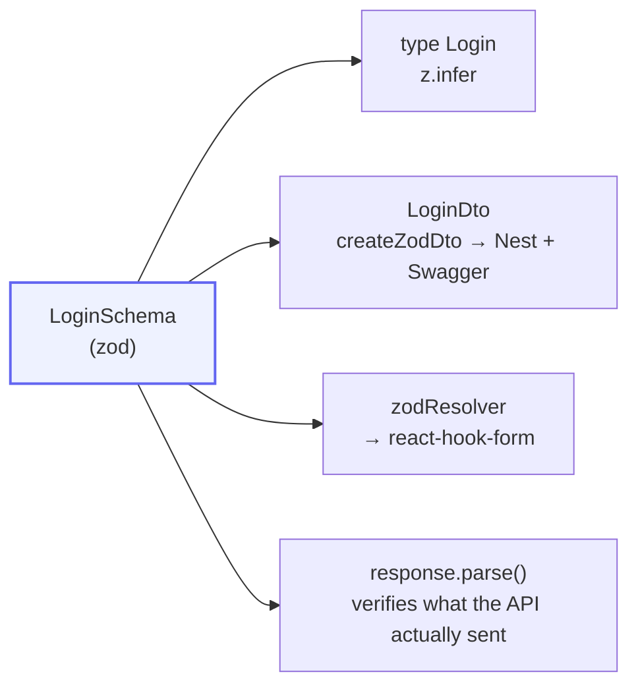
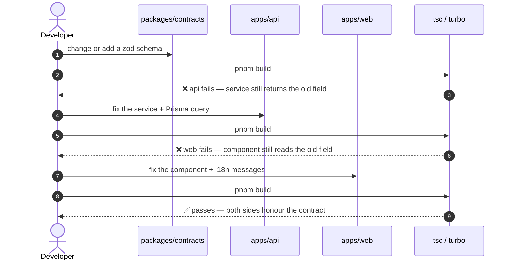

# Contract-first workflow

<Status value="in-progress" note="api uses them · web does not" />

One rule:

> **Every request and response shape is defined once, as a zod schema, in `packages/contracts`.**

Everything else follows from that.

## Why

Without a central contract, a data shape gets written three times — the Nest DTO, the React type, and the form's validation rules. Those three always drift, and they drift silently until something breaks in production.

With one zod definition you get four things:



Change the schema and TypeScript breaks in both apps until they agree. That's the whole point: **fail at build time, not in production.**

## Anatomy of a schema

The real `packages/contracts/src/auth.schema.ts`:

```ts
import { z } from "zod";

export const LoginSchema = z.object({
  email: z.email(),
  password: z.string().min(8).max(72),
});
export type Login = z.infer<typeof LoginSchema>;

export const AuthTokensSchema = z.object({
  accessToken: z.string(),
  refreshToken: z.string(),
});
export type AuthTokens = z.infer<typeof AuthTokensSchema>;
```

Naming rules:

| Thing | Pattern | Example |
| --- | --- | --- |
| Schema | `<Name>Schema` (PascalCase) | `CreateUserSchema` |
| Inferred type | `<Name>`, no Schema suffix | `type CreateUser` |
| Query schema | `<Name>QuerySchema` | `PaginationQuerySchema` |
| Schema factory | camelCase | `paginatedSchema()` |
| File name | `<domain>.schema.ts` | `user.schema.ts` |

::: tip `max(72)` on passwords is not arbitrary
bcrypt silently truncates everything past byte 72. Without the cap, two different long passwords hash to the same value. Capping it in the contract gives both sides the same rule for free.
:::

### Compose schemas instead of repeating them

```ts
// user.schema.ts — UpdateUserSchema derives from CreateUserSchema
export const UpdateUserSchema = CreateUserSchema.pick({ displayName: true }).partial();

// common.schema.ts — wrap any schema into a paginated result
export function paginatedSchema<T extends z.ZodTypeAny>(itemSchema: T) {
  return z.object({
    items: z.array(itemSchema),
    total: z.number().int().min(0),
    page: z.number().int().min(1),
    limit: z.number().int().min(1),
  });
}
```

Always use `.pick()` / `.omit()` / `.partial()` / `.extend()`. Never copy field definitions.

## How the API uses them

`nestjs-zod` turns a schema into a DTO that Nest validates and Swagger can read — `apps/api/src/auth/dto/login.dto.ts`:

```ts
import { createZodDto } from "nestjs-zod";
import { LoginSchema, RefreshTokenSchema } from "@app-platform/contracts";

export class LoginDto extends createZodDto(LoginSchema) {}
export class RefreshTokenDto extends createZodDto(RefreshTokenSchema) {}
```

Controllers use it like any DTO:

```ts
@Post("login")
login(@Body() body: LoginDto) {
  return this.authService.login(body);
}
```

The globally registered `ZodValidationPipe` in `main.ts` does the validation — no manual `.parse()` in controllers:

```ts
app.useGlobalPipes(new ZodValidationPipe());
```

This part exists today and works correctly. <Status value="implemented" inline />

## How the web app uses them

<Status value="planned" inline />

### Form validation

```ts
"use client";
import { useForm } from "react-hook-form";
import { zodResolver } from "@hookform/resolvers/zod";
import { LoginSchema, type Login } from "@app-platform/contracts";

const form = useForm<Login>({
  resolver: zodResolver(LoginSchema),
  defaultValues: { email: "", password: "" },
});
```

The form enforces exactly what the API enforces, with no duplicated rules.

### Validate responses too

The commonly skipped half. The API can return anything; TypeScript checks nothing at runtime. Parse at the boundary:

```ts
// apps/web/src/lib/api-client.ts
import { z } from "zod";

export async function apiFetch<T extends z.ZodTypeAny>(
  path: string,
  schema: T,
  init?: RequestInit,
): Promise<z.infer<T>> {
  const res = await fetch(`${process.env.NEXT_PUBLIC_API_URL}${path}`, {
    ...init,
    headers: { "content-type": "application/json", ...init?.headers },
    credentials: "include",
  });

  const body = await res.json().catch(() => null);
  if (!res.ok) throw toApiError(body, res.status); // see /en/conventions/errors

  // if the API broke its contract, it fails here — not deep inside a component
  return schema.parse(body);
}
```

With TanStack Query:

```ts
import { paginatedSchema, UserSchema } from "@app-platform/contracts";

const UserPageSchema = paginatedSchema(UserSchema);

useQuery({
  queryKey: ["users", { page }],
  queryFn: () => apiFetch(`/v1/users?page=${page}`, UserPageSchema),
});
```

`queryFn` is fully typed without any explicit generic, because `z.infer` already did it.

## The change workflow



The compiler tells you what to fix. You're done when nothing breaks.

### Contract change checklist

- [ ] Edit the schema in `packages/contracts/src/<domain>.schema.ts`
- [ ] Export it from `src/index.ts` if it's a new file
- [ ] Update the API service to return the right shape
- [ ] If the database is affected → edit `schema.prisma`, then `prisma:migrate`
- [ ] Update every web consumer of that schema
- [ ] New user-facing text → add keys to **both** `apps/web/messages/th.json` and `en.json`
- [ ] `pnpm build` passes across the repo
- [ ] Breaking change → update the versioning section of [API conventions](/en/conventions/api-conventions)

## Breaking changes

`packages/contracts` has no build step and is linked via `workspace:*`, so both apps always see the same version. Inside this system versioning is a non-issue — but **external clients are not**.

| Change | Handling |
| --- | --- |
| Add an optional field | Safe, not breaking |
| Add a required response field | Not breaking for lenient parsers, but update any `paginatedSchema` wrapping it |
| Add a required request field | **Breaking** — give it a default or version the endpoint |
| Remove or rename a field | **Breaking** — expand/contract: add the new one, migrate consumers, then remove |
| Change a type | **Breaking** — same as above; never change in place |

## Package constraints

`packages/contracts/package.json` points `main` straight at the source:

```json
{
  "main": "./src/index.ts",
  "types": "./src/index.ts",
  "exports": { ".": "./src/index.ts" }
}
```

Consequences:

- `apps/web` needs `transpilePackages: ["@app-platform/contracts"]` in `next.config.ts` (it has it)
- `apps/api` compiles it as part of `nest build`
- Nothing Node-only or browser-only may go in here. It must run in both. **Only zod schemas and pure types.**

::: warning Current code status
| Target spec | Code today |
| --- | --- |
| `apps/web` imports schemas from contracts | The dependency is declared but **no file imports it** |
| Every response is `.parse()`d at the boundary | No `lib/api-client.ts` exists |
| `UpdateUserSchema` and `paginatedSchema` are used | Defined but no endpoint or page uses them |
| Schemas for signup / reset password / abilities | Missing — see [Signup](/en/auth/signup), [Forgot password](/en/auth/forgot-password), [CASL](/en/auth/casl) |
:::
