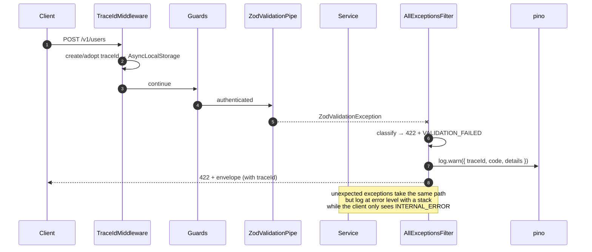
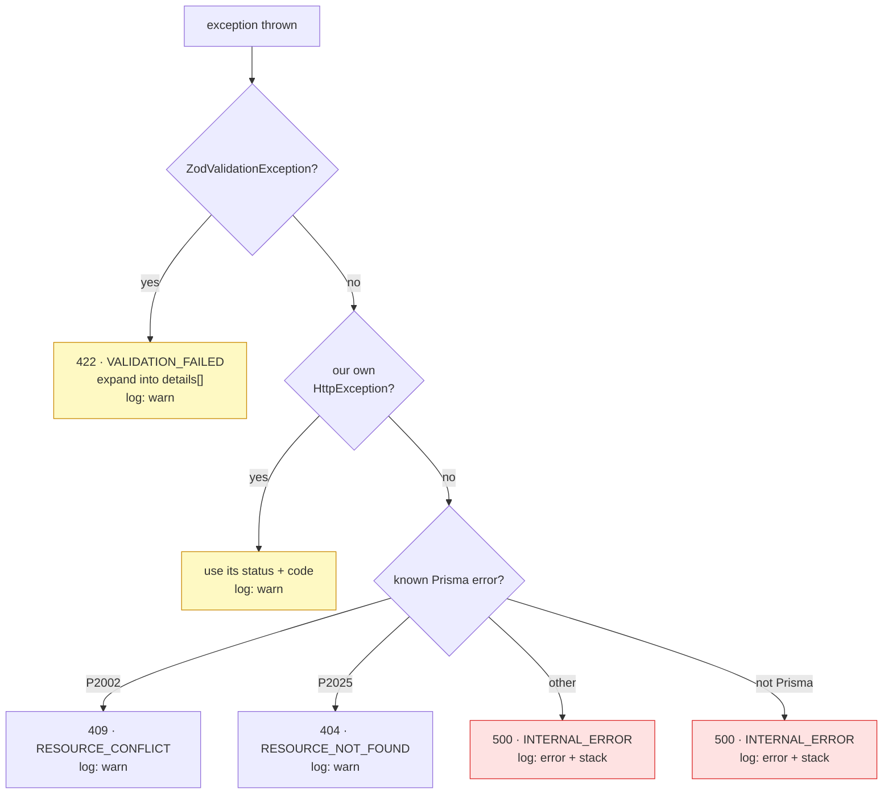

# Error envelope

<Status value="planned" />

> **Every error leaving the API has the same shape. No exceptions.**

If error shapes are unpredictable, the client fills up with `err?.response?.data?.message ?? err?.message ?? "something broke"`. One shape means one handler for the whole system.

## The contract

```ts
// packages/contracts/src/error.schema.ts
import { z } from "zod";

export const ErrorDetailSchema = z.object({
  /** dotted field path, e.g. "email" or "items.0.qty" — null when not field-bound */
  field: z.string().nullable(),
  /** i18n message key, e.g. "validation.email.invalid" */
  code: z.string(),
  /** English text for debugging — never shown to users directly */
  message: z.string(),
});

export const ErrorEnvelopeSchema = z.object({
  /** stable code from the catalog — what clients should branch on */
  code: z.string(),
  /** English summary for debugging */
  message: z.string(),
  /** id for correlating logs across the system */
  traceId: z.string(),
  /** ISO-8601 UTC */
  timestamp: z.iso.datetime(),
  /** the route that was called, e.g. "POST /v1/users" */
  path: z.string(),
  /** field-level errors — empty unless this was a validation failure */
  details: z.array(ErrorDetailSchema).default([]),
});
export type ErrorEnvelope = z.infer<typeof ErrorEnvelopeSchema>;
```

A real example:

```json
{
  "code": "VALIDATION_FAILED",
  "message": "Request body failed validation",
  "traceId": "0192f8a1-4c2e-7b3d-9f01-2a4c6e8b0d13",
  "timestamp": "2026-08-07T09:14:22.481Z",
  "path": "POST /v1/users",
  "details": [
    { "field": "email", "code": "validation.email.invalid", "message": "Invalid email" },
    { "field": "password", "code": "validation.string.min", "message": "Must be at least 8 characters" }
  ]
}
```

### What each field is for

| Field | Consumer | Rule |
| --- | --- | --- |
| `code` | Client logic (what to show, where to go) | Must exist in the [catalog](/en/reference/error-codes), and its meaning **must never change** — it's part of the API |
| `message` | Developers | English, untranslated, never shown to users |
| `traceId` | Users and operators | Displayed in the UI to copy; used to search logs — see [Trace ID](/en/platform/trace-id) |
| `timestamp` | Operators | Always ISO-8601 UTC |
| `path` | Operators | `"<METHOD> <route>"` using the route pattern, not the concrete URL (keeps ids out of logs) |
| `details` | Client, to bind errors to inputs | Always empty unless this was a validation failure |

::: danger What must never be in an envelope
No stack traces, table names, SQL, file paths, or raw Prisma exception text. All of that lives in server-side logs under the same `traceId` — but **it never leaves the server**.
:::

## How it's produced



## Classification



The inviolable rule: **anything unclassified becomes `500 INTERNAL_ERROR`.** No internal text ever escapes by accident.

## Implementation

### Application exceptions

```ts
// apps/api/src/common/errors/app.exception.ts
import { HttpException, HttpStatus } from "@nestjs/common";
import type { ErrorDetail } from "@app-platform/contracts";

export class AppException extends HttpException {
  constructor(
    readonly code: string,
    message: string,
    status: HttpStatus,
    readonly details: ErrorDetail[] = [],
  ) {
    super(message, status);
  }
}

// short helpers that pin code to status so nobody has to remember the pairing
export const Errors = {
  invalidCredentials: () =>
    new AppException("AUTH_INVALID_CREDENTIALS", "Invalid credentials", HttpStatus.UNAUTHORIZED),
  emailTaken: () =>
    new AppException("USER_EMAIL_TAKEN", "Email already registered", HttpStatus.CONFLICT),
  userNotFound: () =>
    new AppException("USER_NOT_FOUND", "User not found", HttpStatus.NOT_FOUND),
  forbidden: (action: string, subject: string) =>
    new AppException("AUTHZ_FORBIDDEN", `Not allowed to ${action} ${subject}`, HttpStatus.FORBIDDEN),
};
```

Services call them without ever typing a code:

```ts
if (!user) throw Errors.invalidCredentials();
```

### The catch-all filter

```ts
// apps/api/src/common/filters/all-exceptions.filter.ts
import { ArgumentsHost, Catch, ExceptionFilter, HttpException, HttpStatus } from "@nestjs/common";
import { Prisma } from "@prisma/client";
import { ZodValidationException } from "nestjs-zod";
import { PinoLogger } from "nestjs-pino";
import type { Request, Response } from "express";
import type { ErrorEnvelope } from "@app-platform/contracts";
import { AppException } from "../errors/app.exception";
import { getTraceId } from "../trace/trace-context";

@Catch()
export class AllExceptionsFilter implements ExceptionFilter {
  constructor(private readonly logger: PinoLogger) {}

  catch(exception: unknown, host: ArgumentsHost) {
    const ctx = host.switchToHttp();
    const req = ctx.getRequest<Request>();
    const res = ctx.getResponse<Response>();

    const { status, code, message, details } = classify(exception);

    const envelope: ErrorEnvelope = {
      code,
      message,
      traceId: getTraceId(),
      timestamp: new Date().toISOString(),
      // route pattern, not req.url — keeps real ids out of logs
      path: `${req.method} ${req.route?.path ?? req.path}`,
      details,
    };

    // 5xx is our fault → error + stack. 4xx is the caller's → warn only.
    if (status >= 500) {
      this.logger.error({ err: exception, ...envelope }, "unhandled exception");
    } else {
      this.logger.warn(envelope, "request failed");
    }

    res.status(status).json(envelope);
  }
}

function classify(e: unknown) {
  if (e instanceof ZodValidationException) {
    return {
      status: HttpStatus.UNPROCESSABLE_ENTITY,
      code: "VALIDATION_FAILED",
      message: "Request failed validation",
      details: e.getZodError().issues.map((i) => ({
        field: i.path.join(".") || null,
        code: `validation.${i.code}`,
        message: i.message,
      })),
    };
  }

  if (e instanceof AppException) {
    return { status: e.getStatus(), code: e.code, message: e.message, details: e.details };
  }

  if (e instanceof Prisma.PrismaClientKnownRequestError) {
    if (e.code === "P2002")
      return { status: HttpStatus.CONFLICT, code: "RESOURCE_CONFLICT", message: "Resource already exists", details: [] };
    if (e.code === "P2025")
      return { status: HttpStatus.NOT_FOUND, code: "RESOURCE_NOT_FOUND", message: "Resource not found", details: [] };
  }

  if (e instanceof HttpException) {
    // Nest's own throws (router 404s, guard 401s) — normalise into our shape
    return { status: e.getStatus(), code: httpStatusToCode(e.getStatus()), message: e.message, details: [] };
  }

  // everything else is a bug of ours; leak nothing
  return {
    status: HttpStatus.INTERNAL_SERVER_ERROR,
    code: "INTERNAL_ERROR",
    message: "Internal server error",
    details: [],
  };
}
```

Register it globally in `app.module.ts` — not via `useGlobalFilters` in `main.ts`, because this way the filter can inject dependencies:

```ts
providers: [{ provide: APP_FILTER, useClass: AllExceptionsFilter }],
```

### Tell Swagger about it

Every endpoint must document the envelope, or Swagger implies nothing can go wrong:

```ts
// apps/api/src/common/decorators/api-error-responses.decorator.ts
export const ApiErrorResponses = () =>
  applyDecorators(
    ApiExtraModels(ErrorEnvelopeDto),
    ApiResponse({ status: 422, description: "Validation failed", type: ErrorEnvelopeDto }),
    ApiResponse({ status: 401, description: "Unauthenticated", type: ErrorEnvelopeDto }),
    ApiResponse({ status: 403, description: "Forbidden", type: ErrorEnvelopeDto }),
    ApiResponse({ status: 500, description: "Internal error", type: ErrorEnvelopeDto }),
  );
```

## Client-side handling

### Turn the response into an error object

```ts
// apps/web/src/lib/api-error.ts
import { ErrorEnvelopeSchema, type ErrorEnvelope } from "@app-platform/contracts";

export class ApiError extends Error {
  constructor(readonly envelope: ErrorEnvelope, readonly status: number) {
    super(envelope.message);
    this.name = "ApiError";
  }
  get code() { return this.envelope.code; }
  get traceId() { return this.envelope.traceId; }
  /** field -> message key, for feeding back into react-hook-form */
  get fieldErrors(): Record<string, string> {
    return Object.fromEntries(
      this.envelope.details.filter((d) => d.field).map((d) => [d.field!, d.code]),
    );
  }
}

export function toApiError(body: unknown, status: number): ApiError {
  const parsed = ErrorEnvelopeSchema.safeParse(body);
  if (parsed.success) return new ApiError(parsed.data, status);

  // the API broke badly (or a proxy answered) — synthesise an envelope so handlers still work
  return new ApiError(
    {
      code: "NETWORK_ERROR",
      message: "Unexpected response",
      traceId: "unknown",
      timestamp: new Date().toISOString(),
      path: "",
      details: [],
    },
    status,
  );
}
```

### Show it to users

Translate `code`; never display `message`.

```ts
// apps/web/messages/en.json
{
  "errors": {
    "AUTH_INVALID_CREDENTIALS": "Incorrect email or password",
    "USER_EMAIL_TAKEN": "That email is already in use",
    "AUTHZ_FORBIDDEN": "You don't have permission to do that",
    "VALIDATION_FAILED": "Please check the highlighted fields",
    "INTERNAL_ERROR": "Something went wrong. Please try again.",
    "NETWORK_ERROR": "Can't reach the server. Check your connection.",
    "fallback": "An unexpected error occurred"
  }
}
```

```ts
const t = useTranslations("errors");
const label = t.has(error.code) ? t(error.code) : t("fallback");
```

### Bind errors back to inputs

```ts
onError(error) {
  if (!(error instanceof ApiError)) return;
  for (const [field, codeKey] of Object.entries(error.fieldErrors)) {
    form.setError(field as keyof Login, { message: tValidation(codeKey) });
  }
  if (Object.keys(error.fieldErrors).length === 0) {
    toast.error(t(error.code), { description: `Trace ID: ${error.traceId}` });
  }
}
```

### Always make the trace id copyable

Any 5xx shown to a user must display its trace id with a copy affordance:

```tsx
<Alert variant="destructive">
  <AlertTitle>{t(error.code)}</AlertTitle>
  <AlertDescription>
    <button onClick={() => navigator.clipboard.writeText(error.traceId)}>
      Trace ID: <code>{error.traceId}</code> — click to copy
    </button>
  </AlertDescription>
</Alert>
```

That's what turns a user report into an instant log lookup. See [Trace ID](/en/platform/trace-id).

::: warning Current code status
| Target spec | Code today |
| --- | --- |
| A global `AllExceptionsFilter` | No filter at all — Nest returns its default `{statusCode, message, error}` |
| `ErrorEnvelopeSchema` in contracts | No `error.schema.ts` exists |
| Every error carries a `traceId` | There are no trace ids in the system |
| Prisma errors are mapped | `users.service.ts` catches duplicates itself and throws Nest's `ConflictException` |
| Error messages are translated | No `errors` namespace in `messages/{th,en}.json` |
:::
